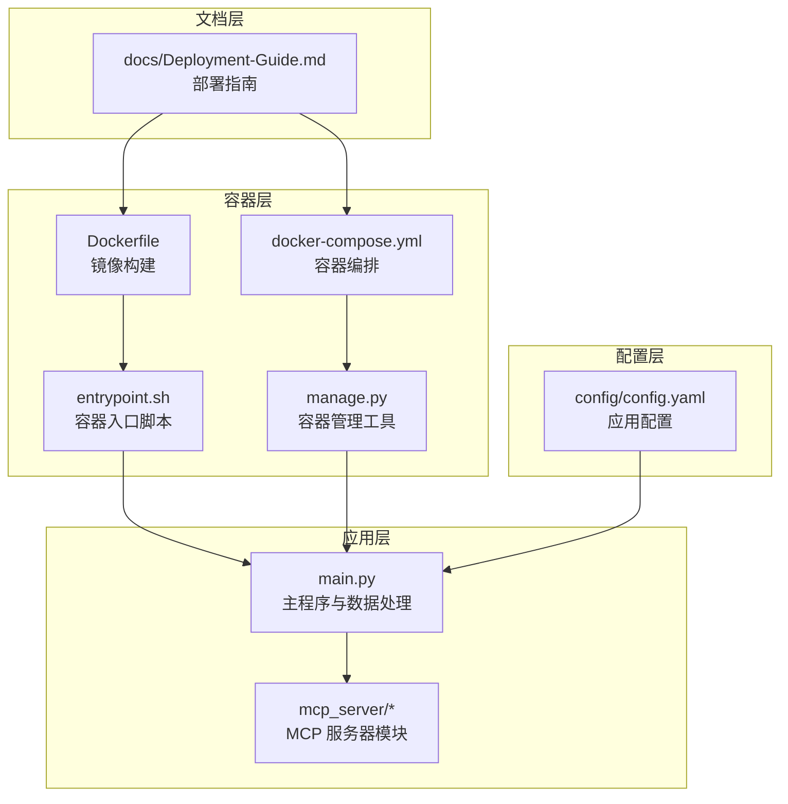
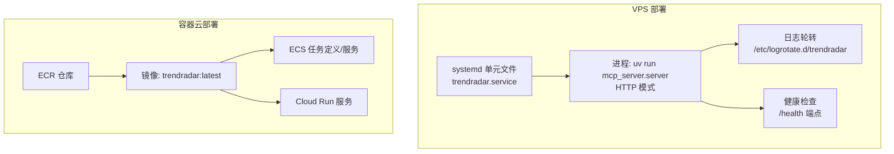
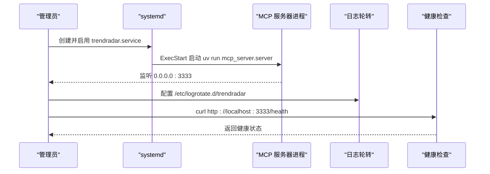
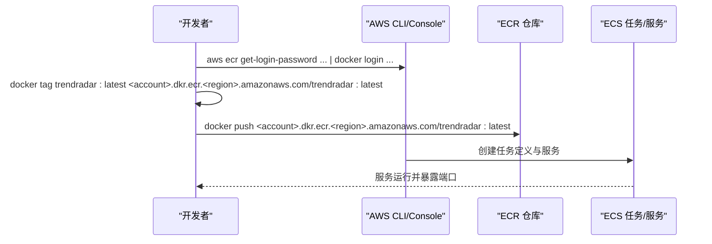
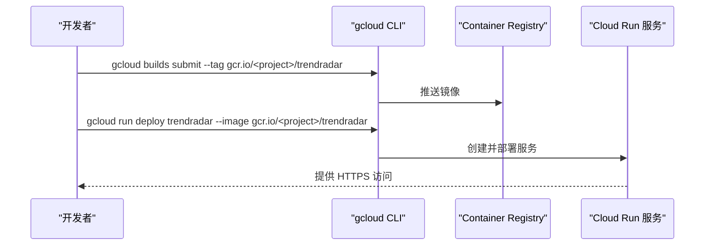
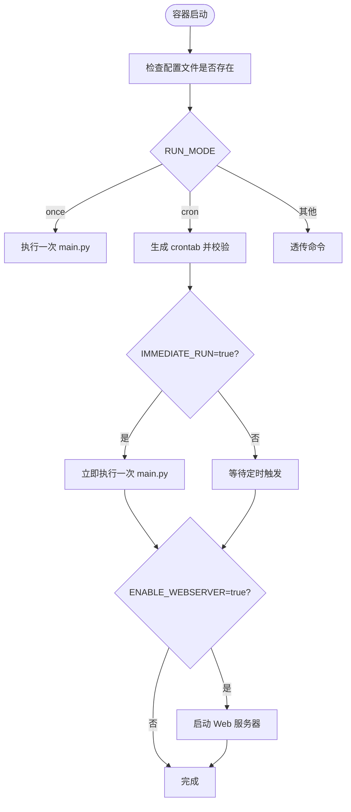
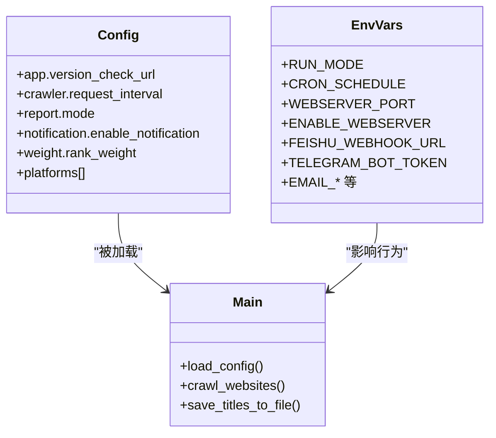
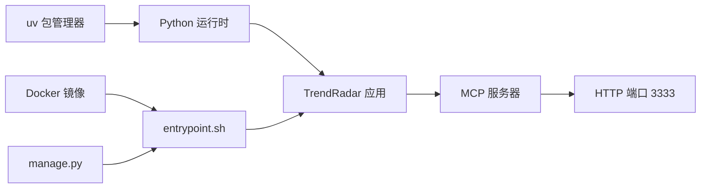

# 云平台部署

<cite>
**本文引用的文件**
- [Deployment-Guide.md](file://docs/Deployment-Guide.md)
- [Dockerfile](file://docker/Dockerfile)
- [docker-compose.yml](file://docker/docker-compose.yml)
- [entrypoint.sh](file://docker/entrypoint.sh)
- [manage.py](file://docker/manage.py)
- [config.yaml](file://config/config.yaml)
- [main.py](file://main.py)
- [start-http.sh](file://start-http.sh)
- [setup-mac.sh](file://setup-mac.sh)
</cite>

## 目录
1. [简介](#简介)
2. [项目结构](#项目结构)
3. [核心组件](#核心组件)
4. [架构总览](#架构总览)
5. [详细组件分析](#详细组件分析)
6. [依赖关系分析](#依赖关系分析)
7. [性能与运维建议](#性能与运维建议)
8. [故障排查指南](#故障排查指南)
9. [结论](#结论)
10. [附录](#附录)

## 简介
本指南面向在云平台部署 TrendRadar 的用户，覆盖两类主要场景：
- VPS（如 AWS EC2、Google Cloud Compute Engine）通过 systemd 部署 TrendRadar MCP 服务，包含 systemd 单元文件创建、自动启动、日志轮转与健康检查。
- 容器云服务（AWS ECS 与 Google Cloud Run）的容器化部署方案，包括 ECR 镜像仓库与推送、ECS 任务与服务定义、以及 Cloud Run 的 gcloud 部署流程。

同时，文档引用并解释 Deployment-Guide.md 中的云部署章节，提供具体命令示例与安全配置要点（IAM 权限、网络策略）。

## 项目结构
- 应用入口与核心逻辑位于根目录，包含主程序与 MCP 服务器模块。
- Docker 相关文件集中在 docker/ 目录，包含镜像构建、入口脚本、容器编排与管理工具。
- 配置文件位于 config/ 目录，包含应用配置与频率词表。
- 文档集中于 docs/ 目录，包含部署指南与 API 参考。

图表来源
- [Dockerfile](file://docker/Dockerfile#L1-L71)
- [docker-compose.yml](file://docker/docker-compose.yml#L1-L74)
- [entrypoint.sh](file://docker/entrypoint.sh#L1-L50)
- [manage.py](file://docker/manage.py#L1-L625)
- [config.yaml](file://config/config.yaml#L1-L140)
- [main.py](file://main.py#L1-L200)
- [Deployment-Guide.md](file://docs/Deployment-Guide.md#L1-L693)

章节来源
- [Deployment-Guide.md](file://docs/Deployment-Guide.md#L1-L693)
- [Dockerfile](file://docker/Dockerfile#L1-L71)
- [docker-compose.yml](file://docker/docker-compose.yml#L1-L74)
- [entrypoint.sh](file://docker/entrypoint.sh#L1-L50)
- [manage.py](file://docker/manage.py#L1-L625)
- [config.yaml](file://config/config.yaml#L1-L140)
- [main.py](file://main.py#L1-L200)

## 核心组件
- MCP 服务器：提供 STDIO/HTTP 两种接入模式，支持远程客户端连接与反向代理。
- Docker 镜像与入口：基于 Python slim 镜像，内置定时任务调度器，支持一次性执行与周期性调度。
- 容器管理工具：提供状态检查、日志查看、Web 服务器托管、手动执行等功能。
- 配置系统：通过 YAML 配置文件与环境变量控制运行模式、通知渠道、推送窗口等。

章节来源
- [Deployment-Guide.md](file://docs/Deployment-Guide.md#L76-L164)
- [Dockerfile](file://docker/Dockerfile#L1-L71)
- [entrypoint.sh](file://docker/entrypoint.sh#L1-L50)
- [manage.py](file://docker/manage.py#L1-L625)
- [config.yaml](file://config/config.yaml#L1-L140)

## 架构总览
下图展示 VPS 与容器云部署的关键交互与组件关系。

图表来源
- [Deployment-Guide.md](file://docs/Deployment-Guide.md#L259-L333)
- [docker-compose.yml](file://docker/docker-compose.yml#L1-L74)

## 详细组件分析

### VPS 部署（systemd）
- 准备工作：更新系统、安装 Python、UV、Git、Nginx。
- 部署应用：克隆仓库、创建虚拟环境、安装依赖。
- 创建 systemd 单元文件：定义服务类型、用户、工作目录、环境变量、启动命令、自动重启策略。
- 启用并启动服务：设置开机自启、启动服务。
- 日志轮转：配置每日轮转、保留数量、权限与创建模式。
- 健康检查：通过 HTTP 端点返回健康状态；可结合系统健康脚本进行综合检查。

图表来源
- [Deployment-Guide.md](file://docs/Deployment-Guide.md#L259-L409)

章节来源
- [Deployment-Guide.md](file://docs/Deployment-Guide.md#L259-L409)

### Docker Cloud 部署（AWS ECS）
- 创建 ECR 仓库：在目标区域创建仓库。
- 登录与推送：使用 AWS CLI 获取登录凭据，打标签并推送镜像。
- 定义 ECS 任务与服务：在 ECS 控制台创建任务定义与服务，映射端口、挂载卷、设置环境变量与健康检查。

图表来源
- [Deployment-Guide.md](file://docs/Deployment-Guide.md#L309-L318)

章节来源
- [Deployment-Guide.md](file://docs/Deployment-Guide.md#L309-L318)

### Docker Cloud 部署（Google Cloud Run）
- 构建与推送：使用 gcloud builds submit 将镜像推送到 gcr.io/<project>/trendradar。
- 部署到 Cloud Run：使用 gcloud run deploy 指定镜像、平台、区域、端口与访问策略。

图表来源
- [Deployment-Guide.md](file://docs/Deployment-Guide.md#L320-L332)

章节来源
- [Deployment-Guide.md](file://docs/Deployment-Guide.md#L320-L332)

### 容器镜像与入口脚本
- Dockerfile：基于 Python slim 镜像，安装依赖、复制入口脚本与主程序，设置环境变量与入口点。
- entrypoint.sh：校验配置文件、根据 RUN_MODE 执行一次性或周期性任务，支持立即执行与 Web 服务器托管。
- manage.py：容器内管理工具，提供状态检查、配置查看、文件浏览、日志查看、Web 服务器启停等能力。

图表来源
- [Dockerfile](file://docker/Dockerfile#L1-L71)
- [entrypoint.sh](file://docker/entrypoint.sh#L1-L50)
- [manage.py](file://docker/manage.py#L1-L625)

章节来源
- [Dockerfile](file://docker/Dockerfile#L1-L71)
- [entrypoint.sh](file://docker/entrypoint.sh#L1-L50)
- [manage.py](file://docker/manage.py#L1-L625)

### 配置与运行模式
- 配置文件：config/config.yaml 提供应用、爬虫、报告、通知、权重与平台列表等配置项。
- 环境变量：容器编排文件 docker-compose.yml 定义了运行模式、端口、通知渠道、推送窗口等环境变量。
- 主程序：main.py 负责加载配置、数据抓取、结果保存与推送记录管理。

图表来源
- [config.yaml](file://config/config.yaml#L1-L140)
- [docker-compose.yml](file://docker/docker-compose.yml#L1-L74)
- [main.py](file://main.py#L160-L400)

章节来源
- [config.yaml](file://config/config.yaml#L1-L140)
- [docker-compose.yml](file://docker/docker-compose.yml#L1-L74)
- [main.py](file://main.py#L160-L400)

## 依赖关系分析
- VPS 部署依赖 systemd、uv、Python 运行时与 Nginx（可选）。
- 容器云部署依赖 Docker 镜像、ECR/Container Registry 与 ECS/Cloud Run。
- 容器内部依赖 entrypoint.sh 与 manage.py 提供的生命周期管理与运维能力。

图表来源
- [Deployment-Guide.md](file://docs/Deployment-Guide.md#L259-L333)
- [Dockerfile](file://docker/Dockerfile#L1-L71)
- [entrypoint.sh](file://docker/entrypoint.sh#L1-L50)
- [manage.py](file://docker/manage.py#L1-L625)

章节来源
- [Deployment-Guide.md](file://docs/Deployment-Guide.md#L259-L333)
- [Dockerfile](file://docker/Dockerfile#L1-L71)
- [entrypoint.sh](file://docker/entrypoint.sh#L1-L50)
- [manage.py](file://docker/manage.py#L1-L625)

## 性能与运维建议
- 系统优化：合理设置内核参数、调整 Python 运行时环境变量以提升稳定性。
- 应用优化：根据配置文件调整请求间隔、推送窗口与批次大小，减少资源消耗。
- 健康检查：在 ECS/Cloud Run 中配置健康检查端点，确保服务可用性。
- 日志轮转：在 VPS 上配置日志轮转，避免磁盘占用过大。

章节来源
- [Deployment-Guide.md](file://docs/Deployment-Guide.md#L334-L430)

## 故障排查指南
- UV 安装失败：检查 PATH、网络与安装脚本执行权限。
- MCP 连接失败：检查服务状态、端口占用与系统日志。
- 爬虫数据为空：检查配置文件、网络连通性与定时任务状态。
- 内存不足：限制内存使用、优化 Python 运行参数。

章节来源
- [Deployment-Guide.md](file://docs/Deployment-Guide.md#L431-L506)

## 结论
通过本指南，您可以在 VPS 上使用 systemd 部署 TrendRadar MCP 服务，并在容器云平台上完成镜像构建、推送与服务部署。结合健康检查、日志轮转与安全配置，可实现稳定可靠的生产级部署。

## 附录
- 常用命令与路径参考
  - VPS 部署 systemd 单元文件创建与启用：参见“VPS 部署”章节。
  - ECS 镜像登录、打标签与推送：参见“Docker Cloud 部署（AWS ECS）”章节。
  - Cloud Run 部署命令：参见“Docker Cloud 部署（Google Cloud Run）”章节。
  - 容器管理工具命令：参见“容器镜像与入口脚本”章节。

章节来源
- [Deployment-Guide.md](file://docs/Deployment-Guide.md#L259-L333)
- [docker-compose.yml](file://docker/docker-compose.yml#L1-L74)
- [manage.py](file://docker/manage.py#L536-L625)