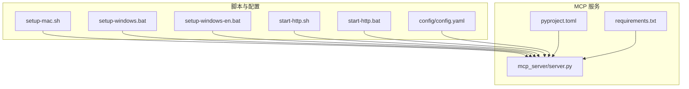
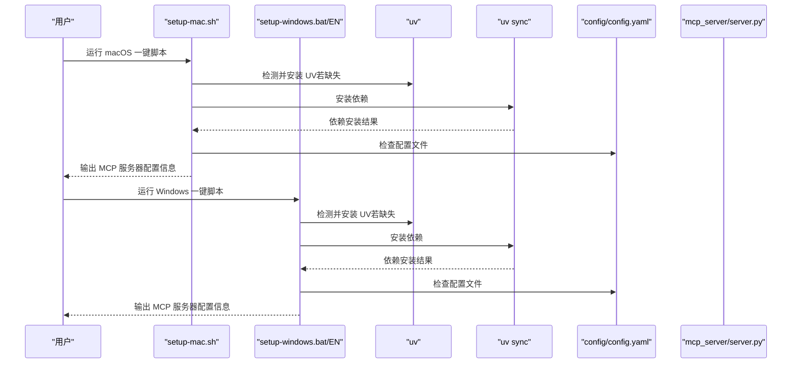
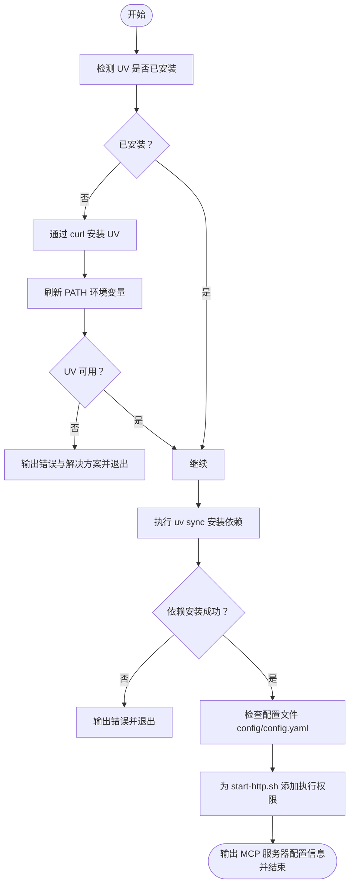
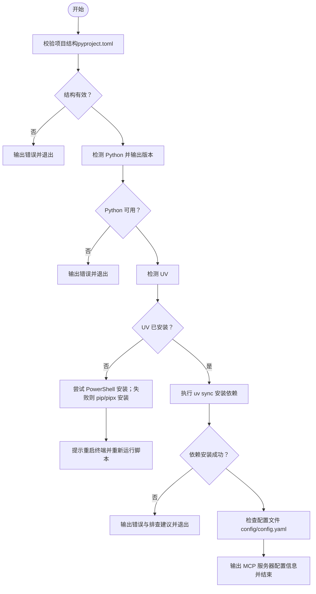
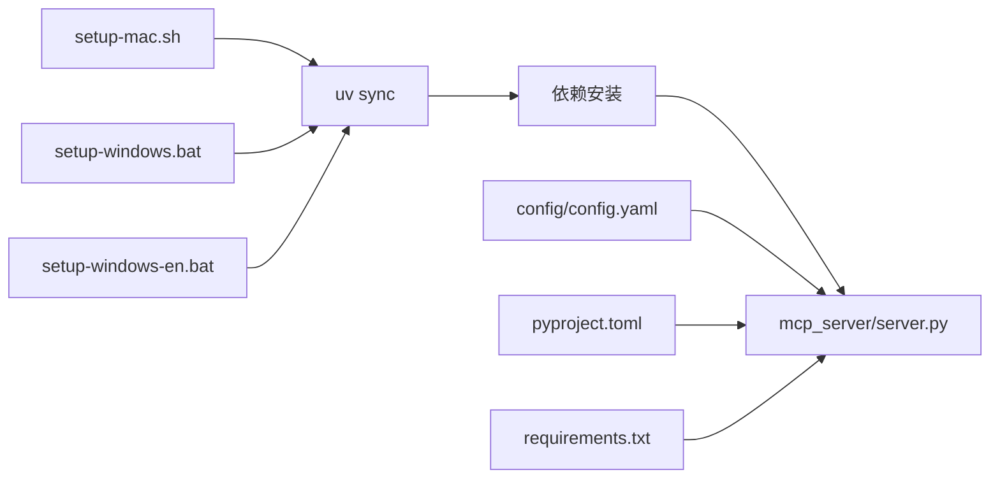

# 脚本部署

<cite>
**本文引用的文件**
- [setup-mac.sh](file://setup-mac.sh)
- [setup-windows.bat](file://setup-windows.bat)
- [setup-windows-en.bat](file://setup-windows-en.bat)
- [start-http.sh](file://start-http.sh)
- [start-http.bat](file://start-http.bat)
- [README-Cherry-Studio.md](file://README-Cherry-Studio.md)
- [README.md](file://README.md)
- [pyproject.toml](file://pyproject.toml)
- [requirements.txt](file://requirements.txt)
- [config/config.yaml](file://config/config.yaml)
- [mcp_server/server.py](file://mcp_server/server.py)
</cite>

## 目录
1. [简介](#简介)
2. [项目结构](#项目结构)
3. [核心组件](#核心组件)
4. [架构总览](#架构总览)
5. [详细组件分析](#详细组件分析)
6. [依赖关系分析](#依赖关系分析)
7. [性能考量](#性能考量)
8. [故障排查指南](#故障排查指南)
9. [结论](#结论)
10. [附录](#附录)

## 简介
本指南面向 macOS 与 Windows 用户，提供从零开始的脚本部署流程说明，覆盖 setup-mac.sh 与 setup-windows.bat/EN 的执行步骤、差异对比、依赖安装与配置校验、以及常见问题的解决方案。文档同时给出验证步骤与最佳实践，帮助你在本地快速完成 TrendRadar MCP 服务的初始化与配置。

## 项目结构
与脚本部署直接相关的文件与职责概览：
- macOS 一键脚本：setup-mac.sh
- Windows 一键脚本（中文）：setup-windows.bat
- Windows 一键脚本（英文）：setup-windows-en.bat
- HTTP 启动脚本（macOS）：start-http.sh
- HTTP 启动脚本（Windows）：start-http.bat
- Cherry Studio 部署指引：README-Cherry-Studio.md
- 项目依赖声明：pyproject.toml、requirements.txt
- MCP 服务入口与工具实现：mcp_server/server.py
- 核心配置：config/config.yaml

图表来源
- [setup-mac.sh](file://setup-mac.sh#L1-L119)
- [setup-windows.bat](file://setup-windows.bat#L1-L181)
- [setup-windows-en.bat](file://setup-windows-en.bat#L1-L176)
- [start-http.sh](file://start-http.sh#L1-L22)
- [start-http.bat](file://start-http.bat#L1-L200)
- [pyproject.toml](file://pyproject.toml#L1-L26)
- [requirements.txt](file://requirements.txt#L1-L6)
- [config/config.yaml](file://config/config.yaml#L1-L140)
- [mcp_server/server.py](file://mcp_server/server.py#L1-L200)

章节来源
- [setup-mac.sh](file://setup-mac.sh#L1-L119)
- [setup-windows.bat](file://setup-windows.bat#L1-L181)
- [setup-windows-en.bat](file://setup-windows-en.bat#L1-L176)
- [start-http.sh](file://start-http.sh#L1-L22)
- [start-http.bat](file://start-http.bat#L1-L200)
- [README-Cherry-Studio.md](file://README-Cherry-Studio.md#L1-L155)
- [pyproject.toml](file://pyproject.toml#L1-L26)
- [requirements.txt](file://requirements.txt#L1-L6)
- [config/config.yaml](file://config/config.yaml#L1-L140)
- [mcp_server/server.py](file://mcp_server/server.py#L1-L200)

## 核心组件
- macOS 一键部署脚本：负责 UV 包管理器检测与安装、uv sync 依赖安装、配置文件检查、以及最终 MCP 服务器配置提示。
- Windows 一键部署脚本（中文/英文）：负责 Python 与 UV 检测、自动安装、uv sync 依赖安装、配置文件检查、以及 MCP 服务器配置提示。
- HTTP 启动脚本：在本地以 HTTP 模式启动 MCP 服务，便于远程访问或多客户端共享。
- 配置与依赖：pyproject.toml/requirements.txt 定义项目依赖；config/config.yaml 提供运行期配置；mcp_server/server.py 提供 MCP 工具与服务入口。

章节来源
- [setup-mac.sh](file://setup-mac.sh#L1-L119)
- [setup-windows.bat](file://setup-windows.bat#L1-L181)
- [setup-windows-en.bat](file://setup-windows-en.bat#L1-L176)
- [start-http.sh](file://start-http.sh#L1-L22)
- [pyproject.toml](file://pyproject.toml#L1-L26)
- [requirements.txt](file://requirements.txt#L1-L6)
- [config/config.yaml](file://config/config.yaml#L1-L140)
- [mcp_server/server.py](file://mcp_server/server.py#L1-L200)

## 架构总览
下图展示了脚本部署与 MCP 服务的关系，以及关键的执行路径与验证点。

图表来源
- [setup-mac.sh](file://setup-mac.sh#L1-L119)
- [setup-windows.bat](file://setup-windows.bat#L1-L181)
- [setup-windows-en.bat](file://setup-windows-en.bat#L1-L176)
- [config/config.yaml](file://config/config.yaml#L1-L140)
- [mcp_server/server.py](file://mcp_server/server.py#L1-L200)

## 详细组件分析

### macOS 一键部署脚本（setup-mac.sh）
- 功能要点
  - 彩色输出与进度提示，便于用户跟踪执行状态。
  - 自动检测 UV 是否已安装，未安装则通过 curl 安装脚本安装，并刷新 PATH。
  - 依赖安装：执行 uv sync，失败时输出错误与排查建议。
  - 配置检查：检测 config/config.yaml 是否存在，不存在时给出提示。
  - 权限设置：为 start-http.sh 添加执行权限。
  - 结果提示：输出 MCP 服务器配置信息，包括命令路径与参数，指导用户在 Cherry Studio 中配置。

- 执行流程图

图表来源
- [setup-mac.sh](file://setup-mac.sh#L1-L119)

章节来源
- [setup-mac.sh](file://setup-mac.sh#L1-L119)

### Windows 一键部署脚本（setup-windows.bat 与 setup-windows-en.bat）
- 差异说明
  - 两份脚本功能基本一致，主要区别在于语言与部分提示文案：
    - setup-windows.bat：中文提示与错误信息。
    - setup-windows-en.bat：英文提示与错误信息。
  - 两者均包含：
    - 项目结构校验（检查 pyproject.toml 是否存在）。
    - Python 检测与版本提示。
    - UV 检测与自动安装（优先 PowerShell 安装，失败则尝试 pip/pipx 安装）。
    - 依赖安装 uv sync，失败时提供排查建议。
    - 配置文件检查（config/config.yaml），如不存在则提示复制示例配置。
    - 输出 MCP 服务器配置信息，便于在 Cherry Studio 中配置。

- 执行流程图（以中文脚本为例）

图表来源
- [setup-windows.bat](file://setup-windows.bat#L1-L181)
- [setup-windows-en.bat](file://setup-windows-en.bat#L1-L176)

章节来源
- [setup-windows.bat](file://setup-windows.bat#L1-L181)
- [setup-windows-en.bat](file://setup-windows-en.bat#L1-L176)

### HTTP 启动脚本（macOS 与 Windows）
- macOS：start-http.sh
  - 检查虚拟环境是否存在，不存在则提示先运行部署脚本。
  - 以 HTTP 模式启动 MCP 服务，监听本地端口，便于远程访问或多客户端共享。
- Windows：start-http.bat
  - 与 macOS 版本类似，提供相同的服务启动能力。

章节来源
- [start-http.sh](file://start-http.sh#L1-L22)
- [start-http.bat](file://start-http.bat#L1-L200)

### 配置与依赖
- 依赖声明
  - pyproject.toml：定义项目名称、版本、最低 Python 版本、依赖与脚本入口。
  - requirements.txt：列出运行期依赖。
- 配置文件
  - config/config.yaml：包含应用、爬虫、报告、通知、平台等配置项，部署脚本会检查其存在性。

章节来源
- [pyproject.toml](file://pyproject.toml#L1-L26)
- [requirements.txt](file://requirements.txt#L1-L6)
- [config/config.yaml](file://config/config.yaml#L1-L140)

### MCP 服务入口与工具
- mcp_server/server.py：提供 FastMCP 2.0 实现，包含日期解析、数据查询、分析、搜索、配置管理、系统管理等工具，支持 stdio 与 HTTP 两种传输模式。

章节来源
- [mcp_server/server.py](file://mcp_server/server.py#L1-L200)

## 依赖关系分析
- 脚本与 MCP 服务
  - setup-mac.sh 与 setup-windows.bat/EN 在安装依赖后，会输出 MCP 服务器配置信息，指导用户在 Cherry Studio 中添加服务器。
  - start-http.sh/HTTP 启动脚本用于以 HTTP 模式运行 MCP 服务，便于远程访问。
- 依赖与配置
  - 依赖由 pyproject.toml/requirements.txt 声明，脚本通过 uv sync 安装。
  - 配置文件 config/config.yaml 由脚本检查，确保 MCP 服务运行所需的关键配置存在。

图表来源
- [setup-mac.sh](file://setup-mac.sh#L1-L119)
- [setup-windows.bat](file://setup-windows.bat#L1-L181)
- [setup-windows-en.bat](file://setup-windows-en.bat#L1-L176)
- [pyproject.toml](file://pyproject.toml#L1-L26)
- [requirements.txt](file://requirements.txt#L1-L6)
- [config/config.yaml](file://config/config.yaml#L1-L140)
- [mcp_server/server.py](file://mcp_server/server.py#L1-L200)

章节来源
- [setup-mac.sh](file://setup-mac.sh#L1-L119)
- [setup-windows.bat](file://setup-windows.bat#L1-L181)
- [setup-windows-en.bat](file://setup-windows-en.bat#L1-L176)
- [pyproject.toml](file://pyproject.toml#L1-L26)
- [requirements.txt](file://requirements.txt#L1-L6)
- [config/config.yaml](file://config/config.yaml#L1-L140)
- [mcp_server/server.py](file://mcp_server/server.py#L1-L200)

## 性能考量
- 依赖安装耗时：uv sync 会根据网络状况与依赖数量耗时 1-2 分钟，建议在稳定网络环境下执行。
- 虚拟环境与路径：macOS 脚本会刷新 PATH 并提示重新运行脚本，确保 UV 在当前会话可用。
- Windows 终端重启：Windows 脚本在 UV 安装完成后提示重启终端，确保新安装的 UV 被识别。

章节来源
- [setup-mac.sh](file://setup-mac.sh#L1-L119)
- [setup-windows.bat](file://setup-windows.bat#L1-L181)
- [setup-windows-en.bat](file://setup-windows-en.bat#L1-L176)

## 故障排查指南
- UV 安装失败（macOS）
  - 现象：脚本检测到 UV 未安装，尝试通过 curl 安装后仍不可用。
  - 可能原因：网络连接异常、安装路径权限不足、安装脚本执行异常。
  - 解决方案：检查网络、参考脚本中的手动安装链接、再次运行脚本。
  - 参考路径：[setup-mac.sh](file://setup-mac.sh#L22-L54)

- UV 安装失败（Windows）
  - 现象：PowerShell 安装失败，转而尝试 pip/pipx 安装也失败。
  - 可能原因：网络问题、Python 版本不满足要求、pip 安装异常。
  - 解决方案：参考脚本中的手动安装方法（pip、pipx、手动下载），确认 Python 版本与网络状态。
  - 参考路径：[setup-windows.bat](file://setup-windows.bat#L56-L102)、[setup-windows-en.bat](file://setup-windows-en.bat#L55-L101)

- 依赖安装失败（uv sync）
  - 现象：uv sync 执行失败。
  - 可能原因：网络连接问题、Python 版本不兼容、pyproject.toml 格式错误。
  - 解决方案：检查网络、确认 Python 版本、使用详细输出模式排查问题。
  - 参考路径：[setup-mac.sh](file://setup-mac.sh#L64-L73)、[setup-windows.bat](file://setup-windows.bat#L112-L133)、[setup-windows-en.bat](file://setup-windows-en.bat#L111-L129)

- 配置文件缺失
  - 现象：脚本提示未找到 config/config.yaml。
  - 解决方案：复制示例配置文件并填写必要参数。
  - 参考路径：[setup-mac.sh](file://setup-mac.sh#L79-L85)、[setup-windows.bat](file://setup-windows.bat#L138-L151)、[setup-windows-en.bat](file://setup-windows-en.bat#L133-L146)

- 权限不足
  - 现象：无法访问项目目录或执行脚本。
  - 解决方案：以管理员权限运行终端或命令提示符，确保对项目目录有读写权限。
  - 参考路径：[setup-windows.bat](file://setup-windows.bat#L18-L24)、[setup-windows-en.bat](file://setup-windows-en.bat#L17-L23)

- 网络连接问题
  - 现象：安装脚本或 uv sync 失败。
  - 解决方案：检查网络连通性，必要时使用代理或更换网络环境。
  - 参考路径：[setup-mac.sh](file://setup-mac.sh#L40-L49)、[setup-windows.bat](file://setup-windows.bat#L119-L129)、[setup-windows-en.bat](file://setup-windows-en.bat#L118-L127)

- Cherry Studio 配置与验证
  - 按照脚本输出的 MCP 服务器配置信息，在 Cherry Studio 中添加服务器并保存启用。
  - 在对话框中输入测试命令，验证工具调用与数据返回。
  - 参考路径：[README-Cherry-Studio.md](file://README-Cherry-Studio.md#L81-L155)

章节来源
- [setup-mac.sh](file://setup-mac.sh#L22-L119)
- [setup-windows.bat](file://setup-windows.bat#L18-L181)
- [setup-windows-en.bat](file://setup-windows-en.bat#L17-L176)
- [README-Cherry-Studio.md](file://README-Cherry-Studio.md#L81-L155)

## 结论
通过本指南，你可以在 macOS 与 Windows 上使用一键脚本完成 TrendRadar MCP 服务的部署与验证。脚本提供了完善的错误提示与排查建议，配合 Cherry Studio 的配置说明，可快速完成本地或远程访问的 MCP 服务搭建。建议在稳定网络环境下执行依赖安装，并在配置文件准备齐全后再进行最终验证。

## 附录
- 验证步骤清单
  - 运行一键部署脚本，确认 UV 安装与依赖安装成功。
  - 检查 config/config.yaml 是否存在并已按需配置。
  - 在 Cherry Studio 中添加 MCP 服务器并保存启用。
  - 使用测试命令验证工具调用与数据返回。
  - 如需远程访问或多客户端共享，使用 HTTP 启动脚本启动服务。

章节来源
- [setup-mac.sh](file://setup-mac.sh#L60-L119)
- [setup-windows.bat](file://setup-windows.bat#L108-L181)
- [setup-windows-en.bat](file://setup-windows-en.bat#L107-L176)
- [README-Cherry-Studio.md](file://README-Cherry-Studio.md#L81-L155)
- [start-http.sh](file://start-http.sh#L1-L22)
- [start-http.bat](file://start-http.bat#L1-L200)