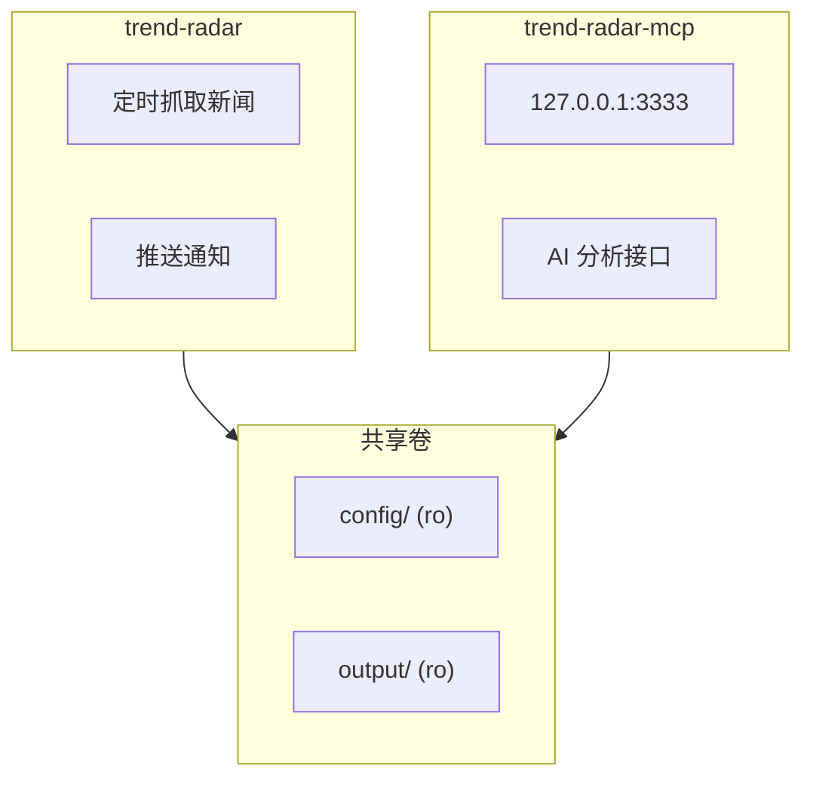

# 部署指南

<cite>
**本文档引用的文件**   
- [Dockerfile](file://docker/Dockerfile)
- [docker-compose.yml](file://docker/docker-compose.yml)
- [.env](file://docker/.env)
- [Dockerfile.mcp](file://docker/Dockerfile.mcp)
- [manage.py](file://docker/manage.py)
- [entrypoint.sh](file://docker/entrypoint.sh)
- [setup-mac.sh](file://setup-mac.sh)
- [setup-windows.bat](file://setup-windows.bat)
- [start-http.sh](file://start-http.sh)
</cite>

## 目录
1. [Docker部署](#docker部署)
2. [GitHub Actions自动化部署](#github-actions自动化部署)
3. [本地运行](#本地运行)
4. [MCP服务器特殊部署](#mcp服务器特殊部署)
5. [故障排除](#故障排除)

## Docker部署

TrendRadar提供完整的Docker部署方案，通过`docker-compose.yml`文件定义了两个服务：`trend-radar`用于新闻推送，`trend-radar-mcp`用于AI分析。部署时，容器会挂载本地的`config`和`output`目录，确保配置和数据的持久化。

`Dockerfile`基于`python:3.10-slim`镜像构建，首先安装`supercronic`定时任务工具，该工具具备重试机制，能有效应对网络波动。随后安装Python依赖，并将项目代码复制到容器内。关键的`entrypoint.sh`脚本作为容器的入口点，负责检查配置文件、设置环境变量，并根据`RUN_MODE`环境变量决定是单次执行还是以cron模式定时运行。在cron模式下，它会生成crontab并立即执行一次任务（由`IMMEDIATE_RUN`控制），同时可选择性地启动内置的Web服务器。

环境变量通过`.env`文件进行集中配置，该文件包含了所有核心设置，如`ENABLE_CRAWLER`（是否启用爬虫）、`REPORT_MODE`（报告模式）、`FEISHU_WEBHOOK_URL`（飞书机器人地址）等。`docker-compose.yml`文件将这些环境变量传递给容器，并通过`ports`将Web服务器的端口映射到宿主机。`WEBSERVER_PORT`默认为8080，可通过修改`.env`文件进行自定义。

完整的部署步骤如下：
1.  **准备配置**：创建`config`和`docker`目录，将`config.yaml`、`frequency_words.txt`和`.env`文件放入相应位置。
2.  **启动服务**：使用`docker compose up -d`命令启动所有服务。该命令会自动拉取`wantcat/trendradar`和`wantcat/trendradar-mcp`镜像。
3.  **验证状态**：通过`docker logs trend-radar`查看日志，确认`supercronic`已作为PID 1进程成功运行。

**Section sources**
- [Dockerfile](file://docker/Dockerfile#L1-L71)
- [docker-compose.yml](file://docker/docker-compose.yml#L1-L88)
- [.env](file://docker/.env#L1-L130)
- [entrypoint.sh](file://docker/entrypoint.sh#L1-L50)

## GitHub Actions自动化部署

GitHub Actions部署利用GitHub的自动化工作流能力，实现定时爬取和云存储。其核心在于配置仓库的Secrets，以安全地存储敏感信息。在仓库的`Settings` -> `Secrets and variables` -> `Actions`中，需要添加多个Secret，其中`WEWORK_WEBHOOK_URL`、`FEISHU_WEBHOOK_URL`等用于配置通知渠道。

对于需要完整功能（如趋势追踪、AI分析）的用户，必须配置远程云存储。推荐使用Cloudflare R2，配置时需在Secrets中添加`S3_BUCKET_NAME`、`S3_ACCESS_KEY_ID`、`S3_SECRET_ACCESS_KEY`和`S3_ENDPOINT_URL`。这些凭据通过`STORAGE_BACKEND=auto`环境变量自动生效，使数据存储在云端而非仓库中，避免了污染仓库历史记录。

部署流程如下：
1.  **Fork仓库**：点击`Use this template`按钮创建自己的仓库。
2.  **配置Secrets**：根据所需的通知渠道和存储方案，在仓库设置中添加相应的Secrets。
3.  **手动测试**：进入仓库的`Actions`标签页，找到`Get Hot News`工作流，点击`Run workflow`进行手动测试。
4.  **定时运行**：工作流会根据`crawler.yml`中的cron表达式（如`0 * * * *`，每小时一次）自动执行。

**Section sources**
- [README.md](file://README.md#L874-L1667)

## 本地运行

对于希望在本地机器上运行的用户，项目提供了便捷的脚本。在macOS系统上，运行`setup-mac.sh`脚本可以自动安装Python依赖。在Windows系统上，运行`setup-windows.bat`或`setup-windows-en.bat`脚本完成环境配置。

配置完成后，可以通过`start-http.sh`（macOS/Linux）或`start-http.bat`（Windows）脚本启动HTTP服务。该脚本本质上是执行`python -m trendradar`命令，以单次模式运行爬虫并生成报告。生成的报告位于`output`目录下，可以直接用浏览器打开`index.html`文件进行查看。

**Section sources**
- [setup-mac.sh](file://setup-mac.sh)
- [setup-windows.bat](file://setup-windows.bat)
- [start-http.sh](file://start-http.sh)

## MCP服务器特殊部署

MCP（Model Context Protocol）服务器用于提供AI智能分析功能，其部署方式与主服务分离。`Dockerfile.mcp`是其专用的构建文件，它基于Python基础镜像，仅复制`mcp_server`和`trendradar`模块，并暴露3333端口。其启动命令为`python -m mcp_server.server --transport http --host 0.0.0.0 --port 3333`。

在Docker Compose中，`trend-radar-mcp`服务通过`docker-compose.yml`文件定义，它同样挂载`config`和`output`目录，以便访问主服务生成的数据。启动后，MCP服务会监听`127.0.0.1:3333`，提供HTTP接口。

用户可以通过`manage.py`脚本与MCP服务交互，例如使用`docker exec -it trend-radar python manage.py start_webserver`启动Web服务器来托管报告。`manage.py`还提供了`status`、`config`、`logs`等命令，用于监控和管理容器状态。

**Diagram sources**
- [Dockerfile.mcp](file://docker/Dockerfile.mcp#L1-L26)
- [docker-compose.yml](file://docker/docker-compose.yml#L74-L88)
- [manage.py](file://docker/manage.py#L1-L648)

**Section sources**
- [Dockerfile.mcp](file://docker/Dockerfile.mcp#L1-L26)
- [manage.py](file://docker/manage.py#L1-L648)

## 故障排除

### Docker网络问题
如果容器无法访问网络，首先检查Docker守护进程状态。确保`docker-compose.yml`中的`ports`配置正确，例如`"127.0.0.1:${WEBSERVER_PORT:-8080}:${WEBSERVER_PORT:-8080}"`确保服务仅绑定到本地回环地址。使用`docker inspect trend-radar`检查容器的网络配置。

### 环境变量未生效
环境变量的优先级高于`config.yaml`文件。如果修改`config.yaml`后配置未生效，应检查`.env`文件或Docker运行时的环境变量设置。确保`Dockerfile`中的`ENV`指令和`docker-compose.yml`中的`environment`部分正确传递了变量。使用`docker exec -it trend-radar python manage.py config`命令可以查看当前生效的配置。

### 容器状态异常
使用`docker exec -it trend-radar python manage.py status`命令检查容器状态。最关键的检查项是PID 1进程是否为`supercronic`。如果不是，说明容器启动异常，需要通过`docker logs trend-radar`查看日志。常见的错误包括配置文件缺失或crontab格式错误。