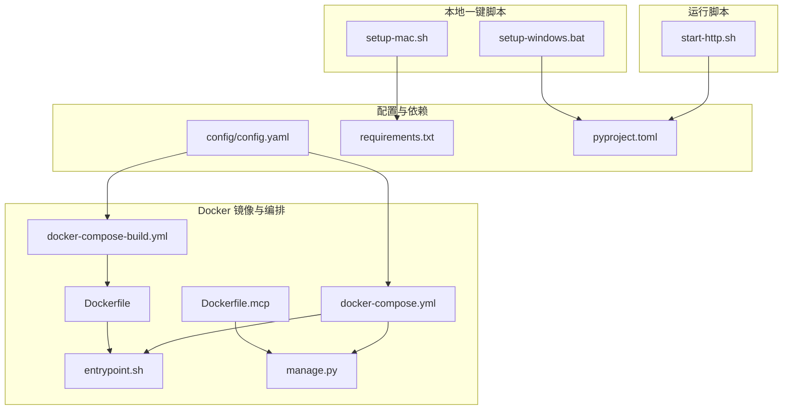
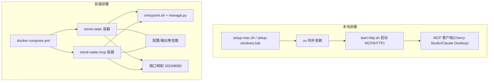
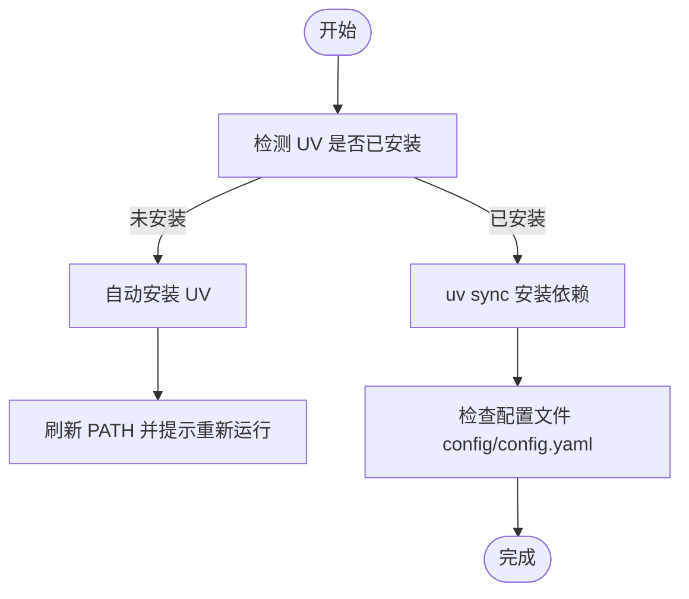
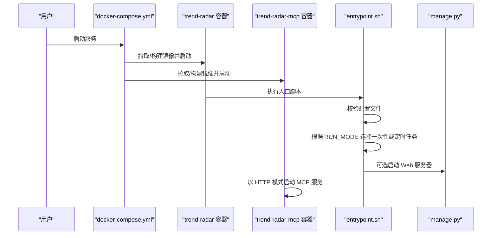
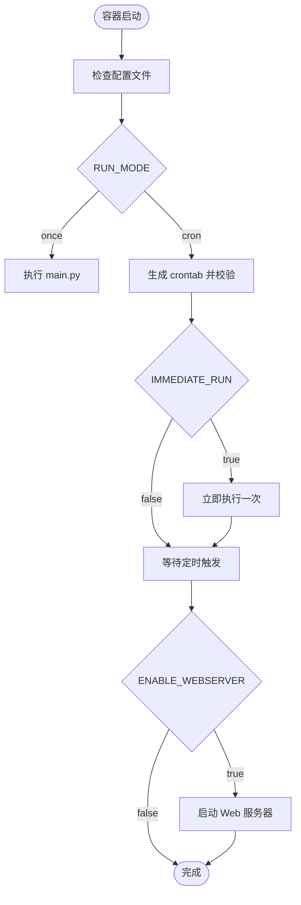
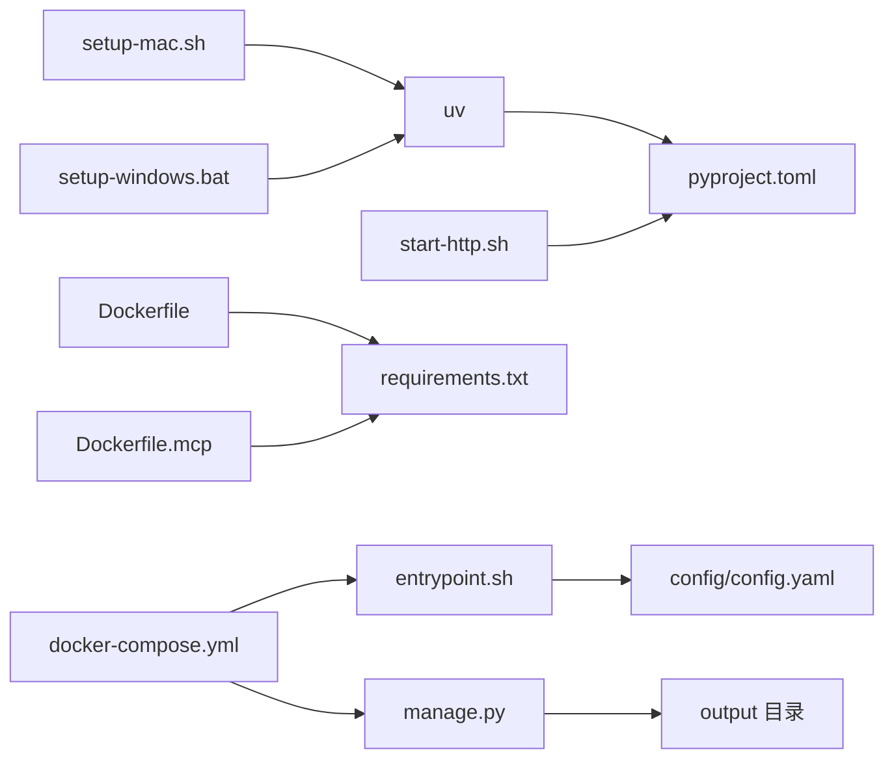

# 部署指南

<cite>
**本文引用的文件**
- [Deployment-Guide.md](file://docs/Deployment-Guide.md)
- [Dockerfile](file://docker/Dockerfile)
- [Dockerfile.mcp](file://docker/Dockerfile.mcp)
- [docker-compose.yml](file://docker/docker-compose.yml)
- [docker-compose-build.yml](file://docker/docker-compose-build.yml)
- [entrypoint.sh](file://docker/entrypoint.sh)
- [manage.py](file://docker/manage.py)
- [setup-mac.sh](file://setup-mac.sh)
- [setup-windows.bat](file://setup-windows.bat)
- [start-http.sh](file://start-http.sh)
- [requirements.txt](file://requirements.txt)
- [pyproject.toml](file://pyproject.toml)
- [config.yaml](file://config/config.yaml)
</cite>

## 目录
1. [简介](#简介)
2. [项目结构](#项目结构)
3. [核心组件](#核心组件)
4. [架构总览](#架构总览)
5. [详细组件分析](#详细组件分析)
6. [依赖关系分析](#依赖关系分析)
7. [性能与运维](#性能与运维)
8. [故障排除指南](#故障排除指南)
9. [结论](#结论)
10. [附录](#附录)

## 简介
本指南面向希望在本地或容器环境中部署 TrendRadar 的用户，覆盖以下目标：
- 通过 setup-mac.sh 与 setup-windows.bat 完成环境初始化与依赖安装
- 基于 Dockerfile 构建镜像，使用 docker-compose.yml 启动服务编排，配置网络与持久化卷
- 结合 Deployment-Guide.md 的步骤，解析 docker-compose.yml 的配置项与运行模式
- 提供健康检查、日志查看与版本升级的最佳实践
- 解决常见部署问题（如端口冲突、权限不足、配置缺失）

## 项目结构
项目采用“脚本 + Docker 编排 + MCP 服务”的多部署形态：
- 本地一键脚本：setup-mac.sh、setup-windows.bat
- Docker 镜像与编排：Dockerfile、Dockerfile.mcp、docker-compose.yml、docker-compose-build.yml
- 容器入口与管理：entrypoint.sh、manage.py
- 运行脚本：start-http.sh
- 配置与依赖：config/config.yaml、requirements.txt、pyproject.toml

```mermaid
graph TB
subgraph "本地一键脚本"
SM["setup-mac.sh"]
SW["setup-windows.bat"]
end
subgraph "Docker 镜像与编排"
DF["Dockerfile"]
DFM["Dockerfile.mcp"]
DC["docker-compose.yml"]
DCB["docker-compose-build.yml"]
EP["entrypoint.sh"]
MP["manage.py"]
end
subgraph "运行脚本"
SH["start-http.sh"]
end
subgraph "配置与依赖"
CFG["config/config.yaml"]
REQ["requirements.txt"]
PYP["pyproject.toml"]
end
SM --> REQ
SW --> PYP
DF --> EP
DFM --> MP
DC --> EP
DCB --> DF
DC --> MP
SH --> PYP
CFG --> DC
CFG --> DCB
```

图表来源
- [Dockerfile](file://docker/Dockerfile#L1-L71)
- [Dockerfile.mcp](file://docker/Dockerfile.mcp#L1-L24)
- [docker-compose.yml](file://docker/docker-compose.yml#L1-L74)
- [docker-compose-build.yml](file://docker/docker-compose-build.yml#L1-L78)
- [entrypoint.sh](file://docker/entrypoint.sh#L1-L50)
- [manage.py](file://docker/manage.py#L1-L625)
- [setup-mac.sh](file://setup-mac.sh#L1-L119)
- [setup-windows.bat](file://setup-windows.bat#L1-L181)
- [start-http.sh](file://start-http.sh#L1-L22)
- [config.yaml](file://config/config.yaml#L1-L140)
- [requirements.txt](file://requirements.txt#L1-L6)
- [pyproject.toml](file://pyproject.toml#L1-L26)

章节来源
- [Dockerfile](file://docker/Dockerfile#L1-L71)
- [Dockerfile.mcp](file://docker/Dockerfile.mcp#L1-L24)
- [docker-compose.yml](file://docker/docker-compose.yml#L1-L74)
- [docker-compose-build.yml](file://docker/docker-compose-build.yml#L1-L78)
- [entrypoint.sh](file://docker/entrypoint.sh#L1-L50)
- [manage.py](file://docker/manage.py#L1-L625)
- [setup-mac.sh](file://setup-mac.sh#L1-L119)
- [setup-windows.bat](file://setup-windows.bat#L1-L181)
- [start-http.sh](file://start-http.sh#L1-L22)
- [config.yaml](file://config/config.yaml#L1-L140)
- [requirements.txt](file://requirements.txt#L1-L6)
- [pyproject.toml](file://pyproject.toml#L1-L26)

## 核心组件
- 本地一键部署脚本
  - macOS：setup-mac.sh，负责 UV 安装、依赖同步、配置检查与 MCP 客户端配置指引
  - Windows：setup-windows.bat，负责 Python/UV 检测、依赖同步、配置检查与 MCP 客户端配置指引
- Docker 镜像与编排
  - Dockerfile：基础镜像、依赖安装、入口脚本、环境变量与默认入口
  - Dockerfile.mcp：MCP 服务器专用镜像，暴露 3333 端口并以 HTTP 模式启动
  - docker-compose.yml：官方示例编排，包含两个服务：trend-radar（爬虫+Web）、trend-radar-mcp（MCP 服务）
  - docker-compose-build.yml：本地构建版本，从根目录 Dockerfile 构建镜像
- 容器入口与管理
  - entrypoint.sh：校验配置、根据 RUN_MODE 选择一次性执行或定时任务，并可选启动 Web 服务器
  - manage.py：容器内管理工具，提供 run/status/config/files/logs/restart/start_webserver/stop_webserver/webserver_status/help 等命令
- 运行脚本
  - start-http.sh：本地 HTTP 模式启动 MCP 服务器（便于远程访问）
- 配置与依赖
  - config/config.yaml：应用配置（爬虫、推送、平台等）
  - requirements.txt、pyproject.toml：依赖清单

章节来源
- [setup-mac.sh](file://setup-mac.sh#L1-L119)
- [setup-windows.bat](file://setup-windows.bat#L1-L181)
- [Dockerfile](file://docker/Dockerfile#L1-L71)
- [Dockerfile.mcp](file://docker/Dockerfile.mcp#L1-L24)
- [docker-compose.yml](file://docker/docker-compose.yml#L1-L74)
- [docker-compose-build.yml](file://docker/docker-compose-build.yml#L1-L78)
- [entrypoint.sh](file://docker/entrypoint.sh#L1-L50)
- [manage.py](file://docker/manage.py#L1-L625)
- [start-http.sh](file://start-http.sh#L1-L22)
- [config.yaml](file://config/config.yaml#L1-L140)
- [requirements.txt](file://requirements.txt#L1-L6)
- [pyproject.toml](file://pyproject.toml#L1-L26)

## 架构总览
下图展示本地与容器两种部署形态的总体架构与交互关系。

```mermaid
graph TB
subgraph "本地部署"
L1["setup-mac.sh / setup-windows.bat"]
L2["uv 同步依赖"]
L3["start-http.sh 启动 MCP(HTTP)"]
L4["MCP 客户端(Cherry Studio/Claude Desktop)"]
end
subgraph "容器部署"
C1["docker-compose.yml"]
C2["trend-radar 容器"]
C3["trend-radar-mcp 容器"]
C4["entrypoint.sh + manage.py"]
C5["配置/输出卷挂载"]
C6["端口映射 3333/8080"]
end
L1 --> L2 --> L3 --> L4
C1 --> C2
C1 --> C3
C2 --> C4
C3 --> C4
C2 --- C5
C3 --- C5
C2 --> C6
C3 --> C6
```

图表来源
- [docker-compose.yml](file://docker/docker-compose.yml#L1-L74)
- [entrypoint.sh](file://docker/entrypoint.sh#L1-L50)
- [manage.py](file://docker/manage.py#L1-L625)
- [start-http.sh](file://start-http.sh#L1-L22)
- [setup-mac.sh](file://setup-mac.sh#L1-L119)
- [setup-windows.bat](file://setup-windows.bat#L1-L181)

## 详细组件分析

### 本地部署：setup-mac.sh 与 setup-windows.bat
- 功能要点
  - 自动检测并安装 UV（macOS：curl 安装；Windows：PowerShell/pip 安装）
  - 同步项目依赖（uv sync）
  - 校验配置文件是否存在，给出下一步 MCP 客户端配置指引
- 使用建议
  - macOS：首次运行若提示 UV 未安装，按提示重新运行脚本
  - Windows：安装完成后需重新打开终端再运行脚本，确保 PATH 生效
  - 若依赖安装失败，检查网络与 Python 版本（>=3.10）

```mermaid
flowchart TD
Start(["开始"]) --> CheckUV["检测 UV 是否已安装"]
CheckUV --> |未安装| InstallUV["自动安装 UV"]
InstallUV --> RefreshPath["刷新 PATH 并提示重新运行"]
CheckUV --> |已安装| SyncDeps["uv sync 安装依赖"]
SyncDeps --> CheckCfg["检查配置文件 config/config.yaml"]
CheckCfg --> Done(["完成"])
```

图表来源
- [setup-mac.sh](file://setup-mac.sh#L1-L119)
- [setup-windows.bat](file://setup-windows.bat#L1-L181)

章节来源
- [setup-mac.sh](file://setup-mac.sh#L1-L119)
- [setup-windows.bat](file://setup-windows.bat#L1-L181)

### Docker 镜像与编排：Dockerfile、Dockerfile.mcp、docker-compose.yml、docker-compose-build.yml
- Dockerfile
  - 基于 python:3.10-slim
  - 安装依赖、复制入口脚本与 manage.py、创建 config/output 目录、设置环境变量
  - 默认 ENTRYPOINT 为 /entrypoint.sh
- Dockerfile.mcp
  - 专门用于 MCP 服务器（HTTP 模式），暴露 3333 端口并以 HTTP 模式启动
- docker-compose.yml（官方示例）
  - 两个服务：trend-radar（爬虫+Web）、trend-radar-mcp（MCP 服务）
  - 端口映射：trend-radar 127.0.0.1:8080->8080（可由 WEBSERVER_PORT 覆盖），trend-radar-mcp 127.0.0.1:3333->3333
  - 卷挂载：config 读写、output 只读（MCP 服务）
  - 环境变量：时区、运行模式、推送配置、Web 服务器开关与端口、定时任务计划等
- docker-compose-build.yml（本地构建）
  - 从根目录 Dockerfile 构建镜像，其余配置与官方示例一致

```mermaid
sequenceDiagram
participant User as "用户"
participant Compose as "docker-compose.yml"
participant TR as "trend-radar 容器"
participant TRM as "trend-radar-mcp 容器"
participant Entryp as "entrypoint.sh"
participant Mgr as "manage.py"
User->>Compose : 启动服务
Compose->>TR : 拉取/构建镜像并启动
Compose->>TRM : 拉取/构建镜像并启动
TR->>Entryp : 执行入口脚本
Entryp->>Entryp : 校验配置文件
Entryp->>Entryp : 根据 RUN_MODE 选择一次性或定时任务
Entryp->>Mgr : 可选启动 Web 服务器
TRM->>TRM : 以 HTTP 模式启动 MCP 服务
```

图表来源
- [docker-compose.yml](file://docker/docker-compose.yml#L1-L74)
- [docker-compose-build.yml](file://docker/docker-compose-build.yml#L1-L78)
- [Dockerfile](file://docker/Dockerfile#L1-L71)
- [Dockerfile.mcp](file://docker/Dockerfile.mcp#L1-L24)
- [entrypoint.sh](file://docker/entrypoint.sh#L1-L50)
- [manage.py](file://docker/manage.py#L1-L625)

章节来源
- [Dockerfile](file://docker/Dockerfile#L1-L71)
- [Dockerfile.mcp](file://docker/Dockerfile.mcp#L1-L24)
- [docker-compose.yml](file://docker/docker-compose.yml#L1-L74)
- [docker-compose-build.yml](file://docker/docker-compose-build.yml#L1-L78)

### 容器入口与管理：entrypoint.sh 与 manage.py
- entrypoint.sh
  - 校验配置文件是否存在
  - 根据 RUN_MODE：
    - once：一次性执行 main.py
    - cron：生成 crontab 并由 supercronic 作为 PID 1 运行；可选立即执行一次；可选启动 Web 服务器
  - 保存环境变量至 /etc/environment
- manage.py
  - 提供 run/status/config/files/logs/restart/start_webserver/stop_webserver/webserver_status/help 等命令
  - Web 服务器默认端口 8080，绑定 0.0.0.0，限制在输出目录只读访问
  - 提供 cron 表达式的人类可读解析与容器状态检查

```mermaid
flowchart TD
EStart(["容器启动"]) --> CheckCfg["检查配置文件"]
CheckCfg --> Mode{"RUN_MODE"}
Mode --> |once| RunOnce["执行 main.py"]
Mode --> |cron| GenCron["生成 crontab 并校验"]
GenCron --> Immediate{"IMMEDIATE_RUN"}
Immediate --> |true| RunNow["立即执行一次"]
Immediate --> |false| Wait["等待定时触发"]
RunNow --> Wait
Wait --> WebCheck{"ENABLE_WEBSERVER"}
WebCheck --> |true| StartWS["启动 Web 服务器"]
WebCheck --> |false| End(["完成"])
StartWS --> End
```

图表来源
- [entrypoint.sh](file://docker/entrypoint.sh#L1-L50)
- [manage.py](file://docker/manage.py#L1-L625)

章节来源
- [entrypoint.sh](file://docker/entrypoint.sh#L1-L50)
- [manage.py](file://docker/manage.py#L1-L625)

### 运行脚本：start-http.sh
- 本地 HTTP 模式启动 MCP 服务器（便于远程访问）
- 仅在本地开发与测试阶段使用，生产环境建议使用 Docker 编排

章节来源
- [start-http.sh](file://start-http.sh#L1-L22)

### 配置与依赖：config.yaml、requirements.txt、pyproject.toml
- config/config.yaml
  - app：版本检查、更新提示
  - crawler：请求间隔、代理、启用开关
  - report：推送模式、排序策略、最大新闻数、内容顺序
  - notification：启用通知、批次大小、推送时间窗口、多账号配置、各渠道 Webhook
  - weight/platforms：平台权重与平台列表
- requirements.txt、pyproject.toml
  - 统一声明依赖（requests、PyYAML、fastmcp、websockets 等）

章节来源
- [config.yaml](file://config/config.yaml#L1-L140)
- [requirements.txt](file://requirements.txt#L1-L6)
- [pyproject.toml](file://pyproject.toml#L1-L26)

## 依赖关系分析
- 本地部署
  - setup-mac.sh/setup-windows.bat 依赖 uv 与 Python（>=3.10）
  - start-http.sh 依赖已同步的虚拟环境
- 容器部署
  - Dockerfile/Dockerfile.mcp 依赖 requirements.txt
  - docker-compose.yml 依赖 entrypoint.sh 与 manage.py
  - manage.py 依赖输出目录与配置文件

```mermaid
graph LR
SM["setup-mac.sh"] --> UV["uv"]
SW["setup-windows.bat"] --> UV
UV --> PYP["pyproject.toml"]
SH["start-http.sh"] --> PYP
DF["Dockerfile"] --> REQ["requirements.txt"]
DFM["Dockerfile.mcp"] --> REQ
DC["docker-compose.yml"] --> EP["entrypoint.sh"]
DC --> MP["manage.py"]
EP --> CFG["config/config.yaml"]
MP --> OUT["output 目录"]
```

图表来源
- [setup-mac.sh](file://setup-mac.sh#L1-L119)
- [setup-windows.bat](file://setup-windows.bat#L1-L181)
- [start-http.sh](file://start-http.sh#L1-L22)
- [Dockerfile](file://docker/Dockerfile#L1-L71)
- [Dockerfile.mcp](file://docker/Dockerfile.mcp#L1-L24)
- [docker-compose.yml](file://docker/docker-compose.yml#L1-L74)
- [entrypoint.sh](file://docker/entrypoint.sh#L1-L50)
- [manage.py](file://docker/manage.py#L1-L625)
- [config.yaml](file://config/config.yaml#L1-L140)
- [requirements.txt](file://requirements.txt#L1-L6)
- [pyproject.toml](file://pyproject.toml#L1-L26)

章节来源
- [setup-mac.sh](file://setup-mac.sh#L1-L119)
- [setup-windows.bat](file://setup-windows.bat#L1-L181)
- [start-http.sh](file://start-http.sh#L1-L22)
- [Dockerfile](file://docker/Dockerfile#L1-L71)
- [Dockerfile.mcp](file://docker/Dockerfile.mcp#L1-L24)
- [docker-compose.yml](file://docker/docker-compose.yml#L1-L74)
- [entrypoint.sh](file://docker/entrypoint.sh#L1-L50)
- [manage.py](file://docker/manage.py#L1-L625)
- [config.yaml](file://config/config.yaml#L1-L140)
- [requirements.txt](file://requirements.txt#L1-L6)
- [pyproject.toml](file://pyproject.toml#L1-L26)

## 性能与运维
- 健康检查
  - 官方示例编排包含健康检查，通过 HTTP 端点进行探测
  - 可参考 Deployment-Guide.md 中的健康检查端点与脚本
- 日志管理
  - 容器日志：docker logs trend-radar
  - 容器内日志查看：python manage.py logs
  - 应用日志：参考 Deployment-Guide.md 中的日志管理与轮转配置
- 性能优化
  - 环境变量优化：PYTHONUNBUFFERED、PYTHONDONTWRITEBYTECODE、PYTHONMALLOC
  - 内核参数与系统资源：参考 Deployment-Guide.md 中的系统优化建议
- 升级与回滚
  - 备份当前版本、拉取最新代码、更新依赖、重启服务、验证健康检查
  - 参考 Deployment-Guide.md 的升级流程与验证步骤

章节来源
- [docker-compose.yml](file://docker/docker-compose.yml#L1-L74)
- [Deployment-Guide.md](file://docs/Deployment-Guide.md#L335-L430)
- [manage.py](file://docker/manage.py#L1-L625)

## 故障排除指南
- 端口冲突
  - 症状：端口被占用导致服务无法启动
  - 解决：修改 docker-compose.yml 中的端口映射或释放宿主机端口
- 权限不足
  - 症状：容器无法写入输出目录或读取配置
  - 解决：确保挂载目录权限正确，容器内以非 root 用户运行时注意权限
- 配置缺失
  - 症状：entrypoint.sh 报告配置文件缺失
  - 解决：准备 config/config.yaml 与 frequency_words.txt，并确认挂载路径正确
- UV 安装失败（本地）
  - 症状：uv: command not found
  - 解决：手动添加到 PATH 或使用 pip 安装
- MCP 连接失败
  - 症状：客户端无法连接到 MCP 服务器
  - 解决：检查服务状态、端口占用、日志输出

章节来源
- [Deployment-Guide.md](file://docs/Deployment-Guide.md#L431-L506)
- [entrypoint.sh](file://docker/entrypoint.sh#L1-L50)
- [docker-compose.yml](file://docker/docker-compose.yml#L1-L74)
- [setup-mac.sh](file://setup-mac.sh#L1-L119)
- [setup-windows.bat](file://setup-windows.bat#L1-L181)

## 结论
本指南提供了从本地一键部署到容器化编排的完整路径，涵盖环境初始化、镜像构建、服务编排、健康检查、日志管理与版本升级。建议在生产环境中优先采用 Docker 编排，并结合健康检查与日志轮转策略，确保服务稳定运行。

## 附录
- 常用命令参考
  - 本地一键部署：./setup-mac.sh 或双击 setup-windows.bat
  - 容器编排：docker-compose up -d
  - 容器内管理：docker exec -it trend-radar python manage.py status
  - 查看日志：docker logs -f trend-radar
  - 健康检查：curl http://localhost:3333/health