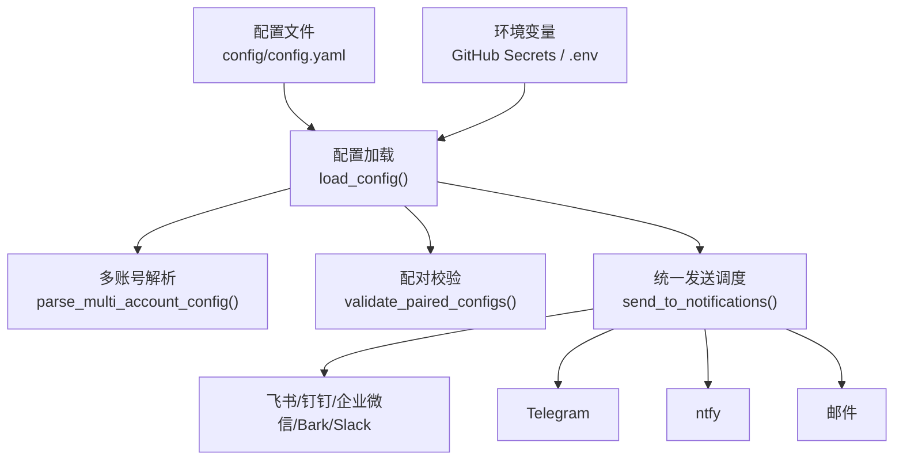
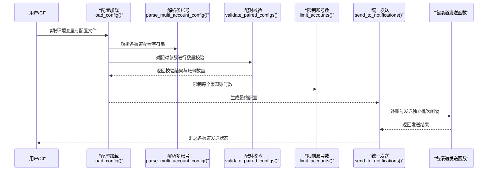
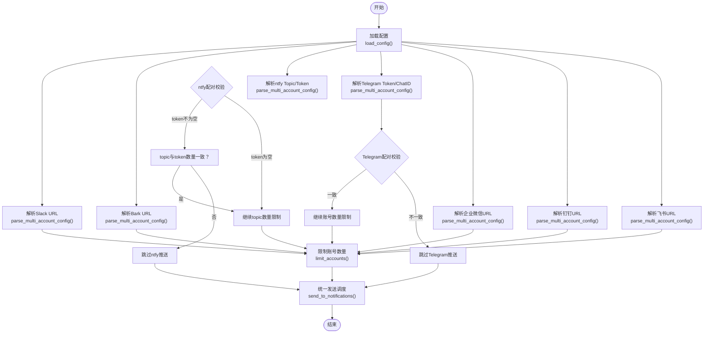
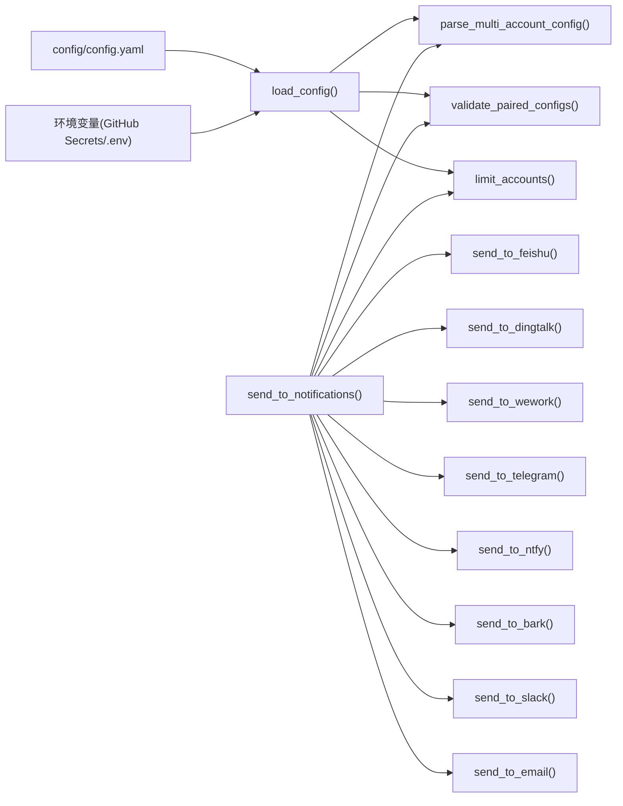

# Webhook通知配置

<cite>
**本文引用的文件**
- [main.py](file://main.py)
- [config/config.yaml](file://config/config.yaml)
- [README.md](file://README.md)
- [README-EN.md](file://README-EN.md)
</cite>

## 目录
1. [简介](#简介)
2. [项目结构](#项目结构)
3. [核心组件](#核心组件)
4. [架构总览](#架构总览)
5. [详细组件分析](#详细组件分析)
6. [依赖关系分析](#依赖关系分析)
7. [性能考量](#性能考量)
8. [故障排查指南](#故障排查指南)
9. [结论](#结论)
10. [附录](#附录)

## 简介
本文件面向使用 TrendRadar 的用户，提供详尽的 Webhook 通知渠道配置说明，覆盖飞书、钉钉、企业微信、Telegram、邮件、ntfy、Bark、Slack 等渠道。重点阐述多账号支持机制与配对参数校验，结合 main.py 中的 parse_multi_account_config 与 validate_paired_configs 函数，解释多账号解析与验证的实现逻辑。同时强调安全警告：切勿在公共仓库暴露 Webhook，应使用 GitHub Secrets 或 Docker 环境变量。文末提供完整多账号配置示例与常见错误排查方法。

## 项目结构
- 配置入口：config/config.yaml 提供通知渠道的基础配置项与默认值；GitHub Actions/Docker 环境变量可覆盖配置。
- 配置加载：main.py 的 load_config 负责从环境变量与配置文件合并读取各渠道配置，并进行多账号解析与配对校验。
- 通知发送：main.py 的 send_to_notifications 统一调度各渠道发送，支持多账号独立发送、批次间隔、日志标注“账号1/账号2”等。

图表来源
- [config/config.yaml](file://config/config.yaml#L34-L110)
- [main.py](file://main.py#L162-L395)
- [main.py](file://main.py#L3800-L3988)

章节来源
- [config/config.yaml](file://config/config.yaml#L34-L110)
- [main.py](file://main.py#L162-L395)
- [main.py](file://main.py#L3800-L3988)

## 核心组件
- 多账号解析函数 parse_multi_account_config：按分号分隔字符串为账号列表，保留空串用于占位，过滤全空情况。
- 配对校验函数 validate_paired_configs：对多个配对参数（如 Telegram 的 token 与 chat_id、ntfy 的 topic 与 token）进行数量一致性校验，若不一致则跳过该渠道推送。
- 限制函数 limit_accounts：将账号数量限制在 max_accounts_per_channel，避免 GitHub Actions 超时与账号风险。
- 安全函数 get_account_at_index：安全地按索引取账号值，支持默认值与越界保护。
- 配置加载 load_config：从环境变量与配置文件合并读取各渠道配置，输出配置来源与账号数量。
- 统一发送 send_to_notifications：按渠道拆解多账号，逐个发送并聚合结果，支持批次间隔与“账号X”日志标注。

章节来源
- [main.py](file://main.py#L58-L160)
- [main.py](file://main.py#L162-L395)
- [main.py](file://main.py#L3800-L3988)

## 架构总览
下图展示配置加载与通知发送的整体流程，突出多账号解析与配对校验的关键节点。

图表来源
- [main.py](file://main.py#L162-L395)
- [main.py](file://main.py#L3800-L3988)

## 详细组件分析

### 配置加载与多账号解析
- 配置来源优先级：环境变量 > 配置文件。各渠道的 URL/Token/Topic 等均支持通过环境变量覆盖。
- 多账号解析：使用分号分隔多个账号值；空串用于占位（例如 “;token2” 表示第一个账号为空）。全空则视为空列表。
- 账号数量限制：max_accounts_per_channel 默认值来自配置文件，超过上限将截断并打印警告。
- 配对校验：对 Telegram 的 token 与 chat_id、ntfy 的 topic 与 token 进行数量一致性检查；ntfy 的 token 可选，但一旦提供则必须与 topic 数量一致。

章节来源
- [main.py](file://main.py#L162-L395)
- [config/config.yaml](file://config/config.yaml#L34-L110)

### 通知发送流程与多账号策略
- 统一调度：send_to_notifications 按渠道拆解多账号，逐个发送，独立计算批次间隔，最终聚合任一成功即算整体成功。
- 日志标注：当存在多个账号时，会在日志中标注“账号1/账号2”，便于区分各账号发送状态。
- 时间窗口控制：可配置推送时间窗口与“一天一次”策略，配合推送记录管理器避免重复推送。

章节来源
- [main.py](file://main.py#L3800-L3988)

### 各通知渠道配置要点

- 飞书（Feishu）
  - 配置项：feishu_url（多账号用分号分隔）
  - 特点：支持多群组推送；消息分批大小由配置决定
  - 配置来源：环境变量或配置文件
  - 示例参考：README 中的多账号示例

- 钉钉（DingTalk）
  - 配置项：dingtalk_url（多账号用分号分隔）
  - 特点：支持多群组推送；消息分批大小由配置决定
  - 配置来源：环境变量或配置文件
  - 示例参考：README 中的多账号示例

- 企业微信（WeWork）
  - 配置项：wework_url（多账号用分号分隔）、wework_msg_type（markdown 或 text）
  - 特点：支持群机器人与个人微信应用推送（通过 msg_type 切换）
  - 配置来源：环境变量或配置文件
  - 示例参考：README 中的企业微信配置说明

- Telegram
  - 配置项：telegram_bot_token、telegram_chat_id（两者数量必须一致）
  - 特点：需配对参数；支持多账号；数量不一致将跳过该渠道
  - 配置来源：环境变量或配置文件
  - 示例参考：README 中的 Telegram 配对示例

- 邮件（Email）
  - 配置项：email_from、email_password、email_to（多收件人用英文逗号分隔）、email_smtp_server、email_smtp_port
  - 特点：已支持多收件人；自动识别主流邮箱 SMTP
  - 配置来源：环境变量或配置文件
  - 示例参考：README 中的邮件配置说明

- ntfy
  - 配置项：ntfy_server_url（默认使用公共服务）、ntfy_topic（多账号用分号分隔）、ntfy_token（可选，与 topic 数量一致）
  - 特点：topic 与 token 数量必须一致；token 可为空表示匿名访问
  - 配置来源：环境变量或配置文件
  - 示例参考：README 中的 ntfy 配对示例

- Bark
  - 配置项：bark_url（多账号用分号分隔）
  - 特点：iOS 专属推送；支持多设备
  - 配置来源：环境变量或配置文件
  - 示例参考：README 中的 Bark 配置说明

- Slack
  - 配置项：slack_webhook_url（多账号用分号分隔）
  - 特点：支持 Markdown 转换为 mrkdwn；自动分批发送
  - 配置来源：环境变量或配置文件
  - 示例参考：README 中的 Slack 配置说明

章节来源
- [config/config.yaml](file://config/config.yaml#L34-L110)
- [README.md](file://README.md#L846-L1460)
- [README.md](file://README.md#L2596-L2752)
- [README-EN.md](file://README-EN.md#L809-L1422)
- [README-EN.md](file://README-EN.md#L2569-L2718)

### 多账号解析与配对校验实现逻辑

图表来源
- [main.py](file://main.py#L162-L395)
- [main.py](file://main.py#L3800-L3988)

章节来源
- [main.py](file://main.py#L58-L160)
- [main.py](file://main.py#L162-L395)
- [main.py](file://main.py#L3800-L3988)

## 依赖关系分析
- 配置层依赖：config/config.yaml 提供默认配置与注释说明；GitHub Secrets/Docker 环境变量覆盖默认值。
- 业务层依赖：send_to_notifications 依赖 parse_multi_account_config、validate_paired_configs、limit_accounts 等工具函数。
- 渠道层依赖：各渠道发送函数（如 send_to_feishu、send_to_telegram 等）在统一调度中被调用，各自负责内容分批与批次间隔。

图表来源
- [config/config.yaml](file://config/config.yaml#L34-L110)
- [main.py](file://main.py#L162-L395)
- [main.py](file://main.py#L3800-L3988)

章节来源
- [config/config.yaml](file://config/config.yaml#L34-L110)
- [main.py](file://main.py#L162-L395)
- [main.py](file://main.py#L3800-L3988)

## 性能考量
- 多账号独立发送：每个账号独立计算批次间隔，总耗时约为“账号数 × 单账号耗时”。建议控制账号数量，避免 GitHub Actions 超时与资源占用过高。
- 批次大小与间隔：各渠道配置了不同的消息分批大小与批次间隔，合理设置可平衡推送效率与平台限制。
- 时间窗口控制：可配置每日只推送一次，减少重复推送与平台压力。

章节来源
- [config/config.yaml](file://config/config.yaml#L34-L110)
- [main.py](file://main.py#L3800-L3988)

## 故障排查指南
- 配置未生效
  - 确认是否使用了正确的环境变量名称（README 中列出了固定名称），并在 GitHub Secrets 中逐一添加。
  - 确认配置文件路径与权限，确保 main.py 能读取到 config/config.yaml。
- Telegram/ntfy 配对参数数量不一致
  - 现象：该渠道被跳过，日志提示配对数量不一致。
  - 处理：确保 token 与 chat_id（Telegram）或 topic 与 token（ntfy）数量一致；ntfy 的 token 可为空，但若提供则必须与 topic 数量一致。
- 账号数量超过限制
  - 现象：超过 max_accounts_per_channel 时，系统会截断并打印警告。
  - 处理：降低账号数量或调整 max_accounts_per_channel。
- GitHub Actions 超时/账号风险
  - 现象：多账号导致总耗时过长，可能触发 Actions 速率限制或账号风险。
  - 处理：减少账号数量，或切换到 Docker 部署以获得更稳定的运行环境。
- 邮件推送失败
  - 现象：SMTP 服务器/端口识别失败或认证错误。
  - 处理：手动设置 email_smtp_server 与 email_smtp_port，或使用自动识别的主流邮箱配置。
- Slack/飞书/钉钉/企业微信/Bark 推送失败
  - 现象：HTTP 状态码异常或返回非预期文本。
  - 处理：检查 webhook URL 是否正确、是否被平台限制；确认内容分批大小与批次间隔设置合理。

章节来源
- [README.md](file://README.md#L846-L1460)
- [README.md](file://README.md#L2596-L2752)
- [README-EN.md](file://README-EN.md#L809-L1422)
- [README-EN.md](file://README-EN.md#L2569-L2718)
- [main.py](file://main.py#L3800-L3988)

## 结论
通过环境变量与配置文件的灵活组合，TrendRadar 支持多账号与配对参数的精细化配置。parse_multi_account_config 与 validate_paired_configs 保障了多账号解析与配对校验的可靠性；limit_accounts 与时间窗口控制进一步提升了稳定性与安全性。请务必使用 GitHub Secrets 或 Docker 环境变量存放敏感信息，避免在公共仓库暴露 Webhook。

## 附录

### 安全警告与最佳实践
- 切勿在公共仓库暴露 Webhook/Token/密码等敏感信息；优先使用 GitHub Secrets 或 Docker 环境变量。
- GitHub Fork 用户请勿在 config/config.yaml 中配置推送信息。
- 多账号推送会增加总耗时，建议不超过 max_accounts_per_channel（默认 3）。

章节来源
- [config/config.yaml](file://config/config.yaml#L60-L91)
- [README.md](file://README.md#L2596-L2646)
- [README-EN.md](file://README-EN.md#L2569-L2608)

### 多账号配置示例（环境变量）
- 飞书多账号（3个群组）
  - FEISHU_WEBHOOK_URL=https://hook1.feishu.cn/xxx;https://hook2.feishu.cn/yyy;https://hook3.feishu.cn/zzz
- 钉钉多账号（2个群组）
  - DINGTALK_WEBHOOK_URL=https://oapi.dingtalk.com/xxx;https://oapi.dingtalk.com/yyy
- 企业微信多账号（2个群组）
  - WEWORK_WEBHOOK_URL=https://qyapi.weixin.qq.com/cgi-bin/webhook/send?key=xxx;https://qyapi.weixin.qq.com/cgi-bin/webhook/send?key=yyy
- Bark多账号（2个设备）
  - BARK_URL=https://api.day.app/key1;https://api.day.app/key2
- Slack多账号（2个频道）
  - SLACK_WEBHOOK_URL=https://hooks.slack.com/xxx;https://hooks.slack.com/yyy
- Telegram配对（2个账号）
  - TELEGRAM_BOT_TOKEN=123456:AAA-BBB;789012:CCC-DDD
  - TELEGRAM_CHAT_ID=-100111;-100222
- ntfy配对（2个topic，第二个需要token）
  - NTFY_TOPIC=topic1;topic2
  - NTFY_TOKEN=;token2

章节来源
- [README.md](file://README.md#L2627-L2752)
- [README-EN.md](file://README-EN.md#L2603-L2718)