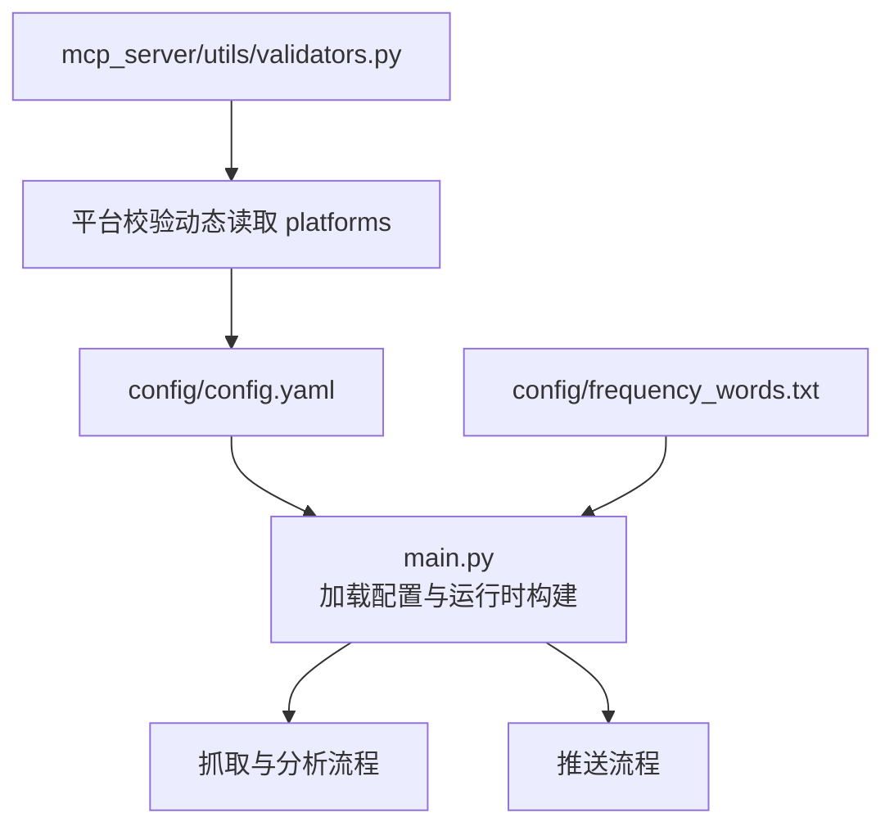
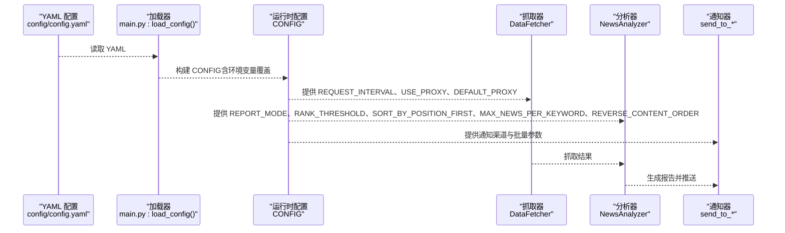
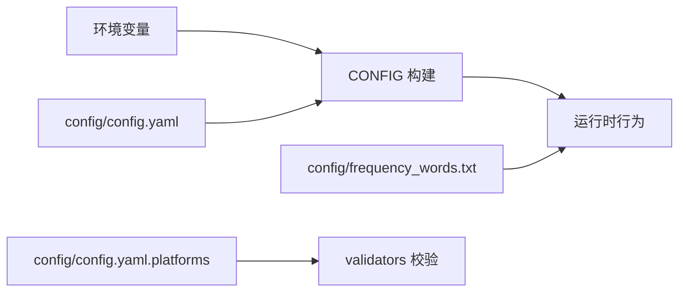

# 主配置文件指南

<cite>
**本文引用的文件**
- [config/config.yaml](file://config/config.yaml)
- [main.py](file://main.py)
- [mcp_server/utils/validators.py](file://mcp_server/utils/validators.py)
- [config/frequency_words.txt](file://config/frequency_words.txt)
- [README.md](file://README.md)
- [README-EN.md](file://README-EN.md)
</cite>

## 目录
1. [简介](#简介)
2. [项目结构](#项目结构)
3. [核心组件](#核心组件)
4. [架构总览](#架构总览)
5. [详细组件分析](#详细组件分析)
6. [依赖关系分析](#依赖关系分析)
7. [性能考量](#性能考量)
8. [故障排查指南](#故障排查指南)
9. [结论](#结论)
10. [附录](#附录)

## 简介
本指南围绕 config/config.yaml 的主配置文件，逐项解释 app、crawler、report、notification、weight、platforms 等核心配置节的功能与参数含义；重点说明 request_interval 请求间隔、report 推送模式（daily/incremental/current）的选择策略、notification 中多账号分号分隔机制及安全警告（webhook 保密）、weight 权重算法配置（rank_weight/frequency_weight/hotness_weight）对排序的影响；并结合 main.py 中的加载逻辑，给出完整配置示例与常见配置错误排查方法。

## 项目结构
- 配置文件位于 config/config.yaml，包含应用版本检查、爬虫间隔、推送模式、通知渠道、权重配置、平台列表等。
- 主程序 main.py 负责加载 YAML 配置、解析环境变量覆盖、构建运行时 CONFIG，并驱动后续的数据抓取、分析与推送。
- MCP 侧工具 mcp_server/utils/validators.py 提供平台校验等辅助能力，间接依赖 config.yaml 的 platforms 配置。
- 关键词配置位于 config/frequency_words.txt，配合 report 配置共同决定推送内容与展示顺序。

图表来源
- [config/config.yaml](file://config/config.yaml#L1-L140)
- [main.py](file://main.py#L161-L395)
- [mcp_server/utils/validators.py](file://mcp_server/utils/validators.py#L16-L41)

章节来源
- [config/config.yaml](file://config/config.yaml#L1-L140)
- [main.py](file://main.py#L161-L395)
- [mcp_server/utils/validators.py](file://mcp_server/utils/validators.py#L16-L41)

## 核心组件
- app 节：应用版本检查与更新提示控制。
- crawler 节：请求间隔、爬虫开关、代理开关与默认代理。
- report 节：推送模式、排名高亮阈值、排序优先级、每关键词最大显示数、内容顺序等。
- notification 节：通知开关、分批大小、批次间隔、消息分隔线、每渠道最大账号数、推送时间窗口、webhook 配置（飞书、钉钉、企业微信、Telegram、邮箱、ntfy、Bark、Slack）。
- weight 节：权重算法配置（rank_weight/frequency_weight/hotness_weight）。
- platforms 节：监控平台清单（id/name）。

章节来源
- [config/config.yaml](file://config/config.yaml#L1-L140)

## 架构总览
下图展示了配置加载与运行时的关键交互：config/config.yaml 作为权威配置源，main.py 通过 YAML 解析与环境变量覆盖构建 CONFIG，随后驱动抓取、分析与推送。

图表来源
- [config/config.yaml](file://config/config.yaml#L1-L140)
- [main.py](file://main.py#L161-L395)

## 详细组件分析

### app 节
- version_check_url：远程版本检查地址。
- show_version_update：是否显示版本更新提示。

章节来源
- [config/config.yaml](file://config/config.yaml#L1-L5)

### crawler 节
- request_interval：请求间隔（毫秒）。main.py 在抓取循环中使用该值进行延时，且会加入微小随机抖动以降低被限流风险。
- enable_crawler：是否启用爬取功能。若为 false，程序会提前终止。
- use_proxy/default_proxy：是否启用代理以及默认代理地址。

章节来源
- [config/config.yaml](file://config/config.yaml#L5-L10)
- [main.py](file://main.py#L683-L740)

### report 节
- mode：推送模式，可选 "daily"、"incremental"、"current"。main.py 会优先读取环境变量 REPORT_MODE，未设置时回退到配置文件。
- rank_threshold：排名高亮阈值，用于在报告中标注热点区间。
- sort_by_position_first：排序优先级。true 表示先按配置位置排序，false 表示先按热点条数排序。
- max_news_per_keyword：每关键词最大显示数量，0 表示不限制。
- reverse_content_order：内容顺序。false 表示热点统计在前，true 表示新增热点在前。

推送模式选择策略（基于 README 中的说明与实现逻辑）：
- daily：累计当日所有匹配新闻 + 新增新闻区域。适合日报总结、全面了解当日热点趋势。
- current：当前榜单匹配新闻 + 新增新闻区域。适合实时热点追踪、了解当前最火内容。
- incremental：仅推送新出现的匹配新闻。适合高频监控、避免重复信息干扰。

章节来源
- [config/config.yaml](file://config/config.yaml#L26-L33)
- [README.md](file://README.md#L1910-L1928)
- [README-EN.md](file://README-EN.md#L1836-L1878)
- [main.py](file://main.py#L1555-L1610)

### notification 节
- enable_notification：是否启用通知功能。
- message_batch_size/dingtalk_batch_size/feishu_batch_size/bark_batch_size/slack_batch_size：各渠道消息分批大小（字节）。
- batch_send_interval：批次发送间隔（秒）。
- feishu_message_separator：飞书消息分隔线。
- max_accounts_per_channel：每渠道最大账号数量，建议不超过 3。
- push_window：推送时间窗口控制（可选）。
  - enabled：是否启用推送时间窗口。
  - time_range.start/end：推送时间窗口起止（北京时间 HH:mm）。
  - once_per_day：每天在时间窗口内只推送一次。
  - push_record_retention_days：推送记录保留天数。
- webhooks：通知渠道配置（多账号支持分号分隔；部分渠道需配对参数数量一致；邮箱支持多收件人逗号分隔）。

多账号分号分隔机制与安全警告：
- 多账号支持：使用分号（;）分隔多个账号，如 "url1;url2;url3"。
- 配对配置：Telegram 的 token 与 chat_id 数量必须一致；ntfy 的 topic 与 token 数量必须一致（token 可选，但若提供则需一致）。
- 安全警告：webhook 保密，不要公开；GitHub Fork 用户请勿在 config.yaml 中填写 webhooks，应放入 GitHub Secrets。

章节来源
- [config/config.yaml](file://config/config.yaml#L34-L109)
- [README.md](file://README.md#L846-L1184)
- [README-EN.md](file://README-EN.md#L809-L1022)
- [main.py](file://main.py#L58-L159)
- [main.py](file://main.py#L261-L395)

### weight 节
- rank_weight：排名权重。
- frequency_weight：频次权重。
- hotness_weight：热度权重。

权重算法对排序的影响：
- 计算权重时，会综合排名得分、出现次数、高排名比例等，最终按权重与排名、频次排序。
- 排序优先级可通过 report.sort_by_position_first 控制（true 先按配置位置，false 先按热点条数）。

章节来源
- [config/config.yaml](file://config/config.yaml#L110-L115)
- [main.py](file://main.py#L1136-L1170)
- [main.py](file://main.py#L1555-L1610)

### platforms 节
- 平台清单：包含 id 与 name，用于标识不同热搜平台。
- MCP 侧工具会动态读取该配置以进行平台校验。

章节来源
- [config/config.yaml](file://config/config.yaml#L116-L140)
- [mcp_server/utils/validators.py](file://mcp_server/utils/validators.py#L16-L41)

## 依赖关系分析
- 配置来源与优先级：环境变量 > config/config.yaml。main.py 在构建 CONFIG 时，会优先读取环境变量，未设置时回退到配置文件。
- 平台校验：MCP 侧 validators.get_supported_platforms() 会从 config/config.yaml 动态读取 platforms，用于校验平台合法性。
- 关键词与报告：config/frequency_words.txt 与 report 配置共同决定推送内容与展示顺序。

图表来源
- [main.py](file://main.py#L161-L395)
- [mcp_server/utils/validators.py](file://mcp_server/utils/validators.py#L16-L41)
- [config/frequency_words.txt](file://config/frequency_words.txt#L1-L114)

章节来源
- [main.py](file://main.py#L161-L395)
- [mcp_server/utils/validators.py](file://mcp_server/utils/validators.py#L16-L41)
- [config/frequency_words.txt](file://config/frequency_words.txt#L1-L114)

## 性能考量
- request_interval：合理设置请求间隔，避免触发目标站点限流；main.py 在抓取循环中会加入随机抖动，减少被封风险。
- 分批大小与间隔：各渠道分批大小与批次间隔会影响推送吞吐与稳定性，建议按默认值使用，除非有明确需求。
- 排序与限制：max_news_per_keyword 与 SORT_BY_POSITION_FIRST 可显著影响报告体积与渲染性能。

章节来源
- [config/config.yaml](file://config/config.yaml#L5-L10)
- [config/config.yaml](file://config/config.yaml#L26-L33)
- [main.py](file://main.py#L683-L740)
- [main.py](file://main.py#L1555-L1610)

## 故障排查指南
常见配置错误与排查方法：
- YAML 缩进错误
  - 症状：配置文件加载失败或字段缺失。
  - 排查：确认缩进层级一致，使用空格缩进，避免混用 Tab。
  - 参考：main.py 使用 yaml.safe_load 加载配置，若缩进错误会导致解析异常。
- 时间格式错误（push_window.time_range.start/end）
  - 症状：时间窗口判断异常或日志提示时间格式错误。
  - 排查：确保 HH:mm 格式，且在 00:00-23:59 范围内；main.py 会对时间进行标准化与范围校验。
- 多账号数量不一致
  - 症状：Telegram 或 ntfy 渠道提示配对配置数量不一致，跳过推送。
  - 排查：确保 token/chat_id、topic/token 数量一致；必要时使用空串占位。
- 环境变量覆盖未生效
  - 症状：修改 config/config.yaml 后未生效。
  - 排查：确认环境变量优先级高于配置文件；在 Docker/NAS 环境中检查 .env 或容器环境变量是否正确设置。
- webhook 保密泄露
  - 症状：推送渠道异常或被滥用。
  - 排查：不要在公共仓库提交包含 webhook 的 config.yaml；使用 GitHub Secrets 或 .env 管理敏感信息。

章节来源
- [main.py](file://main.py#L58-L159)
- [main.py](file://main.py#L283-L381)
- [README.md](file://README.md#L2072-L2100)
- [README-EN.md](file://README-EN.md#L2045-L2073)

## 结论
- config/config.yaml 是系统运行的核心配置源，结合环境变量可实现灵活覆盖。
- report 模式与权重配置直接影响推送内容与排序效果，应结合使用场景谨慎调整。
- notification 的多账号与安全机制至关重要，务必遵循分号分隔与保密原则。
- platforms 配置与 MCP 校验共同保障平台合法性，避免无效抓取。

## 附录

### 完整配置示例（路径与要点）
- app
  - version_check_url、show_version_update
- crawler
  - request_interval、enable_crawler、use_proxy、default_proxy
- report
  - mode、rank_threshold、sort_by_position_first、max_news_per_keyword、reverse_content_order
- notification
  - enable_notification、message_batch_size、dingtalk_batch_size、feishu_batch_size、bark_batch_size、slack_batch_size、batch_send_interval、feishu_message_separator、max_accounts_per_channel、push_window（enabled、time_range.start、time_range.end、once_per_day、push_record_retention_days）、webhooks（feishu_url、dingtalk_url、wework_url、wework_msg_type、telegram_bot_token、telegram_chat_id、email_from、email_password、email_to、email_smtp_server、email_smtp_port、ntfy_server_url、ntfy_topic、ntfy_token、bark_url、slack_webhook_url）
- weight
  - rank_weight、frequency_weight、hotness_weight
- platforms
  - 多个平台 id/name

章节来源
- [config/config.yaml](file://config/config.yaml#L1-L140)

### 代码加载逻辑（main.py）
- 配置加载入口：load_config() 读取 YAML 并构建 CONFIG。
- 环境变量覆盖：优先读取环境变量，未设置时回退到配置文件。
- 多账号解析与校验：parse_multi_account_config、validate_paired_configs、limit_accounts。
- 推送时间窗口：PushRecordManager 与 is_in_time_range。
- 权重计算与排序：calculate_news_weight、prepare_report_data、排序逻辑。

章节来源
- [main.py](file://main.py#L161-L395)
- [main.py](file://main.py#L58-L159)
- [main.py](file://main.py#L1136-L1170)
- [main.py](file://main.py#L1555-L1610)