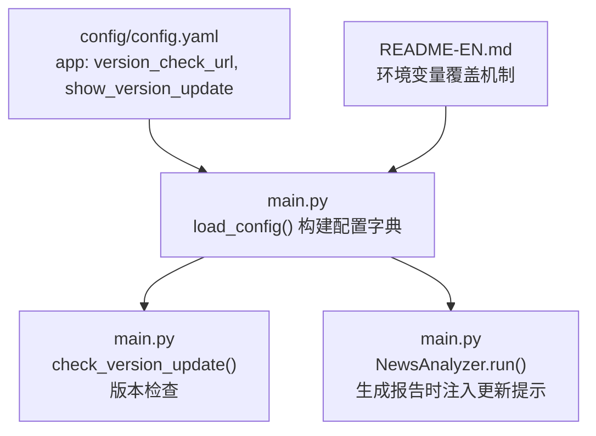
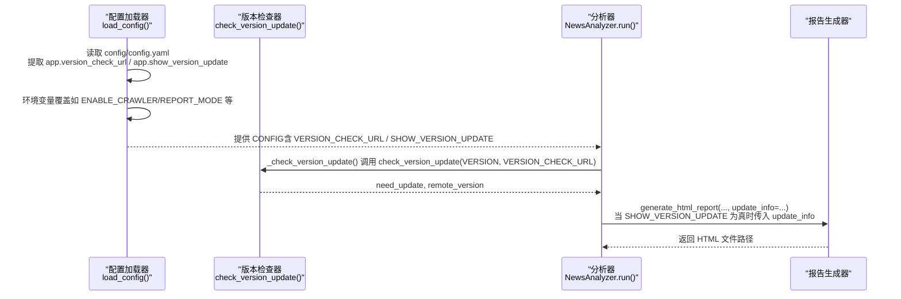
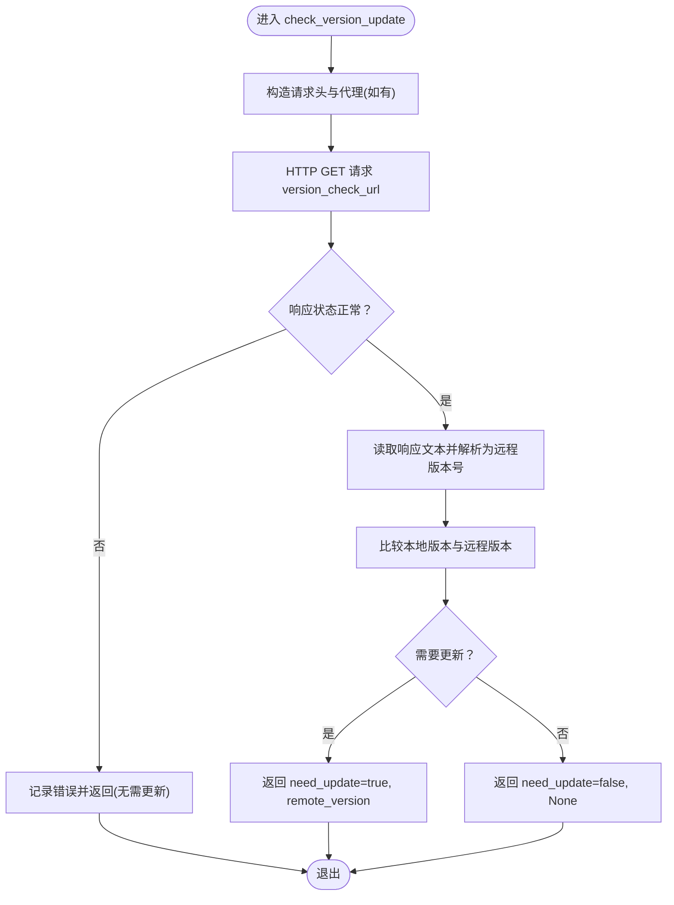
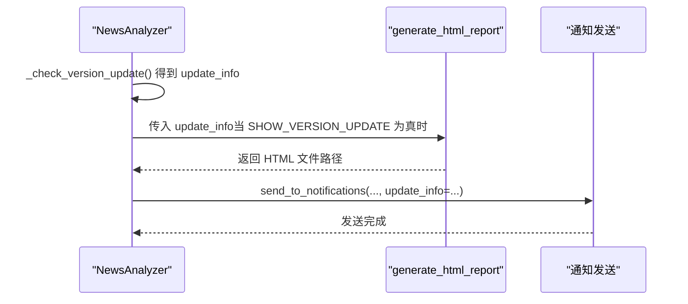
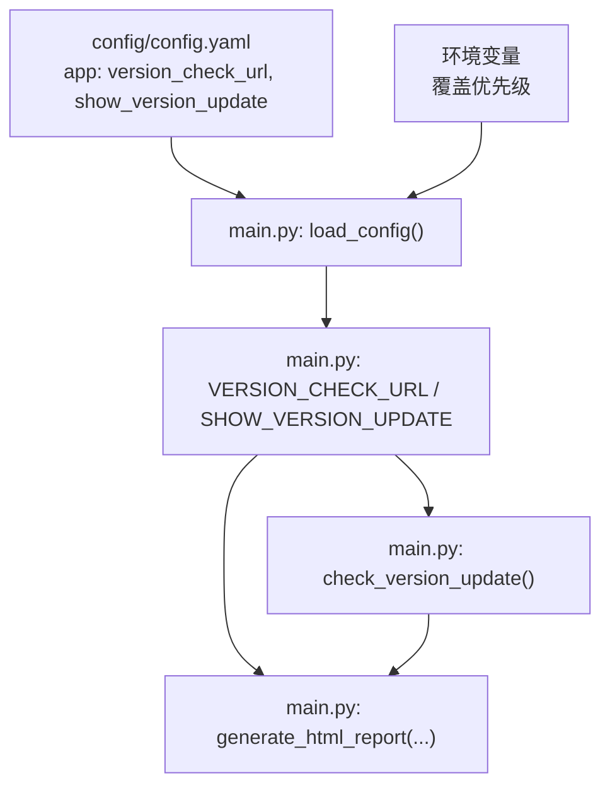

# 应用设置

<cite>
**本文引用的文件**
- [main.py](file://main.py)
- [config/config.yaml](file://config/config.yaml)
- [README-EN.md](file://README-EN.md)
</cite>

## 目录
1. [简介](#简介)
2. [项目结构](#项目结构)
3. [核心组件](#核心组件)
4. [架构总览](#架构总览)
5. [详细组件分析](#详细组件分析)
6. [依赖关系分析](#依赖关系分析)
7. [性能考量](#性能考量)
8. [故障排查指南](#故障排查指南)
9. [结论](#结论)
10. [附录](#附录)

## 简介
本章节聚焦于应用设置中的“版本检查地址”和“更新提示开关”，解释它们在系统中的作用、如何影响运行行为，以及与配置加载、环境变量覆盖机制的关系。文档还结合 main.py 中的 load_config() 实现，展示配置加载过程与环境变量优先级；并通过版本检查流程与提示控制逻辑，帮助读者正确配置与排障。

## 项目结构
- 应用配置主要位于 config/config.yaml 的 app 节点，包含 version_check_url 与 show_version_update 两个关键字段。
- 版本检查与提示控制由 main.py 中的 load_config() 与 check_version_update()/NewsAnalyzer 流水线共同实现。
- README-EN.md 提供了环境变量覆盖机制与优先级说明，便于在容器环境中动态调整配置。

图表来源
- [config/config.yaml](file://config/config.yaml#L1-L6)
- [main.py](file://main.py#L162-L200)
- [main.py](file://main.py#L443-L485)
- [main.py](file://main.py#L5095-L5108)
- [README-EN.md](file://README-EN.md#L2050-L2068)

章节来源
- [config/config.yaml](file://config/config.yaml#L1-L6)
- [main.py](file://main.py#L162-L200)
- [README-EN.md](file://README-EN.md#L2050-L2068)

## 核心组件
- 版本检查地址（version_check_url）
  - 作用：指向一个文本文件，返回远程版本号（形如 x.y.z）。系统通过 HTTP 请求获取该文本，解析后与本地版本比较，决定是否提示更新。
  - 默认值：来自 config/config.yaml 的 app.version_check_url。
  - 优先级：可通过环境变量覆盖（见下节）。
- 更新提示开关（show_version_update）
  - 作用：控制是否在生成的报告中显示“发现新版本”的提示信息。开启时，若检测到新版本，将在报告尾部添加版本信息；关闭时，即使检测到新版本，也不会在报告中显示提示。
  - 默认值：来自 config/config.yaml 的 app.show_version_update。
  - 优先级：可通过环境变量覆盖（见下节）。

章节来源
- [config/config.yaml](file://config/config.yaml#L1-L6)
- [main.py](file://main.py#L175-L178)
- [main.py](file://main.py#L5095-L5108)

## 架构总览
版本检查与提示控制贯穿配置加载、版本检查、报告生成三个阶段，且受环境变量覆盖机制影响。

图表来源
- [main.py](file://main.py#L162-L200)
- [main.py](file://main.py#L443-L485)
- [main.py](file://main.py#L4953-L4970)
- [main.py](file://main.py#L5095-L5108)

## 详细组件分析

### 配置加载与环境变量覆盖
- 配置来源与优先级
  - 默认配置：config/config.yaml。
  - 环境变量覆盖：README-EN.md 明确指出“环境变量优先于 config.yaml”。例如 REPORT_MODE、ENABLE_NOTIFICATION 等均可通过环境变量覆盖。
  - 版本检查相关键值同样遵循此规则：VERSION_CHECK_URL 与 SHOW_VERSION_UPDATE 可通过环境变量覆盖。
- 关键实现位置
  - 配置加载入口：load_config() 会读取 CONFIG_PATH（默认 config/config.yaml），解析 YAML 并构建配置字典。
  - 版本检查地址与提示开关：从 config_data["app"] 中读取 version_check_url 与 show_version_update，并写入 CONFIG 字典。
  - 环境变量覆盖：后续对其他配置项的覆盖逻辑展示了相同模式，因此 VERSION_CHECK_URL 与 SHOW_VERSION_UPDATE 亦遵循该模式。

章节来源
- [main.py](file://main.py#L162-L200)
- [README-EN.md](file://README-EN.md#L2050-L2068)

### 版本检查机制
- 触发时机
  - 在 NewsAnalyzer 的内部流程中，_check_version_update() 会在运行前调用 check_version_update()，传入本地版本 VERSION 与 CONFIG["VERSION_CHECK_URL"]。
- 检查流程
  - 使用 HTTP GET 访问 version_check_url，设置超时与常用请求头。
  - 读取响应文本并去除空白，作为远程版本号。
  - 将本地版本与远程版本均解析为三段式元组（x.y.z），比较大小，得出是否需要更新。
  - 异常时打印错误并返回“无需更新”。
- 结果存储
  - 若需要更新，将 remote_version 与当前版本封装为 update_info，供后续报告生成使用。

图表来源
- [main.py](file://main.py#L443-L485)

章节来源
- [main.py](file://main.py#L443-L485)
- [main.py](file://main.py#L4953-L4970)

### 报告中的提示控制逻辑
- 注入时机
  - 在 NewsAnalyzer.run() 的分析流水线中，generate_html_report(...) 会接收 update_info 参数。
- 开关控制
  - 仅当 CONFIG["SHOW_VERSION_UPDATE"] 为真时，才会将 update_info 传入报告生成函数；否则 update_info 为 None，报告不会显示版本提示。
- 展示细节
  - 报告生成函数内部会根据不同的通知格式（如飞书、钉钉、企业微信、Telegram、ntfy、Slack、邮件等）在尾部追加版本信息（若存在）。

图表来源
- [main.py](file://main.py#L5095-L5108)
- [main.py](file://main.py#L5110-L5152)

章节来源
- [main.py](file://main.py#L5095-L5108)
- [main.py](file://main.py#L5110-L5152)

### 配置加载过程与环境变量覆盖逻辑（结合 main.py）
- 关键步骤
  - 读取 CONFIG_PATH（默认 config/config.yaml），校验文件存在性。
  - 读取 YAML 并构建基础配置字典。
  - 从 app 节点读取 version_check_url 与 show_version_update。
  - 对其他配置项采用“环境变量优先”的策略：若环境变量存在则覆盖 YAML 值，否则回退到 YAML。
- 影响范围
  - 由于 VERSION_CHECK_URL 与 SHOW_VERSION_UPDATE 的读取与覆盖遵循同一模式，因此它们同样受环境变量影响。

章节来源
- [main.py](file://main.py#L162-L200)
- [README-EN.md](file://README-EN.md#L2050-L2068)

## 依赖关系分析
- 配置依赖
  - main.py 的 load_config() 依赖 config/config.yaml 的 app 节点。
  - 版本检查依赖 requests 库与网络可达性。
  - 报告生成依赖 update_info（由版本检查结果提供）。
- 环境变量依赖
  - README-EN.md 明确了环境变量覆盖优先级，适用于 VERSION_CHECK_URL 与 SHOW_VERSION_UPDATE。

图表来源
- [config/config.yaml](file://config/config.yaml#L1-L6)
- [main.py](file://main.py#L162-L200)
- [main.py](file://main.py#L443-L485)
- [main.py](file://main.py#L5095-L5108)
- [README-EN.md](file://README-EN.md#L2050-L2068)

章节来源
- [config/config.yaml](file://config/config.yaml#L1-L6)
- [main.py](file://main.py#L162-L200)
- [README-EN.md](file://README-EN.md#L2050-L2068)

## 性能考量
- 版本检查为轻量级 HTTP 请求，带超时与简单重试策略，对整体性能影响极小。
- 环境变量覆盖仅在启动时发生，不会引入额外运行时开销。
- 报告生成时仅在需要时注入版本提示，避免不必要的文本拼接。

## 故障排查指南
- 常见配置错误与排查
  - URL 格式错误
    - 现象：版本检查失败或返回“无需更新”。
    - 排查要点：
      - 确认 version_check_url 返回的是纯文本形式的版本号（形如 x.y.z），且每行仅一个版本号。
      - 确保网络可达，必要时配置代理（USE_PROXY 与 DEFAULT_PROXY）。
      - 如需在容器环境中生效，确认通过环境变量覆盖已正确设置 VERSION_CHECK_URL。
  - 版本号格式不合法
    - 现象：版本比较失败，始终返回“无需更新”。
    - 排查要点：
      - 远程版本号必须为三段式数字（x.y.z），否则解析失败，比较结果将被视为“无需更新”。
  - 环境变量未生效
    - 现象：修改 config/config.yaml 后，VERSION_CHECK_URL 或 SHOW_VERSION_UPDATE 未变化。
    - 排查要点：
      - 确认环境变量覆盖优先级（环境变量 > config.yaml）。
      - 在容器环境中，确保重启容器后生效（docker-compose up -d）。
  - 代理导致访问失败
    - 现象：版本检查超时或失败。
    - 排查要点：
      - 检查 USE_PROXY 与 DEFAULT_PROXY 设置。
      - 在本地与容器环境分别测试代理配置。
- 相关实现参考
  - 版本检查与异常处理：参见 [main.py](file://main.py#L443-L485)。
  - 配置加载与环境变量覆盖：参见 [main.py](file://main.py#L162-L200)。
  - 环境变量覆盖机制说明：参见 [README-EN.md](file://README-EN.md#L2050-L2068)。

章节来源
- [main.py](file://main.py#L443-L485)
- [main.py](file://main.py#L162-L200)
- [README-EN.md](file://README-EN.md#L2050-L2068)

## 结论
- version_check_url 与 show_version_update 是应用设置中的两个关键开关：前者决定远程版本号来源，后者决定是否在报告中显示版本提示。
- 配置加载遵循“环境变量优先”的原则，二者均可通过环境变量覆盖。
- 版本检查流程简单可靠，异常时会记录错误并返回“无需更新”，不会阻断主流程。
- 正确配置与合理排查可确保版本提示功能稳定可用。

## 附录
- 配置示例（说明性，非代码片段）
  - 在 config/config.yaml 的 app 节点中设置：
    - version_check_url：指向一个返回纯文本版本号的 URL。
    - show_version_update：true/false，控制是否在报告中显示版本提示。
  - 在容器环境中通过环境变量覆盖：
    - 设置 VERSION_CHECK_URL 指向自定义版本号源。
    - 设置 SHOW_VERSION_UPDATE 控制是否显示提示。
  - 参考路径：
    - [config/config.yaml](file://config/config.yaml#L1-L6)
    - [README-EN.md](file://README-EN.md#L2050-L2068)