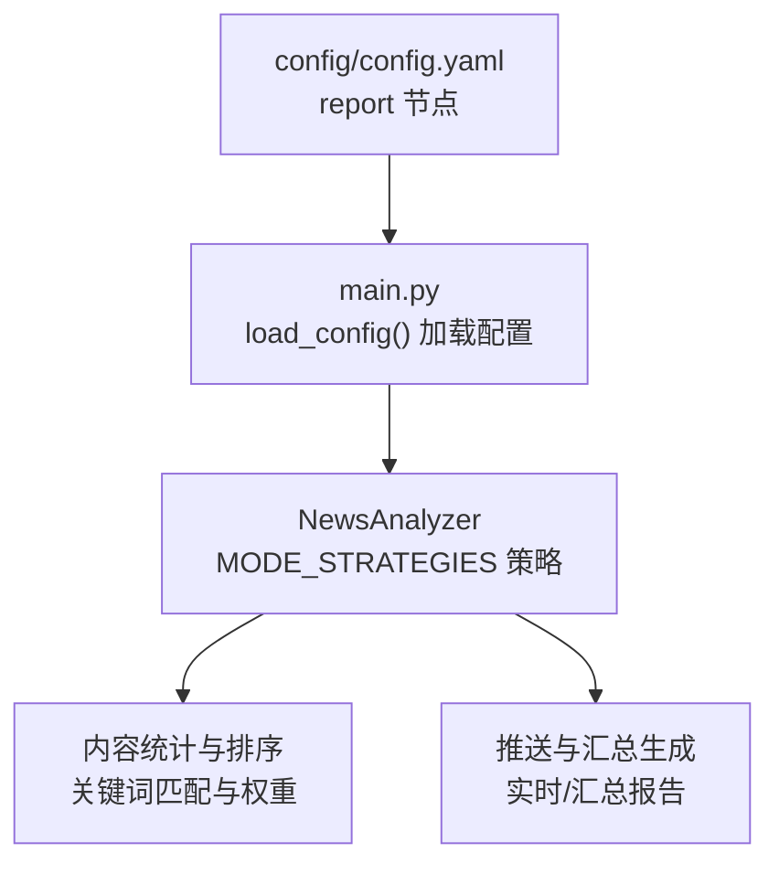
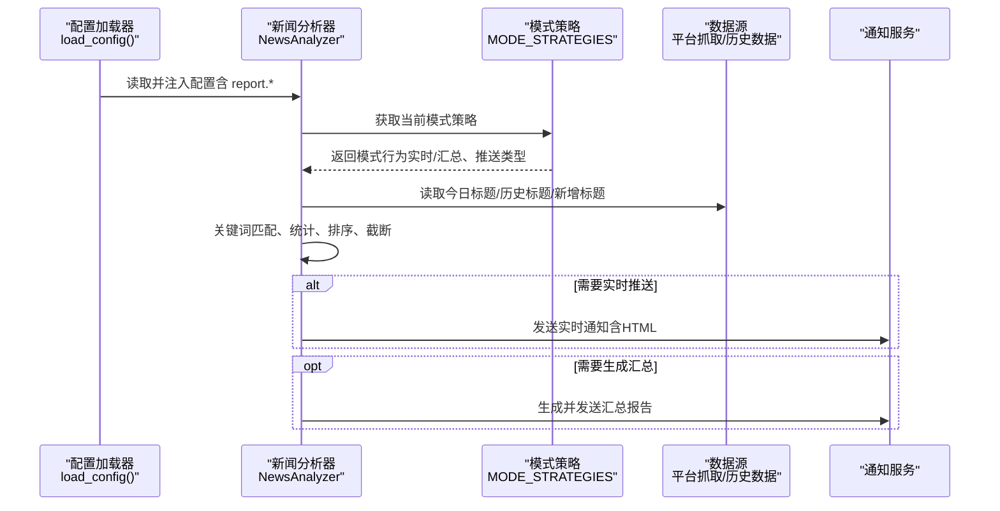
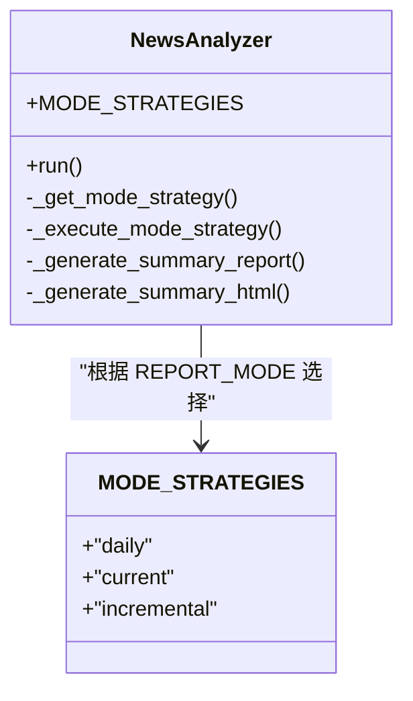
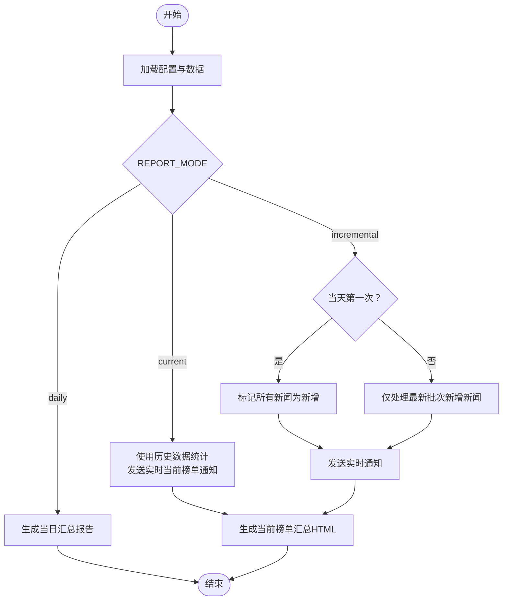
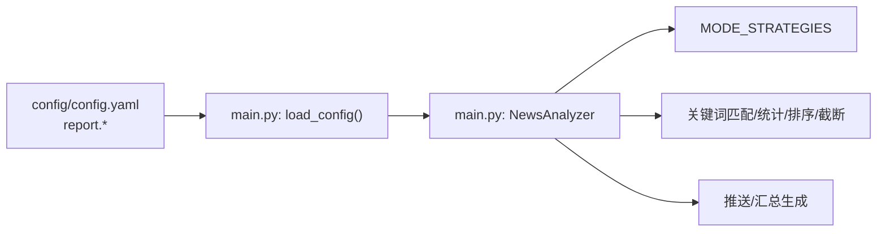

# 报告推送设置

<cite>
**本文引用的文件**
- [config/config.yaml](file://config/config.yaml)
- [main.py](file://main.py)
- [README.md](file://README.md)
- [README-EN.md](file://README-EN.md)
</cite>

## 目录
1. [简介](#简介)
2. [项目结构](#项目结构)
3. [核心组件](#核心组件)
4. [架构总览](#架构总览)
5. [详细组件分析](#详细组件分析)
6. [依赖关系分析](#依赖关系分析)
7. [性能考量](#性能考量)
8. [故障排查指南](#故障排查指南)
9. [结论](#结论)
10. [附录](#附录)

## 简介
本章节聚焦“报告推送设置”中的 report 配置节，系统性说明三种推送模式（daily、incremental、current）的含义、适用场景与行为差异；解释关键参数（rank_threshold、sort_by_position_first、max_news_per_keyword、reverse_content_order）的作用与影响；结合 main.py 中的 MODE_STRATEGIES 策略模式实现，阐明不同模式下的内容生成与推送逻辑；并提供完整配置示例与常见配置错误排查方法。

## 项目结构
- 报告推送设置位于配置文件 config/config.yaml 的 report 节点，同时 main.py 负责加载配置、解析关键词、执行模式策略与生成报告。
- README 文档提供了模式对比、参数说明与使用建议，便于快速理解与配置。

图表来源
- [config/config.yaml](file://config/config.yaml#L26-L33)
- [main.py](file://main.py#L162-L258)
- [main.py](file://main.py#L4882-L4910)

章节来源
- [config/config.yaml](file://config/config.yaml#L26-L33)
- [main.py](file://main.py#L162-L258)
- [main.py](file://main.py#L4882-L4910)

## 核心组件
- 报告模式（report.mode）
  - daily：当日汇总模式，按时推送（默认每小时），显示当日所有匹配新闻 + 新增新闻区域，适用于日报总结、全面了解当日热点趋势。
  - current：当前榜单模式，按时推送（默认每小时），显示当前榜单匹配新闻 + 新增新闻区域，适用于实时热点追踪、了解当前最火内容。
  - incremental：增量监控模式，有新增才推送，显示新出现的匹配频率词新闻，适用于高频监控、避免重复信息干扰。
- 关键参数
  - rank_threshold：排名高亮阈值，用于热点权重计算中“高排名次数”的统计，影响新闻权重排序。
  - sort_by_position_first：排序优先级开关，true 时优先按配置位置排序，false 时优先按热点条数排序。
  - max_news_per_keyword：每关键词最大新闻数，0 表示不限制；支持在关键词分组中使用 @N 覆盖全局配置。
  - reverse_content_order：内容顺序反转开关，false 时“趋势关键词统计在前”，true 时“新增热点新闻在前”。

章节来源
- [config/config.yaml](file://config/config.yaml#L11-L33)
- [README.md](file://README.md#L1846-L1906)
- [README-EN.md](file://README-EN.md#L1814-L1880)
- [README-EN.md](file://README-EN.md#L2391-L2424)

## 架构总览
下图展示了从配置加载到模式策略执行、内容统计与推送的整体流程。

图表来源
- [main.py](file://main.py#L162-L258)
- [main.py](file://main.py#L4882-L4910)
- [main.py](file://main.py#L5280-L5397)

## 详细组件分析

### 模式策略与行为（MODE_STRATEGIES）
- 策略定义
  - incremental：实时增量推送 + 当日汇总；汇总模式为 daily。
  - current：实时当前榜单推送 + 当前榜单汇总；汇总模式为 current。
  - daily：仅生成当日汇总（不发送实时通知）。
- 策略选择
  - 由 CONFIG["REPORT_MODE"] 决定；若未设置，回退到 config/config.yaml 的 report.mode。
- 行为差异
  - daily：按配置生成当日汇总，包含新增区域。
  - current：使用完整历史数据进行统计，确保榜单统计完整性，同时发送实时当前榜单通知。
  - incremental：仅在有新增时推送，且当天第一次执行时将所有新闻标记为新增。

图表来源
- [main.py](file://main.py#L4882-L4910)
- [main.py](file://main.py#L5280-L5397)

章节来源
- [main.py](file://main.py#L4882-L4910)
- [main.py](file://main.py#L5280-L5397)

### 内容生成逻辑（按模式）
- daily 模式
  - 生成当日汇总报告，包含新增区域；不发送实时通知。
- current 模式
  - 使用完整历史数据进行统计，确保榜单统计完整；发送实时当前榜单通知；随后可生成当前榜单汇总 HTML。
- incremental 模式
  - 若当天第一次执行：将所有新闻标记为新增；否则仅处理最新批次中新增的新闻；仅在有新增时发送通知。

图表来源
- [main.py](file://main.py#L1296-L1333)
- [main.py](file://main.py#L5280-L5397)

章节来源
- [main.py](file://main.py#L1296-L1333)
- [main.py](file://main.py#L5280-L5397)

### 关键参数详解与影响
- rank_threshold（排名高亮阈值）
  - 用于热点权重计算中“高排名次数”的统计，影响新闻权重排序；数值越小，越容易被判定为“高排名”。
  - 影响范围：统计阶段对标题进行权重计算，参与排序。
- sort_by_position_first（排序优先级）
  - true：优先按配置位置排序，再考虑热点条数。
  - false：优先按热点条数排序，再考虑配置位置。
- max_news_per_keyword（每关键词最大新闻数）
  - 全局默认值来自 report.max_news_per_keyword；可在关键词分组中使用 @N 覆盖。
  - 截断发生在统计完成后，按权重排序后进行。
- reverse_content_order（内容顺序反转）
  - false：趋势关键词统计在前，新增热点新闻在后。
  - true：新增热点新闻在前，趋势关键词统计在后。

章节来源
- [config/config.yaml](file://config/config.yaml#L26-L33)
- [main.py](file://main.py#L1137-L1171)
- [main.py](file://main.py#L1555-L1586)
- [README-EN.md](file://README-EN.md#L2391-L2424)
- [README.md](file://README.md#L1783-L1821)

### 配置示例
- 基础模式配置
  - 在 config/config.yaml 的 report 节点设置 mode、rank_threshold、sort_by_position_first、max_news_per_keyword、reverse_content_order。
- 环境变量覆盖
  - 可通过环境变量覆盖部分 report 配置（如 REPORT_MODE、SORT_BY_POSITION_FIRST、MAX_NEWS_PER_KEYWORD、REVERSE_CONTENT_ORDER），实现动态切换。
- 关键词分组覆盖
  - 在 frequency_words.txt 中使用 @N 为特定关键词分组设置最大显示数量，覆盖全局配置。

章节来源
- [config/config.yaml](file://config/config.yaml#L26-L33)
- [main.py](file://main.py#L162-L258)
- [README-EN.md](file://README-EN.md#L1756-L1817)

## 依赖关系分析
- 配置依赖
  - main.py 的 load_config() 从 config/config.yaml 读取 report.* 配置，并支持环境变量覆盖。
- 模式策略依赖
  - NewsAnalyzer 的 MODE_STRATEGIES 决定推送与汇总行为；其执行依赖于数据加载、关键词匹配、统计与排序。
- 参数依赖
  - 排序与截断依赖于 rank_threshold、sort_by_position_first、max_news_per_keyword；内容顺序依赖 reverse_content_order。

图表来源
- [main.py](file://main.py#L162-L258)
- [main.py](file://main.py#L4882-L4910)
- [main.py](file://main.py#L1137-L1171)
- [main.py](file://main.py#L1555-L1586)

章节来源
- [main.py](file://main.py#L162-L258)
- [main.py](file://main.py#L4882-L4910)
- [main.py](file://main.py#L1137-L1171)
- [main.py](file://main.py#L1555-L1586)

## 性能考量
- 排序与截断
  - 统计完成后对标题进行排序与截断，max_news_per_keyword 为 0 时不截断，可能增加报告体积与推送负载。
- 增量模式
  - incremental 模式仅在有新增时推送，可显著减少推送频率与消息体量。
- 排序优先级
  - sort_by_position_first 为 true 时，排序逻辑偏向配置顺序，可能影响热点曝光分布。

[本节为通用建议，无需列出具体文件来源]

## 故障排查指南
- 常见配置错误
  - 模式值拼写错误：report.mode 的值必须为 "daily"、"incremental" 或 "current"，大小写敏感，且需与策略键一致。
  - 关键词分组覆盖无效：@N 仅在 frequency_words.txt 中生效，且需为正整数；非法格式将被忽略。
  - 环境变量覆盖冲突：若同时设置了环境变量与配置文件，以环境变量为准；请确认变量名与值格式正确。
- 排查步骤
  - 确认 CONFIG["REPORT_MODE"] 来源（环境变量优先于配置文件）。
  - 检查 MODE_STRATEGIES 是否包含对应模式键。
  - 确认关键词分组与全局限制是否合理，避免 max_news_per_keyword 设置过低导致内容缺失。
  - 对于 current/incremental 模式无推送的问题，确认当天是否存在新增新闻；若无新增，incremental 不会推送。
  - 检查通知渠道配置是否齐全（至少配置一个渠道），否则会跳过通知发送。

章节来源
- [main.py](file://main.py#L162-L258)
- [main.py](file://main.py#L4882-L4910)
- [main.py](file://main.py#L1555-L1586)
- [README-EN.md](file://README-EN.md#L1814-L1880)
- [README.md](file://README.md#L1884-L1906)

## 结论
- report 配置节提供了灵活的推送模式与参数控制，能够满足从“当日汇总”到“增量监控”的多种使用场景。
- MODE_STRATEGIES 将模式行为抽象为策略，配合数据加载与统计逻辑，实现了清晰的推送与汇总流程。
- 合理设置 rank_threshold、sort_by_position_first、max_news_per_keyword、reverse_content_order，可显著提升报告的可读性与推送效率。

[本节为总结性内容，无需列出具体文件来源]

## 附录
- 模式对比与使用建议详见 README 中的“推送模式详解”与“高级配置教程”。
- 关键词分组与覆盖详见 README 中的“关键词高级配置”。

章节来源
- [README.md](file://README.md#L1846-L1906)
- [README-EN.md](file://README-EN.md#L1756-L1817)
- [README-EN.md](file://README-EN.md#L1814-L1880)
- [README-EN.md](file://README-EN.md#L2391-L2424)