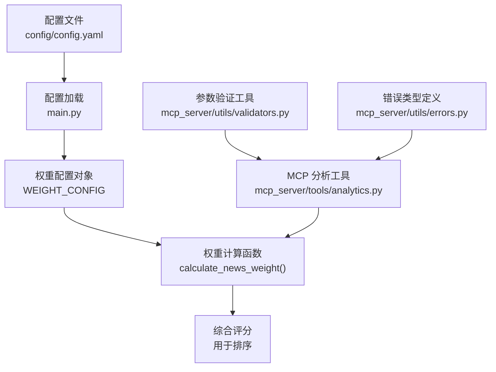
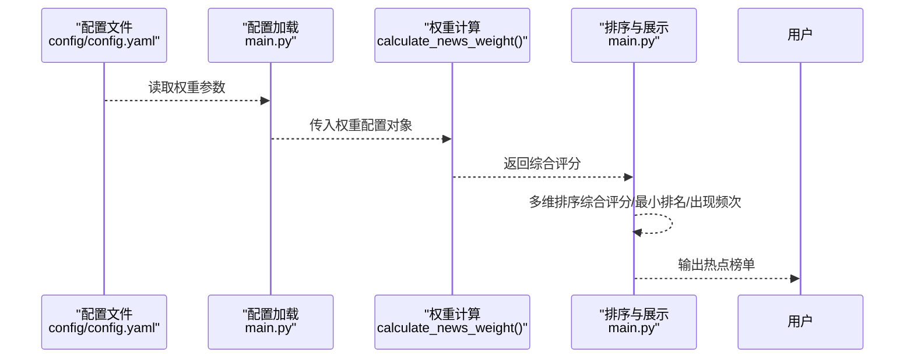
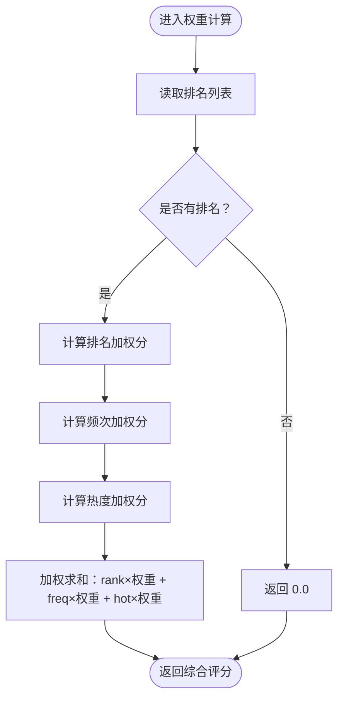
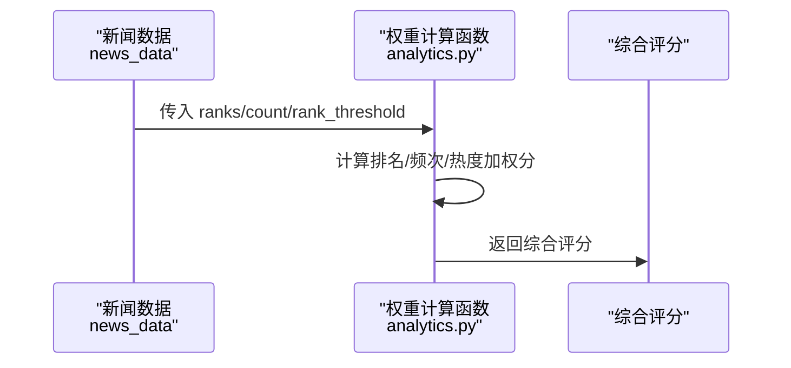
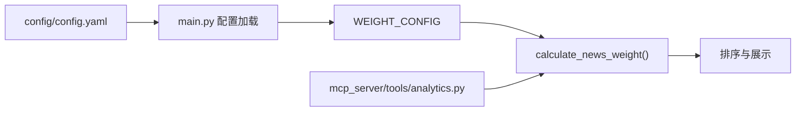

# 权重算法设置

<cite>
**本文引用的文件**
- [main.py](file://main.py)
- [config.yaml](file://config/config.yaml)
- [analytics.py](file://mcp_server/tools/analytics.py)
- [README.md](file://README.md)
- [README-EN.md](file://README-EN.md)
- [errors.py](file://mcp_server/utils/errors.py)
- [validators.py](file://mcp_server/utils/validators.py)
</cite>

## 目录
1. [简介](#简介)
2. [项目结构](#项目结构)
3. [核心组件](#核心组件)
4. [架构总览](#架构总览)
5. [详细组件分析](#详细组件分析)
6. [依赖关系分析](#依赖关系分析)
7. [性能考量](#性能考量)
8. [故障排查指南](#故障排查指南)
9. [结论](#结论)
10. [附录](#附录)

## 简介
本节围绕“热点排序算法”的权重配置进行深入说明，重点解释以下三个参数的含义与作用：
- rank_weight：排名权重
- frequency_weight：频次权重
- hotness_weight：热度权重

并阐述三者之和应为1的约束条件，以及不同权重分配对最终热点榜单的影响策略。结合 main.py 中的新闻数据处理逻辑，说明权重参数如何参与综合评分计算；提供不同场景下的权重配置示例，并说明配置验证与错误处理机制。

## 项目结构
与权重算法相关的核心文件与职责如下：
- config/config.yaml：定义权重配置项与默认值，提供权重节（weight）及各权重参数的默认值。
- main.py：负责加载配置、构建权重配置对象，并在新闻数据处理流程中调用权重计算函数进行综合评分。
- mcp_server/tools/analytics.py：提供独立的权重计算函数，用于 MCP 服务侧的分析与排序，其权重参数与配置保持一致。
- README.md / README-EN.md：提供权重调整的使用说明、典型场景与配置示例。
- mcp_server/utils/validators.py：提供参数验证工具，包括配置节校验等。
- mcp_server/utils/errors.py：提供统一的错误类型，便于在配置或参数异常时抛出标准错误。

图表来源
- [config.yaml](file://config/config.yaml#L110-L116)
- [main.py](file://main.py#L252-L256)
- [main.py](file://main.py#L1137-L1171)
- [analytics.py](file://mcp_server/tools/analytics.py#L24-L75)

章节来源
- [config.yaml](file://config/config.yaml#L110-L116)
- [main.py](file://main.py#L252-L256)
- [analytics.py](file://mcp_server/tools/analytics.py#L24-L75)

## 核心组件
- 权重配置加载与传递
  - 在配置加载阶段，权重参数被读取并封装为权重配置对象，供后续排序逻辑使用。
  - 该对象包含 rank_weight、frequency_weight、hotness_weight 三项权重系数。
- 权重计算函数
  - 在 main.py 中，权重计算函数基于新闻的排名、出现频次与高排名比例，分别计算三类权重分量，并乘以对应权重系数求和得到综合评分。
  - 在 MCP 分析工具中，同样提供独立的权重计算函数，用于服务侧分析与排序，参数与配置保持一致。
- 排序与展示
  - 在新闻统计与排序阶段，综合评分作为主要排序依据之一，配合最小排名、出现频次等维度进行稳定排序。
- 场景化配置示例
  - README 提供了“实时热点型”和“深度话题型”的典型权重配置示例，体现“速度/时效性”与“深度/稳定性”的权衡。

章节来源
- [main.py](file://main.py#L252-L256)
- [main.py](file://main.py#L1137-L1171)
- [analytics.py](file://mcp_server/tools/analytics.py#L24-L75)
- [README.md](file://README.md#L1910-L1970)
- [README-EN.md](file://README-EN.md#L1881-L1924)

## 架构总览
权重算法在系统中的位置与交互如下：
- 配置层：从配置文件读取权重参数，构建权重配置对象。
- 数据层：抓取平台热搜数据，聚合标题、排名、出现频次等信息。
- 算法层：根据权重参数计算综合评分，用于排序。
- 展示层：按综合评分与其它维度排序，输出热点榜单。

图表来源
- [config.yaml](file://config/config.yaml#L110-L116)
- [main.py](file://main.py#L252-L256)
- [main.py](file://main.py#L1137-L1171)
- [main.py](file://main.py#L1555-L1586)

## 详细组件分析

### 权重参数定义与约束
- 参数来源与默认值
  - 权重参数位于配置文件的 weight 节，包含 rank_weight、frequency_weight、hotness_weight 三项。
  - 默认值分别为 0.6、0.3、0.1，合计为 1.0。
- 约束条件
  - 三者之和应为 1.0，这是权重归一化的基础，确保综合评分的尺度一致。
  - README 明确指出“三个数字加起来必须等于 1.0”，并在示例中给出实时热点型与深度话题型的配置。

章节来源
- [config.yaml](file://config/config.yaml#L110-L116)
- [README.md](file://README.md#L1910-L1970)
- [README-EN.md](file://README-EN.md#L1881-L1924)

### 综合评分计算逻辑（main.py）
权重计算函数在 main.py 中实现，其核心步骤如下：
- 输入
  - 新闻数据包含 ranks（排名列表）、count（出现次数）。
  - 权重配置对象包含 rank_weight、frequency_weight、hotness_weight。
- 步骤
  1) 排名权重（rank_weight）
     - 对每个排名计算 11 - min(rank, 10)，并对所有排名求平均，得到排名加权分。
  2) 频次权重（frequency_weight）
     - 对出现次数进行上限截断（如不超过 10），然后乘以 10 得到频次加权分。
  3) 热度权重（hotness_weight）
     - 计算高排名次数（<= rank_threshold）占总出现次数的比例，乘以 100 得到热度加权分。
  4) 综合评分
     - total_weight = rank_weight × 排名加权分 + frequency_weight × 频次加权分 + hotness_weight × 热度加权分。
- 排序策略
  - 在排序时，除综合评分外，还结合最小排名与出现频次等维度，保证榜单稳定且可解释。

图表来源
- [main.py](file://main.py#L1137-L1171)

章节来源
- [main.py](file://main.py#L1137-L1171)
- [main.py](file://main.py#L1555-L1586)

### 综合评分计算逻辑（MCP 分析工具）
MCP 分析工具提供了独立的权重计算函数，其参数与配置保持一致：
- 参数
  - news_data：包含 ranks 与 count 的字典。
  - rank_threshold：高排名阈值（默认 5）。
- 步骤
  - 与 main.py 类似，分别计算排名、频次、热度三类加权分，再乘以固定权重系数求和。
- 使用场景
  - 适用于 MCP 服务侧的分析与排序，便于在统一接口中复用权重算法。

图表来源
- [analytics.py](file://mcp_server/tools/analytics.py#L24-L75)

章节来源
- [analytics.py](file://mcp_server/tools/analytics.py#L24-L75)

### 不同场景下的权重配置示例
- 实时热点型（侧重即时性）
  - 提高 rank_weight，降低 frequency_weight，保持 hotness_weight 稳定。
  - 适合内容创作者、营销人员等希望快速把握当前最热话题的用户。
- 深度话题型（侧重持续热度）
  - 适度提高 frequency_weight，保持 rank_weight 适中，保持 hotness_weight 稳定。
  - 适合投资者、研究人员、新闻工作者等需要深度分析趋势的用户。
- 调整建议
  - 三者之和必须为 1.0。
  - 建议每次调整 0.1~0.2，观察榜单变化后再微调。

章节来源
- [README.md](file://README.md#L1910-L1970)
- [README-EN.md](file://README-EN.md#L1881-L1924)

### 配置验证与错误处理机制
- 配置加载
  - main.py 在加载配置时，将权重参数读入 WEIGHT_CONFIG 对象，供权重计算函数使用。
- 参数验证
  - MCP 工具链提供参数验证工具，包括配置节校验等，确保传入参数符合预期。
- 错误类型
  - 统一使用自定义错误类型，便于在配置或参数异常时返回标准错误信息。
- 与权重相关的潜在问题
  - 若权重之和不为 1.0，综合评分的尺度会失衡，导致排序不可比。
  - 若 rank_threshold 设置不当，会影响热度加成的计算结果。

章节来源
- [main.py](file://main.py#L252-L256)
- [validators.py](file://mcp_server/utils/validators.py#L292-L307)
- [errors.py](file://mcp_server/utils/errors.py#L1-L94)

## 依赖关系分析
- 权重配置依赖关系
  - 配置文件提供权重参数，main.py 加载并封装为权重配置对象。
  - 权重配置对象被权重计算函数使用，用于综合评分。
  - MCP 分析工具提供独立的权重计算函数，参数与配置保持一致。
- 排序依赖关系
  - 综合评分作为排序主键之一，配合最小排名与出现频次等维度进行稳定排序。

图表来源
- [config.yaml](file://config/config.yaml#L110-L116)
- [main.py](file://main.py#L252-L256)
- [main.py](file://main.py#L1137-L1171)
- [analytics.py](file://mcp_server/tools/analytics.py#L24-L75)

章节来源
- [config.yaml](file://config/config.yaml#L110-L116)
- [main.py](file://main.py#L252-L256)
- [main.py](file://main.py#L1137-L1171)
- [analytics.py](file://mcp_server/tools/analytics.py#L24-L75)

## 性能考量
- 权重计算复杂度
  - 对于每条新闻，权重计算涉及遍历排名列表、统计高排名次数与计算平均值，整体为 O(n)（n 为排名数量）。
- 排序复杂度
  - 排序阶段对所有新闻进行综合评分计算与多维排序，整体复杂度约为 O(m·n + m log m)，其中 m 为新闻总数，n 为平均排名数量。
- 优化建议
  - 在大规模数据场景下，可考虑缓存综合评分结果，减少重复计算。
  - 合理设置 rank_threshold，避免过高或过低导致热度加成波动过大。

[本节为一般性指导，无需具体文件分析]

## 故障排查指南
- 权重之和不为 1.0
  - 现象：综合评分尺度异常，排序结果不可比。
  - 处理：检查配置文件中三者之和是否为 1.0，必要时按建议调整。
- 排名阈值设置不当
  - 现象：热度加成比例异常波动。
  - 处理：根据业务目标调整 rank_threshold，使其与榜单分布相匹配。
- 参数异常
  - 现象：工具链报错或返回异常。
  - 处理：使用参数验证工具与错误类型，定位参数类型、范围或配置节问题。

章节来源
- [README.md](file://README.md#L1910-L1970)
- [README-EN.md](file://README-EN.md#L1881-L1924)
- [validators.py](file://mcp_server/utils/validators.py#L292-L307)
- [errors.py](file://mcp_server/utils/errors.py#L1-L94)

## 结论
- rank_weight、frequency_weight、hotness_weight 三者共同决定热点榜单的排序偏好：前者强调即时性，后者强调持续热度，中间值用于平衡。
- 三者之和为 1.0 是权重归一化的前提，确保综合评分具备可比性。
- 不同业务场景应采用不同的权重分配策略：实时热点型侧重排名，深度话题型侧重频次。
- 在实际使用中，应结合参数验证与错误处理机制，确保配置正确、排序稳定。

[本节为总结性内容，无需具体文件分析]

## 附录
- 权重参数与默认值
  - rank_weight：默认 0.6
  - frequency_weight：默认 0.3
  - hotness_weight：默认 0.1
- 典型场景配置示例
  - 实时热点型：提高 rank_weight，降低 frequency_weight。
  - 深度话题型：适度提高 frequency_weight，保持 rank_weight 适中。
- 相关实现路径
  - 权重配置加载：[main.py](file://main.py#L252-L256)
  - 权重计算函数（main.py）：[main.py](file://main.py#L1137-L1171)
  - 权重计算函数（MCP 分析工具）：[analytics.py](file://mcp_server/tools/analytics.py#L24-L75)
  - README 示例与约束说明：[README.md](file://README.md#L1910-L1970)、[README-EN.md](file://README-EN.md#L1881-L1924)