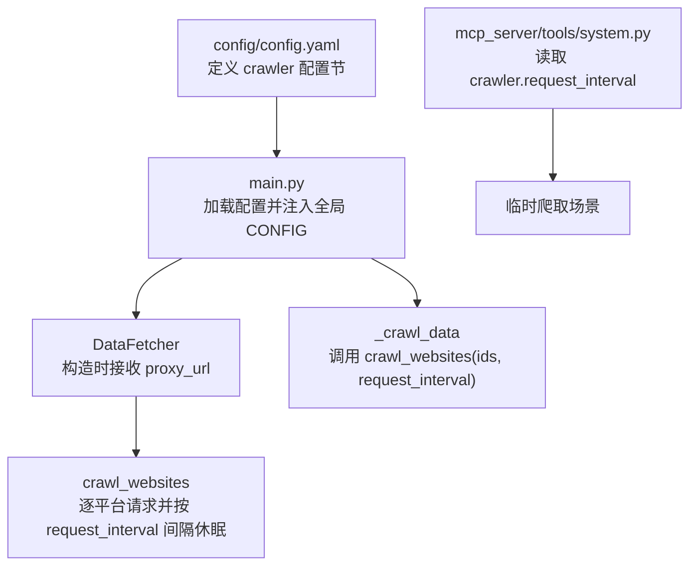
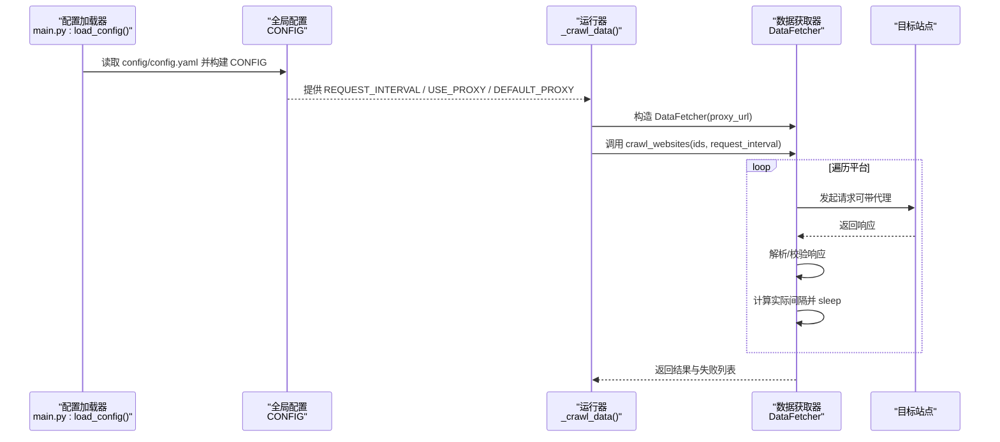
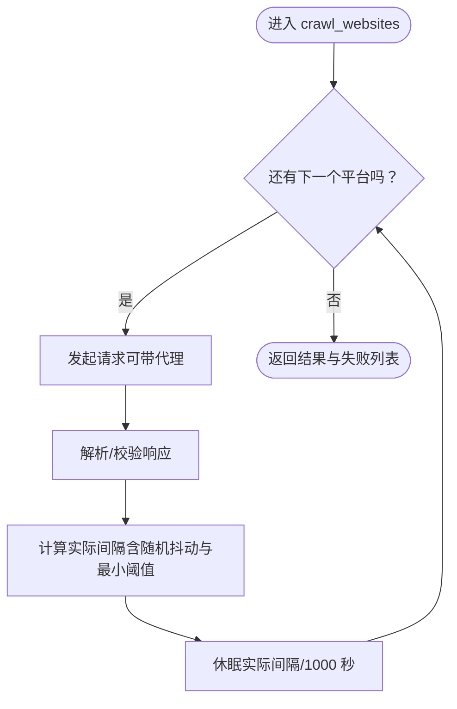
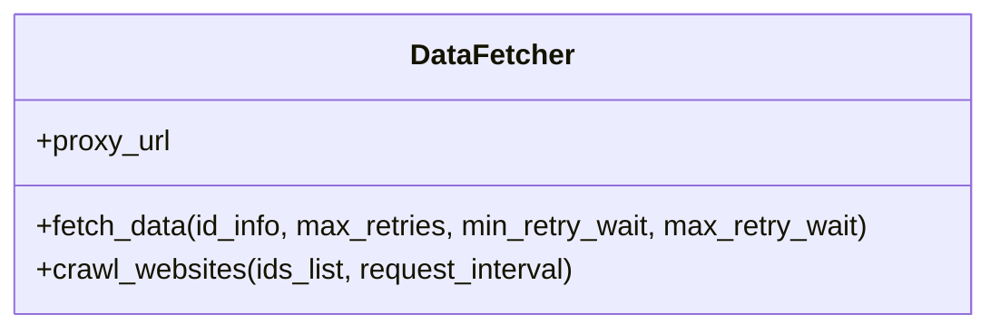
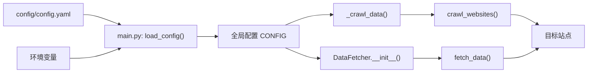

# 爬虫设置

<cite>
**本文引用的文件**
- [config/config.yaml](file://config/config.yaml)
- [main.py](file://main.py)
- [README.md](file://README.md)
- [README-EN.md](file://README-EN.md)
- [mcp_server/tools/system.py](file://mcp_server/tools/system.py)
</cite>

## 目录
1. [简介](#简介)
2. [项目结构](#项目结构)
3. [核心组件](#核心组件)
4. [架构总览](#架构总览)
5. [详细组件分析](#详细组件分析)
6. [依赖关系分析](#依赖关系分析)
7. [性能考量](#性能考量)
8. [故障排查指南](#故障排查指南)
9. [结论](#结论)
10. [附录](#附录)

## 简介
本章节聚焦于“爬虫配置节”的使用与影响，重点解释以下配置项：
- request_interval 请求间隔（毫秒）：如何影响爬取频率与并发节奏
- enable_crawler 爬虫启用开关：控制是否执行数据采集流程
- use_proxy 代理使用开关与 default_proxy 默认代理地址：如何决定网络请求是否走代理及代理地址

同时结合 main.py 中 DataFetcher 类的实现，说明这些配置如何影响数据采集行为，并提供配置示例与常见问题（如请求间隔设置过短导致被限流）的解决方案。

## 项目结构
与“爬虫配置节”直接相关的核心文件与职责如下：
- config/config.yaml：定义 crawler 配置节，包含请求间隔、启用开关、代理开关与默认代理地址
- main.py：负责加载配置、初始化 DataFetcher、执行爬取流程，并在各处使用配置项
- README.md / README-EN.md：说明环境变量覆盖机制，便于在容器环境中动态调整配置
- mcp_server/tools/system.py：在 MCP 服务中读取 crawler.request_interval 用于临时爬取场景

图表来源
- [config/config.yaml](file://config/config.yaml#L5-L10)
- [main.py](file://main.py#L162-L210)
- [main.py](file://main.py#L4912-L4970)
- [main.py](file://main.py#L5256-L5278)
- [main.py](file://main.py#L683-L739)
- [mcp_server/tools/system.py](file://mcp_server/tools/system.py#L109-L143)

章节来源
- [config/config.yaml](file://config/config.yaml#L5-L10)
- [main.py](file://main.py#L162-L210)
- [main.py](file://main.py#L4912-L4970)
- [main.py](file://main.py#L5256-L5278)
- [main.py](file://main.py#L683-L739)
- [mcp_server/tools/system.py](file://mcp_server/tools/system.py#L109-L143)

## 核心组件
- crawler 配置节（来自 config/config.yaml）
  - request_interval：请求间隔（毫秒）
  - enable_crawler：是否启用爬虫
  - use_proxy：是否启用代理
  - default_proxy：默认代理地址（HTTP/HTTPS）

- DataFetcher 类（来自 main.py）
  - 构造时接收 proxy_url，用于后续请求携带代理
  - 提供 fetch_data 与 crawl_websites 方法，前者负责单平台请求与重试，后者负责遍历平台并按 request_interval 间隔发起请求

- 主流程（来自 main.py）
  - 初始化阶段：根据 CONFIG["USE_PROXY"] 与 CONFIG["DEFAULT_PROXY"] 设置代理；构造 DataFetcher
  - 爬取阶段：_crawl_data 中调用 data_fetcher.crawl_websites(ids, request_interval)，其中 request_interval 来自 CONFIG["REQUEST_INTERVAL"]

章节来源
- [config/config.yaml](file://config/config.yaml#L5-L10)
- [main.py](file://main.py#L4912-L4970)
- [main.py](file://main.py#L5256-L5278)
- [main.py](file://main.py#L683-L739)

## 架构总览
下图展示从配置到数据采集的关键交互路径，包括代理设置、请求间隔与爬取流程。

图表来源
- [config/config.yaml](file://config/config.yaml#L5-L10)
- [main.py](file://main.py#L162-L210)
- [main.py](file://main.py#L4912-L4970)
- [main.py](file://main.py#L5256-L5278)
- [main.py](file://main.py#L683-L739)

## 详细组件分析

### request_interval 请求间隔（毫秒）
- 配置含义
  - 该值决定在逐平台请求之间插入的休眠时间（毫秒）。系统会在每个请求后按该间隔进行短暂休眠，从而控制整体爬取节奏。
- 实现细节
  - 在 DataFetcher.crawl_websites 中，当处理到非最后一个平台时，会计算一个“实际间隔”，并在休眠后继续下一个请求。
  - 实际间隔会加入轻微随机抖动，并且保证最小阈值，避免过于频繁的请求。
- 对爬取频率的影响
  - request_interval 越大，整体爬取周期越长，单位时间内请求次数越少，降低被限流风险但可能增加延迟。
  - request_interval 越小，整体爬取越快，单位时间内请求次数越多，提高时效性但更容易触发目标站点的限流策略。
- 与重试的关系
  - 单个平台请求失败时，fetch_data 会进行指数退避重试，与 request_interval 的“平台间间隔”是两个维度的控制策略。

图表来源
- [main.py](file://main.py#L683-L739)

章节来源
- [main.py](file://main.py#L683-L739)

### enable_crawler 爬虫启用开关
- 功能说明
  - 当 ENABLE_CRAWLER=false 时，程序在初始化阶段直接退出，不再执行数据采集流程。
- 生效位置
  - 在 main.py 的初始化检查中，若 CONFIG["ENABLE_CRAWLER"] 为假，将打印提示并终止。
- 使用建议
  - 在维护期间或不需要采集时，可通过环境变量或配置文件将其关闭，避免资源占用与误触发。

章节来源
- [main.py](file://main.py#L5235-L5251)

### use_proxy 代理使用开关与 default_proxy 默认代理地址
- 功能说明
  - use_proxy 控制是否启用代理；default_proxy 指定代理地址（HTTP/HTTPS）。
  - DataFetcher 在构造时接收 proxy_url，并在请求时通过 requests 的 proxies 参数传递。
- 生效位置
  - 初始化阶段：根据 CONFIG["USE_PROXY"] 与 CONFIG["DEFAULT_PROXY"] 设置 proxy_url；随后构造 DataFetcher。
  - 请求阶段：fetch_data 与 crawl_websites 内部均会使用该代理参数。
- 环境变量覆盖
  - 在容器环境下，README 文档指出可通过环境变量覆盖配置，从而动态调整代理策略。

章节来源
- [main.py](file://main.py#L4912-L4970)
- [main.py](file://main.py#L617-L740)
- [README.md](file://README.md#L2077-L2100)
- [README-EN.md](file://README-EN.md#L2050-L2073)

### DataFetcher 类与配置联动
- 构造与代理
  - DataFetcher.__init__ 接收 proxy_url，用于后续请求。
- 请求与重试
  - fetch_data 负责单平台请求，内部包含异常捕获与指数退避重试，提升稳定性。
- 平台遍历与间隔
  - crawl_websites 遍历平台列表，逐个请求并按 request_interval 间隔休眠，最后返回聚合结果与失败列表。

图表来源
- [main.py](file://main.py#L617-L739)

章节来源
- [main.py](file://main.py#L617-L739)

### MCP 服务中的临时爬取场景
- 读取 request_interval
  - MCP 服务在临时爬取场景中也会读取 crawler.request_interval，作为临时调度的间隔参考。
- 与主流程差异
  - MCP 场景通常为一次性或临时任务，而主流程为定时/持续运行的采集。

章节来源
- [mcp_server/tools/system.py](file://mcp_server/tools/system.py#L109-L143)

## 依赖关系分析
- 配置来源与优先级
  - main.py 的 load_config 从 config/config.yaml 读取 crawler 配置，并支持通过环境变量覆盖。
  - README 文档明确“环境变量优先于配置文件”的原则，便于在容器环境中快速调整。
- 组件耦合
  - CONFIG["REQUEST_INTERVAL"] 由 DataFetcher.crawl_websites 使用，间接影响爬取节奏。
  - CONFIG["USE_PROXY"] 与 CONFIG["DEFAULT_PROXY"] 影响 DataFetcher 的代理设置，进而影响请求路径与成功率。
- 外部依赖
  - requests 库用于网络请求；proxies 参数受代理配置影响。
  - 时间控制依赖 time.sleep 与随机抖动，确保请求节奏稳定。

图表来源
- [config/config.yaml](file://config/config.yaml#L5-L10)
- [main.py](file://main.py#L162-L210)
- [main.py](file://main.py#L4912-L4970)
- [main.py](file://main.py#L5256-L5278)
- [main.py](file://main.py#L683-L739)

章节来源
- [config/config.yaml](file://config/config.yaml#L5-L10)
- [main.py](file://main.py#L162-L210)
- [main.py](file://main.py#L4912-L4970)
- [main.py](file://main.py#L5256-L5278)
- [main.py](file://main.py#L683-L739)
- [README.md](file://README.md#L2077-L2100)
- [README-EN.md](file://README-EN.md#L2050-L2073)

## 性能考量
- 请求间隔与吞吐量
  - request_interval 增大可降低请求频率，减少目标站点压力与自身被限流概率，但会增加整体采集延迟。
  - request_interval 减小可提升时效性，但需评估目标站点的限流策略与自身网络稳定性。
- 代理与网络稳定性
  - 启用代理可绕过地域限制或缓解限流，但代理质量与延迟会影响整体性能。
  - 在容器或 CI 环境中，README 指出不建议使用代理，应优先通过环境变量覆盖配置。
- 重试与抖动
  - fetch_data 的指数退避重试可提升失败恢复能力；与 request_interval 的平台间间隔共同构成稳定的采集节奏。

[本节为通用指导，无需列出具体文件来源]

## 故障排查指南
- 症状：请求间隔设置过短导致被目标站点限流
  - 现象：频繁出现超时、状态码异常或响应内容为空
  - 解决方案：
    - 提升 request_interval，例如从默认 1000ms 提升至 2000~5000ms
    - 在容器或 CI 环境中，通过环境变量覆盖 CONFIG（见 README 文档）
    - 如需规避地域限制，可开启 use_proxy 并配置 default_proxy
- 症状：爬虫完全不执行
  - 现象：程序启动后直接退出
  - 解决方案：
    - 检查 ENABLE_CRAWLER 是否为 true；必要时通过环境变量覆盖
- 症状：代理未生效
  - 现象：网络请求未走代理
  - 解决方案：
    - 确认 USE_PROXY 为 true，且 DEFAULT_PROXY 地址有效
    - 在容器或 CI 环境中，README 指出不建议使用代理，应通过环境变量覆盖 CONFIG

章节来源
- [README.md](file://README.md#L2077-L2100)
- [README-EN.md](file://README-EN.md#L2050-L2073)
- [main.py](file://main.py#L5235-L5251)
- [main.py](file://main.py#L4912-L4970)

## 结论
- request_interval 是控制爬取节奏的关键参数，直接影响采集频率与被限流风险
- enable_crawler 提供了“一键关停”能力，便于维护与调试
- use_proxy 与 default_proxy 决定了网络请求是否走代理，配合环境变量可在容器环境中灵活调整
- DataFetcher 的实现将上述配置无缝融入请求与间隔控制，形成稳定可控的采集流程

[本节为总结性内容，无需列出具体文件来源]

## 附录

### 配置示例（基于 config/config.yaml）
- 基础示例
  - request_interval: 1000
  - enable_crawler: true
  - use_proxy: false
  - default_proxy: "http://127.0.0.1:10086"
- 调整示例（降低限流风险）
  - request_interval: 3000
  - enable_crawler: true
  - use_proxy: true
  - default_proxy: "http://127.0.0.1:10086"
- 禁用示例
  - enable_crawler: false

章节来源
- [config/config.yaml](file://config/config.yaml#L5-L10)

### 环境变量覆盖（容器/CI 场景）
- 通过环境变量覆盖 crawler 与通知相关配置，优先级高于 config.yaml
- 常用覆盖项（摘自 README）
  - ENABLE_CRAWLER
  - ENABLE_NOTIFICATION
  - REPORT_MODE
  - MAX_ACCOUNTS_PER_CHANNEL
  - PUSH_WINDOW_ENABLED / PUSH_WINDOW_START / PUSH_WINDOW_END
  - FEISHU_WEBHOOK_URL 等

章节来源
- [README.md](file://README.md#L2077-L2100)
- [README-EN.md](file://README-EN.md#L2050-L2073)