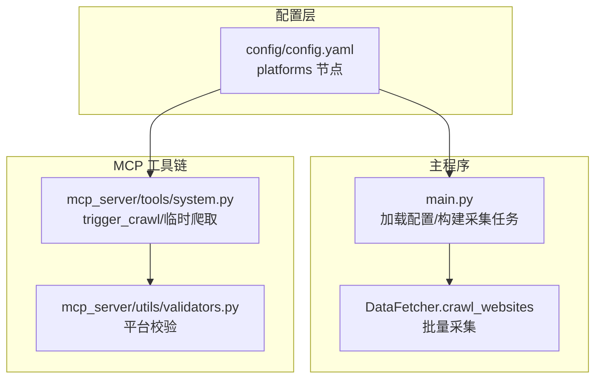
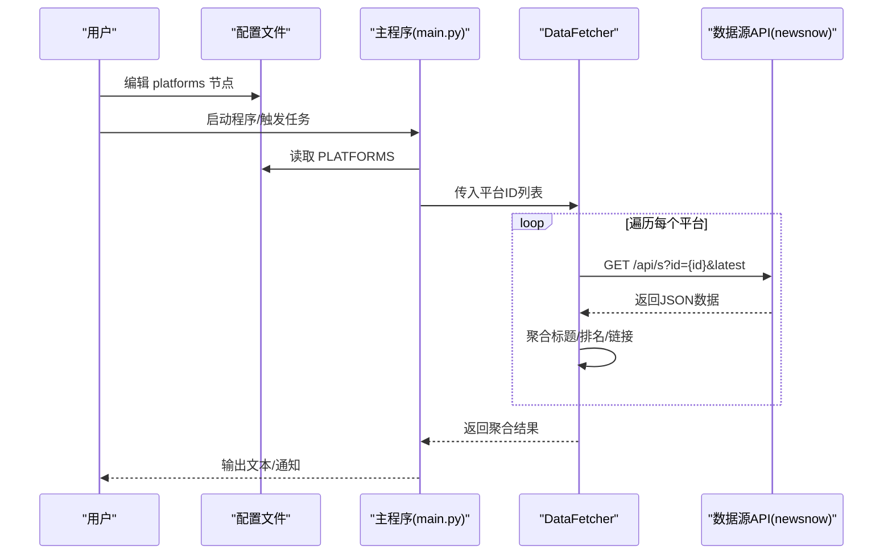
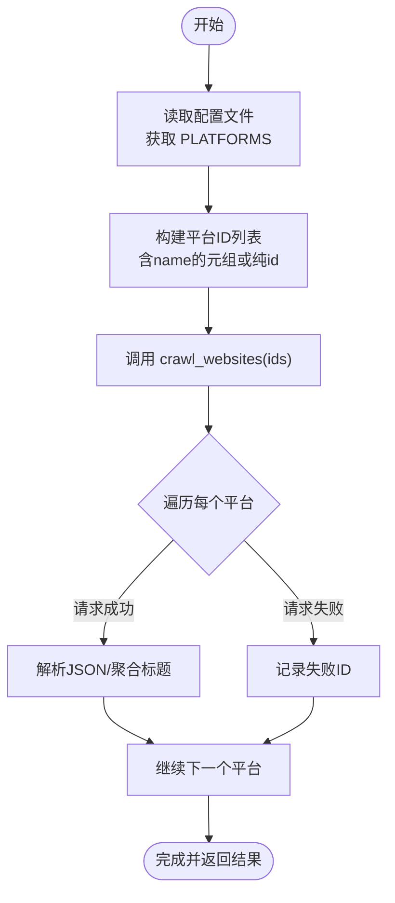
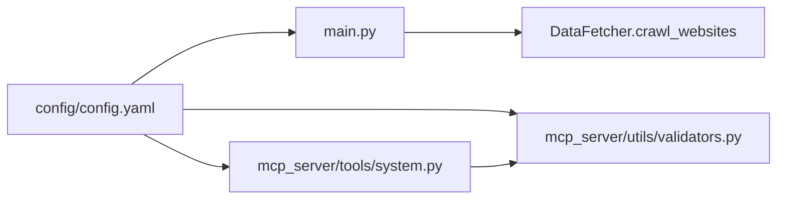

# 监控平台设置

<cite>
**本文引用的文件**
- [config/config.yaml](file://config/config.yaml)
- [main.py](file://main.py)
- [mcp_server/tools/system.py](file://mcp_server/tools/system.py)
- [mcp_server/utils/validators.py](file://mcp_server/utils/validators.py)
- [mcp_server/tools/config_mgmt.py](file://mcp_server/tools/config_mgmt.py)
- [README.md](file://README.md)
- [README-EN.md](file://README-EN.md)
</cite>

## 目录
1. [简介](#简介)
2. [项目结构](#项目结构)
3. [核心组件](#核心组件)
4. [架构总览](#架构总览)
5. [详细组件分析](#详细组件分析)
6. [依赖关系分析](#依赖关系分析)
7. [性能考量](#性能考量)
8. [故障排查指南](#故障排查指南)
9. [结论](#结论)
10. [附录](#附录)

## 简介
本节面向希望自定义监控平台的用户，系统性说明如何在配置文件中定义平台，解释 id 与 name 字段的作用及约束，列举当前支持的平台，并给出添加新平台的操作步骤。同时结合主程序入口与 MCP 工具链中的调用逻辑，阐明平台配置如何影响数据采集范围；最后提供常见错误排查方法，尤其是 id 拼写错误导致采集失败的定位思路。

## 项目结构
- 平台配置位于配置文件的 platforms 节点，采用数组形式，每个元素包含 id 与 name 两个字段。
- 主程序入口负责加载配置并将平台列表转换为采集任务输入。
- MCP 工具链提供临时爬取能力，同样读取配置文件中的 platforms 列表，支持按需筛选平台。

图表来源
- [config/config.yaml](file://config/config.yaml#L116-L140)
- [main.py](file://main.py#L5256-L5273)
- [mcp_server/tools/system.py](file://mcp_server/tools/system.py#L109-L143)
- [mcp_server/utils/validators.py](file://mcp_server/utils/validators.py#L16-L88)

章节来源
- [config/config.yaml](file://config/config.yaml#L116-L140)
- [main.py](file://main.py#L5256-L5273)
- [mcp_server/tools/system.py](file://mcp_server/tools/system.py#L109-L143)
- [mcp_server/utils/validators.py](file://mcp_server/utils/validators.py#L16-L88)

## 核心组件
- 配置文件 platforms 节点
  - id：必须与数据源 API 的平台标识严格一致，否则请求会失败。
  - name：仅用于显示与识别，不影响数据采集。
- 主程序采集流程
  - 从配置中读取 PLATFORMS，构造 id 列表（含 name 的元组或纯 id）。
  - 交由 DataFetcher.crawl_websites 逐个请求数据源接口，聚合结果并输出。
- MCP 工具链
  - trigger_crawl 支持按平台列表临时爬取，内部同样读取配置文件中的 platforms 并进行平台校验。

章节来源
- [config/config.yaml](file://config/config.yaml#L116-L140)
- [main.py](file://main.py#L5256-L5273)
- [mcp_server/tools/system.py](file://mcp_server/tools/system.py#L109-L143)
- [mcp_server/utils/validators.py](file://mcp_server/utils/validators.py#L16-L88)

## 架构总览
平台配置贯穿“配置加载—采集调度—数据聚合—输出”的完整链路，id 作为数据源契约，name 服务于展示与识别。

图表来源
- [config/config.yaml](file://config/config.yaml#L116-L140)
- [main.py](file://main.py#L616-L739)
- [mcp_server/tools/system.py](file://mcp_server/tools/system.py#L143-L181)

## 详细组件分析

### 平台配置字段语义与约束
- id
  - 必须与数据源 API 的平台标识完全一致，否则请求会失败。
  - 该字段决定最终请求的 URL 参数值。
- name
  - 仅用于显示与识别，不影响数据采集。
  - 若缺失 name 字段，程序仍可正常运行，显示时回退为 id。

章节来源
- [config/config.yaml](file://config/config.yaml#L116-L140)
- [main.py](file://main.py#L5256-L5273)

### 支持的平台清单
以下平台已在配置文件中预置，可直接启用。若需扩展，请参考“添加新平台”章节。

- 今日头条
- 百度热搜
- 华尔街见闻
- 澎湃新闻
- bilibili 热搜
- 财联社热门
- 凤凰网
- 贴吧
- 微博
- 抖音
- 知乎

章节来源
- [config/config.yaml](file://config/config.yaml#L116-L140)

### 添加新平台的方法
- 步骤
  1) 在配置文件的 platforms 节点中新增一项，包含 id 与 name。
  2) id 必须与数据源 API 的平台标识一致；name 用于显示。
  3) 保存配置后重启程序或重新触发任务即可生效。
- 参考来源
  - 配置位置与示例：参见配置文件 platforms 节点与 README 中的平台配置说明。
  - 数据源来源：项目使用第三方数据源服务提供 API，平台 id 来源于该服务的平台映射。

章节来源
- [config/config.yaml](file://config/config.yaml#L116-L140)
- [README.md](file://README.md#L120-L127)
- [README-EN.md](file://README-EN.md#L120-L127)

### 平台配置如何影响数据采集范围
- 主程序入口
  - 从配置中读取 PLATFORMS，遍历生成 id 列表（含 name 的二元组或纯 id）。
  - 将该列表传给 DataFetcher.crawl_websites，决定本次采集覆盖哪些平台。
- MCP 工具链
  - trigger_crawl 支持按平台列表临时爬取；当未指定平台时，读取配置文件中的 platforms 并进行平台校验。
  - 平台校验逻辑：从配置文件动态读取支持的平台列表，若请求的平台不在其中则报错。

图表来源
- [main.py](file://main.py#L5256-L5273)
- [main.py](file://main.py#L683-L739)
- [mcp_server/tools/system.py](file://mcp_server/tools/system.py#L109-L143)

章节来源
- [main.py](file://main.py#L5256-L5273)
- [main.py](file://main.py#L683-L739)
- [mcp_server/tools/system.py](file://mcp_server/tools/system.py#L109-L143)

### 配置示例
- platforms 节点示例（摘自配置文件）
  - 包含 id 与 name 字段，id 与数据源 API 对应，name 用于显示。
- 说明
  - 可按需增删平台项；建议选择 10–15 个核心平台，避免信息过载。

章节来源
- [config/config.yaml](file://config/config.yaml#L116-L140)
- [README.md](file://README.md#L1528-L1559)
- [README-EN.md](file://README-EN.md#L1508-L1529)

## 依赖关系分析
- 配置文件依赖
  - main.py 与 mcp_server/tools/system.py 均依赖 config/config.yaml 的 platforms 节点。
- 平台校验依赖
  - mcp_server/utils/validators.py 提供 get_supported_platforms 与 validate_platforms，用于动态读取配置并校验平台合法性。
- 数据源依赖
  - 采集请求 URL 中的 id 参数直接来自 platforms.id，因此 id 必须与数据源 API 的平台标识一致。

图表来源
- [config/config.yaml](file://config/config.yaml#L116-L140)
- [main.py](file://main.py#L5256-L5273)
- [mcp_server/tools/system.py](file://mcp_server/tools/system.py#L109-L143)
- [mcp_server/utils/validators.py](file://mcp_server/utils/validators.py#L16-L88)

章节来源
- [config/config.yaml](file://config/config.yaml#L116-L140)
- [main.py](file://main.py#L5256-L5273)
- [mcp_server/tools/system.py](file://mcp_server/tools/system.py#L109-L143)
- [mcp_server/utils/validators.py](file://mcp_server/utils/validators.py#L16-L88)

## 性能考量
- 请求间隔
  - 配置文件中提供请求间隔参数，主程序与 MCP 工具链均会使用该参数控制请求节奏，避免过于频繁导致被限流或失败。
- 平台数量
  - README 建议选择 10–15 个核心平台，平台越多，请求次数越多，整体耗时与网络开销越大。

章节来源
- [config/config.yaml](file://config/config.yaml#L5-L10)
- [README.md](file://README.md#L1528-L1559)
- [README-EN.md](file://README-EN.md#L1508-L1529)

## 故障排查指南

### 常见错误与定位
- 错误：id 拼写错误导致采集失败
  - 现象：某平台始终显示“请求失败”，或最终结果中缺少该平台。
  - 原因：id 必须与数据源 API 的平台标识一致，否则请求会失败。
  - 定位方法：
    - 检查配置文件中 platforms.id 是否与数据源平台标识一致。
    - 参考 README 中的数据源说明，确认平台 id 的正确值。
  - 处理建议：
    - 修正 id 后重新运行程序或触发任务。
    - 如不确定 id，可参考 README 中的平台配置汇总链接或数据源仓库中的平台映射。

章节来源
- [config/config.yaml](file://config/config.yaml#L116-L140)
- [README.md](file://README.md#L120-L127)
- [README-EN.md](file://README-EN.md#L120-L127)

### 平台校验失败
- 现象：MCP 临时爬取时提示“不支持的平台”。
- 原因：请求的平台 id 未在配置文件的 platforms 中出现。
- 定位与处理：
  - 使用 validators.validate_platforms 动态读取配置中的支持平台列表，核对请求的平台 id 是否在其中。
  - 若不在，将该平台添加到配置文件的 platforms 节点后再重试。

章节来源
- [mcp_server/utils/validators.py](file://mcp_server/utils/validators.py#L16-L88)
- [mcp_server/tools/system.py](file://mcp_server/tools/system.py#L109-L143)

### 通知与采集开关
- 当 ENABLE_CRAWLER 或 ENABLE_NOTIFICATION 为关闭时，程序行为会相应调整（仅采集或仅通知），这可能影响你对“采集失败”的感知。
- 建议：在排查问题时，确认相关开关状态与期望一致。

章节来源
- [main.py](file://main.py#L5240-L5255)

## 结论
- 平台配置的核心在于 id 与数据源 API 的严格对应，name 仅用于显示。
- 通过配置文件的 platforms 节点，主程序与 MCP 工具链均可确定采集范围。
- 建议选择 10–15 个核心平台，避免信息过载；出现问题时优先核对 id 是否正确。

## 附录

### 平台配置字段定义
- id：数据源 API 的平台标识，必须与数据源一致。
- name：显示名称，用于识别与展示。

章节来源
- [config/config.yaml](file://config/config.yaml#L116-L140)

### 配置读取与导出
- 配置读取
  - 主程序通过 load_config 将 platforms 节点注入全局配置。
  - MCP 工具链通过读取配置文件获取 platforms。
- 配置查询
  - MCP 提供配置查询工具，可按节读取当前系统配置。

章节来源
- [main.py](file://main.py#L162-L259)
- [mcp_server/tools/config_mgmt.py](file://mcp_server/tools/config_mgmt.py#L26-L66)
- [mcp_server/tools/system.py](file://mcp_server/tools/system.py#L109-L143)