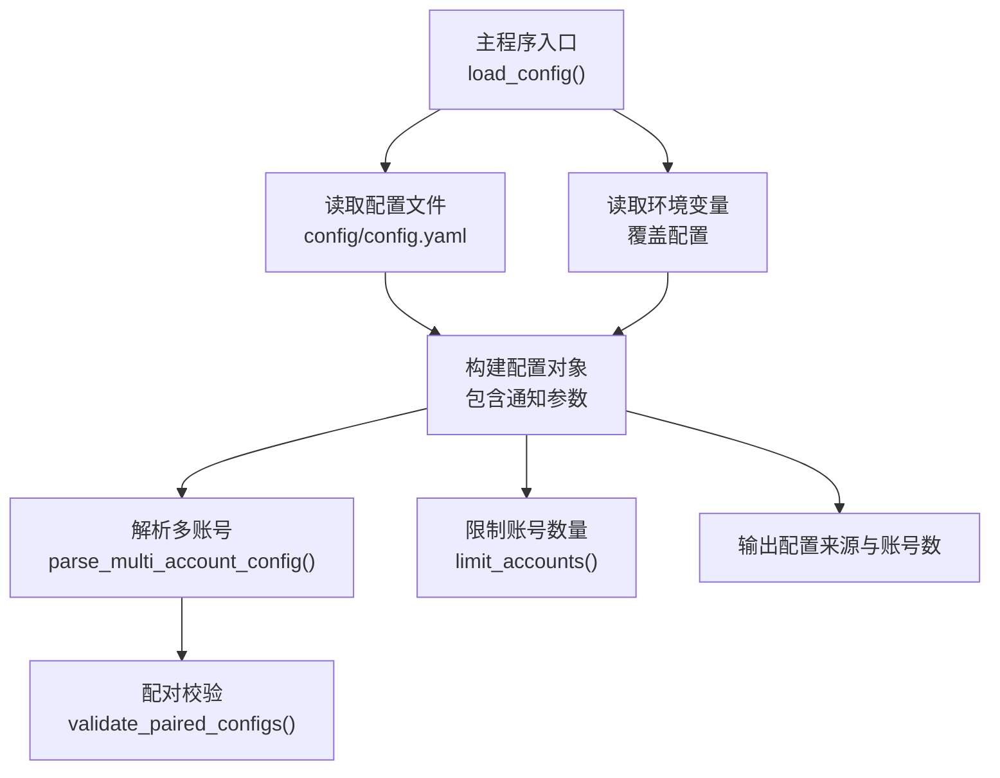
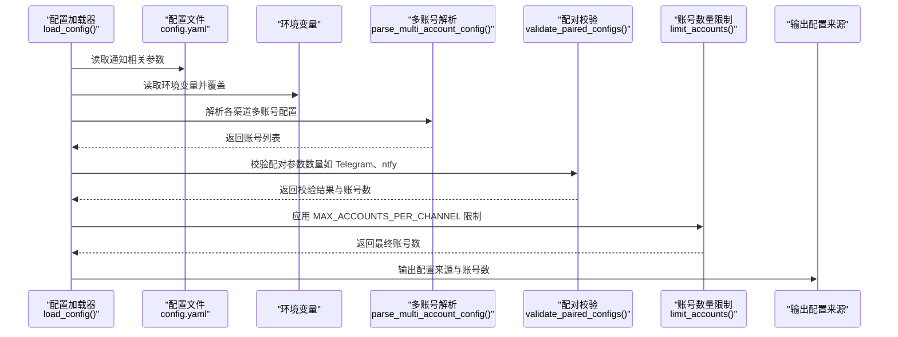
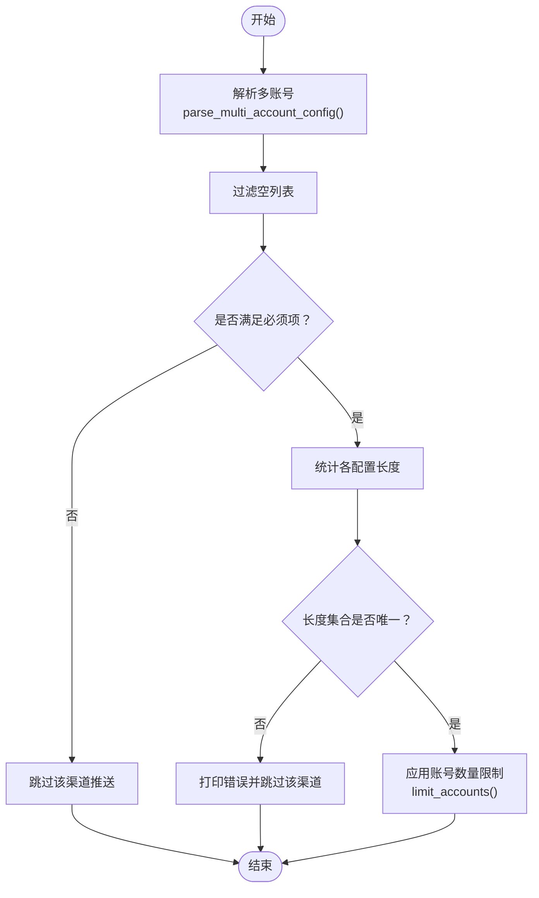
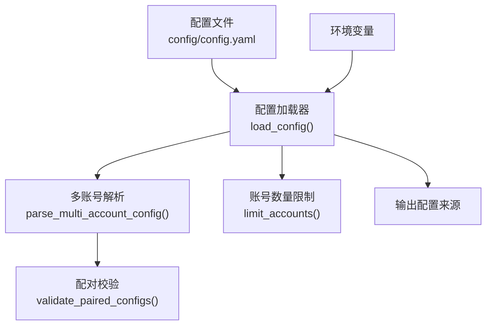

# 基础通知配置

<cite>
**本文引用的文件**
- [main.py](file://main.py)
- [config/config.yaml](file://config/config.yaml)
- [README.md](file://README.md)
- [README-EN.md](file://README-EN.md)
</cite>

## 目录
1. [简介](#简介)
2. [项目结构](#项目结构)
3. [核心组件](#核心组件)
4. [架构总览](#架构总览)
5. [详细组件分析](#详细组件分析)
6. [依赖关系分析](#依赖关系分析)
7. [性能考量](#性能考量)
8. [故障排查指南](#故障排查指南)
9. [结论](#结论)
10. [附录](#附录)

## 简介
本文件面向首次配置与维护 TrendRadar 通知推送的用户，聚焦基础通知配置项的含义、作用与最佳实践，包括：
- 总开关 ENABLE_NOTIFICATION
- 各类消息分批大小（MESSAGE_BATCH_SIZE、DINGTALK_BATCH_SIZE、FEISHU_BATCH_SIZE、BARK_BATCH_SIZE、SLACK_BATCH_SIZE）
- 批次发送间隔 BATCH_SEND_INTERVAL
- 飞书分割线 FEISHU_MESSAGE_SEPARATOR
- 每个渠道最大账号数量 MAX_ACCOUNTS_PER_CHANNEL 的限制机制与安全考量
- 多账号配置解析与配对验证逻辑（parse_multi_account_config、validate_paired_configs）
- 完整配置示例与 Webhooks 安全配置建议（环境变量优先级、GitHub Secrets 使用）

## 项目结构
通知配置主要集中在主程序加载与配置文件中，核心流程如下：
- 主程序加载配置文件与环境变量，构建统一配置对象
- 依据配置决定是否启用通知、各渠道分批策略与账号数量限制
- 多账号解析与配对校验，确保 Telegram、ntfy 等配对参数数量一致
- 输出配置来源与账号数量，便于运维核对

图表来源
- [main.py](file://main.py#L162-L395)
- [config/config.yaml](file://config/config.yaml#L34-L109)

章节来源
- [main.py](file://main.py#L162-L395)
- [config/config.yaml](file://config/config.yaml#L34-L109)

## 核心组件
- 总开关 ENABLE_NOTIFICATION：控制是否启用通知功能。若关闭，将跳过所有渠道的推送。
- 分批大小 MESSAGE_BATCH_SIZE、DINGTALK_BATCH_SIZE、FEISHU_BATCH_SIZE、BARK_BATCH_SIZE、SLACK_BATCH_SIZE：控制不同渠道的消息分批上限（字节）。用于避免单条消息过大导致平台拒绝。
- 批次发送间隔 BATCH_SEND_INTERVAL：相邻批次之间的等待时间（秒），用于降低平台限流压力与提升稳定性。
- 飞书分割线 FEISHU_MESSAGE_SEPARATOR：飞书消息中用于分隔批次内容的分隔符字符串，便于客户端区分批次。
- 每个渠道最大账号数量 MAX_ACCOUNTS_PER_CHANNEL：限制每个通知渠道最多使用的账号数量，避免过度占用资源与账号风险。

章节来源
- [main.py](file://main.py#L197-L214)
- [config/config.yaml](file://config/config.yaml#L34-L43)

## 架构总览
下图展示通知配置在主程序中的装配与使用路径，以及多账号解析与配对校验的关键节点。

图表来源
- [main.py](file://main.py#L162-L395)
- [config/config.yaml](file://config/config.yaml#L34-L109)

## 详细组件分析

### 1. 总开关 ENABLE_NOTIFICATION
- 作用：启用/禁用通知功能。若关闭，将跳过所有渠道的推送。
- 优先级：环境变量优先于配置文件。
- 影响范围：影响后续所有渠道的发送逻辑。

章节来源
- [main.py](file://main.py#L197-L203)
- [config/config.yaml](file://config/config.yaml#L34-L36)

### 2. 分批大小与批次间隔
- 分批大小
  - MESSAGE_BATCH_SIZE：通用消息分批大小（字节）
  - DINGTALK_BATCH_SIZE：钉钉消息分批大小（字节）
  - FEISHU_BATCH_SIZE：飞书消息分批大小（字节）
  - BARK_BATCH_SIZE：Bark 消息分批大小（字节）
  - SLACK_BATCH_SIZE：Slack 消息分批大小（字节）
- 批次发送间隔 BATCH_SEND_INTERVAL：相邻批次之间的等待时间（秒）
- 飞书分割线 FEISHU_MESSAGE_SEPARATOR：用于在飞书消息中插入批次分隔符，便于客户端区分批次

章节来源
- [main.py](file://main.py#L204-L214)
- [config/config.yaml](file://config/config.yaml#L34-L43)

### 3. 每个渠道最大账号数量 MAX_ACCOUNTS_PER_CHANNEL
- 作用：限制每个通知渠道最多使用的账号数量，避免过度使用导致 GitHub Actions 资源紧张与账号风险。
- 限制机制：
  - 读取环境变量或配置文件中的最大值
  - 在解析多账号后，按最大值截断
  - 日志会提示“超过最大限制，只使用前 N 个”
- 安全考量：
  - GitHub Fork 用户不应在配置文件中暴露 Webhooks
  - 建议通过 GitHub Secrets 或 .env 等环境变量注入
  - 账号数量越多，总推送耗时越长，建议控制在合理范围

章节来源
- [main.py](file://main.py#L216-L219)
- [main.py](file://main.py#L121-L141)
- [README.md](file://README.md#L2780-L2814)

### 4. 多账号解析与配对验证
- 多账号解析 parse_multi_account_config
  - 以分号分隔多个账号值，保留空串用于占位
  - 若全部为空，视为未配置
- 配对验证 validate_paired_configs
  - 过滤空列表，检查必须项
  - 统计非空配置的长度集合，若长度不一致则报错并跳过该渠道
  - 返回验证结果与账号数量
- 限制账号数量 limit_accounts
  - 当账号数超过最大值时，截断并打印警告

图表来源
- [main.py](file://main.py#L59-L141)

章节来源
- [main.py](file://main.py#L59-L141)

### 5. Webhooks 安全配置与环境变量优先级
- 环境变量优先级
  - 配置加载时，环境变量会覆盖配置文件中的同名字段
  - 常见覆盖字段包括 ENABLE_NOTIFICATION、各渠道 Webhook URL、BARK_URL、SLACK_WEBHOOK_URL、EMAIL_* 等
- GitHub Secrets 最佳实践
  - 不要在配置文件中明文存放 Webhooks
  - 使用 GitHub Actions 的 Secrets 注入，避免泄露
  - Telegram 与 ntfy 的配对参数（token/chat_id、topic/token）数量必须一致，否则该渠道推送会被跳过
- Docker 环境变量
  - 可通过 docker/.env 文件注入环境变量，实现与 Actions 类似的覆盖效果

章节来源
- [main.py](file://main.py#L260-L322)
- [README.md](file://README.md#L846-L1184)
- [README-EN.md](file://README-EN.md#L2045-L2074)
- [README-EN.md](file://README-EN.md#L2569-L2772)

## 依赖关系分析
- 配置加载依赖
  - 读取配置文件与环境变量，构建统一配置对象
  - 通知参数来源于配置文件与环境变量的合并
- 多账号解析与配对校验依赖
  - parse_multi_account_config 依赖分号分隔规则
  - validate_paired_configs 依赖各渠道配对规则（如 Telegram、ntfy）
- 账号数量限制依赖
  - limit_accounts 依赖 MAX_ACCOUNTS_PER_CHANNEL

图表来源
- [main.py](file://main.py#L162-L395)
- [config/config.yaml](file://config/config.yaml#L34-L109)

章节来源
- [main.py](file://main.py#L162-L395)
- [config/config.yaml](file://config/config.yaml#L34-L109)

## 性能考量
- 多账号独立推送：每个账号独立发送，总耗时约为“账号数 × 单账号耗时”。建议控制账号数量，避免 GitHub Actions 速率限制与账号风险。
- 分批策略：合理设置分批大小与批次间隔，有助于降低平台限流压力，提升成功率。
- Bark 限制：Bark 使用 APNs，单条消息最大约 4KB，超限会被拒绝；系统会在发送前打印警告。

章节来源
- [README.md](file://README.md#L2780-L2791)
- [main.py](file://main.py#L4710-L4745)

## 故障排查指南
- 配置未生效
  - 检查环境变量是否正确覆盖配置文件
  - 确认配置优先级：环境变量 > 配置文件
- 多账号未生效
  - 检查分号分隔是否正确
  - 检查 Telegram、ntfy 的配对参数数量是否一致
- 账号过多被截断
  - 查看日志中关于“超过最大限制”的提示
  - 调整 MAX_ACCOUNTS_PER_CHANNEL 或减少账号数量
- Webhooks 泄露风险
  - 确保通过 GitHub Secrets 或 .env 注入
  - 不要在公共仓库中提交包含敏感信息的配置文件

章节来源
- [main.py](file://main.py#L324-L395)
- [README.md](file://README.md#L846-L1184)
- [README-EN.md](file://README-EN.md#L2569-L2772)

## 结论
- ENABLE_NOTIFICATION 为通知总开关，务必在生产环境中谨慎开启
- 合理设置分批大小与批次间隔，兼顾推送质量与平台稳定性
- 严格控制每个渠道的账号数量，避免资源与账号风险
- 使用环境变量优先策略与 GitHub Secrets，确保 Webhooks 安全
- 多账号配置需遵循分号分隔与配对校验规则，确保各渠道稳定推送

## 附录

### A. 基础配置示例（环境变量）
- 总开关与分批大小
  - ENABLE_NOTIFICATION=true
  - MESSAGE_BATCH_SIZE=4000
  - DINGTALK_BATCH_SIZE=20000
  - FEISHU_BATCH_SIZE=30000
  - BARK_BATCH_SIZE=4000
  - SLACK_BATCH_SIZE=4000
  - BATCH_SEND_INTERVAL=3
  - FEISHU_MESSAGE_SEPARATOR="━━━━━━━━━━━━━━━━━━━"
- 每个渠道最大账号数量
  - MAX_ACCOUNTS_PER_CHANNEL=3
- 渠道 Webhooks（示例）
  - FEISHU_WEBHOOK_URL=https://hook1.feishu.cn/xxx;https://hook2.feishu.cn/yyy;https://hook3.feishu.cn/zzz
  - DINGTALK_WEBHOOK_URL=https://oapi.dingtalk.com/xxx;https://oapi.dingtalk.com/yyy
  - WEWORK_WEBHOOK_URL=https://qyapi.weixin.qq.com/cgi-bin/webhook/send?key=xxx;https://qyapi.weixin.qq.com/cgi-bin/webhook/send?key=yyy
  - TELEGRAM_BOT_TOKEN=token1;token2
  - TELEGRAM_CHAT_ID=-100111;-100222
  - EMAIL_FROM=sender@example.com
  - EMAIL_PASSWORD=your_app_password_or_authorization_code
  - EMAIL_TO=recipient1@example.com,recipient2@example.com
  - EMAIL_SMTP_SERVER=smtp.example.com
  - EMAIL_SMTP_PORT=587
  - NTFY_SERVER_URL=https://ntfy.sh
  - NTFY_TOPIC=topic1;topic2;topic3
  - NTFY_TOKEN=;token_for_topic2;
  - BARK_URL=https://api.day.app/key1;https://api.day.app/key2
  - SLACK_WEBHOOK_URL=https://hooks.slack.com/xxx;https://hooks.slack.com/yyy

章节来源
- [README-EN.md](file://README-EN.md#L2569-L2772)
- [README-EN.md](file://README-EN.md#L2603-L2745)

### B. 配置来源与账号数量输出
- 程序会输出各渠道的配置来源（环境变量或配置文件）与账号数量，便于运维核对
- 若某渠道未配置或配对失败，将不会参与推送

章节来源
- [main.py](file://main.py#L324-L395)