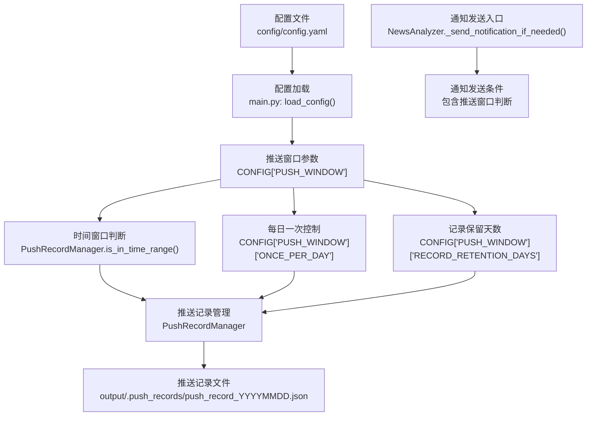
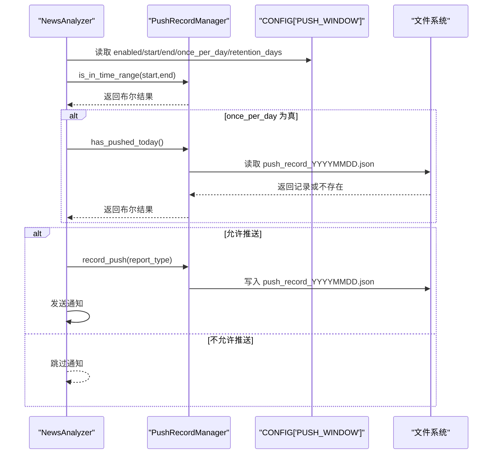
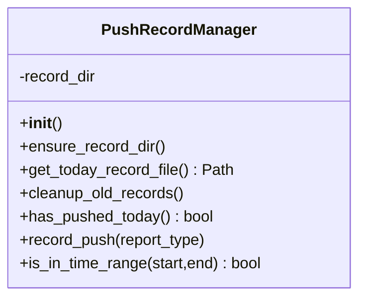
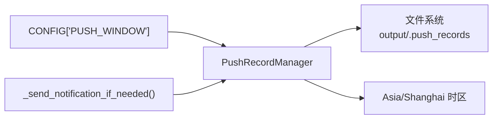

# 推送时间窗口配置

<cite>
**本文引用的文件**
- [main.py](file://main.py)
- [config/config.yaml](file://config/config.yaml)
- [README.md](file://README.md)
- [README-EN.md](file://README-EN.md)
</cite>

## 目录
1. [简介](#简介)
2. [项目结构](#项目结构)
3. [核心组件](#核心组件)
4. [架构总览](#架构总览)
5. [详细组件分析](#详细组件分析)
6. [依赖关系分析](#依赖关系分析)
7. [性能考量](#性能考量)
8. [故障排查指南](#故障排查指南)
9. [结论](#结论)
10. [附录](#附录)

## 简介
本文件围绕“推送时间窗口”配置进行系统化说明，重点覆盖以下方面：
- push_window.enabled 启用开关的工作机制
- time_range 时间范围（start/end）的协同逻辑
- once_per_day 每日一次推送的核心逻辑
- 与 PushRecordManager 类的配合：has_pushed_today 与 is_in_time_range 的实现原理
- 推送记录存储路径、文件命名规范与清理策略
- 时间窗口判断的标准化处理（normalize_time）与时区处理（Asia/Shanghai）
- 典型使用场景（工作日推送、晚间汇总）
- 与 GitHub Actions 定时任务的协同注意事项

## 项目结构
推送时间窗口功能主要涉及配置加载、时间窗口判断、推送记录管理与通知发送流程。核心文件如下：
- 配置加载与推送窗口参数解析：config/config.yaml、main.py 中的 load_config
- 时间窗口判断与记录管理：main.py 中的 PushRecordManager
- 通知发送入口：main.py 中的 NewsAnalyzer._send_notification_if_needed
- 文档与示例：README.md、README-EN.md

图表来源
- [config/config.yaml](file://config/config.yaml#L45-L58)
- [main.py](file://main.py#L220-L251)
- [main.py](file://main.py#L581-L614)
- [main.py](file://main.py#L513-L580)

章节来源
- [config/config.yaml](file://config/config.yaml#L45-L58)
- [main.py](file://main.py#L220-L251)
- [main.py](file://main.py#L513-L580)
- [main.py](file://main.py#L581-L614)

## 核心组件
- 配置加载与推送窗口参数
  - 通过 load_config() 从 config/config.yaml 读取 notification.push_window 配置，并支持环境变量覆盖
  - 关键字段：
    - enabled：是否启用推送时间窗口控制
    - time_range.start/time_range.end：时间窗口起止（HH:MM，北京时间）
    - once_per_day：每天在窗口内是否只推送一次
    - push_record_retention_days：推送记录保留天数
- PushRecordManager
  - 记录目录：output/.push_records
  - 文件命名：push_record_YYYYMMDD.json
  - 清理策略：根据 RECORD_RETENTION_DAYS 删除过期记录
  - 核心方法：
    - has_pushed_today()：判断今日是否已推送
    - is_in_time_range(start, end)：判断当前时间是否在指定窗口内
    - record_push(report_type)：写入今日推送记录
- 通知发送入口
  - NewsAnalyzer._send_notification_if_needed()：统一的通知发送入口，会结合推送窗口条件进行判断

章节来源
- [config/config.yaml](file://config/config.yaml#L45-L58)
- [main.py](file://main.py#L220-L251)
- [main.py](file://main.py#L513-L580)
- [main.py](file://main.py#L581-L614)
- [main.py](file://main.py#L5109-L5158)

## 架构总览
推送时间窗口的运行链路如下：
- 初始化阶段：加载配置，确定是否启用推送窗口、时间窗口与每日一次策略
- 执行阶段：在需要发送通知时，先判断当前时间是否在窗口内，再根据 once_per_day 与 has_pushed_today 决定是否允许推送
- 记录阶段：若允许推送，则写入推送记录文件，标记今日已推送

图表来源
- [main.py](file://main.py#L220-L251)
- [main.py](file://main.py#L581-L614)
- [main.py](file://main.py#L548-L580)

## 详细组件分析

### 配置加载与推送窗口参数
- 配置来源与优先级
  - 默认值来自 config/config.yaml 的 notification.push_window
  - 支持通过环境变量覆盖：
    - PUSH_WINDOW_ENABLED、PUSH_WINDOW_START、PUSH_WINDOW_END、PUSH_WINDOW_ONCE_PER_DAY、PUSH_WINDOW_RETENTION_DAYS
- 参数含义
  - enabled：启用/禁用推送时间窗口控制
  - time_range.start/end：窗口起止时间（HH:MM，北京时间）
  - once_per_day：true 表示每天在窗口内只推送一次；false 表示窗口内每次执行都可能推送
  - push_record_retention_days：推送记录保留天数，用于判断是否已推送

章节来源
- [config/config.yaml](file://config/config.yaml#L45-L58)
- [main.py](file://main.py#L220-L251)
- [README.md](file://README.md#L2459-L2535)
- [README-EN.md](file://README-EN.md#L2426-L2508)

### PushRecordManager 类
PushRecordManager 负责推送记录的创建、读取与清理，核心职责包括：
- 记录目录：output/.push_records
- 文件命名：push_record_YYYYMMDD.json
- 清理策略：删除超过 RECORD_RETENTION_DAYS 的旧记录
- 方法说明
  - has_pushed_today()：读取今日记录文件，判断是否已推送
  - is_in_time_range(start, end)：标准化时间并判断当前时间是否在窗口内
  - record_push(report_type)：写入今日推送记录
  - cleanup_old_records()：按保留天数清理过期记录

图表来源
- [main.py](file://main.py#L513-L580)
- [main.py](file://main.py#L581-L614)

章节来源
- [main.py](file://main.py#L513-L580)
- [main.py](file://main.py#L581-L614)

### 时间窗口判断与标准化处理
- is_in_time_range 实现要点
  - 使用 get_beijing_time() 获取北京时间
  - 将输入时间与当前时间标准化为 HH:MM 格式
  - 校验格式与范围，非法输入将回退为原始字符串
  - 判断 normalized_start <= normalized_current <= normalized_end
- normalize_time 规范
  - 输入格式为 HH:MM，否则抛出异常并打印错误
  - 小时范围 0-23，分钟范围 0-59，超出范围报错
  - 返回两位数格式 HH:MM
- 时区处理
  - get_beijing_time() 使用 Asia/Shanghai 时区
  - 与 GitHub Actions 的时区差异需在 Cron 表达式中折算

章节来源
- [main.py](file://main.py#L404-L410)
- [main.py](file://main.py#L581-L614)

### 每日一次推送逻辑
- once_per_day 为 true 时
  - 在每次发送通知前调用 has_pushed_today() 判断今日是否已推送
  - 若已推送则跳过本次通知
- once_per_day 为 false 时
  - 仅进行时间窗口判断，不阻断多次推送
- 记录写入
  - 允许推送时调用 record_push(report_type) 写入今日记录

章节来源
- [main.py](file://main.py#L548-L580)
- [main.py](file://main.py#L563-L580)

### 推送记录存储与清理
- 存储路径：output/.push_records
- 文件命名：push_record_YYYYMMDD.json
- 清理策略：按 RECORD_RETENTION_DAYS 删除过期记录
- 读取与写入均采用 UTF-8 编码，JSON 格式包含 pushed、push_time、report_type 字段

章节来源
- [main.py](file://main.py#L513-L580)

### 通知发送与推送窗口的协同
- 通知发送入口：NewsAnalyzer._send_notification_if_needed()
- 协同逻辑
  - 若启用推送窗口且当前不在时间窗口内，则跳过通知
  - 若 once_per_day 为真且今日已推送，则跳过通知
  - 否则执行通知发送，并在成功后写入推送记录

章节来源
- [main.py](file://main.py#L5109-L5158)
- [main.py](file://main.py#L548-L580)

### GitHub Actions 定时任务协同注意事项
- 时区差异
  - GitHub Actions 使用 UTC 时间，北京时间需减去 8 小时
  - README 提示：执行时间不稳定，±15 分钟偏差；建议时间窗口至少 2 小时宽
- Cron 表达式
  - README 提供常见示例与说明，建议不要设置短于 30 分钟的间隔，避免被判定为滥用
- 精准定时建议
  - 如需精准定时推送，建议使用 Docker 部署在个人服务器上

章节来源
- [README.md](file://README.md#L2537-L2595)
- [README-EN.md](file://README-EN.md#L2510-L2568)

## 依赖关系分析
- 配置依赖
  - CONFIG['PUSH_WINDOW'] 由 load_config() 构建，包含 enabled、time_range、once_per_day、push_record_retention_days
- 组件耦合
  - PushRecordManager 依赖 CONFIG['PUSH_WINDOW'] 的参数
  - NewsAnalyzer._send_notification_if_needed() 依赖 PushRecordManager 的判断结果
- 外部依赖
  - 时区依赖 pytz（Asia/Shanghai）
  - 文件系统依赖 pathlib 与 json

图表来源
- [main.py](file://main.py#L220-L251)
- [main.py](file://main.py#L513-L580)
- [main.py](file://main.py#L581-L614)
- [main.py](file://main.py#L5109-L5158)

章节来源
- [main.py](file://main.py#L220-L251)
- [main.py](file://main.py#L513-L580)
- [main.py](file://main.py#L581-L614)
- [main.py](file://main.py#L5109-L5158)

## 性能考量
- 时间窗口判断 is_in_time_range 为 O(1)，开销极低
- 记录读写为小 JSON 文件，I/O 成本低
- once_per_day 为真时，has_pushed_today() 仅在每日首次执行时产生一次文件读取
- 清理策略按天遍历目录，文件数量有限，清理成本低

## 故障排查指南
- 常见问题与定位
  - 通知未触发
    - 检查 enabled 是否为 true
    - 检查当前时间是否在 time_range 内
    - 检查 once_per_day 为真时是否已存在今日记录
  - 记录文件未生成
    - 确认 record_push 被调用（仅在允许推送时写入）
    - 检查 output/.push_records 目录权限与磁盘空间
  - 记录清理异常
    - 检查 RECORD_RETENTION_DAYS 配置是否合理
    - 查看清理过程中的异常日志
  - GitHub Actions 时差导致推送时间不准
    - 按 README 提示折算 Cron 表达式，确保时间窗口至少 2 小时宽

章节来源
- [main.py](file://main.py#L548-L580)
- [main.py](file://main.py#L581-L614)
- [README.md](file://README.md#L2490-L2535)
- [README-EN.md](file://README-EN.md#L2463-L2508)

## 结论
推送时间窗口通过配置驱动与 PushRecordManager 的协作，实现了“时间窗口 + 每日一次”的灵活控制。其设计简洁、易于维护，同时提供了清晰的记录与清理机制。结合 GitHub Actions 的时区与频率限制，用户可在云端稳定运行的同时，获得可控的推送节奏。

## 附录

### 典型使用场景示例
- 工作日白天推送（每小时一次）
  - 配置：start: "09:00", end: "18:00", once_per_day: false
  - 说明：窗口内每次执行都可能推送，适合工作时间持续关注
- 晚间汇总推送（每日一次）
  - 配置：start: "20:00", end: "22:00", once_per_day: true
  - 说明：每天仅在窗口内推送一次，适合晚间集中查看
- 午休时间推送（每日一次）
  - 配置：start: "12:00", end: "13:00", once_per_day: true
  - 说明：短窗口内每日一次，避免打扰

章节来源
- [README.md](file://README.md#L2482-L2535)
- [README-EN.md](file://README-EN.md#L2455-L2508)

### 与 GitHub Actions 的协同要点
- 时区换算：UTC 与北京时间相差 8 小时
- 执行频率：建议不低于 30 分钟一次，避免被判定为滥用
- 时间窗口宽度：建议至少 2 小时，以应对执行时间偏差

章节来源
- [README.md](file://README.md#L2537-L2595)
- [README-EN.md](file://README-EN.md#L2510-L2568)