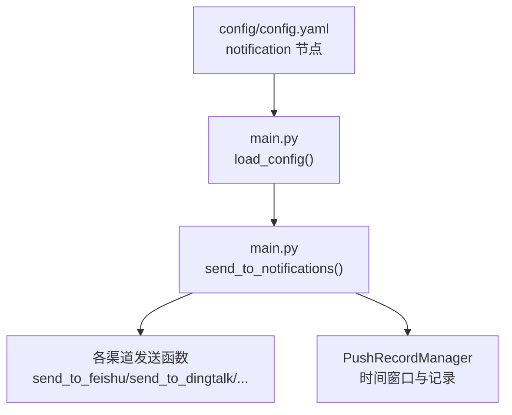
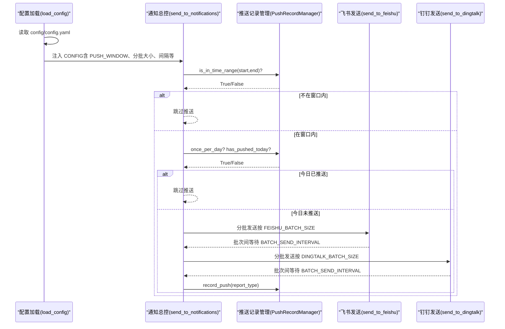
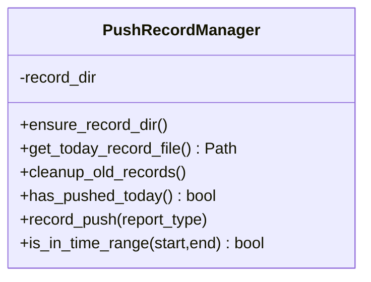
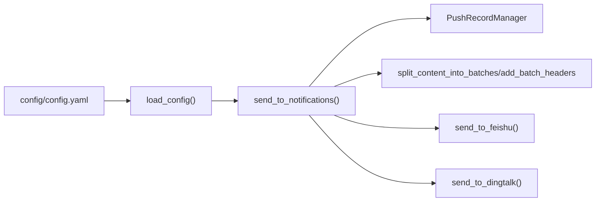

# 通知渠道设置

<cite>
**本文引用的文件**
- [config/config.yaml](file://config/config.yaml)
- [main.py](file://main.py)
- [README-EN.md](file://README-EN.md)
</cite>

## 目录
1. [简介](#简介)
2. [项目结构与入口](#项目结构与入口)
3. [核心组件与职责](#核心组件与职责)
4. [架构概览](#架构概览)
5. [详细组件分析](#详细组件分析)
6. [依赖关系分析](#依赖关系分析)
7. [性能与容量规划](#性能与容量规划)
8. [故障排查指南](#故障排查指南)
9. [结论](#结论)
10. [附录：配置示例与最佳实践](#附录配置示例与最佳实践)

## 简介
本章节聚焦“通知配置节”的使用与实现，围绕以下目标展开：
- enable_notification 总开关与各渠道分批大小（message_batch_size、dingtalk_batch_size、feishu_batch_size、bark_batch_size、slack_batch_size）的含义与取值建议
- batch_send_interval 批次发送间隔的作用与调优
- feishu_message_separator 飞书分割线的作用与使用场景
- push_window 推送时间窗口控制的协同机制：enabled、time_range.start/end、once_per_day、push_record_retention_days
- 结合 main.py 中 PushRecordManager 类，说明时间窗口判断与推送记录管理的实现逻辑
- 提供配置示例与安全注意事项

## 项目结构与入口
- 通知配置位于 config/config.yaml 的 notification 节点，包含 enable_notification、各类消息分批大小、batch_send_interval、feishu_message_separator、push_window 等字段
- 主流程入口在 main.py，其中 load_config() 负责加载配置；send_to_notifications() 负责按配置发送通知；PushRecordManager 负责推送时间窗口与记录管理

图表来源
- [config/config.yaml](file://config/config.yaml#L34-L109)
- [main.py](file://main.py#L160-L359)
- [main.py](file://main.py#L3800-L3988)
- [main.py](file://main.py#L513-L614)

章节来源
- [config/config.yaml](file://config/config.yaml#L34-L109)
- [main.py](file://main.py#L160-L359)

## 核心组件与职责
- 配置加载与覆盖
  - load_config() 从 config/config.yaml 读取默认值，并支持通过环境变量覆盖（如 ENABLE_NOTIFICATION、PUSH_WINDOW_*、FEISHU_WEBHOOK_URL 等）
- 通知发送总控
  - send_to_notifications() 在开启推送时间窗口时，先进行时间窗口判断与“今日是否已推送”检查，再按渠道分发
- 推送记录管理
  - PushRecordManager 提供：时间范围判断、今日是否已推送、记录推送、清理过期记录等能力

章节来源
- [main.py](file://main.py#L160-L359)
- [main.py](file://main.py#L3800-L3988)
- [main.py](file://main.py#L513-L614)

## 架构概览
下图展示通知配置节在整体流程中的位置与交互：

图表来源
- [main.py](file://main.py#L160-L359)
- [main.py](file://main.py#L3800-L3988)
- [main.py](file://main.py#L513-L614)
- [main.py](file://main.py#L3990-L4154)

## 详细组件分析

### 通知配置节（notification）
- enable_notification：总开关，决定是否发送通知
- message_batch_size：通用消息分批大小（字节），用于除特定渠道外的分批策略
- dingtalk_batch_size、feishu_batch_size、bark_batch_size、slack_batch_size：各渠道专用分批大小（字节）
- batch_send_interval：批次发送间隔（秒），用于控制相邻批次之间的等待
- feishu_message_separator：飞书消息分割线（字符串），用于在飞书消息中插入分隔
- push_window：推送时间窗口控制（可选）
  - enabled：是否启用推送时间窗口控制
  - time_range.start/end：推送窗口起止时间（北京时间 HH:MM）
  - once_per_day：每天仅推送一次（若为 true，且今日已推送则跳过）
  - push_record_retention_days：推送记录保留天数，用于清理过期记录

章节来源
- [config/config.yaml](file://config/config.yaml#L34-L109)

### 配置加载与环境变量覆盖
- load_config() 会从 config/config.yaml 读取默认值，并优先使用环境变量覆盖同名配置
- 对 PUSH_WINDOW 的覆盖键包括：
  - PUSH_WINDOW_ENABLED、PUSH_WINDOW_START、PUSH_WINDOW_END、PUSH_WINDOW_ONCE_PER_DAY、PUSH_WINDOW_RETENTION_DAYS
- 对通知渠道的覆盖键包括：
  - FEISHU_WEBHOOK_URL、DINGTALK_WEBHOOK_URL、WEWORK_WEBHOOK_URL、WEWORK_MSG_TYPE、TELEGRAM_BOT_TOKEN、TELEGRAM_CHAT_ID、EMAIL_*、NTFY_*、BARK_URL、SLACK_WEBHOOK_URL

章节来源
- [main.py](file://main.py#L160-L359)

### 推送时间窗口控制（push_window）与 PushRecordManager
- 时间窗口判断
  - is_in_time_range(start, end)：将传入时间标准化为 HH:MM，比较当前时间是否处于区间内
  - 若不在窗口内，send_to_notifications() 直接跳过推送
- 今日是否已推送
  - has_pushed_today()：读取 output/.push_records 下按日期命名的 JSON 文件，判断是否标记为已推送
- 记录推送
  - record_push(report_type)：写入当日记录文件，包含推送时间与报告类型
- 清理过期记录
  - cleanup_old_records()：按 RECORD_RETENTION_DAYS 删除过期记录文件
- 协同机制
  - once_per_day=true 时，若今日已推送则跳过
  - once_per_day=false 时，只要在窗口内就按每次执行推送（受其他条件影响）

图表来源
- [main.py](file://main.py#L513-L614)

章节来源
- [main.py](file://main.py#L513-L614)

### 分批发送与批次间隔
- 分批策略
  - split_content_into_batches()：根据 format_type 与 max_bytes（各渠道专用或通用）进行分批
  - add_batch_headers()：为每批添加批次头部，预留头部空间，避免超限
  - _get_max_batch_header_size()：估算最大批次头部字节数（考虑最多 99 批）
- 各渠道分批大小
  - message_batch_size：通用分批大小
  - dingtalk_batch_size：钉钉专用分批大小
  - feishu_batch_size：飞书专用分批大小
  - bark_batch_size：Bark 专用分批大小
  - slack_batch_size：Slack 专用分批大小
- 批次间隔
  - batch_send_interval：相邻批次之间等待秒数，避免触发平台限流或客户端渲染压力

章节来源
- [main.py](file://main.py#L3176-L3261)
- [main.py](file://main.py#L3263-L3300)
- [main.py](file://main.py#L3990-L4154)

### 飞书分割线（feishu_message_separator）
- 作用：在飞书消息中插入分隔线，提升可读性
- 使用位置：在飞书发送流程中作为消息内容的一部分插入

章节来源
- [config/config.yaml](file://config/config.yaml#L34-L109)
- [main.py](file://main.py#L3990-L4154)

### 通知发送总控（send_to_notifications）
- 在开启 push_window 时，先进行时间窗口判断与“今日是否已推送”检查
- 若满足条件，按渠道依次发送，并在成功发送后（且 once_per_day=true）记录推送
- 对多账号渠道，会解析分号分隔的多个账号并限制最大账号数

章节来源
- [main.py](file://main.py#L3800-L3988)

## 依赖关系分析
- 配置依赖
  - load_config() 依赖 config/config.yaml 的 notification 节点
  - send_to_notifications() 依赖 CONFIG 中的 PUSH_WINDOW、分批大小、间隔等
- 时间窗口依赖
  - PushRecordManager 依赖 CONFIG["PUSH_WINDOW"]["RECORD_RETENTION_DAYS"] 进行记录清理
- 发送流程依赖
  - 各渠道发送函数依赖 split_content_into_batches/add_batch_headers 进行分批与头部处理

图表来源
- [config/config.yaml](file://config/config.yaml#L34-L109)
- [main.py](file://main.py#L160-L359)
- [main.py](file://main.py#L3800-L3988)
- [main.py](file://main.py#L3176-L3261)
- [main.py](file://main.py#L3990-L4154)

章节来源
- [config/config.yaml](file://config/config.yaml#L34-L109)
- [main.py](file://main.py#L160-L359)
- [main.py](file://main.py#L3800-L3988)
- [main.py](file://main.py#L3176-L3261)

## 性能与容量规划
- 分批大小建议
  - 钉钉：DINGTALK_BATCH_SIZE
  - 飞书：FEISHU_BATCH_SIZE
  - 通用：MESSAGE_BATCH_SIZE
  - Bark：BARK_BATCH_SIZE
  - Slack：SLACK_BATCH_SIZE
  - 合理设置可避免单条消息过大导致失败或被截断
- 批次间隔
  - BATCH_SEND_INTERVAL 用于缓解平台限流与客户端渲染压力，建议根据渠道限流策略适当增大
- 多账号与配对校验
  - Telegram、ntfy 等渠道需保证账号数量一致，否则会跳过该渠道推送
- 记录清理
  - RECORD_RETENTION_DAYS 控制推送记录文件保留天数，避免长期积累占用磁盘

章节来源
- [config/config.yaml](file://config/config.yaml#L34-L109)
- [main.py](file://main.py#L3800-L3988)
- [main.py](file://main.py#L513-L614)

## 故障排查指南
- 推送被跳过
  - 检查 PUSH_WINDOW.enabled 与 time_range.start/end 是否正确
  - 检查 once_per_day=true 时是否已存在今日推送记录
- 分批失败或消息过大
  - 调整对应渠道的分批大小（如 FEISHU_BATCH_SIZE、DINGTALK_BATCH_SIZE）
  - 检查批次头部预留是否充足（add_batch_headers 已内置预留）
- 多账号配置错误
  - Telegram、ntfy 等渠道需保证账号数量一致，否则会跳过该渠道
- 环境变量覆盖
  - 确认环境变量键名正确（如 PUSH_WINDOW_*、FEISHU_WEBHOOK_URL 等）

章节来源
- [main.py](file://main.py#L3800-L3988)
- [main.py](file://main.py#L513-L614)

## 结论
- notification 配置节提供了灵活的通知控制能力：总开关、分批大小、批次间隔、分割线、时间窗口与记录管理
- 通过 PushRecordManager 与 send_to_notifications 的协作，实现了“在指定时间段内、按规则记录并控制推送次数”的稳健机制
- 合理设置分批大小与批次间隔，可有效规避平台限流与消息截断问题
- 建议优先使用环境变量覆盖敏感配置，确保安全

## 附录：配置示例与最佳实践

### 配置示例（来自官方文档）
- 推送时间窗口控制（来自 README-EN.md）
  - enabled：是否启用
  - time_range.start/end：推送窗口起止时间（北京时间 HH:MM）
  - once_per_day：每天仅推送一次
  - push_record_retention_days：推送记录保留天数

章节来源
- [README-EN.md](file://README-EN.md#L2426-L2461)

### 安全注意事项
- 严禁在公共仓库中暴露 webhook、token、密码等敏感信息
- 建议将敏感配置放入环境变量或 GitHub Secrets（Actions 场景）
- 多账号推送时，严格控制账号数量，避免过度暴露与滥用风险

章节来源
- [config/config.yaml](file://config/config.yaml#L60-L109)