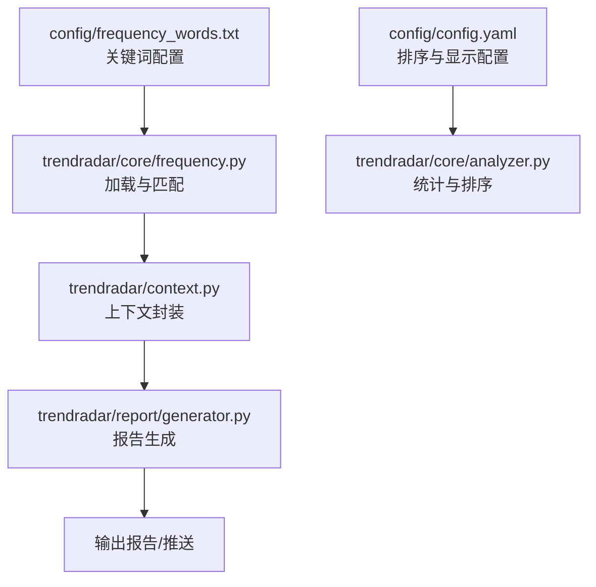
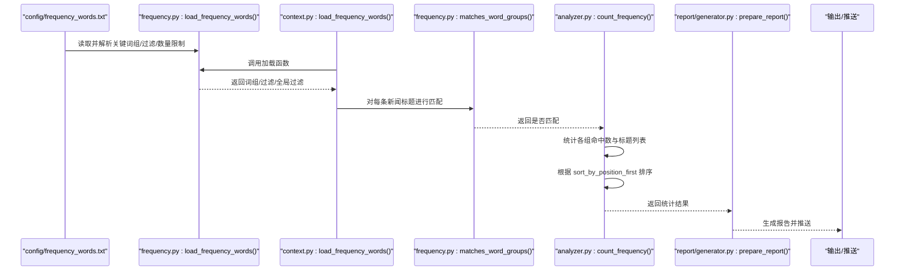
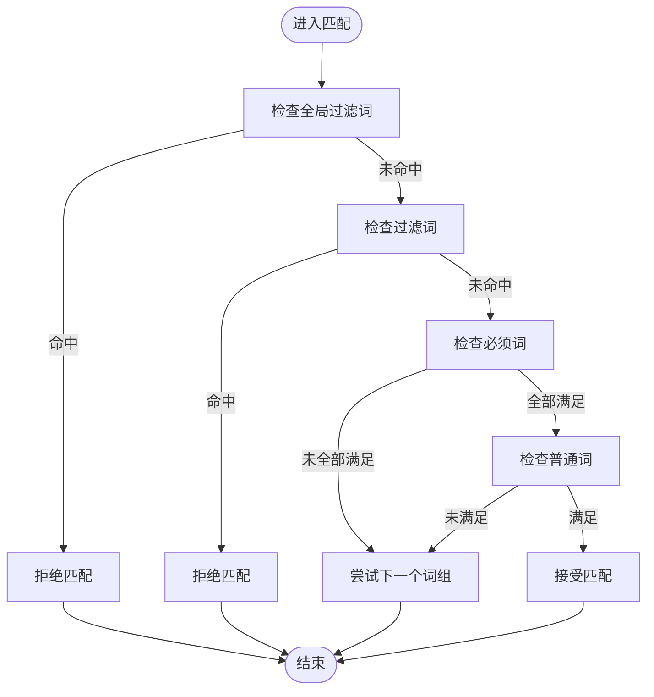
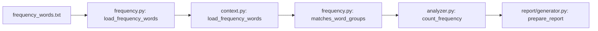

# 关键词配置

<cite>
**本文引用的文件**
- [config/frequency_words.txt](file://config/frequency_words.txt)
- [config/config.yaml](file://config/config.yaml)
- [trendradar/core/frequency.py](file://trendradar/core/frequency.py)
- [trendradar/core/analyzer.py](file://trendradar/core/analyzer.py)
- [trendradar/context.py](file://trendradar/context.py)
- [trendradar/report/generator.py](file://trendradar/report/generator.py)
- [README.md](file://README.md)
- [README-EN.md](file://README-EN.md)
</cite>

## 目录
1. [简介](#简介)
2. [项目结构](#项目结构)
3. [核心组件](#核心组件)
4. [架构总览](#架构总览)
5. [详细组件分析](#详细组件分析)
6. [依赖关系分析](#依赖关系分析)
7. [性能考量](#性能考量)
8. [故障排查指南](#故障排查指南)
9. [结论](#结论)
10. [附录](#附录)

## 简介
本篇文档围绕“关键词配置”展开，重点讲解 config/frequency_words.txt 的语法与高级用法，说明关键词分组通过空行分隔以提升可读性；解释特殊符号语法：+ 表示必须包含词、! 表示过滤词、@ 表示数量限制；结合 config/config.yaml 中的 sort_by_position_first 参数，阐明配置文件中关键词的顺序如何影响最终排序；提供复杂组合示例（如 +AI !gai@5）；强调该文件是内容筛选的核心，直接影响推送精度，并建议定期维护以适应热点变化。

## 项目结构
- 关键词配置文件位于 config/frequency_words.txt
- 推送与排序策略由 config/config.yaml 提供
- 关键词解析与匹配逻辑由 trendradar/core/frequency.py 实现
- 统计与排序展示由 trendradar/core/analyzer.py 实现
- 报告生成阶段调用频率词加载与匹配函数，由 trendradar/report/generator.py 协助完成
- README 文档提供了详细的语法说明与示例

图表来源
- [config/frequency_words.txt](file://config/frequency_words.txt#L1-L114)
- [config/config.yaml](file://config/config.yaml#L74-L81)
- [trendradar/core/frequency.py](file://trendradar/core/frequency.py#L18-L130)
- [trendradar/core/analyzer.py](file://trendradar/core/analyzer.py#L410-L473)
- [trendradar/context.py](file://trendradar/context.py#L186-L202)
- [trendradar/report/generator.py](file://trendradar/report/generator.py#L42-L61)

章节来源
- [config/frequency_words.txt](file://config/frequency_words.txt#L1-L114)
- [config/config.yaml](file://config/config.yaml#L74-L81)
- [README.md](file://README.md#L1705-L1760)

## 核心组件
- 频率词加载与解析：负责从 config/frequency_words.txt 读取并解析关键词组、必须词、过滤词、数量限制、全局过滤区域等。
- 匹配引擎：对单条新闻标题进行匹配，遵循全局过滤优先、过滤词优先、必须词与普通词共同满足的规则。
- 统计与排序：根据 sort_by_position_first 决定“配置位置优先”还是“热点条数优先”的排序策略，并应用每组的最大显示数量限制。

章节来源
- [trendradar/core/frequency.py](file://trendradar/core/frequency.py#L18-L130)
- [trendradar/core/frequency.py](file://trendradar/core/frequency.py#L132-L195)
- [trendradar/core/analyzer.py](file://trendradar/core/analyzer.py#L410-L473)
- [config/config.yaml](file://config/config.yaml#L74-L81)

## 架构总览
下图展示了从关键词配置到最终推送的端到端流程，包括加载、匹配、统计、排序与报告生成的关键节点。

图表来源
- [config/frequency_words.txt](file://config/frequency_words.txt#L1-L114)
- [trendradar/core/frequency.py](file://trendradar/core/frequency.py#L18-L130)
- [trendradar/context.py](file://trendradar/context.py#L186-L202)
- [trendradar/core/frequency.py](file://trendradar/core/frequency.py#L132-L195)
- [trendradar/core/analyzer.py](file://trendradar/core/analyzer.py#L410-L473)
- [trendradar/report/generator.py](file://trendradar/report/generator.py#L42-L61)

## 详细组件分析

### 1) 频率词文件语法与高级用法
- 分组方式：通过空行分隔不同的关键词组，便于独立统计与展示，提升可读性与维护性。
- 特殊符号语法：
  - +词：必须包含词，所有必须词均需出现在标题中。
  - !词：过滤词，若标题包含任一过滤词则直接排除。
  - @数字：该词组最多显示的条数，优先级高于全局配置。
  - [GLOBAL_FILTER]：全局过滤区域，用于定义全局排除词（该区域不支持特殊语法前缀）。
- 词组构成：每个词组由若干普通词组成，若存在普通词则以普通词集合作为组键；若仅有必须词，则以必须词集合作为组键。
- 全局过滤：优先级最高，一旦命中全局过滤词，整条新闻被排除。

章节来源
- [trendradar/core/frequency.py](file://trendradar/core/frequency.py#L24-L34)
- [trendradar/core/frequency.py](file://trendradar/core/frequency.py#L56-L67)
- [trendradar/core/frequency.py](file://trendradar/core/frequency.py#L78-L88)
- [trendradar/core/frequency.py](file://trendradar/core/frequency.py#L92-L113)
- [trendradar/core/frequency.py](file://trendradar/core/frequency.py#L132-L195)
- [README.md](file://README.md#L1705-L1760)
- [README-EN.md](file://README-EN.md#L1654-L1700)

### 2) 匹配流程与优先级
- 全局过滤优先：若标题包含任一全局过滤词，直接返回不匹配。
- 过滤词优先：若标题包含任一普通过滤词，直接返回不匹配。
- 必须词与普通词：只有当所有必须词均出现，且至少出现一个普通词时，才认为匹配成功。
- 若未配置任何词组，系统将默认匹配所有标题（可用于“不过滤，仅限数量限制”的场景）。

图表来源
- [trendradar/core/frequency.py](file://trendradar/core/frequency.py#L150-L195)

章节来源
- [trendradar/core/frequency.py](file://trendradar/core/frequency.py#L132-L195)

### 3) 排序优先级与配置顺序的影响
- 配置项：config/config.yaml 中的 report.sort_by_position_first 控制排序优先级。
  - false（默认）：先按热点条数降序，再按配置位置升序。
  - true：先按配置位置升序，再按热点条数降序。
- 词组位置：词组在频率词文件中的顺序即为“配置位置”，位置越靠前，越容易在 true 模式下优先展示。
- 数量限制：每组的 @数字 优先级高于全局 max_news_per_keyword；若未设置，则使用全局配置。

章节来源
- [config/config.yaml](file://config/config.yaml#L74-L81)
- [trendradar/core/analyzer.py](file://trendradar/core/analyzer.py#L410-L473)
- [README-EN.md](file://README-EN.md#L1878-L1941)

### 4) 复杂组合示例与最佳实践
- 示例：+AI !gai@5
  - 必须包含“AI”
  - 排除包含“gai”的新闻
  - 该组最多显示 5 条
- 建议：
  - 从宽泛关键词起步，逐步添加 + 必须词与 ! 过滤词，减少噪声。
  - 将高优先级主题置于文件靠前位置，配合 sort_by_position_first:true 实现“个人优先”展示。
  - 合理使用 @ 数量限制，避免推送内容过多导致阅读负担。

章节来源
- [README-EN.md](file://README-EN.md#L1775-L1877)
- [README-EN.md](file://README-EN.md#L1917-L1939)
- [README.md](file://README.md#L1705-L1760)

### 5) 与报告生成的衔接
- 报告生成阶段会调用频率词加载与匹配函数，对新增新闻进行二次过滤，确保推送内容符合关键词配置。
- 若未提供匹配函数或加载函数，将回退到全量展示（受全局数量限制约束）。

章节来源
- [trendradar/report/generator.py](file://trendradar/report/generator.py#L42-L61)

## 依赖关系分析
- 频率词文件依赖解析模块：解析出词组、过滤词、全局过滤词与数量限制。
- 匹配模块依赖解析结果：对标题进行逐条匹配。
- 统计模块依赖匹配结果与排序配置：计算命中数、排序并裁剪数量。
- 报告模块依赖统计结果：生成最终推送内容。

图表来源
- [config/frequency_words.txt](file://config/frequency_words.txt#L1-L114)
- [trendradar/core/frequency.py](file://trendradar/core/frequency.py#L18-L130)
- [trendradar/context.py](file://trendradar/context.py#L186-L202)
- [trendradar/core/frequency.py](file://trendradar/core/frequency.py#L132-L195)
- [trendradar/core/analyzer.py](file://trendradar/core/analyzer.py#L410-L473)
- [trendradar/report/generator.py](file://trendradar/report/generator.py#L42-L61)

章节来源
- [trendradar/context.py](file://trendradar/context.py#L186-L202)
- [trendradar/core/analyzer.py](file://trendradar/core/analyzer.py#L410-L473)

## 性能考量
- 匹配复杂度：对每条新闻标题进行全局过滤、过滤词与词组匹配，整体为线性扫描；建议合理拆分词组，避免单组过大导致匹配开销上升。
- 数量限制：优先应用组内 @ 限制，其次使用全局 max_news_per_keyword，有助于控制推送体量。
- 排序成本：排序主要基于“配置位置 + 热点条数”，词组数量有限时开销可控。

[本节为通用性能讨论，不涉及具体文件分析]

## 故障排查指南
- 频率词文件不存在：加载函数会抛出文件不存在异常，检查 FREQUENCY_WORDS_PATH 环境变量或默认路径。
- 全局过滤误伤：确认 GLOBAL_FILTER 区域未混入特殊语法前缀，且过滤词粒度过大。
- 排序不符合预期：检查 config/config.yaml 中 sort_by_position_first 的值，并确认词组在文件中的顺序。
- 数量限制未生效：确认组内 @ 数字格式正确且大于 0；若未设置，将使用全局 max_news_per_keyword。

章节来源
- [trendradar/core/frequency.py](file://trendradar/core/frequency.py#L44-L55)
- [trendradar/core/frequency.py](file://trendradar/core/frequency.py#L96-L106)
- [config/config.yaml](file://config/config.yaml#L74-L81)

## 结论
config/frequency_words.txt 是内容筛选的核心，通过空行分组、+ 必须词、! 过滤词、@ 数量限制与 [GLOBAL_FILTER] 全局过滤，能够精确控制推送内容的质量与数量。结合 config/config.yaml 的 sort_by_position_first，可以灵活地在“热点优先”与“个人优先”之间切换。建议定期维护关键词库，以适配热点变化，持续优化推送精度与体验。

[本节为总结性内容，不涉及具体文件分析]

## 附录
- 语法速查
  - 普通词：直接命中
  - +词：必须包含
  - !词：排除
  - @数字：该组最多显示条数
  - [GLOBAL_FILTER]：全局排除区域
- 推荐维护策略
  - 分组清晰、命名明确
  - 逐步引入 + 与 !，降低噪声
  - 定期评估热点，调整顺序与数量限制
  - 在 sort_by_position_first:true 场景下，将高优先级主题置前

章节来源
- [README.md](file://README.md#L1705-L1760)
- [README-EN.md](file://README-EN.md#L1654-L1700)
- [README-EN.md](file://README-EN.md#L1878-L1941)