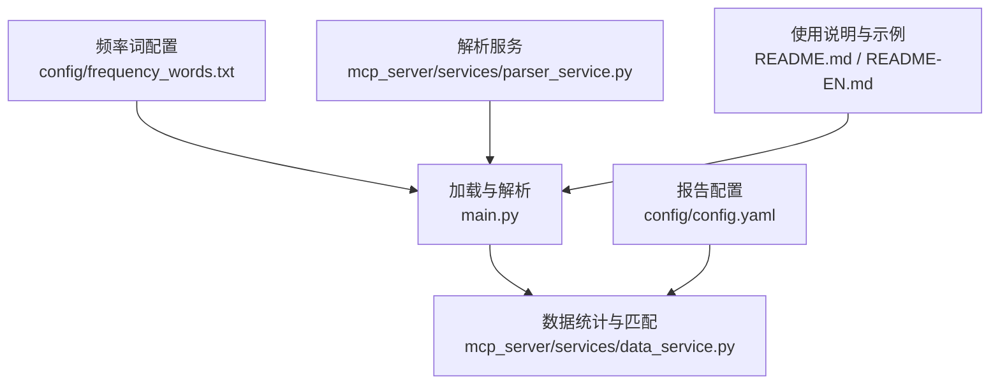
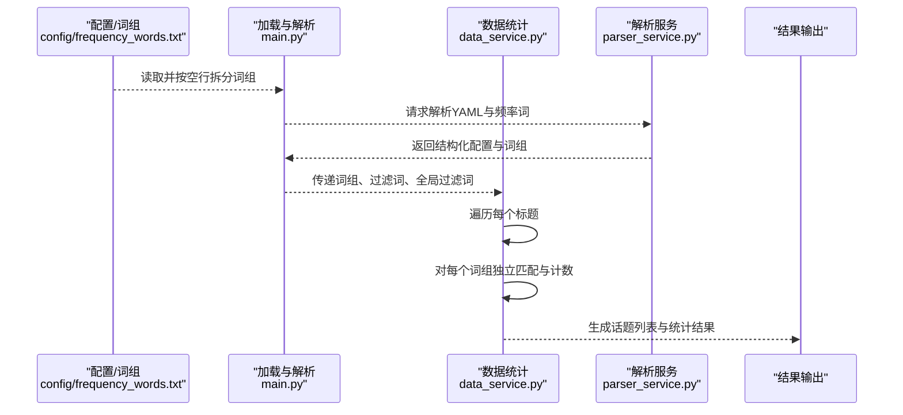
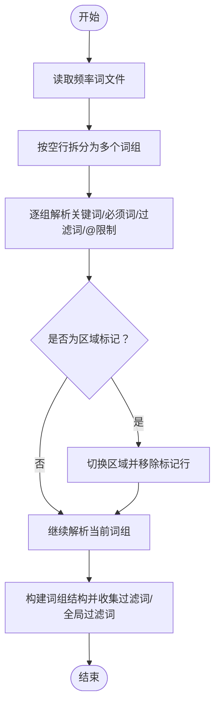
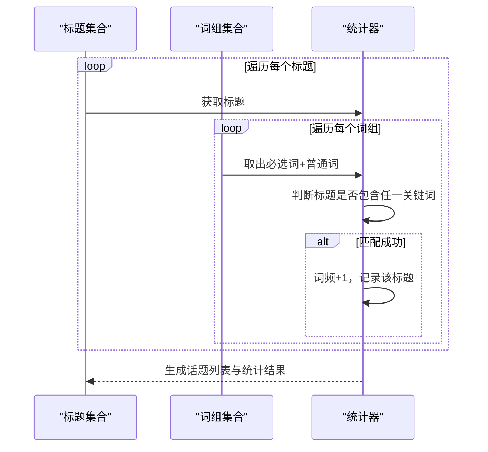
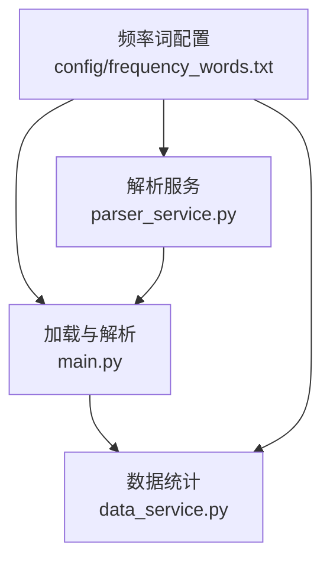

# 关键词分组与配置实践

<cite>
**本文引用的文件**
- [config/frequency_words.txt](file://config/frequency_words.txt)
- [main.py](file://main.py)
- [mcp_server/services/data_service.py](file://mcp_server/services/data_service.py)
- [mcp_server/services/parser_service.py](file://mcp_server/services/parser_service.py)
- [README.md](file://README.md)
- [README-EN.md](file://README-EN.md)
- [config/config.yaml](file://config/config.yaml)
</cite>

## 目录
1. [引言](#引言)
2. [项目结构](#项目结构)
3. [核心组件](#核心组件)
4. [架构总览](#架构总览)
5. [详细组件分析](#详细组件分析)
6. [依赖关系分析](#依赖关系分析)
7. [性能考量](#性能考量)
8. [故障排查指南](#故障排查指南)
9. [结论](#结论)
10. [附录](#附录)

## 引言
本文件围绕“关键词分组”的语义作用与最佳实践展开，重点说明通过空行分隔不同关键词组，可实现每个组的独立统计与推送，从而按主题（如科技、娱乐、体育）组织监控内容。结合频率词配置文件的实际内容（例如“胖东来”与“DeepSeek”之间的空行），解释系统如何遍历每个组进行独立匹配与计数；并引用数据服务模块中362-372行的代码逻辑，说明系统在统计阶段对每个组的处理流程。最后给出高效配置建议：合理分类、避免关键词跨组重复、控制单组数量以提升性能，并警示特殊字符未转义可能导致解析失败的问题。

## 项目结构
与关键词分组密切相关的文件与职责如下：
- 配置文件：config/frequency_words.txt 定义关键词组、过滤词、全局过滤词与分组边界
- 主流程入口：main.py 负责加载与解析频率词配置，拆分为多个词组并进行统计
- 数据服务：mcp_server/services/data_service.py 负责对每个标题进行逐组匹配与计数
- 解析服务：mcp_server/services/parser_service.py 提供YAML与频率词文件解析能力
- 文档说明：README.md 与 README-EN.md 提供分组与语法说明、示例与最佳实践

图表来源
- [config/frequency_words.txt](file://config/frequency_words.txt#L1-L114)
- [main.py](file://main.py#L793-L992)
- [mcp_server/services/data_service.py](file://mcp_server/services/data_service.py#L360-L401)
- [mcp_server/services/parser_service.py](file://mcp_server/services/parser_service.py#L290-L356)
- [config/config.yaml](file://config/config.yaml#L1-L140)
- [README.md](file://README.md#L1669-L1721)

章节来源
- [config/frequency_words.txt](file://config/frequency_words.txt#L1-L114)
- [main.py](file://main.py#L793-L992)
- [mcp_server/services/data_service.py](file://mcp_server/services/data_service.py#L360-L401)
- [mcp_server/services/parser_service.py](file://mcp_server/services/parser_service.py#L290-L356)
- [README.md](file://README.md#L1669-L1721)

## 核心组件
- 频率词配置文件（config/frequency_words.txt）
  - 通过空行分隔不同关键词组，每组独立统计与推送
  - 支持普通关键词、必须词（+前缀）、过滤词（!前缀）、数量限制（@数字）、全局过滤区（[GLOBAL_FILTER]）
- 主流程加载与解析（main.py）
  - 读取频率词文件，按空行切分为多个词组
  - 解析每组内的关键词、必须词、过滤词与数量限制，构建结构化词组列表
- 数据统计与匹配（mcp_server/services/data_service.py）
  - 对每个标题，遍历所有词组，分别进行匹配与计数
  - 维护词频、关键词到新闻的映射，并生成话题列表
- 解析服务（mcp_server/services/parser_service.py）
  - 提供YAML配置与频率词文件的解析接口，支撑配置读取与词组构建
- 报告配置（config/config.yaml）
  - 影响统计模式、排序策略、推送阈值等，间接影响分组结果的呈现

章节来源
- [config/frequency_words.txt](file://config/frequency_words.txt#L1-L114)
- [main.py](file://main.py#L793-L992)
- [mcp_server/services/data_service.py](file://mcp_server/services/data_service.py#L360-L401)
- [mcp_server/services/parser_service.py](file://mcp_server/services/parser_service.py#L290-L356)
- [config/config.yaml](file://config/config.yaml#L1-L140)

## 架构总览
下图展示了从频率词配置到统计结果的关键调用链路与数据流。

图表来源
- [config/frequency_words.txt](file://config/frequency_words.txt#L1-L114)
- [main.py](file://main.py#L793-L992)
- [mcp_server/services/data_service.py](file://mcp_server/services/data_service.py#L360-L401)
- [mcp_server/services/parser_service.py](file://mcp_server/services/parser_service.py#L290-L356)

## 详细组件分析

### 频率词配置与分组边界
- 分组边界：通过空行分隔不同关键词组，系统据此将配置拆分为多个独立词组
- 语法要点：
  - 普通关键词：直接匹配
  - 必须词（+前缀）：必须同时包含
  - 过滤词（!前缀）：包含则排除
  - 数量限制（@数字）：限制该组最多显示的新闻条数
  - 全局过滤区（[GLOBAL_FILTER]）：在任何情况下均生效的过滤词集合
- 示例依据：频率词文件中“胖东来”与“DeepSeek”之间存在空行，体现两个独立词组的边界

章节来源
- [config/frequency_words.txt](file://config/frequency_words.txt#L1-L114)
- [README.md](file://README.md#L1669-L1721)
- [README-EN.md](file://README-EN.md#L1632-L1661)

### 主流程加载与解析（main.py）
- 加载流程
  - 读取频率词文件，按空行拆分为多个词组
  - 解析每组内的关键词、必须词、过滤词与数量限制
  - 支持区域标记：[GLOBAL_FILTER] 与 [WORD_GROUPS]，并向下兼容无标记的旧版配置
- 输出结构
  - 返回词组列表、词组内过滤词、全局过滤词，供后续统计与匹配使用

图表来源
- [main.py](file://main.py#L793-L992)

章节来源
- [main.py](file://main.py#L793-L992)

### 数据统计与匹配（mcp_server/services/data_service.py）
- 匹配逻辑
  - 对每个标题，遍历所有词组
  - 将“必须词”与“普通词”合并，若标题包含任一关键词，则计数并记录该标题
- 关键代码片段路径
  - 遍历词组与匹配：[mcp_server/services/data_service.py](file://mcp_server/services/data_service.py#L360-L401)
  - 统计与话题构建：[mcp_server/services/data_service.py](file://mcp_server/services/data_service.py#L360-L401)

图表来源
- [mcp_server/services/data_service.py](file://mcp_server/services/data_service.py#L360-L401)

章节来源
- [mcp_server/services/data_service.py](file://mcp_server/services/data_service.py#L360-L401)

### 解析服务（mcp_server/services/parser_service.py）
- YAML配置解析：提供配置文件读取与校验
- 频率词解析：按“|”分隔组内子集，支持“+”“!”“@”等语法，构建词组结构
- 与主流程协作：为加载与解析阶段提供统一的解析能力

章节来源
- [mcp_server/services/parser_service.py](file://mcp_server/services/parser_service.py#L290-L356)

### 报告配置（config/config.yaml）
- 影响统计模式（如当日累计、当前榜单、增量监控）
- 影响排序策略、阈值与推送窗口等，间接影响分组结果的呈现与推送节奏

章节来源
- [config/config.yaml](file://config/config.yaml#L1-L140)

## 依赖关系分析
- 配置文件依赖：频率词配置文件决定词组数量与边界，直接影响统计阶段的遍历次数
- 主流程依赖：主流程负责将配置转换为可执行的词组结构
- 数据服务依赖：数据服务对每个标题执行多词组匹配，承担主要性能压力
- 解析服务依赖：解析服务为配置与词组解析提供基础能力

图表来源
- [config/frequency_words.txt](file://config/frequency_words.txt#L1-L114)
- [main.py](file://main.py#L793-L992)
- [mcp_server/services/data_service.py](file://mcp_server/services/data_service.py#L360-L401)
- [mcp_server/services/parser_service.py](file://mcp_server/services/parser_service.py#L290-L356)

章节来源
- [config/frequency_words.txt](file://config/frequency_words.txt#L1-L114)
- [main.py](file://main.py#L793-L992)
- [mcp_server/services/data_service.py](file://mcp_server/services/data_service.py#L360-L401)
- [mcp_server/services/parser_service.py](file://mcp_server/services/parser_service.py#L290-L356)

## 性能考量
- 单组数量控制
  - 建议每组关键词数量适中，避免过多关键词导致匹配开销增大
  - 可通过拆分词组、减少冗余关键词来降低匹配成本
- 必须词与过滤词的使用
  - 必须词有助于缩小候选范围，过滤词可减少噪声，两者均可提升匹配效率
- 全局过滤词的使用
  - 全局过滤词优先级最高，建议控制在5-15个以内，避免过度过滤导致遗漏有价值内容
- 统计模式与阈值
  - 报告模式与阈值设置会影响统计范围与推送频率，合理配置可减少不必要的计算

章节来源
- [README.md](file://README.md#L1669-L1721)
- [README-EN.md](file://README-EN.md#L1632-L1661)
- [config/config.yaml](file://config/config.yaml#L1-L140)

## 故障排查指南
- 特殊字符未转义
  - 若关键词中包含特殊字符（如“|”、“+”、“!”、“@”等），需确保未被误用为语法符号
  - 建议对包含这些字符的关键词进行转义或使用引号包裹（视具体解析规则而定）
- 分组边界问题
  - 确保使用空行明确分隔不同词组，避免相邻关键词被错误合并为同一组
- 语法错误
  - “@数字”仅接受正整数；“+”“!”“@”等前缀需正确使用，否则可能导致解析异常
- 全局过滤区
  - 全局过滤区不支持“!”“+”“@”等特殊语法，仅接受纯文本过滤词

章节来源
- [main.py](file://main.py#L793-L992)
- [README.md](file://README.md#L1669-L1721)
- [README-EN.md](file://README-EN.md#L1632-L1661)

## 结论
通过空行分隔关键词组，系统实现了每个组的独立统计与推送，便于按主题组织监控内容。主流程负责将配置解析为结构化的词组，数据服务对每个标题逐组匹配与计数，最终生成话题列表。合理分类、避免跨组重复、控制单组数量、谨慎使用全局过滤词，是提升性能与准确性的关键。同时，注意特殊字符的转义与语法规范，可有效避免解析失败。

## 附录
- 关键代码片段路径
  - 遍历词组与匹配逻辑：[mcp_server/services/data_service.py](file://mcp_server/services/data_service.py#L360-L401)
  - 频率词加载与解析（按空行拆分、语法解析）：[main.py](file://main.py#L793-L992)
  - 频率词解析服务（YAML与频率词）：[mcp_server/services/parser_service.py](file://mcp_server/services/parser_service.py#L290-L356)
- 示例配置参考
  - 分组与语法说明：[README.md](file://README.md#L1669-L1721)
  - 英文版分组与语法说明：[README-EN.md](file://README-EN.md#L1632-L1661)