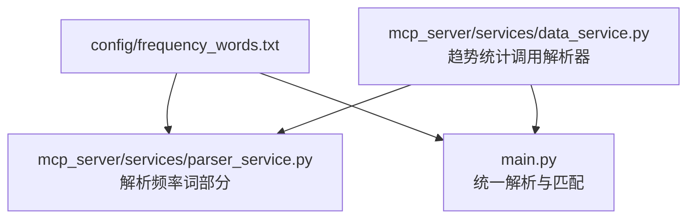
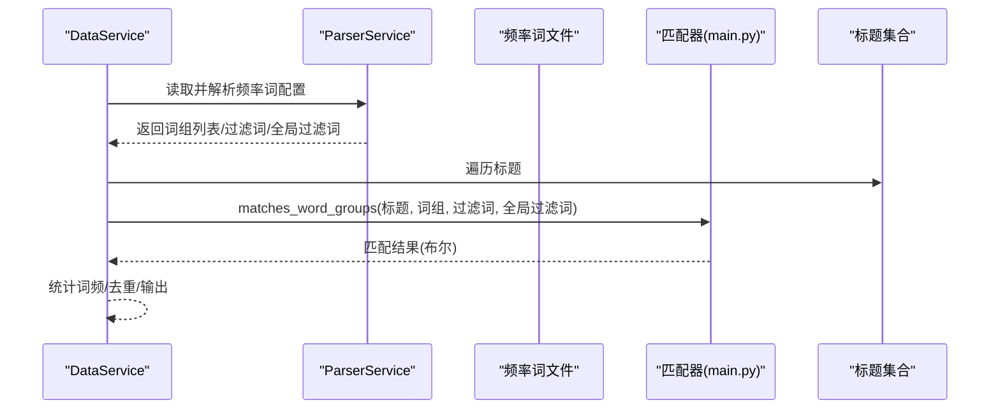
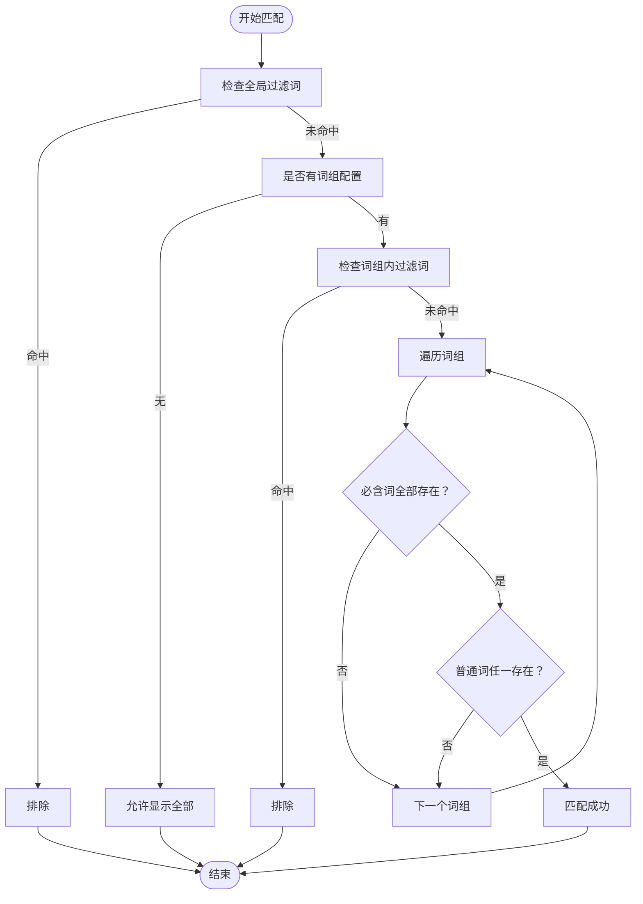
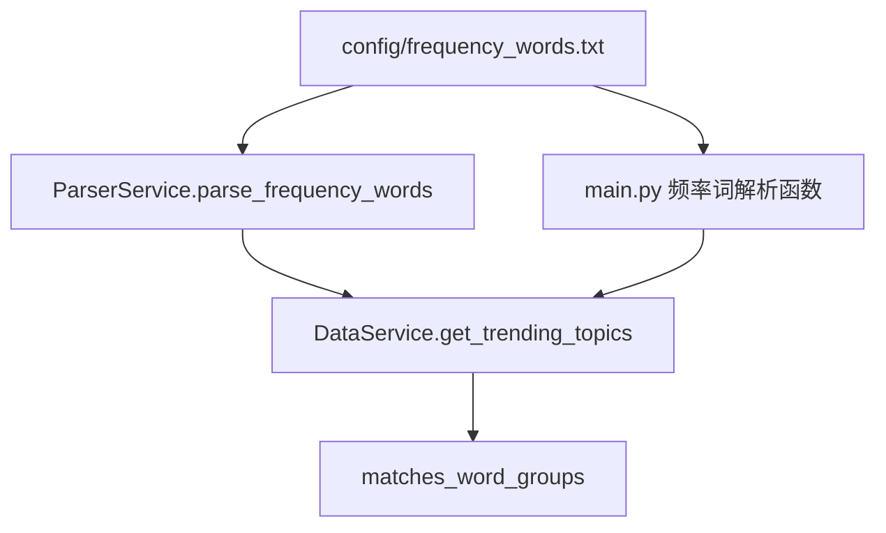

# 关键词配置指南

<cite>
**本文引用的文件**
- [config/frequency_words.txt](file://config/frequency_words.txt)
- [main.py](file://main.py)
- [mcp_server/services/parser_service.py](file://mcp_server/services/parser_service.py)
- [mcp_server/services/data_service.py](file://mcp_server/services/data_service.py)
- [README.md](file://README.md)
- [README-EN.md](file://README-EN.md)
</cite>

## 目录
1. [简介](#简介)
2. [项目结构](#项目结构)
3. [核心组件](#核心组件)
4. [架构总览](#架构总览)
5. [详细组件分析](#详细组件分析)
6. [依赖分析](#依赖分析)
7. [性能考虑](#性能考虑)
8. [故障排查指南](#故障排查指南)
9. [结论](#结论)
10. [附录](#附录)

## 简介
本指南围绕 config/frequency_words.txt 的语法规则与匹配逻辑进行深入解析，覆盖普通关键词、必含词（+前缀）、排除词（!前缀）、数量限制（@后缀）、全局过滤规则 [GLOBAL_FILTER] 的使用方法与优先级关系；结合实际案例演示“AI!gai”如何实现包含 AI 但排除 gai 的复合过滤；说明关键词分组与空行分隔的语义作用；梳理该文件在 data_service.py 中的加载与匹配流程；并提供高效关键词组织建议与常见配置陷阱及解决方案。

## 项目结构
- 关键词配置文件位于 config/frequency_words.txt
- 关键词解析与匹配逻辑分布在 main.py（统一解析与匹配）与 mcp_server/services/parser_service.py（部分解析能力）
- 实时趋势统计与词频统计由 mcp_server/services/data_service.py 调用解析器加载关键词并执行匹配

图表来源
- [config/frequency_words.txt](file://config/frequency_words.txt#L1-L114)
- [mcp_server/services/parser_service.py](file://mcp_server/services/parser_service.py#L289-L355)
- [mcp_server/services/data_service.py](file://mcp_server/services/data_service.py#L321-L401)
- [main.py](file://main.py#L826-L887)

章节来源
- [config/frequency_words.txt](file://config/frequency_words.txt#L1-L114)
- [mcp_server/services/parser_service.py](file://mcp_server/services/parser_service.py#L289-L355)
- [mcp_server/services/data_service.py](file://mcp_server/services/data_service.py#L321-L401)
- [main.py](file://main.py#L826-L887)

## 核心组件
- 频率词配置文件：定义关键词组、过滤词、全局过滤区与分组边界
- 解析器（ParserService）：负责读取与解析配置文件（部分解析能力）
- 数据服务（DataService）：在趋势统计中加载关键词并执行匹配
- 统一匹配器（main.py）：实现全局过滤、过滤词、必含词与普通词的匹配逻辑，以及分组与空行分隔的语义

章节来源
- [config/frequency_words.txt](file://config/frequency_words.txt#L1-L114)
- [mcp_server/services/parser_service.py](file://mcp_server/services/parser_service.py#L289-L355)
- [mcp_server/services/data_service.py](file://mcp_server/services/data_service.py#L321-L401)
- [main.py](file://main.py#L1173-L1222)

## 架构总览
下面的序列图展示了关键词配置在趋势统计中的加载与匹配流程：

图表来源
- [mcp_server/services/data_service.py](file://mcp_server/services/data_service.py#L321-L401)
- [mcp_server/services/parser_service.py](file://mcp_server/services/parser_service.py#L289-L355)
- [main.py](file://main.py#L1173-L1222)

## 详细组件分析

### 1. 语法规则与优先级
- 普通关键词：包含任意一个即命中
- 必含词（+前缀）：必须同时包含普通词与必含词
- 排除词（!前缀）：只要包含即排除
- 数量限制（@后缀）：限制该词组最多显示的新闻条数
- 全局过滤（[GLOBAL_FILTER] 区域）：任何情况下都优先过滤

优先级关系（从高到低）：
- 全局过滤 > 词组内过滤（!）> 词组匹配（+ 与普通词）

章节来源
- [README.md](file://README.md#L1561-L1666)
- [README-EN.md](file://README-EN.md#L1531-L1618)
- [main.py](file://main.py#L1173-L1222)

### 2. 分组与空行分隔的语义
- 用空行分隔不同的词组，每个词组独立统计
- 每个词组可包含普通词、必含词、排除词与数量限制
- 全局过滤区以 [GLOBAL_FILTER] 开头，包含的词在任何情况下都会被过滤

章节来源
- [README.md](file://README.md#L1649-L1692)
- [README-EN.md](file://README-EN.md#L1619-L1661)
- [config/frequency_words.txt](file://config/frequency_words.txt#L1-L114)

### 3. “AI!gai”的复合过滤案例
- 若在某词组中配置 AI 与 !gai，则标题需包含 AI，且不能包含 gai，才视为匹配
- 若存在全局过滤词 gai，则无论词组如何配置，均会被直接排除

章节来源
- [main.py](file://main.py#L1173-L1222)
- [README.md](file://README.md#L1694-L1715)
- [README-EN.md](file://README-EN.md#L1653-L1661)

### 4. 配置文件加载与解析流程
- main.py 中的频率词解析函数会：
  - 按空行分割为多个词组
  - 支持 [GLOBAL_FILTER] 与 [WORD_GROUPS] 区域标记
  - 解析 @ 数字、! 前缀、+ 前缀与普通词
  - 输出词组列表、全局过滤词列表与过滤词列表
- ParserService.parse_frequency_words 主要用于 | 分隔的词组解析（与本仓库当前使用的空行分隔策略不同），在趋势统计中 DataService 通过 ParserService 读取配置时，会使用 main.py 的解析结果

章节来源
- [main.py](file://main.py#L826-L887)
- [mcp_server/services/parser_service.py](file://mcp_server/services/parser_service.py#L289-L355)
- [mcp_server/services/data_service.py](file://mcp_server/services/data_service.py#L321-L340)

### 5. 匹配流程与算法
- 全局过滤优先：若标题包含任一全局过滤词，直接排除
- 若未配置词组，返回 True（显示全部新闻）
- 词组内过滤词检查：若包含任一过滤词，直接排除
- 词组匹配：必须满足“必含词全部存在”且“普通词任一存在”，才认为匹配成功

图表来源
- [main.py](file://main.py#L1173-L1222)

章节来源
- [main.py](file://main.py#L1173-L1222)

### 6. 在 data_service.py 中的使用
- DataService.get_trending_topics 会调用解析器加载关键词配置
- 遍历标题时，对每个标题执行 matches_word_groups 判定
- 统计词频并输出 TOP N 话题

章节来源
- [mcp_server/services/data_service.py](file://mcp_server/services/data_service.py#L321-L401)

### 7. 关键词组织建议
- 从宽到严：先用宽泛关键词测试，再逐步增加必含词，最后补充过滤词
- 避免过度复杂：一个词组包含过多词汇会导致误匹配增多，建议拆分为多个精确词组
- 分组清晰：用空行明确划分不同主题，便于独立统计与展示
- 全局过滤慎用：建议控制在 5-15 个以内，避免过度过滤

章节来源
- [README.md](file://README.md#L1723-L1781)
- [README-EN.md](file://README-EN.md#L1698-L1755)

## 依赖分析
- 频率词配置文件与解析器、匹配器之间存在清晰的职责分离
- DataService 依赖解析器提供的配置数据，再交由匹配器进行判定
- 两种解析路径并存：ParserService.parse_frequency_words 与 main.py 的解析函数，前者面向 | 分隔，后者面向空行分隔

图表来源
- [mcp_server/services/parser_service.py](file://mcp_server/services/parser_service.py#L289-L355)
- [mcp_server/services/data_service.py](file://mcp_server/services/data_service.py#L321-L401)
- [main.py](file://main.py#L826-L887)

章节来源
- [mcp_server/services/parser_service.py](file://mcp_server/services/parser_service.py#L289-L355)
- [mcp_server/services/data_service.py](file://mcp_server/services/data_service.py#L321-L401)
- [main.py](file://main.py#L826-L887)

## 性能考虑
- 频繁读取与解析：建议通过缓存减少 IO 压力（ParserService 已内置缓存机制）
- 匹配复杂度：匹配器采用线性扫描，词组数量较多时可考虑预处理（如构建索引或正则缓存），但当前实现简洁易维护
- 全局过滤优先：尽早排除明显噪声，减少后续匹配成本

[本节为通用建议，无需具体文件引用]

## 故障排查指南
- 配置未生效
  - 确认频率词文件路径与编码正确（UTF-8）
  - 确认词组间使用空行分隔
  - 确认未误用不支持的语法（例如 [GLOBAL_FILTER] 区域不支持 +、!、@）
- 匹配结果异常
  - 检查是否存在全局过滤词命中
  - 检查是否误用了“必含词”导致范围过窄
  - 检查“过滤词”是否过于宽泛
- 数量限制无效
  - 确认 @ 后面为正整数
  - 确认该词组确有匹配项
- 优先级误解
  - 全局过滤优先级最高，其次为词组内过滤，最后为词组匹配
  - 若希望仅在特定词组内过滤，请使用词组内过滤词（!），而非全局过滤

章节来源
- [README.md](file://README.md#L1616-L1666)
- [README-EN.md](file://README-EN.md#L1612-L1636)
- [main.py](file://main.py#L1173-L1222)

## 结论
- config/frequency_words.txt 提供了灵活的关键词配置能力，配合全局过滤与分组机制，能够实现从宽泛到严格的多层次筛选
- 匹配流程遵循“全局过滤优先”的原则，确保高质量内容优先呈现
- 建议采用“从宽到严”的配置策略，并合理拆分词组，避免过度复杂与误过滤

[本节为总结性内容，无需具体文件引用]

## 附录

### A. 语法速查表
- 普通词：包含任意一个即命中
- 必含词（+）：必须同时包含普通词与必含词
- 过滤词（!）：包含即排除
- 数量限制（@）：限制该词组最多显示条数
- 全局过滤（[GLOBAL_FILTER]）：任何情况下都优先过滤

章节来源
- [README.md](file://README.md#L1561-L1616)
- [README-EN.md](file://README-EN.md#L1531-L1586)

### B. 实际案例参考
- “AI!gai”：标题需包含 AI，且不能包含 gai
- 全局过滤：在 [GLOBAL_FILTER] 中配置广告、推广、营销等词，任何情况下均排除

章节来源
- [README.md](file://README.md#L1694-L1715)
- [README-EN.md](file://README-EN.md#L1653-L1661)