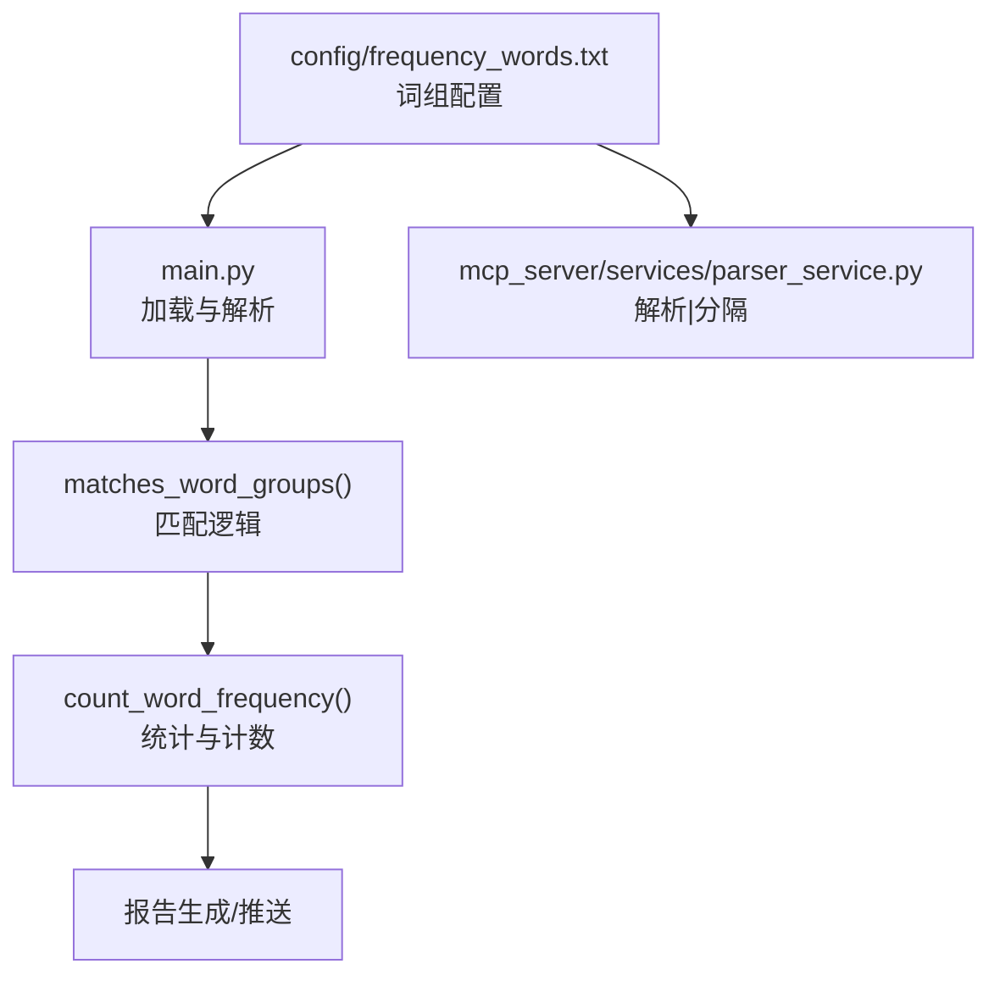
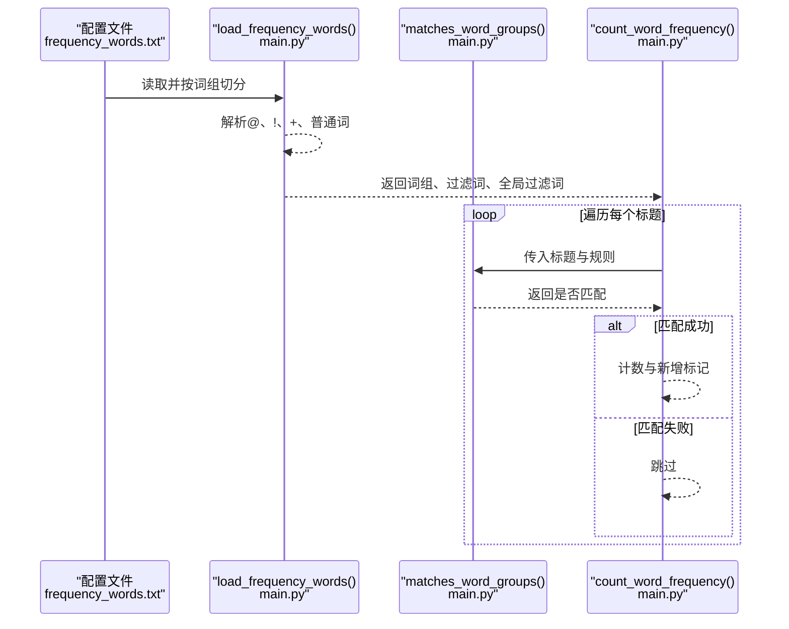
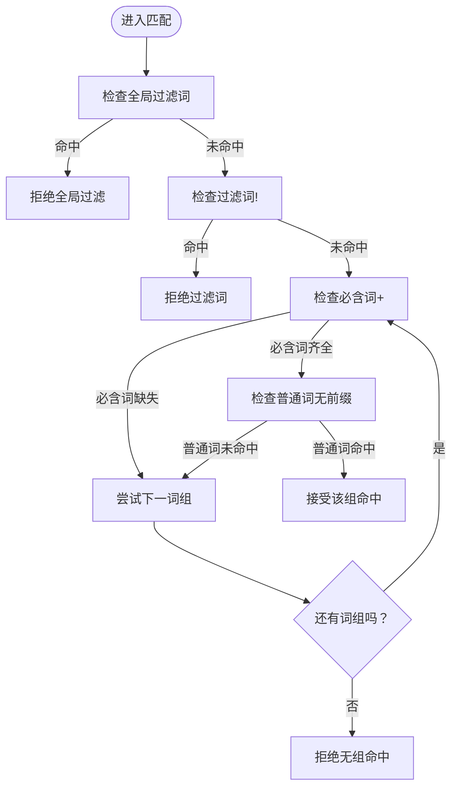
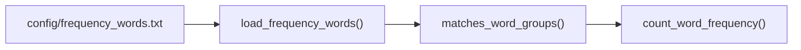

# 基础语法配置

<cite>
**本文引用的文件**
- [config/frequency_words.txt](file://config/frequency_words.txt)
- [main.py](file://main.py)
- [mcp_server/services/parser_service.py](file://mcp_server/services/parser_service.py)
- [README-EN.md](file://README-EN.md)
- [README.md](file://README.md)
</cite>

## 目录
1. [简介](#简介)
2. [项目结构](#项目结构)
3. [核心组件](#核心组件)
4. [架构总览](#架构总览)
5. [详细组件分析](#详细组件分析)
6. [依赖分析](#依赖分析)
7. [性能考虑](#性能考虑)
8. [故障排查指南](#故障排查指南)
9. [结论](#结论)
10. [附录](#附录)

## 简介
本章节聚焦于 config/frequency_words.txt 的基础语法，包括普通关键词、必含词（+前缀）、排除词（!前缀）和数量限制（@后缀）。我们将解释每种语法的匹配逻辑与优先级，并结合代码中的匹配流程说明这些规则如何在数据处理链路中生效。最后给出常见错误示例与修正建议，帮助用户正确配置与使用。

## 项目结构
- 频率词配置文件位于 config/frequency_words.txt，采用“词组”分段组织，支持区域标记与特殊语法。
- 主程序 main.py 负责加载配置、解析词组、执行匹配逻辑，并在统计与推送阶段应用过滤规则。
- MCP 服务 parser_service.py 提供另一种词组解析方式（使用“|”分隔符），用于特定场景下的词组构建。

图表来源
- [config/frequency_words.txt](file://config/frequency_words.txt#L1-L114)
- [main.py](file://main.py#L793-L992)
- [mcp_server/services/parser_service.py](file://mcp_server/services/parser_service.py#L308-L356)

章节来源
- [config/frequency_words.txt](file://config/frequency_words.txt#L1-L114)
- [main.py](file://main.py#L793-L992)
- [mcp_server/services/parser_service.py](file://mcp_server/services/parser_service.py#L308-L356)

## 核心组件
- 词组解析与加载
  - main.py 中的 load_frequency_words 负责读取配置文件，按“词组”切分，支持区域标记（如 [GLOBAL_FILTER]、[WORD_GROUPS]），并解析 @、!、+ 语法，生成词组结构。
  - mcp_server/services/parser_service.py 提供另一种解析方式，使用“|”分隔词组，内部再以“,”拆分普通词、必含词、过滤词，不支持 @ 数量限制。
- 匹配逻辑
  - matches_word_groups(title, word_groups, filter_words, global_filters) 实现全局过滤、过滤词、必含词与普通词的匹配判定，返回布尔值决定是否保留该标题。
- 统计与计数
  - count_word_frequency 在遍历标题时调用 matches_word_groups，统计各词组命中数量、新增数量等，并根据模式（daily/incremental/current）决定处理范围。

章节来源
- [main.py](file://main.py#L793-L992)
- [main.py](file://main.py#L1173-L1222)
- [main.py](file://main.py#L1287-L1372)
- [mcp_server/services/parser_service.py](file://mcp_server/services/parser_service.py#L308-L356)

## 架构总览
下图展示了从配置加载到标题匹配的关键流程：

图表来源
- [main.py](file://main.py#L793-L992)
- [main.py](file://main.py#L1173-L1222)
- [main.py](file://main.py#L1287-L1372)

## 详细组件分析

### 1. 语法定义与匹配逻辑
- 普通关键词（无前缀）
  - 作用：标题包含该词即满足条件。
  - 匹配关系：词组内的普通词之间为“或”关系；只要词组内任一普通词命中，即视为该组命中。
- 必含词（+前缀）
  - 作用：必须同时包含该词与词组内的普通词。
  - 匹配关系：必含词与普通词共同构成“且”关系；若必含词缺失，该组整体不命中。
- 排除词（!前缀）
  - 作用：一旦标题包含该词，整条新闻直接排除。
  - 匹配关系：优先级最高，先于全局过滤与普通/必含词判定。
- 数量限制（@后缀）
  - 作用：限制该词组最多推送/统计的新闻条数。
  - 优先级：@数字 > 全局配置 > 不限制。
- 全局过滤（[GLOBAL_FILTER] 区域）
  - 作用：任何情况下都会过滤包含该词的新闻。
  - 特性：该区域不支持 +、!、@ 语法，仅允许纯文本词。

章节来源
- [README.md](file://README.md#L1561-L1616)
- [README-EN.md](file://README-EN.md#L1531-L1586)
- [main.py](file://main.py#L793-L992)
- [main.py](file://main.py#L1173-L1222)

### 2. 词组解析与加载（main.py）
- 词组切分
  - 以空行分隔为多个词组，支持区域标记（如 [GLOBAL_FILTER]、[WORD_GROUPS]）。
- 语法解析
  - @：解析为正整数，作为该词组的最大显示数量。
  - !：提取为过滤词，加入全局过滤词集合。
  - +：提取为必含词，加入该词组的 required 列表。
  - 普通词：加入该词组的 normal 列表。
- 结果结构
  - 返回：(processed_groups, filter_words, global_filters)
  - processed_groups 每项包含 required、normal、group_key、max_count 字段。

章节来源
- [main.py](file://main.py#L793-L992)

### 3. 匹配流程（matches_word_groups）
- 优先级
  1) 全局过滤（GLOBAL_FILTER）：若标题包含任一全局过滤词，直接返回不匹配。
  2) 过滤词（!）：若标题包含任一过滤词，直接返回不匹配。
  3) 必含词（+）与普通词（无前缀）：只有当必含词全部存在，且普通词至少存在一个时，该组才命中。
  4) 若无词组配置，返回匹配（用于显示全部新闻）。

图表来源
- [main.py](file://main.py#L1173-L1222)

章节来源
- [main.py](file://main.py#L1173-L1222)

### 4. 统计与计数（count_word_frequency）
- 调用 matches_word_groups 对每个标题进行判定。
- 根据模式（daily/incremental/current）决定处理范围与新增标记逻辑。
- 统计各词组命中数量与新增数量，最终生成报告。

章节来源
- [main.py](file://main.py#L1287-L1372)

### 5. MCP 服务解析（parser_service.py）
- 使用“|”分隔词组，再以“,”拆分普通词、必含词、过滤词。
- 不支持 @ 数量限制，适用于不需要数量限制的场景。

章节来源
- [mcp_server/services/parser_service.py](file://mcp_server/services/parser_service.py#L308-L356)

### 6. 实际匹配效果示例（基于配置）
- 示例一：华为 + 手机
  - 配置：华为（普通词）；+手机（必含词）
  - 效果：标题必须同时包含“华为”和“手机”，否则不命中。
- 示例二：排除词
  - 配置：!车、!餐
  - 效果：包含“车”或“餐”的新闻将被直接排除，无论是否包含关键词。
- 示例三：数量限制
  - 配置：@10
  - 效果：该词组最多推送/统计 10 条新闻，优先级高于全局配置。

章节来源
- [config/frequency_words.txt](file://config/frequency_words.txt#L1-L114)
- [README.md](file://README.md#L1561-L1616)
- [README-EN.md](file://README-EN.md#L1531-L1586)

### 7. 常见错误与修正建议
- 错误示例：+号后无空格
  - 现象：+号与词粘连导致解析异常，无法识别为必含词。
  - 修正：确保 + 与词之间有空格，例如 “+手机” 而非 “+手机”。
- 错误示例：@ 后缀格式错误
  - 现象：@ 后不是正整数或包含空格，将被忽略。
  - 修正：@ 后必须为正整数，例如 “@10”。

章节来源
- [main.py](file://main.py#L856-L863)
- [README.md](file://README.md#L1561-L1616)
- [README-EN.md](file://README-EN.md#L1531-L1586)

## 依赖分析
- 配置加载依赖
  - main.py 的 load_frequency_words 依赖 config/frequency_words.txt 的词组结构与特殊语法。
- 匹配依赖
  - matches_word_groups 依赖 load_frequency_words 产出的 processed_groups、filter_words、global_filters。
- 统计依赖
  - count_word_frequency 依赖 matches_word_groups 的布尔结果进行计数与新增标记。

图表来源
- [main.py](file://main.py#L793-L992)
- [main.py](file://main.py#L1173-L1222)
- [main.py](file://main.py#L1287-L1372)

章节来源
- [main.py](file://main.py#L793-L992)
- [main.py](file://main.py#L1173-L1222)
- [main.py](file://main.py#L1287-L1372)

## 性能考虑
- 匹配复杂度
  - 每个标题对词组的匹配为 O(G)（G 为词组数量），组内匹配为 O(R+N)（R 为必含词数，N 为普通词数）。整体复杂度较低，适合大规模新闻标题处理。
- 全局过滤与过滤词
  - 全局过滤与过滤词检查为 O(F)（F 为过滤词数量），建议控制过滤词数量以降低开销。
- 数量限制
  - @ 数量限制在统计阶段生效，不影响匹配逻辑，但可减少后续处理与推送的数据量。

## 故障排查指南
- 症状：配置了 + 但未生效
  - 检查 + 与词之间是否有空格；确认必含词与普通词均存在于标题中。
- 症状：配置了 @ 但未生效
  - 检查 @ 后是否为正整数；确认词组内是否有多条相同配置导致覆盖。
- 症状：配置了 ! 但仍有噪声
  - 检查是否存在大小写差异；匹配为大小写不敏感，但确保过滤词拼写正确。
- 症状：全局过滤未生效
  - 确认是否在 [GLOBAL_FILTER] 区域内；该区域不支持 +、!、@ 语法。

章节来源
- [main.py](file://main.py#L793-L992)
- [main.py](file://main.py#L1173-L1222)
- [README.md](file://README.md#L1561-L1616)

## 结论
- 普通词为“或”关系，必含词为“且”关系，排除词优先级最高，数量限制优先级高于全局配置。
- 通过 load_frequency_words 与 matches_word_groups 的配合，系统实现了灵活、可扩展的关键词过滤与统计能力。
- 建议遵循语法规范（+、!、@ 的正确使用），并结合实际业务场景合理设置词组与数量限制，以获得最佳的监控与推送效果。

## 附录
- 词组解析与匹配调用链
  - 配置加载：load_frequency_words
  - 匹配判定：matches_word_groups
  - 统计计数：count_word_frequency

章节来源
- [main.py](file://main.py#L793-L992)
- [main.py](file://main.py#L1173-L1222)
- [main.py](file://main.py#L1287-L1372)