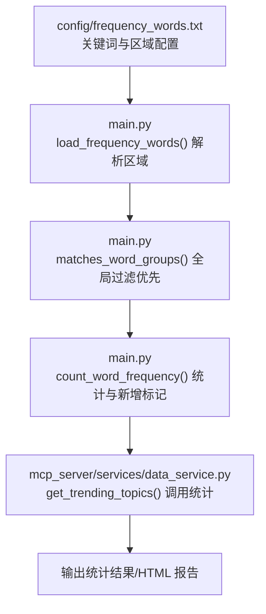
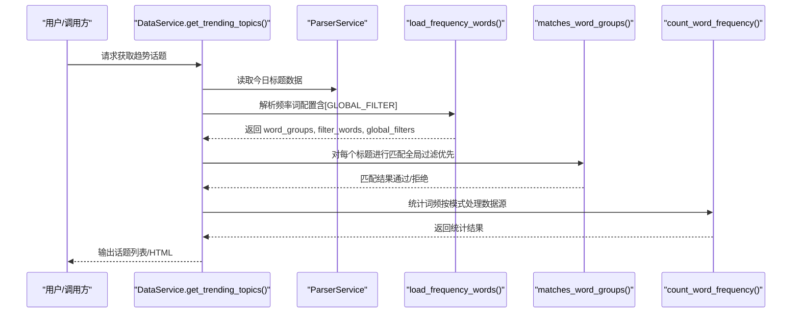
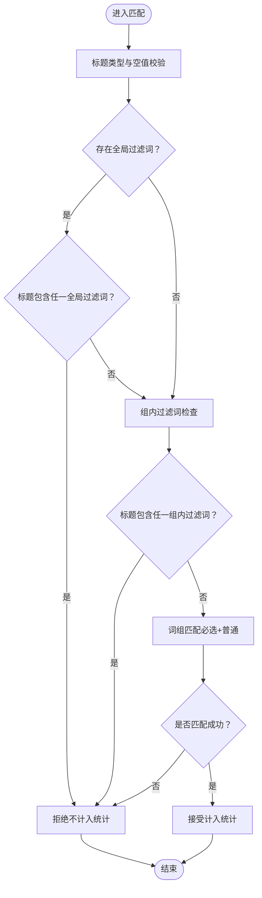
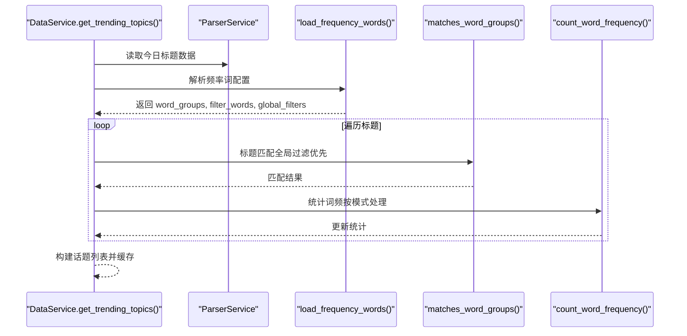

# 高级语法配置

<cite>
**本文引用的文件**
- [config/frequency_words.txt](file://config/frequency_words.txt)
- [main.py](file://main.py)
- [mcp_server/services/data_service.py](file://mcp_server/services/data_service.py)
- [README.md](file://README.md)
- [README-EN.md](file://README-EN.md)
- [version](file://version)
</cite>

## 目录
1. [简介](#简介)
2. [项目结构](#项目结构)
3. [核心组件](#核心组件)
4. [架构总览](#架构总览)
5. [详细组件分析](#详细组件分析)
6. [依赖关系分析](#依赖关系分析)
7. [性能考量](#性能考量)
8. [故障排查指南](#故障排查指南)
9. [结论](#结论)
10. [附录](#附录)

## 简介
本文件聚焦于频率词配置中的高级语法特性，特别是“全局过滤规则”[GLOBAL_FILTER]的实现机制与应用场景。与传统的组内过滤词（以“!”开头）相比，全局过滤对所有关键词组生效，且拥有最高优先级。文档结合 data_service.py 中 get_trending_topics 方法的 word_groups 处理流程，说明全局过滤如何在词频统计前对标题数据进行预处理；并提供配置示例与跨组过滤效果演示，强调该功能自 v3.5.0 版本引入，需确保系统版本兼容。

## 项目结构
围绕“全局过滤”的关键文件与职责如下：
- 配置文件：config/frequency_words.txt 定义关键词组与全局过滤区
- 主流程：main.py 负责加载配置、解析区域标记、执行匹配与统计
- 数据服务：mcp_server/services/data_service.py 提供 get_trending_topics，调用解析与统计逻辑
- 文档说明：README.md 与 README-EN.md 提供使用说明与版本信息
- 版本标识：version 文件标注当前版本为 3.5.0

图表来源
- [config/frequency_words.txt](file://config/frequency_words.txt#L1-L114)
- [main.py](file://main.py#L793-L887)
- [main.py](file://main.py#L1173-L1222)
- [main.py](file://main.py#L1277-L1372)
- [mcp_server/services/data_service.py](file://mcp_server/services/data_service.py#L285-L401)

章节来源
- [config/frequency_words.txt](file://config/frequency_words.txt#L1-L114)
- [main.py](file://main.py#L793-L887)
- [mcp_server/services/data_service.py](file://mcp_server/services/data_service.py#L285-L401)
- [README.md](file://README.md#L395-L410)
- [README-EN.md](file://README-EN.md#L1588-L1666)
- [version](file://version#L1-L1)

## 核心组件
- 配置解析器（load_frequency_words）
  - 支持区域标记：[GLOBAL_FILTER] 与 [WORD_GROUPS]
  - 全局过滤区仅接受纯文本词，忽略特殊语法前缀（如“!”、“+”、“@”）
  - 返回：词组列表、组内过滤词、全局过滤词
- 匹配器（matches_word_groups）
  - 全局过滤优先级最高：只要标题包含任一全局过滤词，直接拒绝
  - 若无词组配置，则匹配所有标题（显示全部新闻）
  - 组内过滤词（“!”）次之，词组匹配（“+”必选词、普通词）再次之
- 统计器（count_word_frequency）
  - 在不同模式（当日汇总、当前榜单、增量）下处理数据源
  - 传入 global_filters，确保在统计前完成预过滤
- 数据服务（DataService.get_trending_topics）
  - 读取今日标题数据
  - 调用解析器获取 word_groups 与 global_filters
  - 遍历标题并统计词频，构建话题列表

章节来源
- [main.py](file://main.py#L793-L887)
- [main.py](file://main.py#L1173-L1222)
- [main.py](file://main.py#L1277-L1372)
- [mcp_server/services/data_service.py](file://mcp_server/services/data_service.py#L285-L401)

## 架构总览
全局过滤贯穿“配置解析 → 标题匹配 → 统计输出”的主流程，确保在词频统计前对标题进行预处理，从而提升结果质量与稳定性。

图表来源
- [mcp_server/services/data_service.py](file://mcp_server/services/data_service.py#L285-L401)
- [main.py](file://main.py#L793-L887)
- [main.py](file://main.py#L1173-L1222)
- [main.py](file://main.py#L1277-L1372)

## 详细组件分析

### 配置解析器：[GLOBAL_FILTER] 与 [WORD_GROUPS]
- 区域标记识别
  - 以“[... ]”形式标记区域，支持 GLOBAL_FILTER 与 WORD_GROUPS
  - 未显式标记时，默认视为 WORD_GROUPS（向后兼容）
- 全局过滤区处理
  - 仅收集非空行作为全局过滤词
  - 忽略特殊语法前缀（“!”、“+”、“@”），保证全局过滤词纯文本
- 词组区处理
  - 保持原有语法规则：以“!”开头为组内过滤词；以“+”开头为必选词；以“@”开头为最大显示数量；其余为普通词
  - 词组间以空行分隔，独立统计

章节来源
- [main.py](file://main.py#L793-L887)
- [config/frequency_words.txt](file://config/frequency_words.txt#L1-L114)

### 匹配器：全局过滤优先级
- 匹配顺序
  1) 全局过滤（最高优先级）：若标题包含任一全局过滤词，直接拒绝
  2) 组内过滤（“!”）：若标题包含任一组内过滤词，拒绝
  3) 词组匹配：必须满足“必选词”条件，且至少包含一个“普通词”，才视为匹配
- 无词组配置时
  - 若未配置词组，匹配所有标题（用于显示全部新闻）

图表来源
- [main.py](file://main.py#L1173-L1222)

章节来源
- [main.py](file://main.py#L1173-L1222)

### 统计器：跨组过滤与模式处理
- 模式选择
  - 当日汇总（daily）：处理当天所有累计数据
  - 当前榜单（current）：处理最新一批数据（基于时间戳）
  - 增量（incremental）：仅处理新增新闻，首次或仅新增时标记新增
- 全局过滤传入
  - 统计阶段接收 global_filters，确保在统计前完成预过滤
- 结果构建
  - 统计词频、去重新闻数量、构建话题列表并返回

章节来源
- [main.py](file://main.py#L1277-L1372)
- [mcp_server/services/data_service.py](file://mcp_server/services/data_service.py#L285-L401)

### 数据服务：get_trending_topics 与 word_groups 处理
- 读取今日标题数据
- 调用解析器获取 word_groups 与 global_filters
- 遍历标题：对每个标题执行匹配器，统计词频并构建话题列表
- 返回结果并缓存

图表来源
- [mcp_server/services/data_service.py](file://mcp_server/services/data_service.py#L285-L401)
- [main.py](file://main.py#L793-L887)
- [main.py](file://main.py#L1173-L1222)
- [main.py](file://main.py#L1277-L1372)

章节来源
- [mcp_server/services/data_service.py](file://mcp_server/services/data_service.py#L285-L401)

## 依赖关系分析
- 配置文件依赖
  - config/frequency_words.txt 依赖 main.py 的解析器（load_frequency_words）
- 匹配依赖
  - matches_word_groups 依赖 global_filters 与 word_groups
- 统计依赖
  - count_word_frequency 依赖 matches_word_groups 与模式参数
- 服务依赖
  - DataService.get_trending_topics 依赖 ParserService 与统计器

图表来源
- [config/frequency_words.txt](file://config/frequency_words.txt#L1-L114)
- [main.py](file://main.py#L793-L887)
- [main.py](file://main.py#L1173-L1222)
- [main.py](file://main.py#L1277-L1372)
- [mcp_server/services/data_service.py](file://mcp_server/services/data_service.py#L285-L401)

章节来源
- [config/frequency_words.txt](file://config/frequency_words.txt#L1-L114)
- [main.py](file://main.py#L793-L887)
- [main.py](file://main.py#L1173-L1222)
- [main.py](file://main.py#L1277-L1372)
- [mcp_server/services/data_service.py](file://mcp_server/services/data_service.py#L285-L401)

## 性能考量
- 全局过滤的预处理显著减少后续匹配与统计的工作量，尤其在大规模标题数据下收益明显
- 统计阶段按模式选择数据源，避免不必要的全量扫描
- 缓存策略（服务层与系统层）有助于降低重复计算成本

## 故障排查指南
- 全局过滤未生效
  - 检查配置文件是否正确使用 [GLOBAL_FILTER] 区域标记
  - 确认全局过滤词为纯文本，未使用“!”、“+”、“@”等特殊前缀
- 词组过滤冲突
  - 确认匹配顺序：全局过滤 > 组内过滤 > 词组匹配
  - 如需特定组内过滤，优先使用组内过滤词（“!”），避免滥用全局过滤
- 版本不兼容
  - 确认系统版本为 3.5.0 或更高（version 文件）
  - 若版本低于 3.5.0，[GLOBAL_FILTER] 将不会被识别

章节来源
- [README.md](file://README.md#L395-L410)
- [README-EN.md](file://README-EN.md#L1588-L1666)
- [version](file://version#L1-L1)

## 结论
[GLOBAL_FILTER] 通过“最高优先级”的预过滤机制，在词频统计前对标题进行全局清洗，有效提升结果质量与稳定性。结合 [WORD_GROUPS] 的组内过滤与必选/普通词匹配，可灵活构建高质量的热点监测体系。建议谨慎设置全局过滤词数量（推荐 5-15 个），优先使用组内过滤词进行局部控制，确保系统版本不低于 3.5.0。

## 附录

### 配置示例与跨组过滤演示
- 示例配置（中文）
  - [GLOBAL_FILTER] 区域：广告、推广、营销、震惊、标题党
  - [WORD_GROUPS] 区域：科技、AI；华为、鸿蒙、!车
- 跨组过滤效果
  - “广告：最新科技产品发布” → 全局过滤命中“广告”，拒绝（不计入统计）
  - “科技公司发布AI新产品” → 不包含全局过滤词，匹配“科技”词组，计入统计
  - “AI技术突破引发关注” → 不包含全局过滤词，匹配“科技”词组中的“AI”，计入统计
- 优先级说明
  - 全局过滤 > 组内过滤（“!”） > 词组匹配（“+”必选 + 普通词）

章节来源
- [README.md](file://README.md#L1618-L1666)
- [README-EN.md](file://README-EN.md#L1588-L1666)
- [config/frequency_words.txt](file://config/frequency_words.txt#L1-L114)