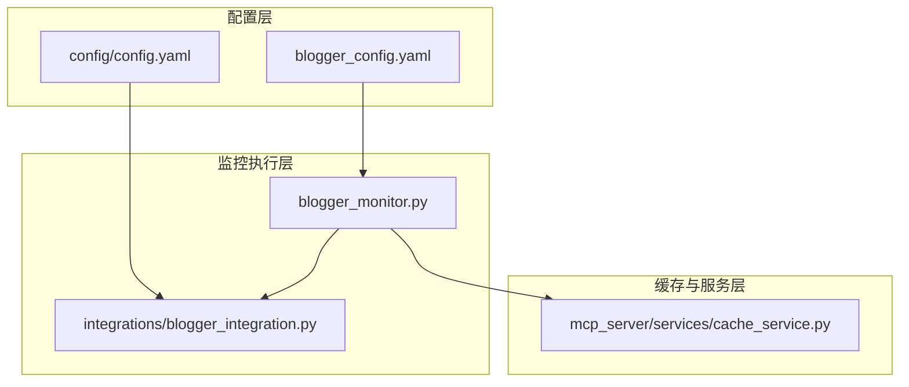
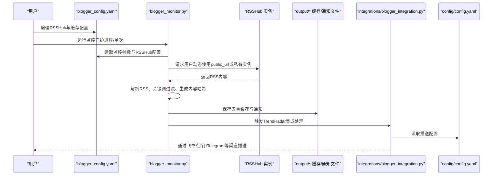
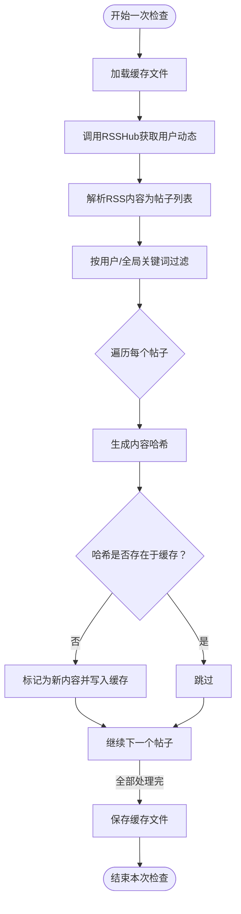
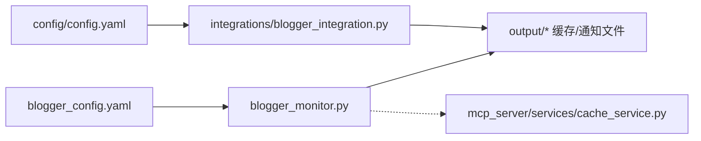

# RSSHub与缓存配置

<cite>
**本文引用的文件**
- [blogger_config.yaml](file://config/blogger_config.yaml)
- [blogger_monitor.py](file://blogger_monitor.py)
- [cache_service.py](file://mcp_server/services/cache_service.py)
- [blogger_integration.py](file://integrations/blogger_integration.py)
- [config.yaml](file://config/config.yaml)
- [README-BloggerMonitor.md](file://README-BloggerMonitor.md)
</cite>

## 目录
1. [简介](#简介)
2. [项目结构](#项目结构)
3. [核心组件](#核心组件)
4. [架构总览](#架构总览)
5. [详细组件分析](#详细组件分析)
6. [依赖关系分析](#依赖关系分析)
7. [性能考量](#性能考量)
8. [故障排查指南](#故障排查指南)
9. [结论](#结论)
10. [附录](#附录)

## 简介
本文件围绕“blogger_config.yaml”中的RSSHub公共与私有实例切换配置，以及缓存策略对监控效率的影响展开，结合blogger_monitor.py中的缓存加载、保存与去重逻辑，给出最佳实践与私有RSSHub环境下的稳定性配置建议。读者无需深厚技术背景，也可通过图示与流程逐步理解配置要点与工作机制。

## 项目结构
与RSSHub与缓存相关的关键文件与职责如下：
- config/blogger_config.yaml：博主监控配置入口，包含RSSHub公共/私有实例配置与缓存策略配置。
- blogger_monitor.py：监控主流程，负责RSSHub请求、RSS解析、关键词过滤、去重与通知落盘。
- mcp_server/services/cache_service.py：通用TTL缓存服务（供MCP服务使用），展示缓存过期与清理机制。
- integrations/blogger_integration.py：将博主监控结果对接到TrendRadar推送体系，负责格式转换与渠道推送。
- config/config.yaml：TrendRadar整体推送配置，用于集成通知通道。
- README-BloggerMonitor.md：快速开始、高级用法与故障排除说明。

图表来源
- [blogger_config.yaml](file://config/blogger_config.yaml#L46-L60)
- [blogger_monitor.py](file://blogger_monitor.py#L1-L120)
- [cache_service.py](file://mcp_server/services/cache_service.py#L1-L137)
- [blogger_integration.py](file://integrations/blogger_integration.py#L1-L120)
- [config.yaml](file://config/config.yaml#L92-L109)

章节来源
- [blogger_config.yaml](file://config/blogger_config.yaml#L46-L60)
- [blogger_monitor.py](file://blogger_monitor.py#L1-L120)
- [cache_service.py](file://mcp_server/services/cache_service.py#L1-L137)
- [blogger_integration.py](file://integrations/blogger_integration.py#L1-L120)
- [config.yaml](file://config/config.yaml#L92-L109)

## 核心组件
- RSSHub实例切换配置
  - 在blogger_config.yaml中，rsshub节点提供public_url字段用于指定公共RSSHub实例；同时预留private_url注释项，便于切换至私有实例。
  - 当前blogger_monitor.py中硬编码使用公共RSSHub域名进行请求，若需切换私有实例，应在监控逻辑中读取配置并动态拼接URL。
- 缓存策略
  - 在blogger_config.yaml中，cache节点包含expire_days与max_cache_size两个关键参数，分别控制缓存过期天数与最大缓存条目数。
  - blogger_monitor.py内置本地JSON缓存文件，用于去重与持久化，但未直接使用上述配置参数。

章节来源
- [blogger_config.yaml](file://config/blogger_config.yaml#L46-L60)
- [blogger_monitor.py](file://blogger_monitor.py#L81-L103)

## 架构总览
从配置到执行再到通知的整体流程如下：

图表来源
- [blogger_config.yaml](file://config/blogger_config.yaml#L46-L60)
- [blogger_monitor.py](file://blogger_monitor.py#L115-L191)
- [blogger_integration.py](file://integrations/blogger_integration.py#L103-L150)
- [config.yaml](file://config/config.yaml#L92-L109)

## 详细组件分析

### RSSHub公共与私有实例切换配置
- 使用场景
  - 公共实例：部署便捷、无需维护，适合开发与小规模使用。
  - 私有实例：稳定性更高、可控性更强，适合生产环境与高并发场景。
- 配置步骤
  - 在blogger_config.yaml中设置rsshub.public_url为公共实例地址。
  - 如需切换私有实例，取消注释并填写private_url为自有域名。
  - 修改blogger_monitor.py中请求URL的来源，从硬编码改为读取配置文件的rsshub节点。
- 切换注意事项
  - 私有实例需保证网络可达与域名解析稳定。
  - 若使用反向代理或CDN，需确保RSSHub路由可用且响应正常。
  - 可结合README-BloggerMonitor.md中的故障排除建议进行验证。

章节来源
- [blogger_config.yaml](file://config/blogger_config.yaml#L50-L56)
- [blogger_monitor.py](file://blogger_monitor.py#L127-L134)
- [README-BloggerMonitor.md](file://README-BloggerMonitor.md#L184-L190)

### 缓存策略与监控效率影响机制
- expire_days（过期天数）
  - 作用：控制去重缓存中内容哈希的保留周期，到期后自动释放占用空间。
  - 影响：过短可能导致重复通知（缓存过早失效），过长可能占用过多磁盘与内存。
- max_cache_size（最大缓存条目数）
  - 作用：限制去重缓存中存储的哈希数量上限。
  - 影响：过高增加IO与内存压力，过低可能误判为新内容。
- 实际实现与差异
  - blogger_config.yaml中提供了上述两个参数，但blogger_monitor.py当前使用的是本地JSON文件缓存，未直接读取配置中的expire_days与max_cache_size。
  - 因此，若希望真正生效，需在blogger_monitor.py中实现基于配置的缓存清理与容量控制逻辑。

章节来源
- [blogger_config.yaml](file://config/blogger_config.yaml#L57-L60)
- [blogger_monitor.py](file://blogger_monitor.py#L81-L103)

### 去重逻辑与缓存实现原理
- 去重原理
  - 生成内容唯一哈希：基于平台、用户ID、内容正文与发布时间计算MD5哈希，作为去重键。
  - 去重判断：若哈希不在缓存中，则视为新内容并加入缓存；否则跳过。
- 缓存实现
  - 缓存文件：output/blogger_cache.json，保存posts哈希表与时间戳。
  - 加载与保存：启动时加载缓存，每次检查结束后保存，确保断点续跑。
- 关键方法
  - load_cache：从JSON文件读取缓存字典。
  - save_cache：将内存中的缓存写回JSON文件。
  - get_post_hash：生成内容哈希，用于去重判断。

图表来源
- [blogger_monitor.py](file://blogger_monitor.py#L81-L103)
- [blogger_monitor.py](file://blogger_monitor.py#L115-L191)
- [blogger_monitor.py](file://blogger_monitor.py#L293-L331)

章节来源
- [blogger_monitor.py](file://blogger_monitor.py#L81-L103)
- [blogger_monitor.py](file://blogger_monitor.py#L115-L191)
- [blogger_monitor.py](file://blogger_monitor.py#L293-L331)

### 与TrendRadar的集成与通知
- 输出文件
  - output/blogger_notifications.json：保存新发现的博文，便于后续集成处理。
  - output/YYYYMMDD_blogger.json：按日期归档的TrendRadar兼容格式文件。
- 集成流程
  - integrations/blogger_integration.py读取通知缓存，筛选未处理的新内容，转换为TrendRadar格式，并通过config/config.yaml中的webhooks配置推送到飞书、钉钉、Telegram等渠道。
- 通知渠道
  - config.yaml中提供多种推送渠道的webhook配置，需按需填写。

章节来源
- [blogger_integration.py](file://integrations/blogger_integration.py#L1-L120)
- [blogger_integration.py](file://integrations/blogger_integration.py#L120-L240)
- [config.yaml](file://config/config.yaml#L92-L109)

## 依赖关系分析
- 配置依赖
  - blogger_monitor.py依赖blogger_config.yaml中的监控参数与RSSHub配置。
  - integrations/blogger_integration.py依赖config/config.yaml中的webhooks配置。
- 缓存依赖
  - blogger_monitor.py内部维护本地缓存文件，不依赖mcp_server的CacheService。
  - mcp_server的CacheService提供TTL缓存能力，适用于MCP服务层，与博主监控的本地缓存解耦。

图表来源
- [blogger_config.yaml](file://config/blogger_config.yaml#L46-L60)
- [blogger_monitor.py](file://blogger_monitor.py#L1-L120)
- [blogger_integration.py](file://integrations/blogger_integration.py#L1-L120)
- [cache_service.py](file://mcp_server/services/cache_service.py#L1-L137)
- [config.yaml](file://config/config.yaml#L92-L109)

章节来源
- [blogger_config.yaml](file://config/blogger_config.yaml#L46-L60)
- [blogger_monitor.py](file://blogger_monitor.py#L1-L120)
- [blogger_integration.py](file://integrations/blogger_integration.py#L1-L120)
- [cache_service.py](file://mcp_server/services/cache_service.py#L1-L137)
- [config.yaml](file://config/config.yaml#L92-L109)

## 性能考量
- RSSHub请求频率
  - check_interval建议不低于300秒，避免对公共实例造成过大压力。
  - max_posts_per_check建议控制在5-20之间，平衡新鲜度与负载。
- 缓存容量与过期
  - expire_days与max_cache_size应结合业务量与存储资源设定，避免频繁IO与内存占用过高。
  - 若当前实现未使用配置参数，建议在blogger_monitor.py中引入配置驱动的清理与容量控制逻辑。
- 去重效率
  - MD5哈希计算开销较低，但需注意内容体量较大时的字符串拼接成本。
  - 建议对超长内容进行截断或摘要化处理，减少哈希生成与存储负担。

[本节为通用性能建议，不直接分析具体文件，故无章节来源]

## 故障排查指南
- RSSHub访问失败
  - 公共实例不稳定时，可考虑切换至私有实例或使用镜像源。
  - 检查网络连通性、DNS解析与代理设置。
- 用户ID错误
  - 微博需使用数字ID；知乎可使用用户名或ID。
- 关键词匹配失败
  - 检查关键词是否包含特殊字符，尝试更通用的关键词。
- 推送通知失败
  - 确认config/config.yaml中的webhook配置正确，检查渠道可用性与权限。
- 缓存异常
  - 若缓存文件损坏，可删除后由程序自动重建；关注磁盘空间与权限。

章节来源
- [README-BloggerMonitor.md](file://README-BloggerMonitor.md#L184-L207)
- [blogger_monitor.py](file://blogger_monitor.py#L81-L103)

## 结论
- RSSHub切换：当前代码使用公共实例硬编码URL，建议从blogger_config.yaml读取rsshub配置，实现公共/私有实例无缝切换。
- 缓存策略：blogger_config.yaml提供了expire_days与max_cache_size，但当前blogger_monitor.py未使用这些参数。建议在监控逻辑中引入配置驱动的缓存清理与容量控制，以提升稳定性与效率。
- 去重与通知：本地JSON缓存与TrendRadar集成已具备完整链路，建议完善私有实例配置与缓存策略，确保监控在生产环境长期稳定运行。

[本节为总结性内容，不直接分析具体文件，故无章节来源]

## 附录

### RSSHub实例切换配置清单
- 在blogger_config.yaml中设置rsshub.public_url为公共实例地址。
- 如需私有实例，取消注释并填写private_url为自有域名。
- 修改blogger_monitor.py中请求URL来源，从硬编码改为读取配置文件的rsshub节点。

章节来源
- [blogger_config.yaml](file://config/blogger_config.yaml#L50-L56)
- [blogger_monitor.py](file://blogger_monitor.py#L127-L134)

### 缓存配置最佳实践
- expire_days：根据业务留存需求与存储成本权衡，建议7-30天。
- max_cache_size：根据监控目标数量与平均内容长度估算，建议1万-10万条之间，结合定期清理策略。
- 若当前实现未使用配置参数，建议在blogger_monitor.py中：
  - 引入配置读取与校验。
  - 实现基于时间与容量的双维度清理逻辑。
  - 在save_cache前执行清理，避免缓存无限增长。

章节来源
- [blogger_config.yaml](file://config/blogger_config.yaml#L57-L60)
- [blogger_monitor.py](file://blogger_monitor.py#L81-L103)

### 私有RSSHub环境下的稳定性配置方案
- 网络与域名
  - 使用内网或高可用域名，确保DNS解析稳定。
  - 配置反向代理与健康检查，保障可用性。
- 资源与限流
  - 为RSSHub实例配置合理的CPU/内存与连接池上限。
  - 在blogger_monitor.py中适当增大超时与重试次数，降低瞬时失败影响。
- 监控与告警
  - 对RSSHub实例与本项目日志建立监控告警。
  - 定期检查output目录磁盘使用情况与缓存文件完整性。

[本节为通用建议，不直接分析具体文件，故无章节来源]