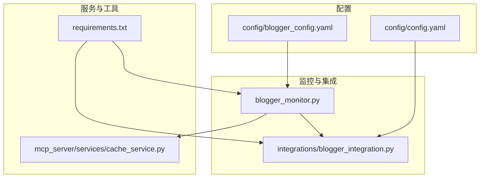
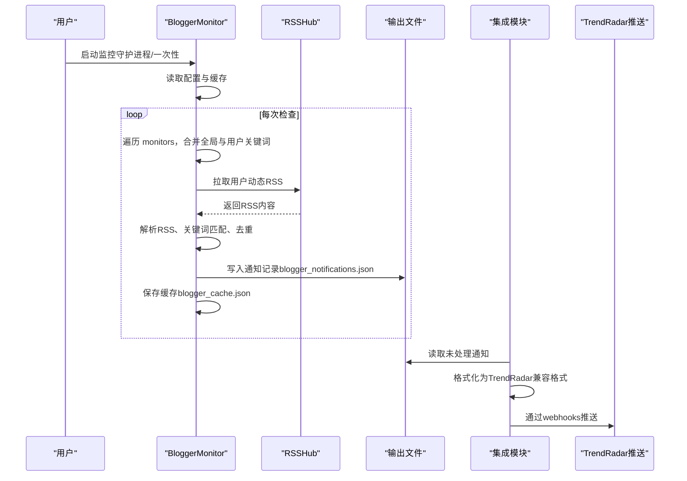
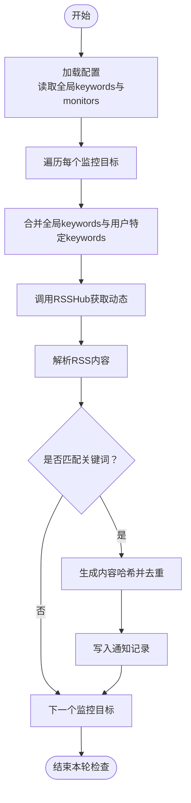
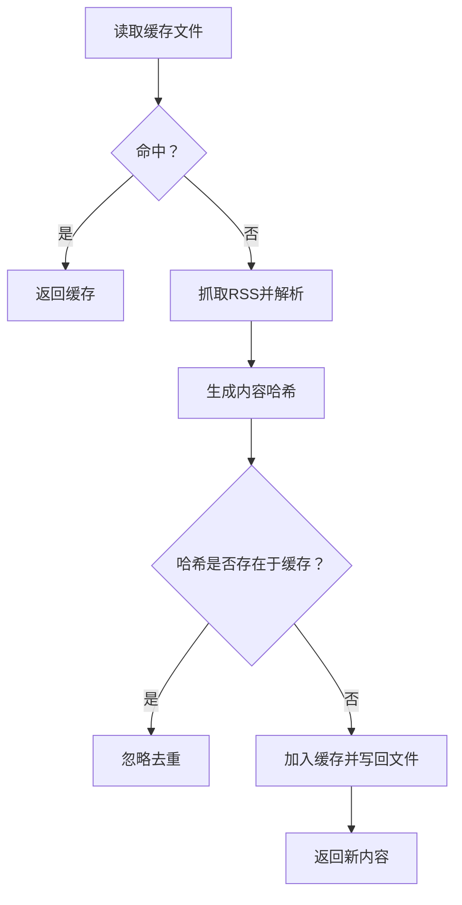
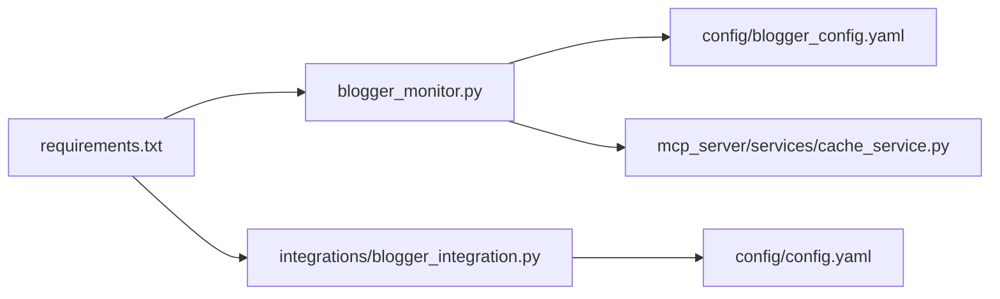

# 博主监控配置指南

<cite>
**本文引用的文件**
- [blogger_config.yaml](file://config/blogger_config.yaml)
- [blogger_monitor.py](file://blogger_monitor.py)
- [blogger_integration.py](file://integrations/blogger_integration.py)
- [config.yaml](file://config/config.yaml)
- [README-BloggerMonitor.md](file://README-BloggerMonitor.md)
- [README-EN.md](file://README-EN.md)
- [README.md](file://README.md)
- [cache_service.py](file://mcp_server/services/cache_service.py)
- [requirements.txt](file://requirements.txt)
</cite>

## 目录
1. [简介](#简介)
2. [项目结构](#项目结构)
3. [核心组件](#核心组件)
4. [架构总览](#架构总览)
5. [详细组件分析](#详细组件分析)
6. [依赖关系分析](#依赖关系分析)
7. [性能考量](#性能考量)
8. [故障排查指南](#故障排查指南)
9. [结论](#结论)
10. [附录](#附录)

## 简介
本指南围绕 blogger_config.yaml 的结构设计与配置方法，系统讲解：
- monitors 列表中 platform、user_id、keywords、name 字段的作用
- 全局 keywords 与用户特定 keywords 的叠加逻辑
- notification 通知渠道的启用方式（console/file/email 等）及其依赖条件
- check_interval 检查频率与 max_posts_per_check 的性能平衡建议
- RSSHub 公共与私有实例的切换方法
- cache 缓存策略（expire_days、max_cache_size）对监控效率的影响
- 结合 blogger_monitor.py 的运行机制，给出典型配置场景（技术大V监控、财经博主追踪）与故障排查技巧

## 项目结构
与博主监控相关的配置与实现主要分布在以下文件：
- 配置文件：config/blogger_config.yaml（博主监控配置）、config/config.yaml（TrendRadar 推送配置）
- 监控脚本：blogger_monitor.py（核心监控逻辑）
- 集成模块：integrations/blogger_integration.py（与 TrendRadar 推送系统的集成）
- 缓存服务：mcp_server/services/cache_service.py（TTL 缓存服务，供其他模块使用）
- 文档：README-BloggerMonitor.md（使用说明与故障排除）

图表来源
- [blogger_config.yaml](file://config/blogger_config.yaml#L1-L60)
- [blogger_monitor.py](file://blogger_monitor.py#L1-L120)
- [blogger_integration.py](file://integrations/blogger_integration.py#L1-L120)
- [config.yaml](file://config/config.yaml#L1-L120)
- [cache_service.py](file://mcp_server/services/cache_service.py#L1-L60)
- [requirements.txt](file://requirements.txt#L1-L6)

章节来源
- [blogger_config.yaml](file://config/blogger_config.yaml#L1-L60)
- [blogger_monitor.py](file://blogger_monitor.py#L1-L120)
- [blogger_integration.py](file://integrations/blogger_integration.py#L1-L120)
- [config.yaml](file://config/config.yaml#L1-L120)
- [cache_service.py](file://mcp_server/services/cache_service.py#L1-L60)
- [requirements.txt](file://requirements.txt#L1-L6)

## 核心组件
- 配置文件（blogger_config.yaml）
  - monitors：监控目标列表，包含 platform、user_id、keywords、name 等字段
  - keywords：全局关键词，对所有监控目标生效
  - notification：通知开关与渠道（console/file/email 等）
  - check_interval：检查间隔（秒）
  - max_posts_per_check：每次检查最多获取的帖子数
  - rsshub：RSSHub 实例配置（public_url/private_url）
  - cache：缓存策略（expire_days、max_cache_size）

- 监控主程序（blogger_monitor.py）
  - BloggerMonitor 类负责加载配置、缓存、关键词匹配、RSSHub 抓取、去重与通知
  - run_once/run_daemon 提供一次性检查与守护进程模式

- 集成模块（integrations/blogger_integration.py）
  - 将博主监控结果格式化为 TrendRadar 兼容格式，并通过 webhooks 推送到飞书、钉钉、Telegram、企业微信、ntfy、Bark、Slack 等

章节来源
- [blogger_config.yaml](file://config/blogger_config.yaml#L1-L60)
- [blogger_monitor.py](file://blogger_monitor.py#L1-L120)
- [blogger_integration.py](file://integrations/blogger_integration.py#L1-L120)

## 架构总览
博主监控的整体流程如下：
- 读取 blogger_config.yaml，构建监控目标列表
- 每轮检查：遍历 monitors，拼接全局 keywords 与用户特定 keywords，调用 RSSHub 获取用户动态
- 去重：基于内容生成哈希，判断是否已缓存
- 通知：控制台输出；若启用，将结果写入 output/blogger_notifications.json
- 集成：blogger_integration.py 读取 output/blogger_notifications.json，格式化并推送至 TrendRadar 推送渠道

图表来源
- [blogger_monitor.py](file://blogger_monitor.py#L293-L351)
- [blogger_monitor.py](file://blogger_monitor.py#L115-L191)
- [blogger_monitor.py](file://blogger_monitor.py#L245-L292)
- [blogger_integration.py](file://integrations/blogger_integration.py#L241-L284)
- [config.yaml](file://config/config.yaml#L92-L109)

章节来源
- [blogger_monitor.py](file://blogger_monitor.py#L293-L351)
- [blogger_monitor.py](file://blogger_monitor.py#L115-L191)
- [blogger_monitor.py](file://blogger_monitor.py#L245-L292)
- [blogger_integration.py](file://integrations/blogger_integration.py#L241-L284)
- [config.yaml](file://config/config.yaml#L92-L109)

## 详细组件分析

### 1) 配置文件结构与字段说明
- monitors 列表
  - platform：平台标识，如 weibo、zhihu
  - user_id：用户标识，微博需数字 ID，知乎可用户名或 ID
  - keywords：用户特定关键词（可选），与全局 keywords 叠加
  - name：用户备注（可选）

- 全局 keywords
  - 对所有监控目标生效，用于统一过滤

- notification
  - enable：是否启用通知
  - channels：通知渠道列表，支持 console、file、email、wechat、telegram 等（具体取决于配置与环境）

- 监控参数
  - check_interval：检查间隔（秒），默认 300
  - max_posts_per_check：每次检查最多获取的帖子数，默认 10

- RSSHub 配置
  - public_url：公共 RSSHub 实例地址
  - private_url：私有 RSSHub 实例地址（可选）

- 缓存配置
  - expire_days：缓存过期天数
  - max_cache_size：最大缓存条目数

章节来源
- [blogger_config.yaml](file://config/blogger_config.yaml#L1-L60)
- [README-BloggerMonitor.md](file://README-BloggerMonitor.md#L66-L111)

### 2) 关键词叠加逻辑与匹配规则
- 叠加逻辑
  - 每个监控目标在运行时会将全局 keywords 与用户特定 keywords 合并，作为该目标的过滤集合
- 匹配规则
  - 不区分大小写，采用“包含匹配”
  - 若未设置关键词，将不过滤（匹配所有）

图表来源
- [blogger_monitor.py](file://blogger_monitor.py#L293-L331)
- [blogger_monitor.py](file://blogger_monitor.py#L104-L114)

章节来源
- [blogger_monitor.py](file://blogger_monitor.py#L293-L331)
- [blogger_monitor.py](file://blogger_monitor.py#L104-L114)

### 3) 通知渠道与依赖条件
- 控制台输出（console）
  - 默认启用，无需额外配置
- 文件输出（file）
  - 通过 blogger_monitor.py 写入 output/blogger_notifications.json，便于后续集成模块处理
- 邮件（email）
  - 需要在 config/config.yaml 中配置 webhooks.email_* 相关项（发件人、密码、收件人、SMTP 服务器与端口）
  - 支持多收件人（逗号分隔）
- 企业微信、钉钉、飞书、Telegram、ntfy、Bark、Slack
  - 需在 config/config.yaml 的 webhooks 中配置相应 webhook 或 token/chat_id
  - 多账号支持：使用英文分号分隔多个值；Telegram 与 ntfy 需要配对参数数量一致
  - GitHub Actions 部署建议使用 GitHub Secrets 管理敏感信息，避免暴露

章节来源
- [blogger_monitor.py](file://blogger_monitor.py#L245-L292)
- [blogger_integration.py](file://integrations/blogger_integration.py#L103-L149)
- [blogger_integration.py](file://integrations/blogger_integration.py#L150-L240)
- [config.yaml](file://config/config.yaml#L92-L109)
- [README-EN.md](file://README-EN.md#L809-L1147)
- [README.md](file://README.md#L846-L1184)

### 4) RSSHub 实例切换
- 公共实例
  - 默认使用 public_url（如 https://rsshub.app）
- 私有实例
  - 在配置中设置 private_url（如 http://your-rsshub-domain.com）
  - 切换后需确保网络可达与域名解析正常

章节来源
- [blogger_config.yaml](file://config/blogger_config.yaml#L50-L56)
- [README-BloggerMonitor.md](file://README-BloggerMonitor.md#L184-L190)

### 5) 缓存策略与监控效率
- 博主监控缓存
  - 位置：output/blogger_cache.json
  - 机制：基于内容哈希去重，避免重复通知
  - 策略：expire_days 控制过期时间，max_cache_size 控制最大条目数
- TTL 缓存服务（供其他模块使用）
  - 提供 get/set/delete/clear/cleanup_expired/get_stats 等接口
  - TTL 默认 900 秒（15 分钟），可通过参数调整

图表来源
- [blogger_monitor.py](file://blogger_monitor.py#L81-L103)
- [blogger_monitor.py](file://blogger_monitor.py#L140-L191)
- [cache_service.py](file://mcp_server/services/cache_service.py#L1-L121)

章节来源
- [blogger_monitor.py](file://blogger_monitor.py#L81-L103)
- [blogger_monitor.py](file://blogger_monitor.py#L140-L191)
- [cache_service.py](file://mcp_server/services/cache_service.py#L1-L121)

### 6) 运行机制与参数平衡
- check_interval
  - 控制守护进程的检查周期，建议不低于 300 秒（5 分钟），避免过于频繁导致 RSSHub 或平台限流
- max_posts_per_check
  - 控制每次检查抓取的最大帖子数，建议 5-20，兼顾实时性与资源消耗
- RSSHub 抓取
  - 使用 RSSHub 提供的用户动态接口，解析 RSS 内容并进行关键词匹配与去重

章节来源
- [blogger_config.yaml](file://config/blogger_config.yaml#L46-L49)
- [blogger_monitor.py](file://blogger_monitor.py#L333-L351)
- [blogger_monitor.py](file://blogger_monitor.py#L193-L244)

### 7) 典型配置场景示例
- 技术大V监控（微博）
  - platform: weibo
  - user_id: 微博数字 ID
  - keywords: ["人工智能", "AI", "大模型", "生成式AI"]
  - name: "技术大V"
- 财经博主追踪（知乎）
  - platform: zhihu
  - user_id: 用户名或 ID
  - keywords: ["投资", "股市", "财经", "宏观经济"]
  - name: "财经博主"
- 全局关键词
  - keywords: ["热点", "重要"]
- 通知渠道
  - console（默认）
  - email/飞书/钉钉/Telegram 等（按需启用）

章节来源
- [blogger_config.yaml](file://config/blogger_config.yaml#L5-L29)
- [blogger_config.yaml](file://config/blogger_config.yaml#L30-L45)
- [blogger_config.yaml](file://config/blogger_config.yaml#L46-L60)

## 依赖关系分析
- 外部依赖
  - requests：HTTP 请求（RSSHub 抓取）
  - PyYAML：配置文件解析
  - fastmcp：TrendRadar 核心服务（用于集成模块）
- 内部模块依赖
  - blogger_monitor.py 依赖 YAML 配置与输出目录
  - integrations/blogger_integration.py 依赖 TrendRadar 配置与输出通知文件
  - mcp_server/services/cache_service.py 提供 TTL 缓存能力

图表来源
- [requirements.txt](file://requirements.txt#L1-L6)
- [blogger_monitor.py](file://blogger_monitor.py#L1-L40)
- [blogger_integration.py](file://integrations/blogger_integration.py#L1-L20)
- [blogger_config.yaml](file://config/blogger_config.yaml#L1-L20)
- [config.yaml](file://config/config.yaml#L1-L20)

章节来源
- [requirements.txt](file://requirements.txt#L1-L6)
- [blogger_monitor.py](file://blogger_monitor.py#L1-L40)
- [blogger_integration.py](file://integrations/blogger_integration.py#L1-L20)
- [blogger_config.yaml](file://config/blogger_config.yaml#L1-L20)
- [config.yaml](file://config/config.yaml#L1-L20)

## 性能考量
- 检查频率与抓取量
  - check_interval 建议 ≥ 300 秒，max_posts_per_check 建议 5-20，避免 RSSHub 限流与平台风控
- 缓存策略
  - expire_days 与 max_cache_size 调整以平衡存储与去重效果
  - TTL 缓存服务（900 秒默认）可用于其他模块的短期数据缓存
- 网络与实例稳定性
  - 公共 RSSHub 实例不稳定时，可切换私有实例或镜像，或增加超时与重试策略

章节来源
- [blogger_config.yaml](file://config/blogger_config.yaml#L46-L60)
- [cache_service.py](file://mcp_server/services/cache_service.py#L1-L60)
- [README-BloggerMonitor.md](file://README-BloggerMonitor.md#L184-L190)

## 故障排查指南
- RSSHub 访问失败
  - 切换私有实例或镜像；检查网络连通性与 DNS 解析
- 用户ID错误
  - 微博需数字 ID；知乎可用户名或 ID；确认用户主页可访问
- 关键词匹配失败
  - 检查关键词是否包含特殊字符；尝试更通用关键词；查看日志了解匹配过程
- 推送通知失败
  - 检查 config/config.yaml 中的 webhooks 配置；确认 webhook URL 或 token/chat_id 正确；查看日志获取详细错误
- 日志定位
  - 控制台输出与日志文件（blogger_monitor.log）用于定位问题

章节来源
- [README-BloggerMonitor.md](file://README-BloggerMonitor.md#L182-L216)
- [blogger_monitor.py](file://blogger_monitor.py#L1-L40)

## 结论
blogger_config.yaml 提供了清晰的博主监控配置入口，结合 RSSHub 的用户动态抓取与去重机制，能够高效地实现跨平台博主监控。通过合理设置 check_interval、max_posts_per_check、RSSHub 实例与缓存策略，可在准确性与性能之间取得良好平衡。配合 TrendRadar 的多渠道推送，可满足团队协作与个人追踪的多样化需求。

## 附录
- 初始化配置
  - 使用命令行参数初始化默认配置文件，随后编辑 config/blogger_config.yaml
- 批量导入监控目标
  - 可通过脚本批量追加 monitors 列表
- 定时任务
  - 使用 crontab 设置定时任务，定期执行 --once 模式

章节来源
- [README-BloggerMonitor.md](file://README-BloggerMonitor.md#L16-L65)
- [README-BloggerMonitor.md](file://README-BloggerMonitor.md#L128-L179)