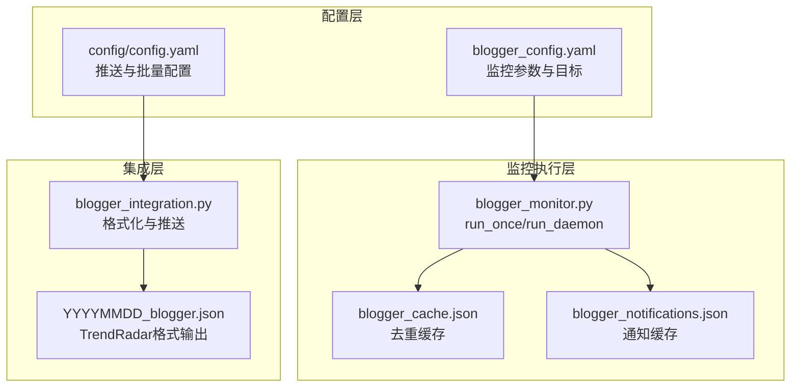
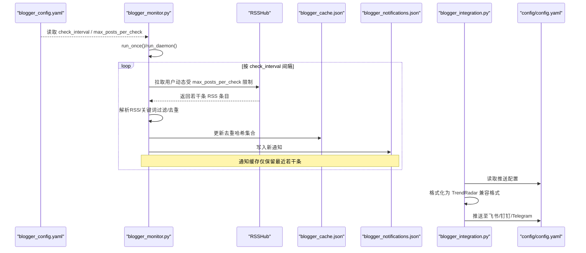
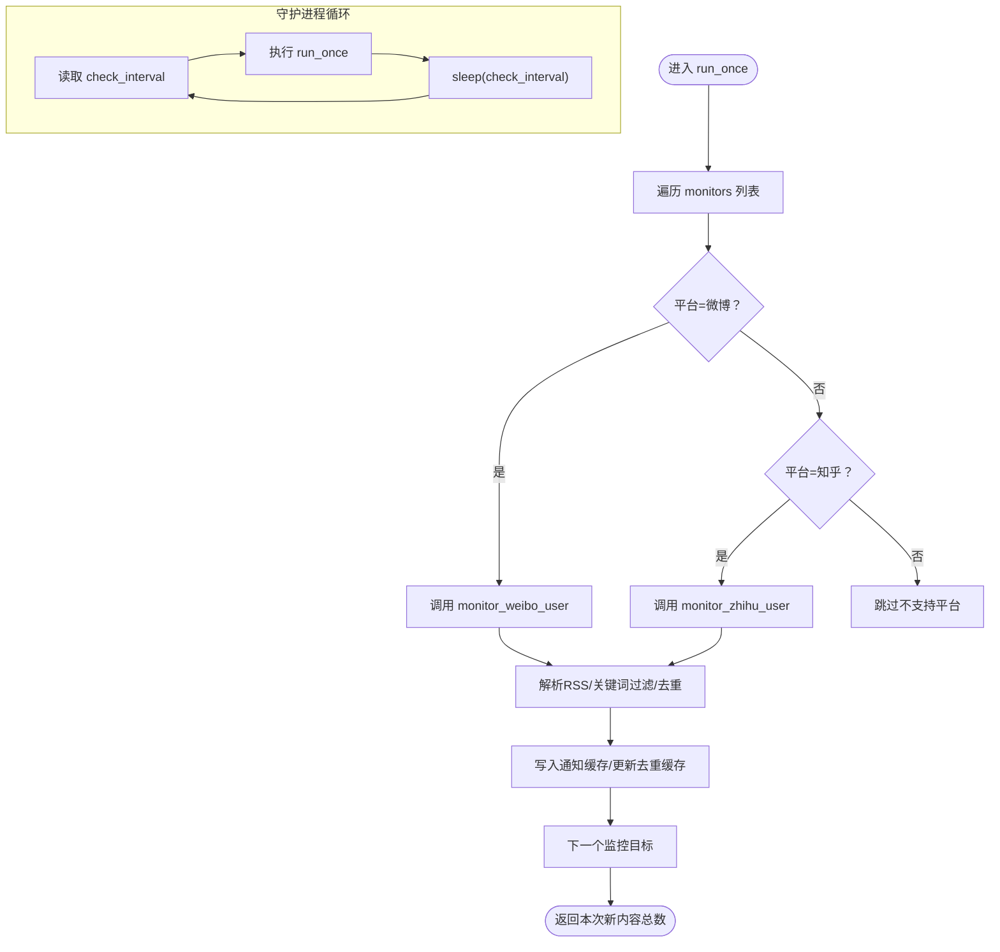
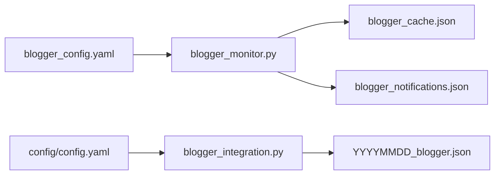

# 监控参数设置

<cite>
**本文引用的文件**
- [blogger_config.yaml](file://config/blogger_config.yaml)
- [blogger_monitor.py](file://blogger_monitor.py)
- [blogger_integration.py](file://integrations/blogger_integration.py)
- [config.yaml](file://config/config.yaml)
- [README-BloggerMonitor.md](file://README-BloggerMonitor.md)
</cite>

## 目录
1. [简介](#简介)
2. [项目结构](#项目结构)
3. [核心组件](#核心组件)
4. [架构总览](#架构总览)
5. [详细组件分析](#详细组件分析)
6. [依赖关系分析](#依赖关系分析)
7. [性能考量](#性能考量)
8. [故障排查指南](#故障排查指南)
9. [结论](#结论)
10. [附录](#附录)

## 简介
本文件围绕博客监控配置中的两个关键参数“检查间隔（check_interval）”与“每次检查最大获取数（max_posts_per_check）”，结合监控主程序的守护进程与单次运行流程，系统阐述其对系统资源消耗与监控实时性的权衡关系，并给出不同场景下的参数配置建议与性能优化最佳实践。同时说明如何通过通知集成模块将博主动态接入统一推送通道，确保在不同频率下仍能稳定产出高质量通知。

## 项目结构
- 配置层：blogger_config.yaml 提供监控目标、关键词、通知开关、检查间隔与最大获取数等参数；config.yaml 提供推送渠道与批量大小等系统级通知配置。
- 监控执行层：blogger_monitor.py 提供 run_once 与 run_daemon 两种运行模式，负责拉取 RSSHub 数据、关键词过滤、去重与通知落盘。
- 集成层：blogger_integration.py 将博主动态转换为 TrendRadar 兼容格式并推送至飞书、钉钉、Telegram 等渠道。

图表来源
- [blogger_config.yaml](file://config/blogger_config.yaml#L46-L60)
- [blogger_monitor.py](file://blogger_monitor.py#L293-L351)
- [blogger_integration.py](file://integrations/blogger_integration.py#L68-L102)

章节来源
- [blogger_config.yaml](file://config/blogger_config.yaml#L46-L60)
- [blogger_monitor.py](file://blogger_monitor.py#L293-L351)
- [blogger_integration.py](file://integrations/blogger_integration.py#L68-L102)

## 核心组件
- 参数来源与默认值
  - check_interval：默认 300 秒（5 分钟），可在配置文件中调整。
  - max_posts_per_check：默认 10，用于限制每次检查抓取的帖子数量上限。
- 运行模式
  - run_once：执行一次全量检查，适合一次性验证或定时任务触发。
  - run_daemon：进入守护进程循环，按 check_interval 间隔持续检查。

章节来源
- [blogger_config.yaml](file://config/blogger_config.yaml#L46-L48)
- [blogger_monitor.py](file://blogger_monitor.py#L72-L75)
- [blogger_monitor.py](file://blogger_monitor.py#L333-L351)
- [blogger_monitor.py](file://blogger_monitor.py#L293-L331)

## 架构总览
下图展示从配置到执行再到推送的整体流程，重点标注 check_interval 与 max_posts_per_check 在各阶段的作用点。

图表来源
- [blogger_config.yaml](file://config/blogger_config.yaml#L46-L48)
- [blogger_monitor.py](file://blogger_monitor.py#L293-L351)
- [blogger_monitor.py](file://blogger_monitor.py#L212-L243)
- [blogger_integration.py](file://integrations/blogger_integration.py#L68-L102)
- [config.yaml](file://config/config.yaml#L92-L109)

## 详细组件分析

### 参数 check_interval 的影响与控制
- 作用点
  - 守护进程循环：run_daemon 依据配置的 check_interval 进行睡眠，决定两次检查之间的最小时间间隔。
  - 实时性与资源消耗权衡：较小的间隔能提升实时性，但增加网络请求次数与 CPU/IO 开销；较大的间隔降低开销，但可能错过高频事件。
- 影响范围
  - 网络请求频率：每次 run_once 会针对每个监控目标发起一次请求（RSSHub）。
  - 缓存与 IO：频繁检查会更频繁地读写缓存文件，注意磁盘 IO 压力。
  - 推送节奏：若配合定时任务（如 crontab），check_interval 与计划任务周期需协调，避免重复触发。

章节来源
- [blogger_monitor.py](file://blogger_monitor.py#L333-L351)
- [README-BloggerMonitor.md](file://README-BloggerMonitor.md#L84-L88)

### 参数 max_posts_per_check 的作用与边界
- 作用点
  - RSS 解析阶段：解析 RSS 时仅取前 max_posts_per_check 条，避免一次性处理过多条目。
  - 请求压力控制：减少单次请求的解析负担，降低内存占用与处理时间。
- 边界与注意事项
  - 若目标用户发帖非常密集，适当提高该值可减少漏检风险；但需结合 check_interval 与网络限流策略综合评估。
  - 与关键词过滤配合：即便条目较多，最终只保留匹配关键词的新内容，因此该参数主要影响解析与去重阶段的负载。

章节来源
- [blogger_monitor.py](file://blogger_monitor.py#L212-L243)
- [blogger_config.yaml](file://config/blogger_config.yaml#L46-L48)

### run_once 与 run_daemon 的调用链
- run_once 流程要点
  - 遍历 monitors 列表，分别调用微博/知乎监控方法。
  - 对每个平台调用 RSSHub 接口，解析 RSS，关键词过滤，去重，写入通知缓存。
  - 保存缓存，返回本次发现的新内容数量。
- run_daemon 流程要点
  - 读取 check_interval，循环执行 run_once，并按间隔睡眠。
  - 异常处理：捕获键盘中断与一般异常，异常时短暂等待后重试，避免进程退出。

图表来源
- [blogger_monitor.py](file://blogger_monitor.py#L293-L331)
- [blogger_monitor.py](file://blogger_monitor.py#L333-L351)

章节来源
- [blogger_monitor.py](file://blogger_monitor.py#L293-L351)

### RSSHub 请求与解析细节
- 请求来源：微博与知乎分别通过 RSSHub 的对应路由获取用户动态。
- 解析策略：使用正则提取 RSS 条目字段，限制条目数量为 max_posts_per_check。
- 错误处理：网络异常或解析失败会记录日志并返回空结果，不影响整体流程。

章节来源
- [blogger_monitor.py](file://blogger_monitor.py#L115-L191)
- [blogger_monitor.py](file://blogger_monitor.py#L212-L243)

### 去重与通知缓存
- 去重：基于内容摘要生成哈希，仅对新内容写入缓存与通知。
- 通知缓存：仅保留最近若干条，避免无限增长导致 IO 压力。
- 集成推送：集成模块读取通知缓存，格式化为 TrendRadar 兼容格式并推送。

章节来源
- [blogger_monitor.py](file://blogger_monitor.py#L99-L103)
- [blogger_monitor.py](file://blogger_monitor.py#L245-L289)
- [blogger_integration.py](file://integrations/blogger_integration.py#L68-L102)
- [blogger_integration.py](file://integrations/blogger_integration.py#L241-L283)

## 依赖关系分析
- 配置依赖
  - blogger_config.yaml 提供 check_interval 与 max_posts_per_check 的默认值与覆盖项。
  - config.yaml 提供推送渠道与批量大小等系统级通知配置，影响集成模块的推送行为。
- 代码依赖
  - run_once 依赖 RSSHub 接口与本地缓存文件；run_daemon 依赖 run_once 的稳定性。
  - 集成模块依赖 TrendRadar 的推送配置与通知缓存文件。

图表来源
- [blogger_config.yaml](file://config/blogger_config.yaml#L46-L60)
- [blogger_monitor.py](file://blogger_monitor.py#L293-L351)
- [blogger_integration.py](file://integrations/blogger_integration.py#L68-L102)
- [config.yaml](file://config/config.yaml#L92-L109)

章节来源
- [blogger_config.yaml](file://config/blogger_config.yaml#L46-L60)
- [blogger_monitor.py](file://blogger_monitor.py#L293-L351)
- [blogger_integration.py](file://integrations/blogger_integration.py#L68-L102)
- [config.yaml](file://config/config.yaml#L92-L109)

## 性能考量
- 资源消耗与实时性权衡
  - check_interval 越短，请求越频繁，CPU/IO 与网络带宽占用越高；但能更快捕捉到新内容。
  - max_posts_per_check 越大，单次解析与去重成本越高；但能降低漏检概率。
- 网络与第三方服务
  - RSSHub 为公共实例时，建议合理设置 check_interval，避免触发限流；必要时可自建或切换镜像。
- 缓存与 IO
  - 频繁写入缓存与通知文件会带来磁盘 IO 压力，建议在高并发场景下适当增大 check_interval 或减少 max_posts_per_check。
- 推送与批量
  - 集成模块的批量大小与分批间隔由 config.yaml 控制，与监控频率协同配置可避免推送风暴。

章节来源
- [README-BloggerMonitor.md](file://README-BloggerMonitor.md#L84-L88)
- [config.yaml](file://config/config.yaml#L35-L43)

## 故障排查指南
- RSSHub 访问失败
  - 现象：监控日志报错，返回空结果。
  - 建议：检查网络连通性、代理设置或更换 RSSHub 实例。
- 用户ID错误
  - 现象：解析不到动态或返回空。
  - 建议：确认微博数字ID与知乎用户名/ID正确。
- 关键词匹配失败
  - 现象：未触发通知。
  - 建议：检查关键词大小写与特殊字符，或放宽匹配条件。
- 推送通知失败
  - 现象：集成模块日志报错。
  - 建议：核对 config.yaml 中 webhook 地址或 token，查看详细错误信息。

章节来源
- [README-BloggerMonitor.md](file://README-BloggerMonitor.md#L184-L208)
- [blogger_integration.py](file://integrations/blogger_integration.py#L150-L240)

## 结论
- check_interval 与 max_posts_per_check 是影响监控系统实时性与资源消耗的关键参数。二者需结合业务场景、目标活跃度与第三方服务能力进行协同配置。
- 在高频监控场景下，建议适度缩短 check_interval 并适当提高 max_posts_per_check，同时关注 RSSHub 限流与本地 IO 压力；在低频监控场景下，可增大 check_interval 以降低开销。
- 通过合理的参数组合与推送配置，既能保证及时发现热点，又能维持系统的长期稳定运行。

## 附录

### 不同场景下的参数配置建议
- 高频监控（热点追踪）
  - check_interval：建议 120–300 秒，兼顾实时性与资源消耗。
  - max_posts_per_check：建议 10–20，避免单次解析过载。
- 低频监控（日常跟踪）
  - check_interval：建议 600–1800 秒，显著降低请求与 IO 压力。
  - max_posts_per_check：建议 5–10，满足基本覆盖即可。
- 稳定运行（生产环境）
  - check_interval：建议 300–600 秒，平衡实时性与稳定性。
  - max_posts_per_check：建议 10–15，兼顾解析效率与覆盖率。

章节来源
- [README-BloggerMonitor.md](file://README-BloggerMonitor.md#L84-L88)
- [blogger_config.yaml](file://config/blogger_config.yaml#L46-L48)

### 性能优化最佳实践
- 合理设置 check_interval，避免与外部定时任务冲突。
- 限制 max_posts_per_check，防止单次解析耗时过长。
- 使用本地缓存与去重机制，减少重复 IO 与推送。
- 在高并发场景下，考虑自建 RSSHub 实例或使用更稳定的镜像。
- 结合 config.yaml 的批量与分批配置，避免推送风暴。

章节来源
- [blogger_monitor.py](file://blogger_monitor.py#L212-L243)
- [blogger_monitor.py](file://blogger_monitor.py#L333-L351)
- [config.yaml](file://config/config.yaml#L35-L43)