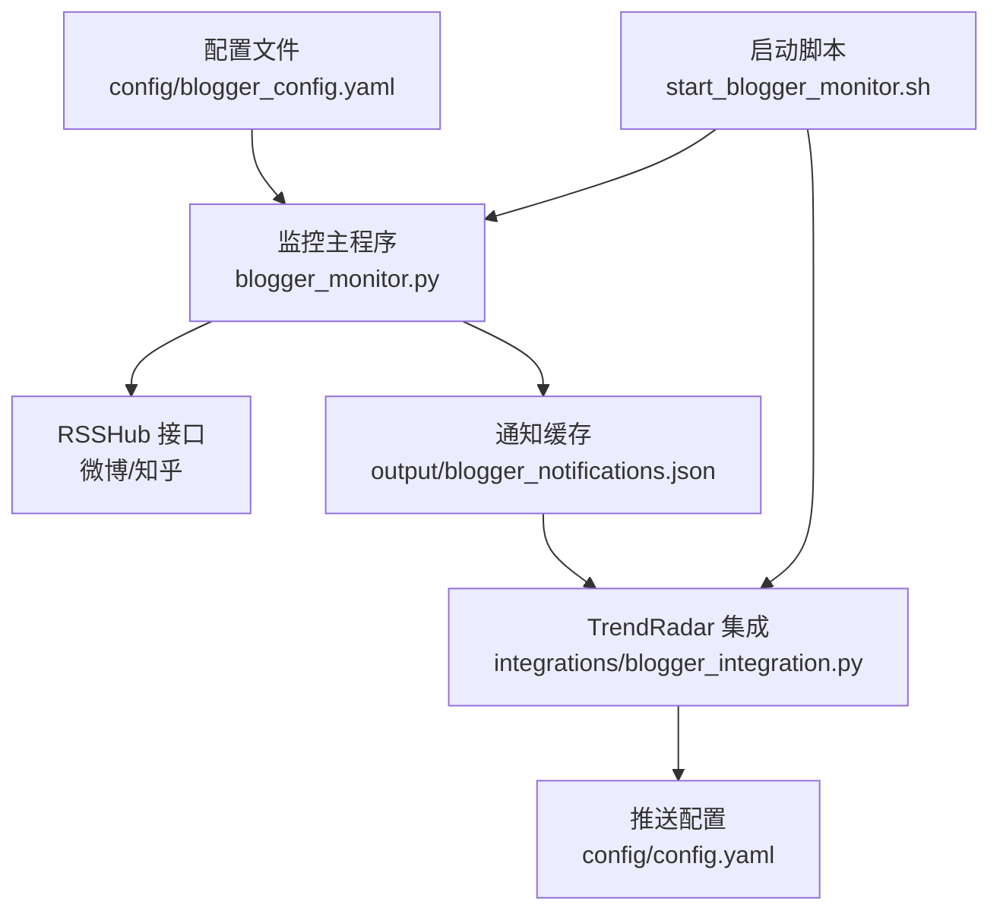
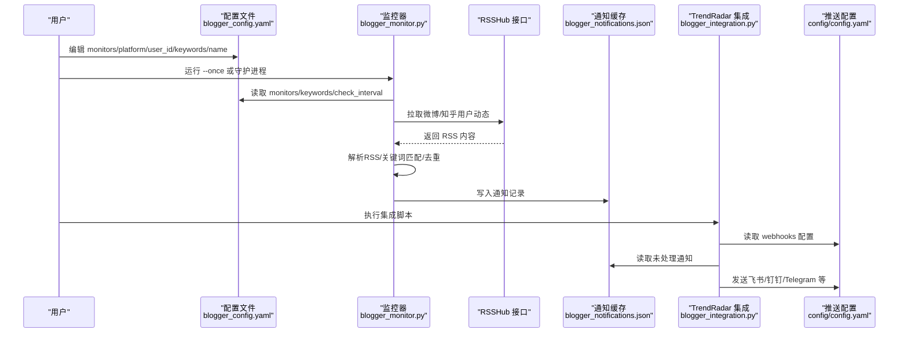
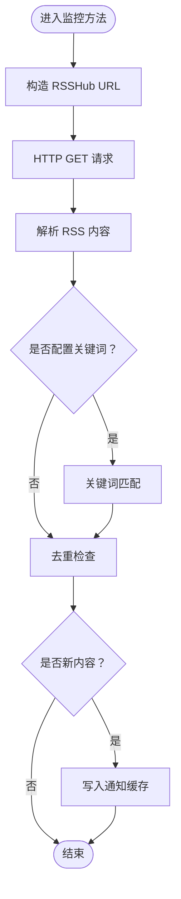
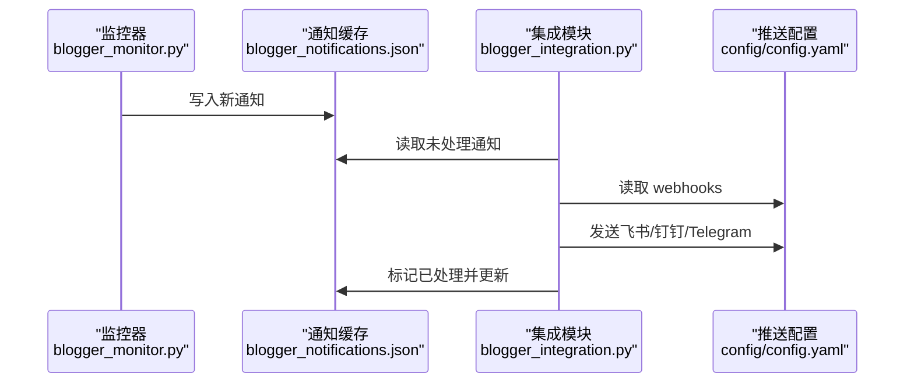
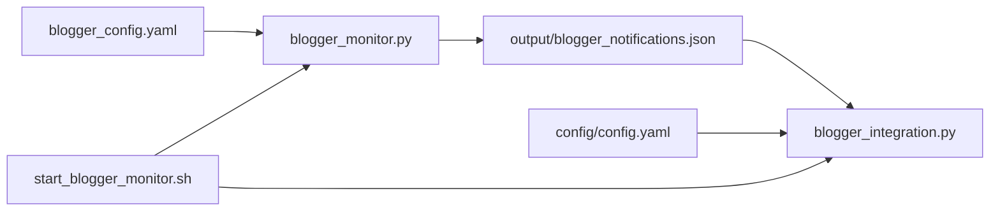

# 监控目标配置

<cite>
**本文引用的文件**
- [blogger_config.yaml](file://config/blogger_config.yaml)
- [blogger_monitor.py](file://blogger_monitor.py)
- [README-BloggerMonitor.md](file://README-BloggerMonitor.md)
- [blogger_integration.py](file://integrations/blogger_integration.py)
- [config.yaml](file://config/config.yaml)
- [BlogMonitor-Architecture.md](file://BlogMonitor-Architecture.md)
- [start_blogger_monitor.sh](file://start_blogger_monitor.sh)
</cite>

## 目录
1. [简介](#简介)
2. [项目结构](#项目结构)
3. [核心组件](#核心组件)
4. [架构总览](#架构总览)
5. [详细组件分析](#详细组件分析)
6. [依赖关系分析](#依赖关系分析)
7. [性能考虑](#性能考虑)
8. [故障排查指南](#故障排查指南)
9. [结论](#结论)
10. [附录](#附录)

## 简介
本文围绕博客博主监控配置，系统讲解配置文件中 monitors 列表的字段含义、配置要求与最佳实践，并结合代码实现说明不同平台（微博、知乎）的 user_id 获取方式、关键词过滤机制、通知与集成流程，以及常见问题的排查方法。读者无需深入编程即可理解如何正确配置与使用。

## 项目结构
与“监控目标配置”直接相关的文件与职责如下：
- config/blogger_config.yaml：博主监控目标与全局参数配置入口
- blogger_monitor.py：监控主流程、RSSHub抓取、关键词匹配、通知落盘
- integrations/blogger_integration.py：与 TrendRadar 推送系统对接，格式化并发送通知
- config/config.yaml：TrendRadar 推送渠道配置（飞书、钉钉、Telegram 等）
- README-BloggerMonitor.md：官方使用说明与故障排除
- BlogMonitor-Architecture.md：整体架构文档（含 MCP 工具定义）
- start_blogger_monitor.sh：便捷启动脚本（单次/守护进程/查看日志/集成推送）

图表来源
- [blogger_config.yaml](file://config/blogger_config.yaml#L1-L60)
- [blogger_monitor.py](file://blogger_monitor.py#L1-L120)
- [blogger_integration.py](file://integrations/blogger_integration.py#L1-L120)
- [config.yaml](file://config/config.yaml#L92-L110)
- [start_blogger_monitor.sh](file://start_blogger_monitor.sh#L1-L146)

章节来源
- [blogger_config.yaml](file://config/blogger_config.yaml#L1-L60)
- [blogger_monitor.py](file://blogger_monitor.py#L1-L120)
- [blogger_integration.py](file://integrations/blogger_integration.py#L1-L120)
- [config.yaml](file://config/config.yaml#L92-L110)
- [start_blogger_monitor.sh](file://start_blogger_monitor.sh#L1-L146)

## 核心组件
- 配置文件结构
  - monitors：监控目标数组，每个元素包含 platform、user_id、keywords、name 等字段
  - keywords：全局关键词，对所有监控目标生效
  - notification：通知开关与渠道
  - check_interval、max_posts_per_check：监控周期与单次抓取上限
  - rsshub：RSSHub 地址配置（公共实例或私有实例）
  - cache：缓存过期与容量配置
- 监控主流程
  - 读取配置，逐个监控目标执行
  - 调用 RSSHub 接口抓取用户动态
  - 关键词匹配与去重
  - 通知落盘与缓存更新
- TrendRadar 集成
  - 将通知转换为 TrendRadar 格式并发送到配置的 webhook 渠道

章节来源
- [blogger_config.yaml](file://config/blogger_config.yaml#L1-L60)
- [blogger_monitor.py](file://blogger_monitor.py#L293-L351)
- [blogger_integration.py](file://integrations/blogger_integration.py#L1-L120)
- [config.yaml](file://config/config.yaml#L92-L110)

## 架构总览
下图展示了从配置到通知的关键流程，映射到实际代码文件：

图表来源
- [blogger_config.yaml](file://config/blogger_config.yaml#L1-L60)
- [blogger_monitor.py](file://blogger_monitor.py#L293-L351)
- [blogger_integration.py](file://integrations/blogger_integration.py#L103-L170)
- [config.yaml](file://config/config.yaml#L92-L110)

## 详细组件分析

### monitors 列表字段详解
- platform
  - 作用：指定平台类型，当前支持 weibo、zhihu
  - 配置要求：必须为受支持的平台标识符；不支持的平台会被跳过并记录警告
- user_id
  - 作用：平台用户标识，用于构造 RSSHub 请求
  - 配置要求：
    - 微博：必须为数字ID（示例见配置文件与官方说明）
    - 知乎：可为用户名或ID（RSSHub 支持两种形式）
- keywords
  - 作用：用户特定关键词，仅对该用户的帖子进行过滤
  - 配置要求：列表项为字符串；匹配规则为不区分大小写的部分匹配
- name
  - 作用：用户备注，便于识别与管理
  - 配置要求：可选字段，不影响功能

章节来源
- [blogger_config.yaml](file://config/blogger_config.yaml#L1-L30)
- [blogger_monitor.py](file://blogger_monitor.py#L309-L320)
- [README-BloggerMonitor.md](file://README-BloggerMonitor.md#L66-L90)

### 平台 user_id 获取方式
- 微博
  - 步骤：访问用户主页 URL，其中数字部分即为用户ID
  - 示例：用户主页 URL 中的数字即为 user_id
- 知乎
  - 步骤：访问用户主页 URL，其中用户名部分即为 user_id
  - 说明：RSSHub 支持用户名或ID两种形式

章节来源
- [README-BloggerMonitor.md](file://README-BloggerMonitor.md#L66-L90)

### 个性化关键词设置
- 用户特定关键词
  - 在 monitors 每个目标下配置 keywords，仅对该用户生效
- 全局关键词
  - 在配置顶层 keywords 下配置，对所有监控目标生效
- 匹配规则
  - 不区分大小写，采用部分匹配；匹配任一关键词即视为命中

章节来源
- [blogger_config.yaml](file://config/blogger_config.yaml#L30-L35)
- [blogger_monitor.py](file://blogger_monitor.py#L302-L304)

### 监控目标实现机制（monitor_weibo_user / monitor_zhihu_user）
- 流程概览
  - 构造 RSSHub 请求 URL（微博/知乎）
  - 发起 HTTP 请求并解析 RSS 内容
  - 应用关键词过滤
  - 去重（基于内容哈希）
  - 生成通知并写入缓存
- 关键实现要点
  - RSSHub 接口：微博使用用户动态接口，知乎使用用户活动接口
  - RSS 解析：使用正则表达式提取 item 标签及字段
  - 去重：对每条内容生成哈希，缓存中不存在则视为新内容
  - 错误处理：捕获异常并记录日志，返回空列表避免中断

图表来源
- [blogger_monitor.py](file://blogger_monitor.py#L115-L191)
- [blogger_monitor.py](file://blogger_monitor.py#L193-L244)

章节来源
- [blogger_monitor.py](file://blogger_monitor.py#L115-L191)
- [blogger_monitor.py](file://blogger_monitor.py#L193-L244)

### 通知与集成机制
- 通知落盘
  - 将新发现的内容写入 output/blogger_notifications.json，保留最近100条
  - 控制台输出简洁通知摘要
- TrendRadar 集成
  - 读取 config/config.yaml 中的 webhooks 配置
  - 将通知转换为 TrendRadar 格式并发送至飞书、钉钉、Telegram 等
  - 集成脚本会标记已处理并更新缓存

图表来源
- [blogger_monitor.py](file://blogger_monitor.py#L245-L292)
- [blogger_integration.py](file://integrations/blogger_integration.py#L103-L170)
- [config.yaml](file://config/config.yaml#L92-L110)

章节来源
- [blogger_monitor.py](file://blogger_monitor.py#L245-L292)
- [blogger_integration.py](file://integrations/blogger_integration.py#L103-L170)
- [config.yaml](file://config/config.yaml#L92-L110)

### 配置示例
- 微博用户示例
  - platform: weibo
  - user_id: 数字ID
  - keywords: 可选，如 ["人工智能","AI","大模型"]
  - name: 可选备注
- 知乎用户示例
  - platform: zhihu
  - user_id: 用户名或ID
  - keywords: 可选，如 ["创业","技术","产品"]
  - name: 可选备注
- 全局关键词
  - 在配置顶层 keywords 下添加，如 ["热点","新闻","重要"]

章节来源
- [blogger_config.yaml](file://config/blogger_config.yaml#L1-L30)
- [blogger_config.yaml](file://config/blogger_config.yaml#L30-L35)

## 依赖关系分析
- 配置依赖
  - blogger_config.yaml 为监控目标与参数的唯一来源
  - config/config.yaml 为 TrendRadar 推送渠道配置的唯一来源
- 代码依赖
  - blogger_monitor.py 依赖 YAML 配置与 RSSHub 接口
  - integrations/blogger_integration.py 依赖 TrendRadar 配置与通知缓存
- 启动脚本依赖
  - start_blogger_monitor.sh 提供便捷入口，自动检测配置并引导初始化

图表来源
- [blogger_config.yaml](file://config/blogger_config.yaml#L1-L60)
- [blogger_monitor.py](file://blogger_monitor.py#L1-L120)
- [blogger_integration.py](file://integrations/blogger_integration.py#L1-L120)
- [config.yaml](file://config/config.yaml#L92-L110)
- [start_blogger_monitor.sh](file://start_blogger_monitor.sh#L1-L146)

章节来源
- [blogger_config.yaml](file://config/blogger_config.yaml#L1-L60)
- [blogger_monitor.py](file://blogger_monitor.py#L1-L120)
- [blogger_integration.py](file://integrations/blogger_integration.py#L1-L120)
- [config.yaml](file://config/config.yaml#L92-L110)
- [start_blogger_monitor.sh](file://start_blogger_monitor.sh#L1-L146)

## 性能考虑
- 检查间隔与抓取上限
  - check_interval 建议不低于 300 秒，避免过于频繁导致 RSSHub 压力
  - max_posts_per_check 建议 5-20，平衡实时性与资源消耗
- 去重与缓存
  - 基于内容哈希的去重避免重复通知
  - 缓存过期与容量配置可减少重复抓取与磁盘占用
- RSSHub 可用性
  - 若公共实例不稳定，可考虑自建或镜像，或使用代理

章节来源
- [blogger_config.yaml](file://config/blogger_config.yaml#L46-L60)
- [blogger_monitor.py](file://blogger_monitor.py#L115-L191)
- [README-BloggerMonitor.md](file://README-BloggerMonitor.md#L84-L90)

## 故障排查指南
- RSSHub 访问失败
  - 现象：监控方法抛出异常并返回空列表
  - 处理：检查网络连通性、更换 RSSHub 实例或开启代理
- 用户ID格式错误
  - 微博必须为数字ID；知乎可为用户名或ID
  - 处理：核对用户主页URL，修正 user_id
- 关键词匹配失败
  - 现象：未触发通知
  - 处理：确认关键词大小写与特殊字符；尝试更通用关键词；查看日志
- 推送通知失败
  - 现象：集成模块发送失败
  - 处理：检查 config/config.yaml 中 webhooks 配置是否正确；查看日志定位错误
- 平台不支持
  - 现象：记录警告并跳过该目标
  - 处理：确认 platform 值为 weibo 或 zhihu

章节来源
- [blogger_monitor.py](file://blogger_monitor.py#L115-L191)
- [blogger_monitor.py](file://blogger_monitor.py#L311-L320)
- [blogger_integration.py](file://integrations/blogger_integration.py#L150-L216)
- [README-BloggerMonitor.md](file://README-BloggerMonitor.md#L182-L209)

## 结论
通过规范配置 monitors 列表的 platform、user_id、keywords、name 字段，并结合 RSSHub 抓取与关键词匹配机制，可高效实现对微博、知乎等平台博主的个性化监控。配合 TrendRadar 推送系统，能够将通知统一推送到多种渠道。建议合理设置检查间隔与抓取上限，确保系统稳定运行；出现问题时，依据日志与配置文件进行快速定位与修复。

## 附录

### 配置字段对照表
- monitors[].platform
  - 作用：平台标识
  - 取值：weibo、zhihu
- monitors[].user_id
  - 作用：用户标识
  - 取值：微博为数字ID；知乎为用户名或ID
- monitors[].keywords
  - 作用：用户特定关键词
  - 取值：字符串列表
- monitors[].name
  - 作用：备注
  - 取值：字符串
- keywords
  - 作用：全局关键词
  - 取值：字符串列表
- notification.enable/channels
  - 作用：通知开关与渠道
  - 取值：布尔值与渠道列表
- check_interval/max_posts_per_check
  - 作用：检查周期与抓取上限
  - 取值：数值（秒/条）
- rsshub.public_url/private_url
  - 作用：RSSHub 地址
  - 取值：URL
- cache.expire_days/max_cache_size
  - 作用：缓存策略
  - 取值：天数与条目数

章节来源
- [blogger_config.yaml](file://config/blogger_config.yaml#L1-L60)
- [config.yaml](file://config/config.yaml#L92-L110)