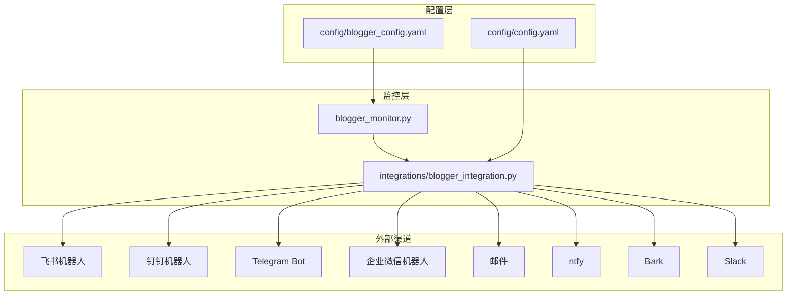
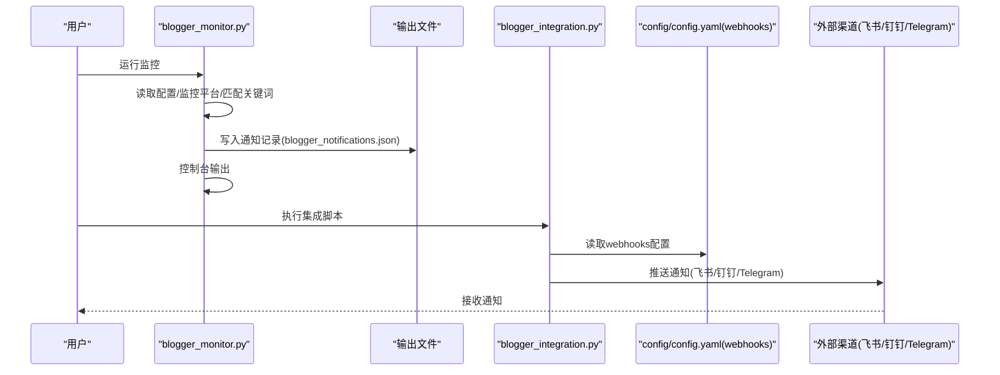
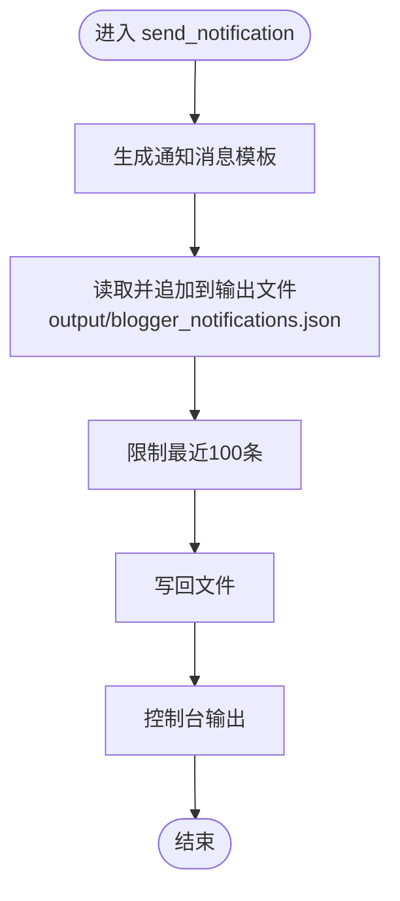
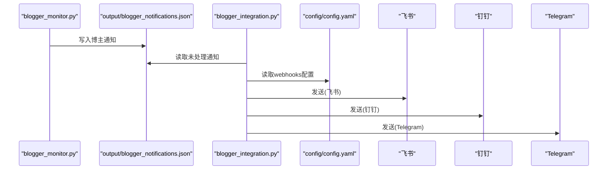
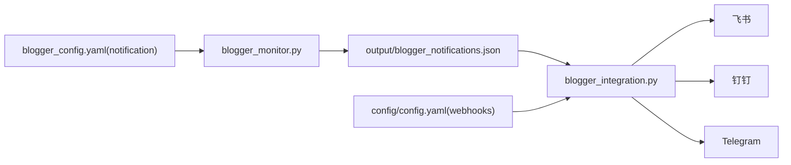

# 通知渠道配置

<cite>
**本文引用的文件**
- [blogger_config.yaml](file://config/blogger_config.yaml)
- [blogger_monitor.py](file://blogger_monitor.py)
- [blogger_integration.py](file://integrations/blogger_integration.py)
- [README-BloggerMonitor.md](file://README-BloggerMonitor.md)
- [README.md](file://README.md)
- [README-EN.md](file://README-EN.md)
- [main.py](file://main.py)
</cite>

## 目录
1. [简介](#简介)
2. [项目结构](#项目结构)
3. [核心组件](#核心组件)
4. [架构总览](#架构总览)
5. [详细组件分析](#详细组件分析)
6. [依赖关系分析](#依赖关系分析)
7. [性能考量](#性能考量)
8. [故障排查指南](#故障排查指南)
9. [结论](#结论)
10. [附录](#附录)

## 简介
本文件围绕博客博主监控工具中的通知配置进行系统性讲解，重点覆盖以下方面：
- blogger_config.yaml 中 notification 配置项的使用方法，包括 enable 开关与 channels 列表的启用条件与配置方式
- 结合 blogger_monitor.py 中 send_notification 方法，分析通知消息的生成逻辑与输出格式
- 如何扩展支持更多通知渠道（如微信、Telegram）的实现路径
- 通知配置的典型场景示例与故障排查技巧（通知未触发、消息格式异常等）

## 项目结构
与通知配置直接相关的文件与职责如下：
- config/blogger_config.yaml：博主监控的 YAML 配置文件，包含 monitors、keywords、notification 等字段
- blogger_monitor.py：博主监控主程序，负责读取配置、监控平台、关键词匹配、生成通知并输出到控制台与输出文件
- integrations/blogger_integration.py：与 TrendRadar 推送系统集成，将博主监控结果格式化并经由 TrendRadar 的 webhooks 推送至飞书、钉钉、Telegram 等渠道
- README-BloggerMonitor.md：博主监控工具的使用说明，包含与 TrendRadar 集成、文件结构、故障排除等内容
- README.md / README-EN.md：TrendRadar 主工程的多账号推送配置与渠道说明
- main.py：TrendRadar 主流程中读取环境变量/配置并解析多账号配置、校验配对参数、输出通知渠道来源信息

图表来源
- [blogger_config.yaml](file://config/blogger_config.yaml#L36-L45)
- [blogger_monitor.py](file://blogger_monitor.py#L245-L291)
- [blogger_integration.py](file://integrations/blogger_integration.py#L103-L128)
- [README-BloggerMonitor.md](file://README-BloggerMonitor.md#L90-L111)

章节来源
- [blogger_config.yaml](file://config/blogger_config.yaml#L36-L45)
- [blogger_monitor.py](file://blogger_monitor.py#L245-L291)
- [blogger_integration.py](file://integrations/blogger_integration.py#L103-L128)
- [README-BloggerMonitor.md](file://README-BloggerMonitor.md#L90-L111)

## 核心组件
- notification.enable：控制是否启用通知（布尔值）。当为 false 时，监控到的新内容仍会写入输出文件，但不会通过 TrendRadar 的 webhooks 推送
- notification.channels：通知渠道列表，支持的值包括 console、file、email、wechat、telegram 等（具体取决于配置与实现）
- send_notification：在 blogger_monitor.py 中生成通知消息、写入输出文件并打印到控制台；当前代码中对 channels 的判断与分支处理尚未生效，实际推送由 TrendRadar 的 webhooks 驱动
- TrendRadar 集成：blogger_integration.py 读取 config/config.yaml 中的 webhooks 配置，将博主监控结果格式化后通过飞书、钉钉、Telegram 等渠道推送

章节来源
- [blogger_config.yaml](file://config/blogger_config.yaml#L36-L45)
- [blogger_monitor.py](file://blogger_monitor.py#L245-L291)
- [blogger_integration.py](file://integrations/blogger_integration.py#L103-L128)

## 架构总览
博主监控通知的总体流程：
1. 读取 blogger_config.yaml 的 notification 配置
2. 执行监控任务，匹配关键词，生成新内容
3. send_notification 写入输出文件并打印控制台
4. 若启用 TrendRadar 集成，则通过 integrations/blogger_integration.py 读取 config/config.yaml 的 webhooks，将博主内容格式化并推送到各渠道

图表来源
- [blogger_monitor.py](file://blogger_monitor.py#L245-L291)
- [blogger_integration.py](file://integrations/blogger_integration.py#L103-L128)
- [README-BloggerMonitor.md](file://README-BloggerMonitor.md#L90-L111)

## 详细组件分析

### 1) blogger_config.yaml 中 notification 配置项
- enable：布尔开关，true 表示启用通知；false 表示禁用通知推送（但仍会写入输出文件）
- channels：通知渠道列表，支持的值包括 console、file、email、wechat、telegram 等。其中：
  - console：控制台输出（始终生效）
  - file：保存到文件（当前代码中未显式启用 file，但可通过配置启用）
  - email、wechat、telegram：需要在 config/config.yaml 中配置对应的 webhooks 参数后，才会通过 TrendRadar 推送系统发送

章节来源
- [blogger_config.yaml](file://config/blogger_config.yaml#L36-L45)
- [blogger_monitor.py](file://blogger_monitor.py#L70-L75)
- [blogger_monitor.py](file://blogger_monitor.py#L383-L386)

### 2) send_notification 方法的消息生成与输出
send_notification 的职责：
- 生成统一的通知消息模板，包含平台、用户、时间、内容摘要与链接
- 将通知追加到 output/blogger_notifications.json，并限制最近 100 条
- 控制台输出该消息
- 当前代码中未对 channels 列表进行分支处理，因此不会根据 channels 的值决定是否发送 email/wechat/telegram

图表来源
- [blogger_monitor.py](file://blogger_monitor.py#L245-L291)

章节来源
- [blogger_monitor.py](file://blogger_monitor.py#L245-L291)

### 3) TrendRadar 集成与渠道推送
- integrations/blogger_integration.py 会读取 config/config.yaml 中的 webhooks 配置，将博主监控结果格式化为 TrendRadar 兼容格式，并通过飞书、钉钉、Telegram 等渠道推送
- README-BloggerMonitor.md 明确指出“博主监控会自动读取 config/config.yaml 中的推送配置，支持飞书、钉钉、Telegram、企业微信机器人”
- README.md / README-EN.md 提供了多账号推送配置、配对参数校验、渠道来源统计等细节

图表来源
- [blogger_integration.py](file://integrations/blogger_integration.py#L103-L128)
- [README-BloggerMonitor.md](file://README-BloggerMonitor.md#L90-L111)

章节来源
- [blogger_integration.py](file://integrations/blogger_integration.py#L103-L128)
- [README-BloggerMonitor.md](file://README-BloggerMonitor.md#L90-L111)
- [README.md](file://README.md#L846-L1522)
- [README-EN.md](file://README-EN.md#L809-L1422)

### 4) 扩展支持更多通知渠道（微信、Telegram 等）的实现路径
- 当前 send_notification 未根据 channels 列表进行分支处理，若要在 blogger_monitor.py 内部直接扩展，可在 send_notification 中增加对 channels 的判断，分别调用 email/wechat/telegram 的发送逻辑
- 更推荐的方式是通过 TrendRadar 的 webhooks 配置实现多渠道推送，因为：
  - integrations/blogger_integration.py 已内置飞书、钉钉、Telegram 的发送方法
  - README.md / README-EN.md 提供了多账号配置、配对参数校验、渠道来源统计等完整实践
  - main.py 中解析并校验了 TELEGRAM_BOT_TOKEN 与 TELEGRAM_CHAT_ID 的配对数量，确保推送一致性

实现建议：
- 在 config/config.yaml 的 webhooks 中添加 email、wechat、telegram 等配置项
- 若需要多账号，使用英文分号分隔多个值，并确保配对参数数量一致
- 通过 integrations/blogger_integration.py 的 send_notifications_via_trendradar 方法统一推送

章节来源
- [blogger_monitor.py](file://blogger_monitor.py#L245-L291)
- [blogger_integration.py](file://integrations/blogger_integration.py#L103-L128)
- [README.md](file://README.md#L846-L1522)
- [README-EN.md](file://README-EN.md#L809-L1422)
- [main.py](file://main.py#L283-L381)

## 依赖关系分析
- blogger_monitor.py 依赖 config/blogger_config.yaml 的 notification 配置，用于控制是否启用通知与渠道列表
- integrations/blogger_integration.py 依赖 config/config.yaml 的 webhooks 配置，用于实际推送
- README-BloggerMonitor.md 指明博主监控与 TrendRadar 推送系统集成，统一通过 webhooks 推送
- README.md / README-EN.md 提供了多账号推送、配对参数校验、渠道来源统计等支撑

图表来源
- [blogger_config.yaml](file://config/blogger_config.yaml#L36-L45)
- [blogger_monitor.py](file://blogger_monitor.py#L245-L291)
- [blogger_integration.py](file://integrations/blogger_integration.py#L103-L128)
- [README-BloggerMonitor.md](file://README-BloggerMonitor.md#L90-L111)

章节来源
- [blogger_config.yaml](file://config/blogger_config.yaml#L36-L45)
- [blogger_monitor.py](file://blogger_monitor.py#L245-L291)
- [blogger_integration.py](file://integrations/blogger_integration.py#L103-L128)
- [README-BloggerMonitor.md](file://README-BloggerMonitor.md#L90-L111)

## 性能考量
- 输出文件大小控制：send_notification 仅保留最近 100 条通知，避免文件无限增长
- 监控间隔与最大获取条数：config/blogger_config.yaml 中的 check_interval 与 max_posts_per_check 影响监控频率与每次处理的数据量
- 多账号推送：README.md / README-EN.md 提供了多账号配置与数量限制，避免过多并发导致资源压力

章节来源
- [blogger_monitor.py](file://blogger_monitor.py#L281-L286)
- [blogger_config.yaml](file://config/blogger_config.yaml#L47-L49)
- [README.md](file://README.md#L846-L1522)
- [README-EN.md](file://README-EN.md#L809-L1422)

## 故障排查指南
- 通知未触发
  - 检查 blogger_config.yaml 的 notification.enable 是否为 true
  - 确认是否执行了 integrations/blogger_integration.py 的处理流程，以将 output/blogger_notifications.json 中的未处理通知推送到各渠道
  - 检查 config/config.yaml 的 webhooks 是否正确配置，特别是 TELEGRAM_BOT_TOKEN 与 TELEGRAM_CHAT_ID 数量是否一致
- 消息格式异常
  - send_notification 输出的是纯文本格式，若需要富文本，建议通过 TrendRadar 的 webhooks（如飞书 interactive card、钉钉 markdown）实现
  - Telegram 默认使用 Markdown，若出现格式问题，检查内容中是否包含未转义的特殊字符
- 渠道配置错误
  - 多账号配置需使用英文分号分隔，且配对参数数量必须一致（如 Telegram 的 token 与 chat_id）
  - 邮件推送需配置至少 EMAIL_FROM、EMAIL_PASSWORD、EMAIL_TO，必要时指定 SMTP 服务器与端口

章节来源
- [blogger_monitor.py](file://blogger_monitor.py#L245-L291)
- [blogger_integration.py](file://integrations/blogger_integration.py#L103-L128)
- [README.md](file://README.md#L846-L1522)
- [README-EN.md](file://README-EN.md#L809-L1422)
- [main.py](file://main.py#L283-L381)

## 结论
- blogger_config.yaml 的 notification.enable 与 channels 控制着通知的启用与渠道选择
- send_notification 当前主要负责生成消息并写入输出文件与控制台；实际推送由 TrendRadar 的 webhooks 驱动
- 扩展更多通知渠道的最佳实践是通过 config/config.yaml 的 webhooks 配置，配合 integrations/blogger_integration.py 的统一推送逻辑
- 多账号与配对参数校验、渠道来源统计等能力由 README.md / README-EN.md 与 main.py 提供，便于规模化部署与运维

## 附录

### A. 典型配置场景示例
- 仅控制台输出：channels 中仅包含 console
- 多渠道推送：在 config/config.yaml 的 webhooks 中配置飞书、钉钉、Telegram 等，blogger_monitor.py 生成通知后，通过 integrations/blogger_integration.py 推送
- 多账号推送：使用英文分号分隔多个值，并确保配对参数数量一致

章节来源
- [blogger_config.yaml](file://config/blogger_config.yaml#L36-L45)
- [blogger_integration.py](file://integrations/blogger_integration.py#L103-L128)
- [README.md](file://README.md#L846-L1522)
- [README-EN.md](file://README-EN.md#L809-L1422)