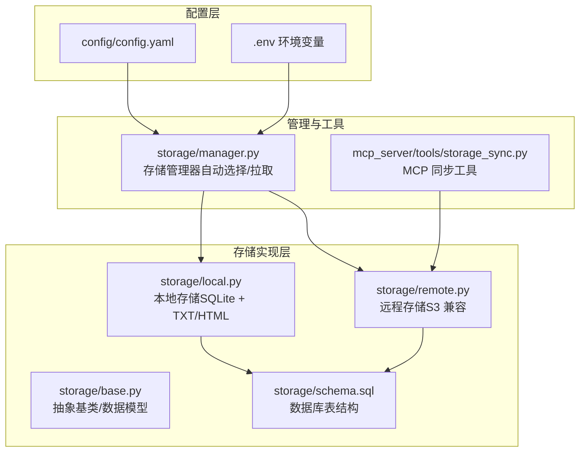
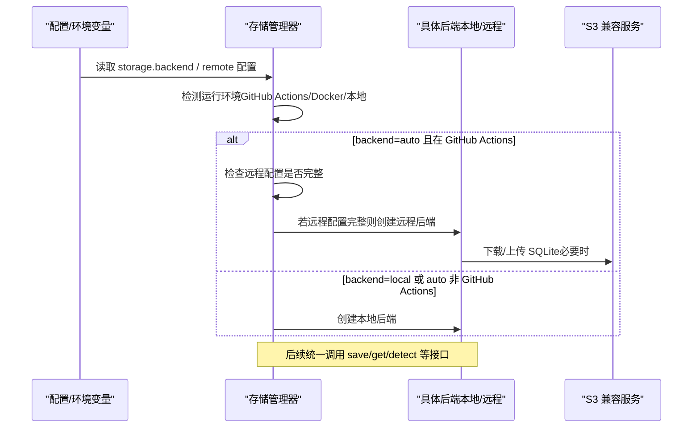
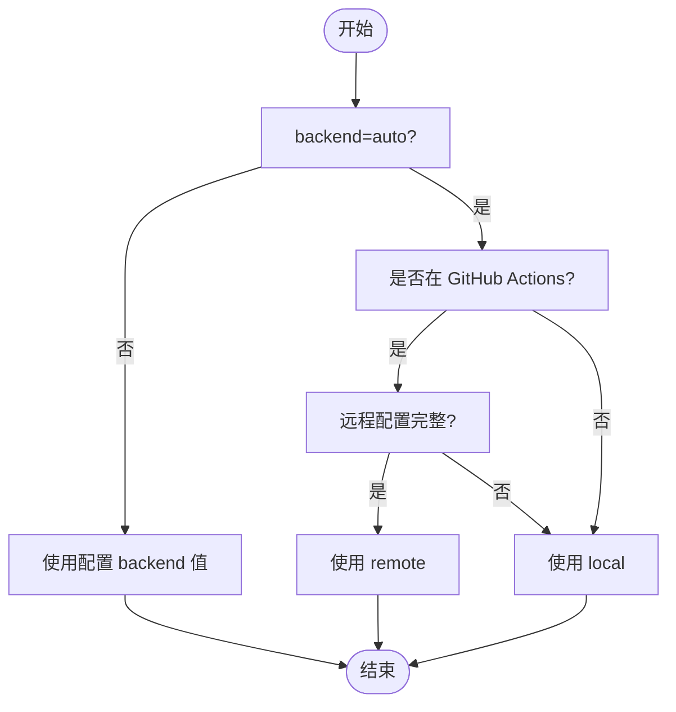
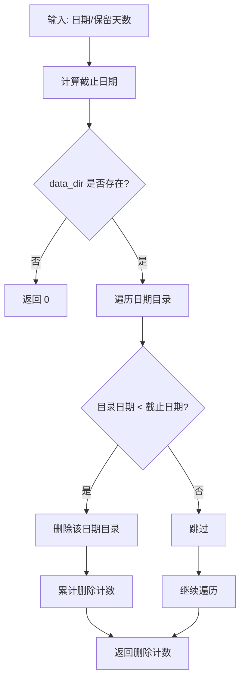
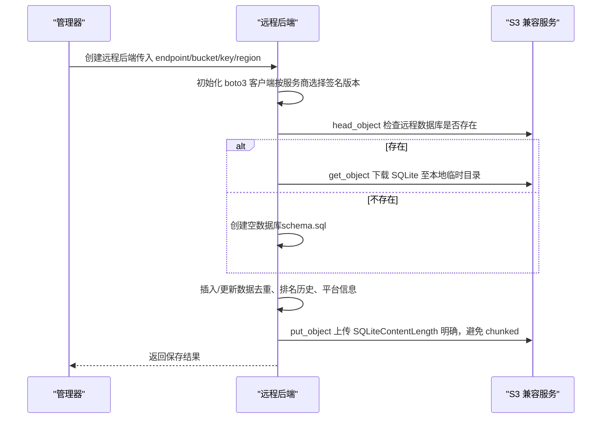
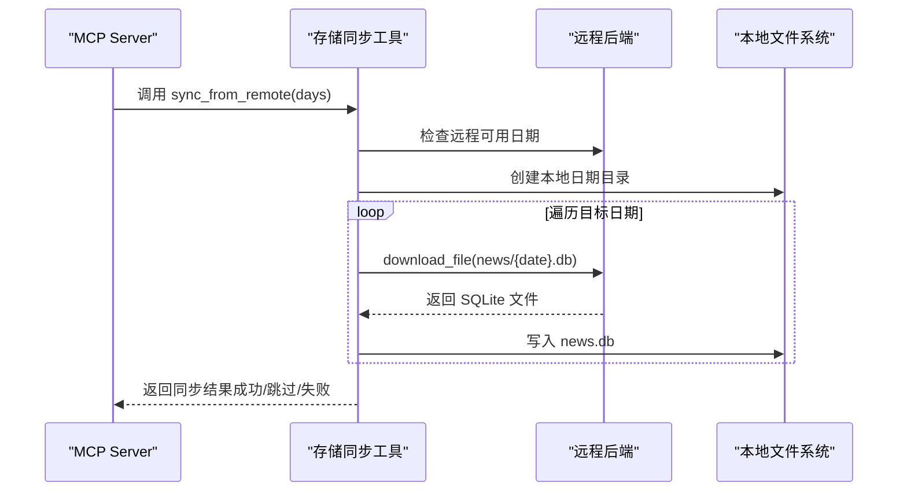
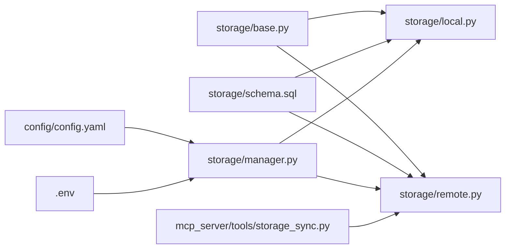

# 存储配置

<cite>
**本文引用的文件**
- [config.yaml](file://config/config.yaml)
- [storage/base.py](file://trendradar/storage/base.py)
- [storage/local.py](file://trendradar/storage/local.py)
- [storage/remote.py](file://trendradar/storage/remote.py)
- [storage/manager.py](file://trendradar/storage/manager.py)
- [storage/schema.sql](file://trendradar/storage/schema.sql)
- [mcp_server/tools/storage_sync.py](file://mcp_server/tools/storage_sync.py)
- [docker/.env](file://docker/.env)
- [docker/Dockerfile](file://docker/Dockerfile)
</cite>

## 目录
1. [简介](#简介)
2. [项目结构](#项目结构)
3. [核心组件](#核心组件)
4. [架构总览](#架构总览)
5. [详细组件分析](#详细组件分析)
6. [依赖关系分析](#依赖关系分析)
7. [性能考量](#性能考量)
8. [故障排查指南](#故障排查指南)
9. [结论](#结论)
10. [附录](#附录)

## 简介
本章节聚焦“storage”配置节的全部选项，系统性阐述：
- backend 三种模式（local、remote、auto）及其适用场景
- auto 在 GitHub Actions 中的智能判断逻辑
- 本地存储路径 data_dir 与数据保留策略 retention_days
- 远程存储（S3 兼容）关键参数 endpoint_url、bucket_name、access_key_id、secret_access_key、region
- 主流服务商（Cloudflare R2、阿里云 OSS、腾讯云 COS）的配置要点
- pull 配置在 MCP Server 场景下的数据同步机制
- 敏感信息通过环境变量注入的最佳实践

## 项目结构
storage 相关代码位于 trendradar/storage 目录，采用“抽象基类 + 本地/远程具体实现 + 管理器”的分层设计；MCP Server 提供独立的存储同步工具，便于在 MCP 场景下拉取远程数据到本地。

图表来源
- [config.yaml](file://config/config.yaml#L12-L52)
- [storage/manager.py](file://trendradar/storage/manager.py#L18-L110)
- [storage/local.py](file://trendradar/storage/local.py#L1-L120)
- [storage/remote.py](file://trendradar/storage/remote.py#L1-L120)
- [storage/schema.sql](file://trendradar/storage/schema.sql#L1-L118)
- [mcp_server/tools/storage_sync.py](file://mcp_server/tools/storage_sync.py#L1-L120)

章节来源
- [config.yaml](file://config/config.yaml#L12-L52)
- [storage/manager.py](file://trendradar/storage/manager.py#L18-L110)
- [storage/local.py](file://trendradar/storage/local.py#L1-L120)
- [storage/remote.py](file://trendradar/storage/remote.py#L1-L120)
- [storage/schema.sql](file://trendradar/storage/schema.sql#L1-L118)
- [mcp_server/tools/storage_sync.py](file://mcp_server/tools/storage_sync.py#L1-L120)

## 核心组件
- 抽象基类与数据模型：定义统一的存储接口与数据结构，保证本地/远程实现的一致性。
- 本地存储后端：基于 SQLite 的本地持久化，支持可选的 TXT 快照与 HTML 报告。
- 远程存储后端：基于 S3 兼容协议（boto3），支持 Cloudflare R2、阿里云 OSS、腾讯云 COS、AWS S3、MinIO 等。
- 存储管理器：根据 backend 类型与运行环境（GitHub Actions/Docker/本地）自动选择后端，并提供拉取、清理等能力。
- MCP 同步工具：在 MCP Server 场景下，从远程拉取数据到本地，支持列出可用日期、获取状态等。

章节来源
- [storage/base.py](file://trendradar/storage/base.py#L187-L356)
- [storage/local.py](file://trendradar/storage/local.py#L1-L120)
- [storage/remote.py](file://trendradar/storage/remote.py#L1-L120)
- [storage/manager.py](file://trendradar/storage/manager.py#L18-L110)
- [mcp_server/tools/storage_sync.py](file://mcp_server/tools/storage_sync.py#L1-L120)

## 架构总览
storage 的整体架构围绕“统一接口 + 多后端实现 + 环境感知 + MCP 同步”展开。管理器负责在运行时解析配置与环境变量，自动选择后端；远程后端通过 S3 兼容 API 与对象存储交互；本地后端通过 SQLite 与文件系统交互；MCP 同步工具提供面向 MCP Server 的数据拉取与状态查询能力。

图表来源
- [storage/manager.py](file://trendradar/storage/manager.py#L93-L110)
- [storage/manager.py](file://trendradar/storage/manager.py#L126-L173)
- [storage/remote.py](file://trendradar/storage/remote.py#L178-L274)
- [config.yaml](file://config/config.yaml#L12-L52)

## 详细组件分析

### storage 配置节详解
- backend：选择存储后端
  - local：本地 SQLite + TXT/HTML 文件
  - remote：远程云存储（S3 兼容协议）
  - auto：自动选择（在 GitHub Actions 且配置了远程存储时使用 remote，否则使用 local）
- formats：数据格式选项
  - sqlite：主存储（必须启用）
  - txt：是否生成 TXT 快照
  - html：是否生成 HTML 报告（邮件推送必须设为 true，否则会报错）
- local：本地存储配置
  - data_dir：数据目录（默认 output）
  - retention_days：本地数据保留天数（0 = 不清理）
- remote：远程存储配置（S3 兼容协议）
  - retention_days：远程数据保留天数（0 = 不清理）
  - endpoint_url：服务端点（或环境变量 S3_ENDPOINT_URL）
  - bucket_name：存储桶名称（或环境变量 S3_BUCKET_NAME）
  - access_key_id：访问密钥 ID（或环境变量 S3_ACCESS_KEY_ID）
  - secret_access_key：访问密钥（或环境变量 S3_SECRET_ACCESS_KEY）
  - region：区域（可选，部分服务商需要，或环境变量 S3_REGION）
- pull：数据拉取配置（MCP Server 等场景）
  - enabled：是否启用启动时自动拉取
  - days：拉取最近 N 天的数据（0 = 不拉取）

章节来源
- [config.yaml](file://config/config.yaml#L12-L52)

### backend 模式与 auto 判断逻辑
- local：适用于本地开发、测试或无需共享数据的场景。
- remote：适用于需要跨设备/跨环境共享数据、CI/CD 场景或集中化存储。
- auto：
  - 在 GitHub Actions 环境中，若配置了远程存储（endpoint_url、bucket_name、access_key_id、secret_access_key 均存在），则使用 remote；否则回退到 local。
  - 非 GitHub Actions 环境下，auto 默认使用 local。
- 环境变量优先级：当配置文件中未提供某些字段时，管理器会尝试从环境变量读取（如 S3_*、STORAGE_* 等），从而实现敏感信息的安全注入。

图表来源
- [storage/manager.py](file://trendradar/storage/manager.py#L93-L110)
- [storage/manager.py](file://trendradar/storage/manager.py#L107-L125)
- [docker/.env](file://docker/.env#L92-L116)

章节来源
- [storage/manager.py](file://trendradar/storage/manager.py#L93-L110)
- [storage/manager.py](file://trendradar/storage/manager.py#L107-L125)
- [docker/.env](file://docker/.env#L92-L116)

### 本地存储（local）：data_dir 与 retention_days
- data_dir：本地数据目录，默认 output。管理器会据此定位每日数据库文件与快照/报告目录。
- retention_days：
  - 本地清理：当 local.retention_days > 0 时，管理器会在清理阶段删除早于保留期限的日期目录。
  - 远程清理：当 remote.retention_days > 0 且已配置远程存储时，管理器也会尝试清理远程数据（由远程后端实现）。
- 本地后端特性：
  - 使用 SQLite 作为主存储，表结构由 schema.sql 定义。
  - 支持可选的 TXT 快照与 HTML 报告生成。
  - 提供“首次抓取检测”、“新增标题检测”等能力。

图表来源
- [storage/local.py](file://trendradar/storage/local.py#L746-L800)
- [storage/manager.py](file://trendradar/storage/manager.py#L235-L255)

章节来源
- [config.yaml](file://config/config.yaml#L26-L30)
- [storage/local.py](file://trendradar/storage/local.py#L746-L800)
- [storage/manager.py](file://trendradar/storage/manager.py#L235-L255)
- [storage/schema.sql](file://trendradar/storage/schema.sql#L1-L118)

### 远程存储（remote）：S3 兼容参数与适配
- 关键参数：
  - endpoint_url：对象存储服务端点（如 Cloudflare R2、阿里云 OSS、腾讯云 COS、AWS S3、MinIO 等）
  - bucket_name：存储桶名称
  - access_key_id / secret_access_key：访问凭据
  - region：区域（可选，部分服务商需要）
  - retention_days：远程数据保留天数（0 = 不清理）
- 适配细节：
  - 使用 boto3 客户端，启用 virtual-hosted style addressing，提升兼容性。
  - 针对腾讯云 COS 的特殊处理：使用 SigV2 以避免 chunked transfer encoding 问题；其他服务商默认使用 SigV4。
  - 数据流程：下载当天 SQLite → 合并新数据 → 上传回远程。
- 环境变量注入：优先从环境变量读取（S3_ENDPOINT_URL、S3_BUCKET_NAME、S3_ACCESS_KEY_ID、S3_SECRET_ACCESS_KEY、S3_REGION），避免在配置文件中明文存储敏感信息。

图表来源
- [storage/remote.py](file://trendradar/storage/remote.py#L93-L116)
- [storage/remote.py](file://trendradar/storage/remote.py#L178-L274)
- [storage/remote.py](file://trendradar/storage/remote.py#L275-L311)
- [storage/remote.py](file://trendradar/storage/remote.py#L312-L512)

章节来源
- [config.yaml](file://config/config.yaml#L31-L46)
- [storage/remote.py](file://trendradar/storage/remote.py#L93-L116)
- [storage/remote.py](file://trendradar/storage/remote.py#L178-L274)
- [storage/remote.py](file://trendradar/storage/remote.py#L275-L311)
- [storage/remote.py](file://trendradar/storage/remote.py#L312-L512)

### 主流服务商配置要点（Cloudflare R2、阿里云 OSS、腾讯云 COS）
- Cloudflare R2
  - endpoint_url：形如 https://<account_id>.r2.cloudflarestorage.com
  - bucket_name：你的 R2 存储桶名称
  - region：可选（R2 通常不需要显式 region）
- 阿里云 OSS
  - endpoint_url：形如 https://oss-cn-hangzhou.aliyuncs.com
  - bucket_name：你的 OSS 存储桶名称
  - region：建议与 bucket 所属区域一致
- 腾讯云 COS
  - endpoint_url：形如 https://cos.ap-guangzhou.myqcloud.com
  - bucket_name：你的 COS 存储桶名称
  - region：建议与 bucket 所属区域一致
  - 注意：远程后端会自动选择 SigV2 以适配腾讯云 COS 的传输编码

章节来源
- [config.yaml](file://config/config.yaml#L38-L45)
- [storage/remote.py](file://trendradar/storage/remote.py#L93-L116)

### pull 配置与 MCP Server 场景
- pull.enabled：是否在启动时自动从远程拉取数据到本地
- pull.days：拉取最近 N 天的数据（0 = 不拉取）
- MCP 同步工具：
  - 从远程拉取数据到本地：支持按日期范围拉取、跳过已存在日期、失败重试等。
  - 获取存储状态：展示本地/远程配置、保留天数、目录大小、最早/最新日期等。
  - 列出可用日期：支持本地、远程或两者对比。
- 适用场景：爬虫写入远程，MCP 侧拉取到本地进行分析与可视化。

图表来源
- [mcp_server/tools/storage_sync.py](file://mcp_server/tools/storage_sync.py#L176-L274)
- [mcp_server/tools/storage_sync.py](file://mcp_server/tools/storage_sync.py#L289-L371)
- [mcp_server/tools/storage_sync.py](file://mcp_server/tools/storage_sync.py#L373-L469)

章节来源
- [config.yaml](file://config/config.yaml#L47-L52)
- [mcp_server/tools/storage_sync.py](file://mcp_server/tools/storage_sync.py#L176-L274)
- [mcp_server/tools/storage_sync.py](file://mcp_server/tools/storage_sync.py#L289-L371)
- [mcp_server/tools/storage_sync.py](file://mcp_server/tools/storage_sync.py#L373-L469)

### 敏感信息注入与安全建议
- 环境变量优先：优先从环境变量读取 S3_* 与 STORAGE_* 相关配置，避免在配置文件中明文存储敏感信息。
- Docker 环境：Dockerfile 中设置了常用环境变量名，可在 .env 中统一注入。
- MCP Server：同步工具同样支持从环境变量读取远程配置，便于在 CI/CD 环境中安全注入。

章节来源
- [storage/manager.py](file://trendradar/storage/manager.py#L107-L125)
- [mcp_server/tools/storage_sync.py](file://mcp_server/tools/storage_sync.py#L54-L77)
- [docker/.env](file://docker/.env#L92-L116)
- [docker/Dockerfile](file://docker/Dockerfile#L67-L70)

## 依赖关系分析
- 抽象基类与数据模型：为本地/远程后端提供统一接口契约，确保行为一致性。
- 本地后端依赖 schema.sql 定义的数据库表结构。
- 远程后端依赖 boto3，且根据 endpoint_url 自动选择签名版本。
- 管理器依赖环境变量与配置文件，决定后端选择与清理策略。
- MCP 同步工具依赖远程后端能力，提供日期拉取与状态查询。

图表来源
- [storage/base.py](file://trendradar/storage/base.py#L187-L356)
- [storage/local.py](file://trendradar/storage/local.py#L1-L120)
- [storage/remote.py](file://trendradar/storage/remote.py#L1-L120)
- [storage/schema.sql](file://trendradar/storage/schema.sql#L1-L118)
- [storage/manager.py](file://trendradar/storage/manager.py#L18-L110)
- [mcp_server/tools/storage_sync.py](file://mcp_server/tools/storage_sync.py#L1-L120)
- [config.yaml](file://config/config.yaml#L12-L52)
- [docker/.env](file://docker/.env#L92-L116)

章节来源
- [storage/base.py](file://trendradar/storage/base.py#L187-L356)
- [storage/local.py](file://trendradar/storage/local.py#L1-L120)
- [storage/remote.py](file://trendradar/storage/remote.py#L1-L120)
- [storage/schema.sql](file://trendradar/storage/schema.sql#L1-L118)
- [storage/manager.py](file://trendradar/storage/manager.py#L18-L110)
- [mcp_server/tools/storage_sync.py](file://mcp_server/tools/storage_sync.py#L1-L120)
- [config.yaml](file://config/config.yaml#L12-L52)
- [docker/.env](file://docker/.env#L92-L116)

## 性能考量
- 本地存储：SQLite 适合中小规模数据；当数据量增大时，建议结合索引与合理的 retention_days 控制目录数量。
- 远程存储：下载/上传 SQLite 时采用明确 ContentLength，避免 chunked transfer encoding 导致的兼容性问题；对腾讯云 COS 使用 SigV2；对其他服务商使用 SigV4。
- 清理策略：合理设置 retention_days，避免历史数据过多导致 IO 压力与成本上升。
- MCP 同步：按需拉取最近 N 天数据，避免一次性拉取过多导致网络与磁盘压力。

## 故障排查指南
- 远程后端初始化失败
  - 现象：提示需要安装 boto3 或初始化失败
  - 排查：确认已安装 boto3；检查 endpoint_url、bucket_name、access_key_id、secret_access_key 是否完整；核对 region 设置
- 上传/下载异常
  - 现象：上传验证失败或下载异常
  - 排查：检查网络连通性；确认签名版本与服务端要求一致；检查对象键命名（news/{date}.db）
- 自动选择后端不符合预期
  - 现象：在 GitHub Actions 中未使用 remote
  - 排查：确认远程配置完整；检查环境变量是否正确注入；确认 GITHUB_ACTIONS 环境变量
- MCP 同步失败
  - 现象：拉取失败或状态查询异常
  - 排查：确认远程配置；检查远程可用日期；查看失败日期列表与错误信息

章节来源
- [storage/manager.py](file://trendradar/storage/manager.py#L126-L173)
- [storage/remote.py](file://trendradar/storage/remote.py#L225-L274)
- [mcp_server/tools/storage_sync.py](file://mcp_server/tools/storage_sync.py#L176-L274)

## 结论
storage 配置节提供了灵活的本地/远程存储切换能力，配合 auto 智能判断与环境变量注入，能够满足本地开发、CI/CD 与 MCP Server 等多种场景需求。通过合理的 data_dir、retention_days、pull 配置以及对主流 S3 兼容服务的参数适配，可以在保证安全性的同时获得良好的扩展性与稳定性。

## 附录
- 数据库表结构概览（来自 schema.sql）
  - platforms：平台信息表
  - news_items：新闻条目表（URL + platform_id 唯一索引）
  - title_changes：标题变更历史表
  - rank_history：排名历史表
  - crawl_records：抓取记录表
  - crawl_source_status：抓取来源状态表
  - push_records：推送记录表

章节来源
- [storage/schema.sql](file://trendradar/storage/schema.sql#L1-L118)