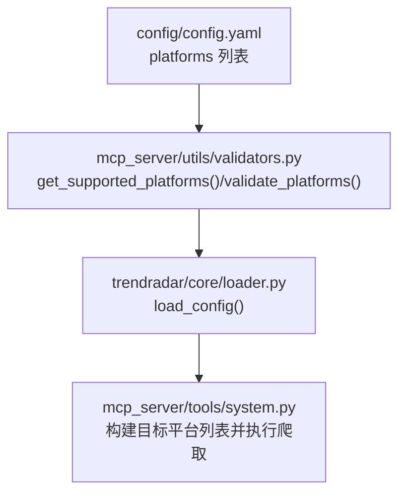
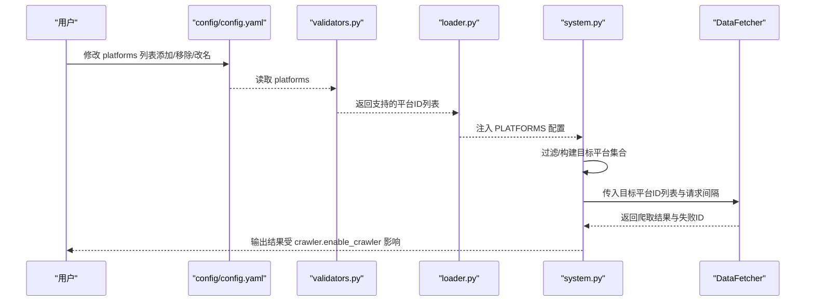
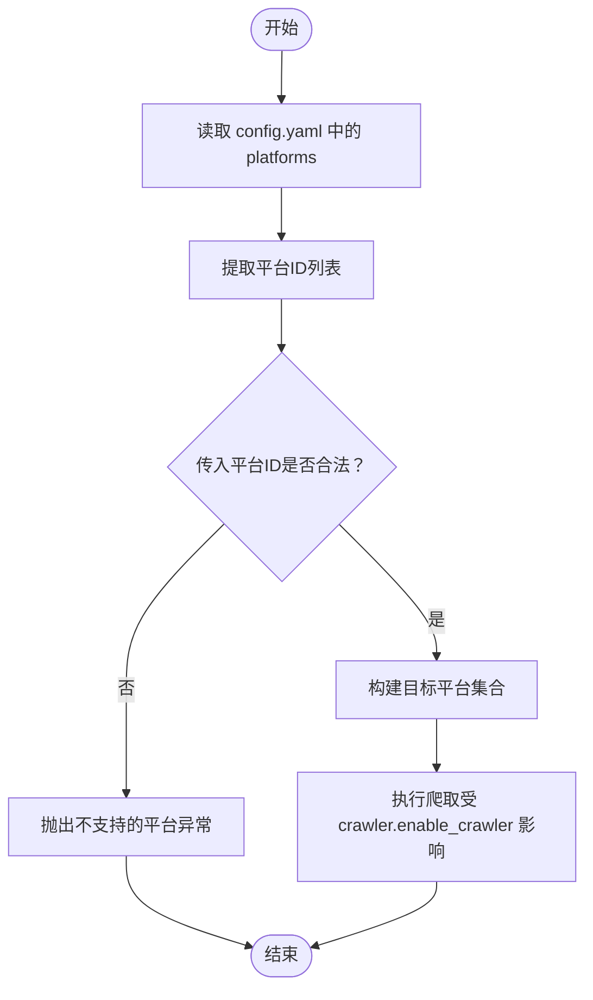
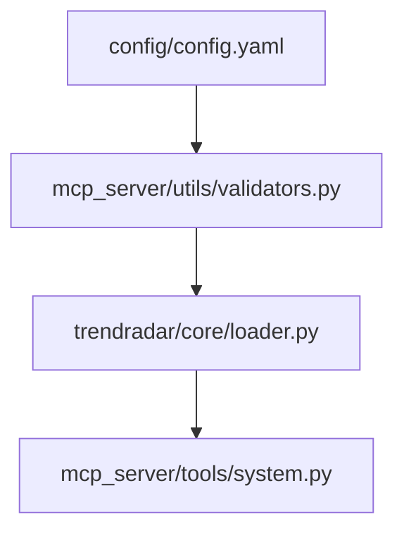

# 平台配置

<cite>
**本文引用的文件**
- [config.yaml](file://config/config.yaml)
- [README.md](file://README.md)
- [README-EN.md](file://README-EN.md)
- [validators.py](file://mcp_server/utils/validators.py)
- [loader.py](file://trendradar/core/loader.py)
- [system.py](file://mcp_server/tools/system.py)
</cite>

## 目录
1. [简介](#简介)
2. [项目结构](#项目结构)
3. [核心组件](#核心组件)
4. [架构总览](#架构总览)
5. [详细组件分析](#详细组件分析)
6. [依赖关系分析](#依赖关系分析)
7. [性能考量](#性能考量)
8. [故障排查指南](#故障排查指南)
9. [结论](#结论)
10. [附录](#附录)

## 简介
本章节聚焦于如何在配置文件中管理“监控平台”。重点解释 config.yaml 中 platforms 列表的结构与作用：其中每个平台的 id 字段必须与代码侧支持的平台标识符严格匹配，name 字段仅用于显示；同时说明当前已内置支持的11个平台及其 id；给出添加/移除平台的操作示例，并阐述修改后对爬取行为的影响；强调即使更改 name 也不会影响功能运行；最后解释平台启用逻辑与 crawler.enable_crawler 的关系，以及如何通过注释特定平台实现选择性禁用。

## 项目结构
- 平台配置位于 config/config.yaml 的 platforms 节点，采用列表形式，每个元素包含 id 与 name 两个字段。
- 平台校验逻辑由 mcp_server/utils/validators.py 提供，读取 config.yaml 中的 platforms 并进行合法性校验。
- 平台列表在运行时被加载到内存中，供爬取流程使用。

图表来源
- [config.yaml](file://config/config.yaml#L163-L187)
- [validators.py](file://mcp_server/utils/validators.py#L16-L41)
- [loader.py](file://trendradar/core/loader.py#L318-L322)
- [system.py](file://mcp_server/tools/system.py#L109-L171)

章节来源
- [config.yaml](file://config/config.yaml#L163-L187)
- [validators.py](file://mcp_server/utils/validators.py#L16-L41)
- [loader.py](file://trendradar/core/loader.py#L318-L322)
- [system.py](file://mcp_server/tools/system.py#L109-L171)

## 核心组件
- 平台配置文件：config/config.yaml 的 platforms 节点，包含 id 与 name 字段。
- 平台校验工具：validators.py 中的 get_supported_platforms() 与 validate_platforms()，用于从配置文件动态读取平台列表并进行校验。
- 配置加载器：loader.py 的 load_config()，将 platforms 节点加载到运行时配置中。
- 爬取执行：system.py 读取配置中的 platforms，构建目标平台集合并发起爬取。

章节来源
- [config.yaml](file://config/config.yaml#L163-L187)
- [validators.py](file://mcp_server/utils/validators.py#L16-L41)
- [validators.py](file://mcp_server/utils/validators.py#L43-L88)
- [loader.py](file://trendradar/core/loader.py#L318-L322)
- [system.py](file://mcp_server/tools/system.py#L109-L171)

## 架构总览
下图展示了平台配置从文件到运行时的流转过程，以及与爬取流程的关系。

图表来源
- [config.yaml](file://config/config.yaml#L163-L187)
- [validators.py](file://mcp_server/utils/validators.py#L16-L41)
- [validators.py](file://mcp_server/utils/validators.py#L43-L88)
- [loader.py](file://trendradar/core/loader.py#L318-L322)
- [system.py](file://mcp_server/tools/system.py#L109-L171)

## 详细组件分析

### 平台配置结构与字段语义
- id：平台唯一标识符，必须与代码侧支持的平台标识符一致，否则将触发校验失败。
- name：平台显示名称，仅用于界面或日志展示，修改不会影响功能运行。

章节来源
- [config.yaml](file://config/config.yaml#L163-L187)

### 支持的平台清单（当前内置11个）
以下为 config.yaml 中已内置的平台列表及对应 id。这些 id 必须与代码侧支持的平台标识符保持一致。

- 今日头条：id 为 “toutiao”
- 百度热搜：id 为 “baidu”
- 华尔街见闻：id 为 “wallstreetcn-hot”
- 澎湃新闻：id 为 “thepaper”
- bilibili 热搜：id 为 “bilibili-hot-search”
- 财联社热门：id 为 “cls-hot”
- 凤凰网：id 为 “ifeng”
- 贴吧：id 为 “tieba”
- 微博：id 为 “weibo”
- 抖音：id 为 “douyin”
- 知乎：id 为 “zhihu”

章节来源
- [config.yaml](file://config/config.yaml#L163-L187)

### 添加或移除平台的操作示例
- 添加平台：在 platforms 列表中新增一项，确保 id 与代码侧支持的标识符一致，name 可按需修改。
- 移除平台：从 platforms 列表中删除对应项。
- 修改 name：仅修改 name 字段，不影响功能运行。

说明
- 若新增平台 id 与代码侧不匹配，将导致平台校验失败，系统会提示不支持的平台。
- 若移除平台，后续爬取将不再包含该平台的数据。

章节来源
- [config.yaml](file://config/config.yaml#L163-L187)
- [validators.py](file://mcp_server/utils/validators.py#L43-L88)

### 平台启用逻辑与 crawler.enable_crawler 的关系
- crawler.enable_crawler 控制是否启用爬取功能。当其为 false 时，程序将直接停止，不会执行任何爬取动作，此时平台配置不会影响实际行为。
- 当 crawler.enable_crawler 为 true 时，系统会根据 platforms 列表构建目标平台集合，并执行爬取。

章节来源
- [config.yaml](file://config/config.yaml#L54-L56)
- [loader.py](file://trendradar/core/loader.py#L51-L60)
- [system.py](file://mcp_server/tools/system.py#L109-L171)

### 通过注释特定平台实现选择性禁用
- 在 config.yaml 中，可以通过注释掉某一行（例如在平台项前加注释符号）来临时禁用该平台，从而实现选择性禁用。
- 这种方式不会改变 id，仅影响该平台是否被纳入本次爬取任务。

章节来源
- [config.yaml](file://config/config.yaml#L163-L187)

### 平台校验与过滤流程
- 读取配置：validators.py 从 config.yaml 动态读取 platforms 并提取 id 列表。
- 校验平台：validate_platforms() 会对传入的平台ID进行校验，若不在配置列表中则抛出异常。
- 构建目标平台：system.py 会根据传入的平台ID列表或默认配置，过滤出目标平台集合，然后交由 DataFetcher 执行爬取。

图表来源
- [validators.py](file://mcp_server/utils/validators.py#L16-L41)
- [validators.py](file://mcp_server/utils/validators.py#L43-L88)
- [system.py](file://mcp_server/tools/system.py#L109-L171)

## 依赖关系分析
- config/config.yaml 是平台配置的权威来源。
- validators.py 依赖 config.yaml 的路径与结构，负责平台ID的读取与校验。
- loader.py 将 platforms 注入运行时配置，供其他模块使用。
- system.py 依据配置与传入参数，决定最终爬取哪些平台。

图表来源
- [config.yaml](file://config/config.yaml#L163-L187)
- [validators.py](file://mcp_server/utils/validators.py#L16-L41)
- [loader.py](file://trendradar/core/loader.py#L318-L322)
- [system.py](file://mcp_server/tools/system.py#L109-L171)

章节来源
- [config.yaml](file://config/config.yaml#L163-L187)
- [validators.py](file://mcp_server/utils/validators.py#L16-L41)
- [loader.py](file://trendradar/core/loader.py#L318-L322)
- [system.py](file://mcp_server/tools/system.py#L109-L171)

## 性能考量
- 平台数量与请求间隔：平台数量越多，爬取耗时越长；可通过调整 crawler.request_interval 控制请求间隔，平衡速度与稳定性。
- 爬取开关：当 crawler.enable_crawler 为 false 时，不执行任何爬取，可显著降低资源消耗。
- 选择性禁用：通过注释平台项减少参与爬取的平台，有助于优化性能与网络负载。

章节来源
- [config.yaml](file://config/config.yaml#L54-L56)
- [config.yaml](file://config/config.yaml#L163-L187)

## 故障排查指南
- 平台校验失败
  - 现象：提示不支持的平台或平台不存在。
  - 原因：传入的平台ID与 config.yaml 中的 id 不一致。
  - 处理：确保 id 与内置平台一致，或在代码侧增加对新平台的支持。
- 配置加载失败
  - 现象：平台配置未加载，系统允许所有平台通过（降级策略）。
  - 处理：检查 config.yaml 路径与权限，确认文件可读且格式正确。
- 爬取未执行
  - 现象：没有任何爬取结果。
  - 原因：crawler.enable_crawler 为 false。
  - 处理：将 crawler.enable_crawler 设置为 true。

章节来源
- [validators.py](file://mcp_server/utils/validators.py#L43-L88)
- [system.py](file://mcp_server/tools/system.py#L109-L171)
- [config.yaml](file://config/config.yaml#L54-L56)

## 结论
- platforms 列表中的 id 必须与代码侧支持的平台标识符一致，name 仅用于显示。
- 当前内置支持11个平台，新增/移除平台需谨慎核对 id。
- 修改 name 不会影响功能运行，但 id 的变更会导致平台校验失败。
- crawler.enable_crawler 控制是否执行爬取；通过注释平台项可实现选择性禁用。
- 建议根据实际需求精简平台数量，以获得更好的性能与体验。

## 附录
- 参考文档
  - 平台配置说明与添加示例（中文）：[README.md](file://README.md#L1676-L1704)
  - 平台配置说明与添加示例（英文）：[README-EN.md](file://README-EN.md#L1624-L1645)

章节来源
- [README.md](file://README.md#L1676-L1704)
- [README-EN.md](file://README-EN.md#L1624-L1645)