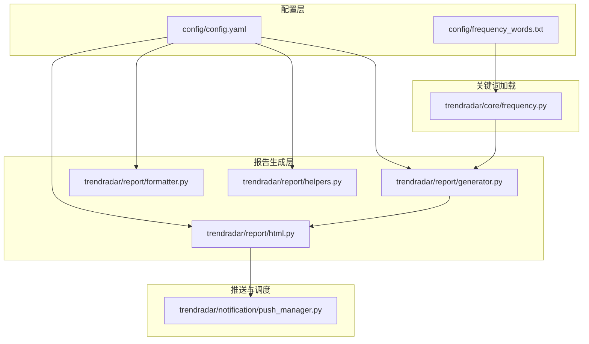
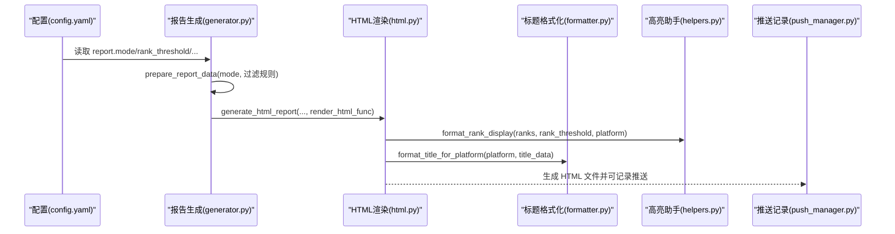
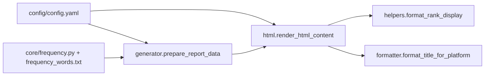

# 报告与推送模式配置

<cite>
**本文引用的文件**
- [config/config.yaml](file://config/config.yaml)
- [trendradar/report/generator.py](file://trendradar/report/generator.py)
- [trendradar/report/html.py](file://trendradar/report/html.py)
- [trendradar/report/formatter.py](file://trendradar/report/formatter.py)
- [trendradar/report/helpers.py](file://trendradar/report/helpers.py)
- [trendradar/notification/push_manager.py](file://trendradar/notification/push_manager.py)
- [trendradar/core/frequency.py](file://trendradar/core/frequency.py)
- [config/frequency_words.txt](file://config/frequency_words.txt)
- [README.md](file://README.md)
- [README-EN.md](file://README-EN.md)
</cite>

## 目录
1. [简介](#简介)
2. [项目结构](#项目结构)
3. [核心组件](#核心组件)
4. [架构总览](#架构总览)
5. [详细组件分析](#详细组件分析)
6. [依赖关系分析](#依赖关系分析)
7. [性能考量](#性能考量)
8. [故障排查指南](#故障排查指南)
9. [结论](#结论)
10. [附录](#附录)

## 简介
本文件围绕 report 模块的配置项进行系统性解析，重点说明三种推送模式（daily、current、incremental）的工作机制、推送时机与适用场景；解释 rank_threshold 对高亮排名的影响、sort_by_position_first 对关键词排序优先级的控制逻辑、max_news_per_keyword 的限制作用；并说明 reverse_content_order 如何改变报告内容顺序。最后结合用户工作流，给出不同使用场景下的推荐配置组合。

## 项目结构
与“报告与推送模式配置”直接相关的核心文件分布如下：
- 配置文件：config/config.yaml 提供 report 模块的关键参数
- 报告生成：trendradar/report/generator.py 负责准备报告数据与生成 HTML
- HTML 渲染：trendradar/report/html.py 负责渲染最终 HTML 内容
- 格式化与高亮：trendradar/report/formatter.py 与 trendradar/report/helpers.py 负责标题格式化与排名高亮
- 推送记录与时窗：trendradar/notification/push_manager.py 提供推送记录与时间窗口判断
- 关键词配置与加载：trendradar/core/frequency.py 与 config/frequency_words.txt 提供关键词规则与过滤

图表来源
- [config/config.yaml](file://config/config.yaml#L59-L81)
- [trendradar/report/generator.py](file://trendradar/report/generator.py#L14-L137)
- [trendradar/report/html.py](file://trendradar/report/html.py#L14-L120)
- [trendradar/report/formatter.py](file://trendradar/report/formatter.py#L13-L224)
- [trendradar/report/helpers.py](file://trendradar/report/helpers.py#L62-L126)
- [trendradar/notification/push_manager.py](file://trendradar/notification/push_manager.py#L15-L110)
- [trendradar/core/frequency.py](file://trendradar/core/frequency.py#L18-L95)
- [config/frequency_words.txt](file://config/frequency_words.txt#L1-L114)

章节来源
- [config/config.yaml](file://config/config.yaml#L59-L81)
- [trendradar/report/generator.py](file://trendradar/report/generator.py#L14-L137)
- [trendradar/report/html.py](file://trendradar/report/html.py#L14-L120)
- [trendradar/report/formatter.py](file://trendradar/report/formatter.py#L13-L224)
- [trendradar/report/helpers.py](file://trendradar/report/helpers.py#L62-L126)
- [trendradar/notification/push_manager.py](file://trendradar/notification/push_manager.py#L15-L110)
- [trendradar/core/frequency.py](file://trendradar/core/frequency.py#L18-L95)
- [config/frequency_words.txt](file://config/frequency_words.txt#L1-L114)

## 核心组件
- 报告模式与关键参数
  - report.mode：选择 daily、current 或 incremental
  - report.rank_threshold：排名高亮阈值
  - report.sort_by_position_first：排序优先级控制
  - report.max_news_per_keyword：每关键词最大显示数量
  - report.reverse_content_order：内容顺序控制
- 报告数据准备与 HTML 生成
  - generator.prepare_report_data：根据模式与过滤规则准备 stats 与新增新闻
  - generator.generate_html_report：生成 HTML 文件并可复制到根目录
  - html.render_html_content：渲染 HTML，支持 reverse_content_order
  - formatter.format_title_for_platform：按平台格式化标题，含新增标记与链接
  - helpers.format_rank_display：根据 rank_threshold 与平台类型高亮排名
- 关键词与过滤
  - frequency.py.load_frequency_words：加载词组、必须词、过滤词、全局过滤词与每组最大显示数
  - frequency_words.txt：默认词组配置文件

章节来源
- [config/config.yaml](file://config/config.yaml#L59-L81)
- [trendradar/report/generator.py](file://trendradar/report/generator.py#L14-L137)
- [trendradar/report/html.py](file://trendradar/report/html.py#L14-L120)
- [trendradar/report/formatter.py](file://trendradar/report/formatter.py#L13-L224)
- [trendradar/report/helpers.py](file://trendradar/report/helpers.py#L62-L126)
- [trendradar/core/frequency.py](file://trendradar/core/frequency.py#L18-L95)
- [config/frequency_words.txt](file://config/frequency_words.txt#L1-L114)

## 架构总览
下图展示了 report 模块从配置到推送的关键流程，包括三种推送模式的差异、关键词过滤与 HTML 渲染。

图表来源
- [config/config.yaml](file://config/config.yaml#L59-L81)
- [trendradar/report/generator.py](file://trendradar/report/generator.py#L14-L137)
- [trendradar/report/html.py](file://trendradar/report/html.py#L14-L120)
- [trendradar/report/formatter.py](file://trendradar/report/formatter.py#L13-L224)
- [trendradar/report/helpers.py](file://trendradar/report/helpers.py#L62-L126)
- [trendradar/notification/push_manager.py](file://trendradar/notification/push_manager.py#L15-L110)

## 详细组件分析

### 报告模式与推送时机
- daily（当日汇总）
  - 推送时机：按时推送（默认每小时一次）
  - 显示内容：当日所有匹配新闻 + 新增新闻区域
  - 适用场景：日报总结、全面了解当日热点趋势
- current（当前榜单）
  - 推送时机：按时推送（默认每小时一次）
  - 显示内容：当前榜单匹配新闻 + 新增新闻区域
  - 适用场景：实时热点追踪、了解当前最火的内容
- incremental（增量监控）
  - 推送时机：有新增才推送
  - 显示内容：新出现的匹配频率词新闻
  - 适用场景：避免重复信息干扰，适合高频监控

章节来源
- [config/config.yaml](file://config/config.yaml#L59-L73)
- [README.md](file://README.md#L2007-L2050)
- [README-EN.md](file://README-EN.md#L1941-L2001)

### rank_threshold 对高亮排名的影响
- 影响范围：HTML 报告与各平台消息中的排名高亮
- 逻辑要点：
  - 当最小排名小于等于阈值时，使用高亮格式（不同平台采用不同高亮标记）
  - 若最小排名与最大排名相同，显示为单一排名；否则显示区间
- 作用：帮助快速识别高热度新闻，便于优先阅读

章节来源
- [trendradar/report/helpers.py](file://trendradar/report/helpers.py#L62-L126)
- [trendradar/report/formatter.py](file://trendradar/report/formatter.py#L13-L224)
- [trendradar/report/html.py](file://trendradar/report/html.py#L545-L716)
- [config/config.yaml](file://config/config.yaml#L75-L81)

### sort_by_position_first 对关键词排序优先级的控制
- 控制逻辑：
  - false（默认）：按“热点条数降序”优先，其次按配置位置升序
  - true：按“配置位置升序”优先，其次按热点条数降序
- 适用场景：
  - false：关注热度趋势，优先展示更热的话题
  - true：关注个人优先级，优先展示配置靠前的关键词

章节来源
- [README-EN.md](file://README-EN.md#L1886-L1940)
- [README.md](file://README.md#L2594-L2609)

### max_news_per_keyword 的限制作用
- 限制对象：每个关键词组最多显示的新闻条数
- 优先级：
  - 单独配置（词组内的 @数字）优先于全局配置
  - 若词组未设置，则使用全局 report.max_news_per_keyword
- 作用：控制每关键词的展示规模，避免信息过载

章节来源
- [trendradar/core/frequency.py](file://trendradar/core/frequency.py#L18-L95)
- [README-EN.md](file://README-EN.md#L1904-L1940)
- [README.md](file://README.md#L2570-L2575)

### reverse_content_order 如何改变报告内容顺序
- 控制对象：热点词汇统计与新增热点新闻两部分的显示顺序
- false（默认）：热点词汇统计在前，新增热点新闻在后
- true：新增热点新闻在前，热点词汇统计在后
- 适用场景：
  - false：适合关注关键词匹配结果的用户，先看分类统计
  - true：适合关注最新动态的用户，优先查看新增热点

章节来源
- [config/config.yaml](file://config/config.yaml#L75-L81)
- [trendradar/report/html.py](file://trendradar/report/html.py#L709-L716)

### 关键词过滤与加载
- 加载流程：
  - 从配置文件加载词组、必须词、过滤词、全局过滤词
  - 支持每组最大显示数（@数字）
- 与推送的关系：
  - 在 prepare_report_data 中，若提供匹配函数与加载函数，则对新增新闻进行频率词过滤
  - 过滤后统计“频率词过滤后”的新增热点数量，与推送显示一致

章节来源
- [trendradar/core/frequency.py](file://trendradar/core/frequency.py#L18-L95)
- [config/frequency_words.txt](file://config/frequency_words.txt#L1-L114)
- [trendradar/report/generator.py](file://trendradar/report/generator.py#L42-L70)

### HTML 报告生成与推送记录
- HTML 生成：
  - generate_html_report：准备数据并调用渲染函数生成 HTML 文件
  - render_html_content：渲染 HTML，支持 reverse_content_order
- 推送记录与时窗：
  - PushRecordManager：提供每日只推送一次与时间窗口判断能力
  - 时区与时间：默认使用 Asia/Shanghai 时区

章节来源
- [trendradar/report/generator.py](file://trendradar/report/generator.py#L140-L236)
- [trendradar/report/html.py](file://trendradar/report/html.py#L14-L120)
- [trendradar/notification/push_manager.py](file://trendradar/notification/push_manager.py#L15-L110)
- [config/config.yaml](file://config/config.yaml#L1-L12)

## 依赖关系分析
- 配置到生成器
  - report.* 参数直接影响 prepare_report_data 与 generate_html_report 的行为
- 生成器到渲染器
  - prepare_report_data 输出的 report_data 作为 render_html_content 的输入
- 渲染器到格式化与高亮
  - render_html_content 调用 helpers.format_rank_display 与 formatter.format_title_for_platform
- 关键词配置到生成器
  - frequency.py 与 frequency_words.txt 提供过滤规则，影响新增新闻的过滤结果

图表来源
- [config/config.yaml](file://config/config.yaml#L59-L81)
- [trendradar/report/generator.py](file://trendradar/report/generator.py#L14-L137)
- [trendradar/report/html.py](file://trendradar/report/html.py#L14-L120)
- [trendradar/report/helpers.py](file://trendradar/report/helpers.py#L62-L126)
- [trendradar/report/formatter.py](file://trendradar/report/formatter.py#L13-L224)
- [trendradar/core/frequency.py](file://trendradar/core/frequency.py#L18-L95)
- [config/frequency_words.txt](file://config/frequency_words.txt#L1-L114)

## 性能考量
- 关键词过滤成本：频率词过滤在 prepare_report_data 中进行，对新增新闻进行逐标题匹配与过滤，建议合理设置 max_news_per_keyword 与关键词粒度，避免过多匹配开销
- HTML 渲染成本：render_html_content 会遍历 stats 与 new_titles，reverse_content_order 仅影响拼接顺序，不引入额外计算
- 排序优先级：sort_by_position_first 会影响排序键，但整体复杂度仍受新闻条目数量主导

## 故障排查指南
- 增量模式长时间无推送
  - 可能原因：当前时段无新增匹配新闻、关键词配置过严或过宽、监控平台数量较少
  - 解决方案：优化关键词配置、切换为 current/daily 模式、增加监控平台
- 推送时间窗口不生效
  - 检查 notification.push_window.enabled、time_range.start/end、once_per_day
  - 注意 GitHub Actions 执行时间不稳定，建议留足时间窗口并使用 Docker 部署以获得更准的时间
- 排名高亮不符合预期
  - 检查 report.rank_threshold 与平台高亮格式
  - 确认 ranks 列表非空且最小排名小于等于阈值

章节来源
- [README.md](file://README.md#L2034-L2050)
- [README-EN.md](file://README-EN.md#L1985-L2001)
- [trendradar/notification/push_manager.py](file://trendradar/notification/push_manager.py#L68-L110)
- [trendradar/report/helpers.py](file://trendradar/report/helpers.py#L62-L126)

## 结论
- report 模块通过 report.* 参数实现了灵活的报告与推送策略
- daily/current/incremental 三种模式分别满足“全量回顾”“实时追踪”“增量监控”的需求
- rank_threshold、sort_by_position_first、max_news_per_keyword、reverse_content_order 共同塑造了报告的可读性与信息密度
- 建议结合关键词配置与推送时间窗口，按场景选择最优组合

## 附录

### 推荐配置组合（基于用户工作流）
- 个人实时追踪
  - 模式：current
  - 排序：false（按热点条数优先）
  - 展示上限：max_news_per_keyword=0 或适度限制
  - 内容顺序：false（先看统计再看新增）
- 团队日报
  - 模式：daily
  - 排序：false（按热点条数优先）
  - 展示上限：max_news_per_keyword=0 或适度限制
  - 内容顺序：false（先看统计再看新增）
- 高频监控（如交易员）
  - 模式：incremental
  - 排序：false（按热点条数优先）
  - 展示上限：max_news_per_keyword=0 或适度限制
  - 内容顺序：false（先看统计再看新增）
- 优先关注个人优先级
  - 模式：current/daily/incremental 任选
  - 排序：true（按配置位置优先）
  - 展示上限：max_news_per_keyword=0 或适度限制
  - 内容顺序：false（先看统计再看新增）

章节来源
- [config/config.yaml](file://config/config.yaml#L59-L81)
- [README.md](file://README.md#L2007-L2050)
- [README-EN.md](file://README-EN.md#L1941-L2001)