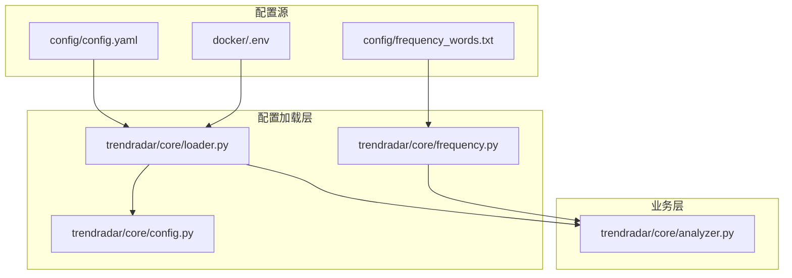
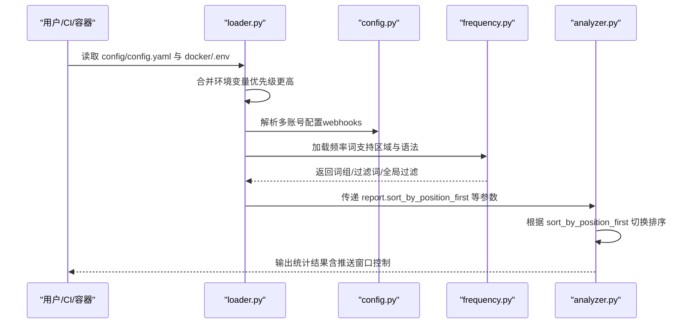
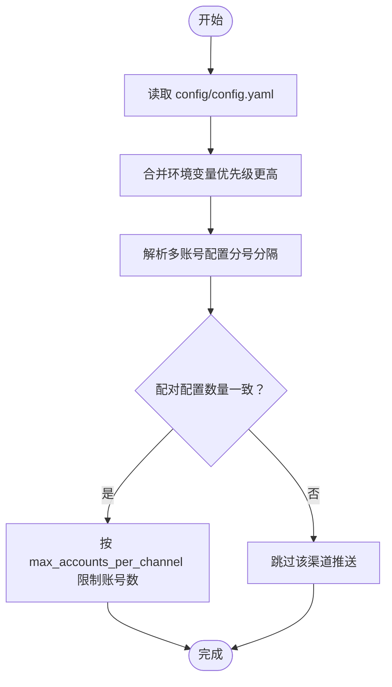
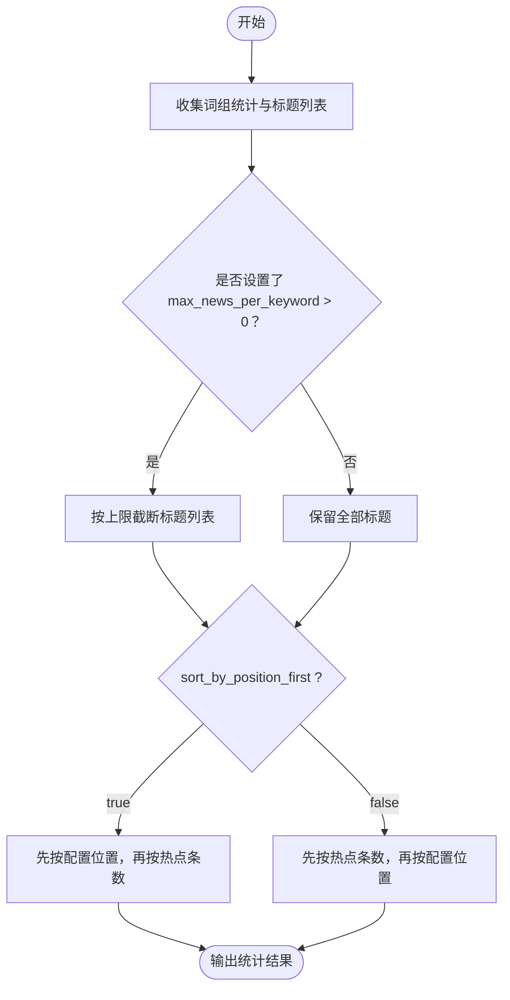
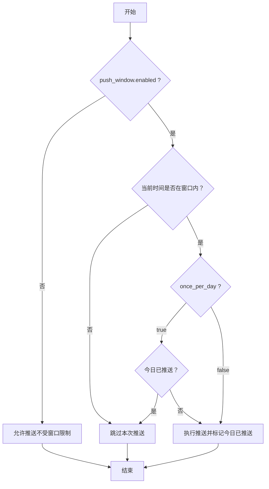
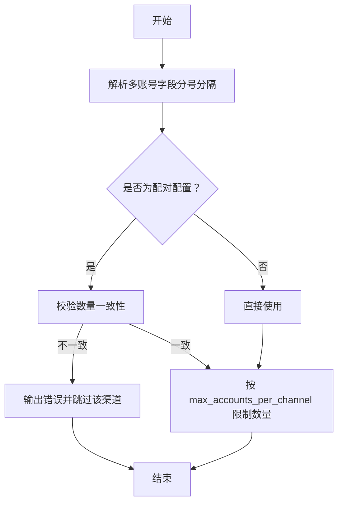
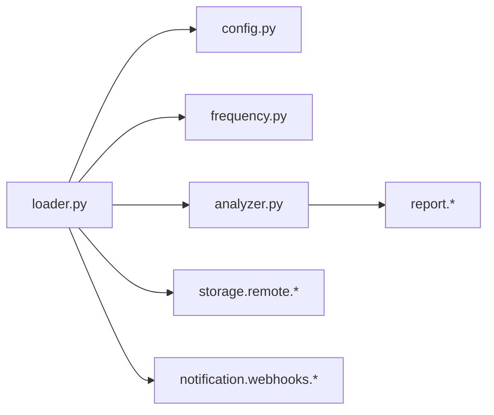

# 配置指南

<cite>
**本文引用的文件**
- [config/config.yaml](file://config/config.yaml)
- [config/frequency_words.txt](file://config/frequency_words.txt)
- [docker/.env](file://docker/.env)
- [trendradar/core/loader.py](file://trendradar/core/loader.py)
- [trendradar/core/config.py](file://trendradar/core/config.py)
- [trendradar/core/frequency.py](file://trendradar/core/frequency.py)
- [trendradar/core/analyzer.py](file://trendradar/core/analyzer.py)
- [README.md](file://README.md)
- [README-EN.md](file://README-EN.md)
</cite>

## 目录
1. [简介](#简介)
2. [项目结构](#项目结构)
3. [核心配置项总览](#核心配置项总览)
4. [架构概览](#架构概览)
5. [详细组件解析](#详细组件解析)
6. [依赖关系分析](#依赖关系分析)
7. [性能与可用性考量](#性能与可用性考量)
8. [故障排查指南](#故障排查指南)
9. [结论](#结论)
10. [附录](#附录)

## 简介
本指南面向用户与开发者，系统性解析配置体系，涵盖以下重点：
- 逐项解读 config.yaml 中的每个配置项，包括 app.timezone、storage.backend、report.mode、notification.push_window 等的作用、可选值、默认值与实际影响。
- 强调 notification.webhooks 的安全警告，指导通过环境变量或 GitHub Secrets 安全配置通知渠道。
- 深入讲解 frequency_words.txt 的高级用法：关键词分组、排序优先级（sort_by_position_first）、数量限制（@语法）的组合应用。
- 提供配置文件的完整示例与最佳实践，帮助根据使用场景（个人监控 vs. 团队共享）调整 push_window 与 max_accounts_per_channel 等参数。
- 说明环境变量覆盖机制（环境变量优先级高于 config.yaml），并给出 Docker 部署场景下的覆盖示例。

## 项目结构
配置相关的关键文件与职责如下：
- config/config.yaml：应用主配置，包含 app、storage、crawler、report、notification、weight、platforms 等节。
- config/frequency_words.txt：关键词配置文件，支持普通词组、必须词（+前缀）、过滤词（!前缀）、全局过滤区与数量限制（@前缀）。
- docker/.env：Docker 环境变量配置，用于覆盖 config.yaml 中的大部分运行期配置。
- trendradar/core/loader.py：统一加载配置，实现“环境变量 > config.yaml”的优先级策略。
- trendradar/core/config.py：多账号配置解析与校验工具（分号分隔、配对校验、数量限制）。
- trendradar/core/frequency.py：频率词加载与匹配逻辑，支持区域化分组与高级语法。
- trendradar/core/analyzer.py：分析阶段的排序逻辑，依据 sort_by_position_first 切换排序优先级。
- README.md / README-EN.md：官方文档，包含环境变量覆盖机制、推送时间窗口、多账号推送等详细说明与示例。



图表来源
- [config/config.yaml](file://config/config.yaml#L1-L187)
- [config/frequency_words.txt](file://config/frequency_words.txt#L1-L114)
- [docker/.env](file://docker/.env#L1-L130)
- [trendradar/core/loader.py](file://trendradar/core/loader.py#L1-L196)
- [trendradar/core/frequency.py](file://trendradar/core/frequency.py#L1-L195)
- [trendradar/core/analyzer.py](file://trendradar/core/analyzer.py#L441-L472)

章节来源
- [config/config.yaml](file://config/config.yaml#L1-L187)
- [config/frequency_words.txt](file://config/frequency_words.txt#L1-L114)
- [docker/.env](file://docker/.env#L1-L130)
- [trendradar/core/loader.py](file://trendradar/core/loader.py#L1-L196)
- [trendradar/core/frequency.py](file://trendradar/core/frequency.py#L1-L195)
- [trendradar/core/analyzer.py](file://trendradar/core/analyzer.py#L441-L472)

## 核心配置项总览
本节按配置文件的层级与功能，逐项说明关键配置项的作用、可选值、默认值与影响。

- app
  - version_check_url：版本检查地址（默认值来自配置文件）。
  - show_version_update：是否显示版本更新提示（默认开启）。
  - timezone：时区设置，影响时间显示、推送窗口判断与数据存储（默认“Asia/Shanghai”）。

- storage
  - backend：存储后端选择（local/remote/auto；默认 auto）。
  - formats.sqlite：主存储（必须启用）。
  - formats.txt/html：是否生成快照/报告（html 推送需启用）。
  - local.data_dir：本地数据目录（默认“output”）。
  - local.retention_days：本地数据保留天数（0=不清理）。
  - remote.retention_days：远程数据保留天数（0=不清理）。
  - remote.endpoint_url/bucket_name/access_key_id/secret_access_key/region：S3 兼容配置（建议通过环境变量注入）。

- crawler
  - request_interval：请求间隔（毫秒）。
  - enable_crawler：是否启用爬取（默认开启）。
  - use_proxy/default_proxy：代理开关与默认代理地址。

- report
  - mode：报告模式（daily/current/incremental；默认 current）。
  - rank_threshold：排名高亮阈值。
  - sort_by_position_first：排序优先级（true=先按配置位置，false=先按热点条数）。
  - max_news_per_keyword：每个关键词最大显示数量（0=不限制）。
  - reverse_content_order：内容顺序（false=热点统计在前，true=新增新闻在前）。

- notification
  - enable_notification：是否启用通知（默认开启）。
  - message_batch_size/dingtalk_batch_size/feishu_batch_size/bark_batch_size/slack_batch_size：各渠道分批大小（字节）。
  - batch_send_interval：批次发送间隔（秒）。
  - feishu_message_separator：飞书消息分隔线。
  - max_accounts_per_channel：每个渠道最大账号数量（建议不超过 3）。
  - push_window.enabled/time_range.start/end/once_per_day：推送时间窗口控制（默认关闭，窗口 20:00-22:00，每天仅一次）。
  - webhooks：通知渠道配置（多账号用分号分隔；多账号与配对项需数量一致；邮箱支持逗号分隔多收件人；ntfy 的 topic 与 token 数量一致）。

- weight
  - rank_weight/frequency_weight/hotness_weight：权重分配（合计约等于 1）。

- platforms
  - 平台列表（id/name），用于展示与统计。

章节来源
- [config/config.yaml](file://config/config.yaml#L1-L187)
- [README.md](file://README.md#L2216-L2719)
- [README-EN.md](file://README-EN.md#L2167-L2931)

## 架构概览
配置加载与应用流程如下：
- 配置来源：config/config.yaml 与 docker/.env。
- 加载策略：loader 模块读取 YAML 并合并环境变量，实现“环境变量 > config.yaml”的优先级。
- 多账号解析：config 工具对 webhooks 中的多账号进行解析、配对校验与数量限制。
- 频率词加载：frequency 模块解析 frequency_words.txt，支持分组、必须词、过滤词、全局过滤与数量限制。
- 排序逻辑：analyzer 根据 sort_by_position_first 切换排序优先级。
- 推送窗口：notification.push_window 控制推送时间窗口与每日推送次数。



图表来源
- [trendradar/core/loader.py](file://trendradar/core/loader.py#L1-L196)
- [trendradar/core/config.py](file://trendradar/core/config.py#L1-L153)
- [trendradar/core/frequency.py](file://trendradar/core/frequency.py#L1-L195)
- [trendradar/core/analyzer.py](file://trendradar/core/analyzer.py#L441-L472)

## 详细组件解析

### 1) 配置加载与优先级（loader）
- 环境变量优先级：当环境变量存在时，覆盖 config.yaml 中的同名配置项。
- 多账号解析：对 webhooks 中的多账号字段（如 feishu_url、telegram_bot_token/chat_id、ntfy_topic/token 等）进行分号分隔解析。
- 配对校验：对需要成对配置的渠道（如 Telegram 的 token 与 chat_id、ntfy 的 topic 与 token），要求数量一致，否则跳过该渠道推送。
- 数量限制：根据 max_accounts_per_channel 限制每个渠道使用的账号数量，并输出警告。



图表来源
- [trendradar/core/loader.py](file://trendradar/core/loader.py#L1-L196)
- [trendradar/core/config.py](file://trendradar/core/config.py#L1-L153)

章节来源
- [trendradar/core/loader.py](file://trendradar/core/loader.py#L1-L196)
- [trendradar/core/config.py](file://trendradar/core/config.py#L1-L153)
- [README.md](file://README.md#L2216-L2719)
- [README-EN.md](file://README-EN.md#L2167-L2931)

### 2) 频率词配置（frequency_words.txt）
- 分组语法：
  - 普通词：直接写入，任意匹配即可。
  - +词：必须词，所有必须词均需出现在标题中。
  - !词：过滤词，匹配则排除。
  - @数字：该词组最多显示的条数（正整数）。
- 区域化：
  - [GLOBAL_FILTER]：定义全局过滤词（不支持特殊语法前缀）。
  - [WORD_GROUPS]：定义词组（默认区域）。
- 加载与匹配：
  - 按空行分隔词组，支持区域标记。
  - 全局过滤优先级最高；随后检查过滤词；最后检查必须词与普通词的组合。
  - 若未配置词组，则匹配所有标题（支持显示全部新闻）。

```mermaid
flowchart TD
A["读取频率词文件"] --> B["按空行切分为词组"]
B --> C{"是否为区域标记？"}
C --> |是| D["切换当前区域GLOBAL_FILTER/WORD_GROUPS"]
C --> |否| E["解析词组行"]
E --> F{"语法类型？"}
F --> |+必须词| G["加入组内必须词"]
F --> |!过滤词| H["加入组内过滤词"]
F --> |@数量限制| I["解析并记录最大显示数量"]
F --> |普通词| J["加入组内普通词"]
G --> K["构建词组对象"]
H --> K
I --> K
J --> K
D --> E
K --> L["返回词组/过滤词/全局过滤"]
```

图表来源
- [trendradar/core/frequency.py](file://trendradar/core/frequency.py#L1-L195)

章节来源
- [config/frequency_words.txt](file://config/frequency_words.txt#L1-L114)
- [trendradar/core/frequency.py](file://trendradar/core/frequency.py#L1-L195)

### 3) 报告与排序（report & analyzer）
- report.sort_by_position_first：
  - true：先按配置位置排序，再按热点条数降序。
  - false：先按热点条数降序，再按配置位置。
- report.max_news_per_keyword：
  - 限制每个关键词显示的新闻数量（0=不限制）。
- analyzer 在排序阶段根据上述配置进行排序，并统计匹配新闻数。



图表来源
- [trendradar/core/analyzer.py](file://trendradar/core/analyzer.py#L441-L472)

章节来源
- [config/config.yaml](file://config/config.yaml#L74-L81)
- [trendradar/core/analyzer.py](file://trendradar/core/analyzer.py#L441-L472)

### 4) 推送时间窗口（notification.push_window）
- enabled：是否启用推送时间窗口控制。
- time_range.start/end：推送窗口开始/结束时间（北京时间 HH:MM）。
- once_per_day：true=每天在窗口内仅推送一次；false=窗口内每次执行都推送。
- 重要提示：GitHub Actions 执行时间不稳定，建议窗口至少 2 小时；若需精准定时，推荐 Docker 部署在个人服务器。



图表来源
- [config/config.yaml](file://config/config.yaml#L93-L106)
- [README.md](file://README.md#L2611-L2688)
- [README-EN.md](file://README-EN.md#L2575-L2653)

章节来源
- [config/config.yaml](file://config/config.yaml#L93-L106)
- [README.md](file://README.md#L2611-L2688)
- [README-EN.md](file://README-EN.md#L2575-L2653)

### 5) 通知渠道与安全（notification.webhooks）
- 多账号支持：使用分号分隔多个账号（如“url1;url2;url3”）。
- 配对配置：Telegram 的 token 与 chat_id 数量必须一致；ntfy 的 topic 与 token 数量必须一致（token 可选）。
- 邮箱：已支持多收件人（逗号分隔），无需改动。
- 安全警告：不要在公共仓库中提交 webhooks；建议通过 GitHub Secrets 或 .env 注入。
- 环境变量覆盖：FEISHU_WEBHOOK_URL、TELEGRAM_BOT_TOKEN、TELEGRAM_CHAT_ID、DINGTALK_WEBHOOK_URL、WEWORK_WEBHOOK_URL、WEWORK_MSG_TYPE、EMAIL_*、NTFY_*、BARK_URL、SLACK_WEBHOOK_URL 等。



图表来源
- [trendradar/core/config.py](file://trendradar/core/config.py#L1-L153)
- [trendradar/core/loader.py](file://trendradar/core/loader.py#L171-L196)
- [README.md](file://README.md#L2690-L2719)
- [README-EN.md](file://README-EN.md#L2713-L2741)

章节来源
- [trendradar/core/config.py](file://trendradar/core/config.py#L1-L153)
- [trendradar/core/loader.py](file://trendradar/core/loader.py#L171-L196)
- [README.md](file://README.md#L2690-L2719)
- [README-EN.md](file://README-EN.md#L2713-L2741)

## 依赖关系分析
- 配置加载依赖：
  - loader 依赖 config 工具进行多账号解析与校验。
  - loader 依赖 frequency 模块提供的词组/过滤词/全局过滤。
  - analyzer 依赖 report.sort_by_position_first 与 max_news_per_keyword。
- 外部依赖：
  - storage.remote 依赖 S3 兼容服务端点、桶名、密钥与区域（建议通过环境变量注入）。
  - notification.webhooks 依赖各渠道的 webhook 或 token。



图表来源
- [trendradar/core/loader.py](file://trendradar/core/loader.py#L1-L196)
- [trendradar/core/config.py](file://trendradar/core/config.py#L1-L153)
- [trendradar/core/frequency.py](file://trendradar/core/frequency.py#L1-L195)
- [trendradar/core/analyzer.py](file://trendradar/core/analyzer.py#L441-L472)
- [config/config.yaml](file://config/config.yaml#L1-L187)

章节来源
- [trendradar/core/loader.py](file://trendradar/core/loader.py#L1-L196)
- [trendradar/core/config.py](file://trendradar/core/config.py#L1-L153)
- [trendradar/core/frequency.py](file://trendradar/core/frequency.py#L1-L195)
- [trendradar/core/analyzer.py](file://trendradar/core/analyzer.py#L441-L472)
- [config/config.yaml](file://config/config.yaml#L1-L187)

## 性能与可用性考量
- 推送时间窗口：
  - GitHub Actions 执行时间不稳定，建议窗口至少 2 小时；若需精准定时，推荐 Docker 部署在个人服务器。
- 多账号数量限制：
  - 建议每个渠道不超过 3 个账号，避免 fork 用户触发账号风险与运行时间过长。
- 分批大小与间隔：
  - 合理设置各渠道分批大小与发送间隔，避免触发平台限流或消息截断。
- 存储后端：
  - remote 后端适合团队共享与跨设备访问；local 后端适合个人离线使用；auto 在 CI 环境下自动选择 remote。

章节来源
- [config/config.yaml](file://config/config.yaml#L93-L106)
- [README.md](file://README.md#L2646-L2652)
- [README-EN.md](file://README-EN.md#L2610-L2616)

## 故障排查指南
- 配置未生效（Docker 环境）：
  - 确认 .env 中的环境变量已正确设置，且容器已重启生效。
  - 确认环境变量优先级高于 config.yaml。
- 多账号配置错误：
  - 检查配对配置数量是否一致（Telegram token 与 chat_id、ntfy topic 与 token）。
  - 检查 max_accounts_per_channel 是否被触发（超出将截断并输出警告）。
- 推送时间窗口无效：
  - 确认 enabled=true 且当前时间处于窗口内；once_per_day=true 时，窗口内仅推送一次。
- 频率词过滤异常：
  - 检查 GLOBAL_FILTER 与 WORD_GROUPS 区域是否正确；确认 @数字语法与 +、! 语法使用正确。
- 通知渠道无法推送：
  - 确认 webhook 或 token 正确；避免在公共仓库中提交敏感信息，使用 GitHub Secrets 或 .env 注入。

章节来源
- [README.md](file://README.md#L2216-L2719)
- [README-EN.md](file://README-EN.md#L2167-L2931)
- [trendradar/core/config.py](file://trendradar/core/config.py#L1-L153)
- [trendradar/core/frequency.py](file://trendradar/core/frequency.py#L1-L195)

## 结论
- 通过“环境变量 > config.yaml”的优先级，可在 Docker 等容器环境中灵活覆盖配置。
- frequency_words.txt 提供强大的关键词分组与过滤能力，结合 @ 语法与排序优先级，可精确控制推送内容与呈现顺序。
- notification.webhooks 的安全至关重要，务必通过 .env 或 GitHub Secrets 注入敏感信息。
- 根据使用场景合理设置 push_window 与 max_accounts_per_channel，既能满足个人监控，也能兼顾团队共享与合规性。

## 附录

### A. 配置优先级与覆盖示例（Docker）
- 环境变量覆盖机制（环境变量优先级高于 config.yaml）。
- 常用覆盖项（示例来源于官方文档）：
  - ENABLE_CRAWLER、ENABLE_NOTIFICATION、REPORT_MODE、MAX_ACCOUNTS_PER_CHANNEL、PUSH_WINDOW_ENABLED、PUSH_WINDOW_START、PUSH_WINDOW_END、FEISHU_WEBHOOK_URL、TELEGRAM_BOT_TOKEN、TELEGRAM_CHAT_ID、EMAIL_*、NTFY_*、BARK_URL、SLACK_WEBHOOK_URL 等。
- Docker 部署建议：
  - 在 .env 中设置敏感信息（webhook、token 等），避免提交到公共仓库。
  - 重启容器使变更生效。

章节来源
- [README.md](file://README.md#L2216-L2719)
- [README-EN.md](file://README-EN.md#L2167-L2931)
- [docker/.env](file://docker/.env#L1-L130)

### B. 推送时间窗口配置示例
- 基本结构：notification.push_window.enabled、time_range.start/end、once_per_day。
- 使用场景：
  - 工作时间推送：start="09:00"，end="18:00"，once_per_day=false。
  - 晚间汇总推送：start="20:00"，end="22:00"，once_per_day=true。
- 注意事项：GitHub Actions 执行时间不稳定，建议窗口至少 2 小时；若需精准定时，推荐 Docker 部署在个人服务器。

章节来源
- [config/config.yaml](file://config/config.yaml#L93-L106)
- [README.md](file://README.md#L2611-L2688)
- [README-EN.md](file://README-EN.md#L2575-L2653)

### C. 频率词高级用法示例
- 分组与语法：
  - 普通词组：按空行分隔。
  - +必须词：所有必须词均需出现。
  - !过滤词：命中即排除。
  - @数字：限制该词组显示数量。
  - [GLOBAL_FILTER]：全局过滤区（不支持特殊语法前缀）。
- 组合应用：将“必须词 + 过滤词 + @数量限制”组合，配合 sort_by_position_first 实现“先按配置位置、再按热点条数”的排序。

章节来源
- [config/frequency_words.txt](file://config/frequency_words.txt#L1-L114)
- [trendradar/core/frequency.py](file://trendradar/core/frequency.py#L1-L195)
- [trendradar/core/analyzer.py](file://trendradar/core/analyzer.py#L441-L472)

### D. 安全配置最佳实践
- 不要在公共仓库中提交 webhooks、token、密码等敏感信息。
- 使用 GitHub Secrets（Actions）或 .env（Docker）注入敏感配置。
- 每个渠道账号数量建议不超过 3，避免 fork 用户触发账号风险。
- 邮件多收件人使用逗号分隔，无需额外配置。

章节来源
- [config/config.yaml](file://config/config.yaml#L107-L156)
- [README.md](file://README.md#L2690-L2719)
- [README-EN.md](file://README-EN.md#L2713-L2741)