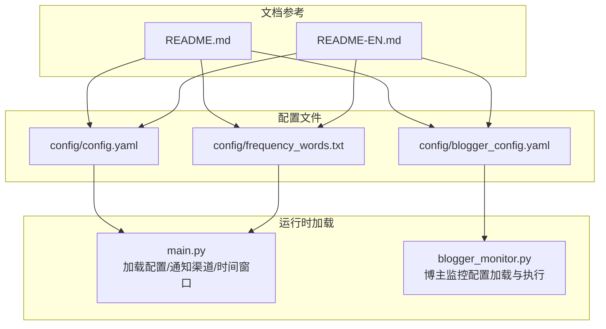
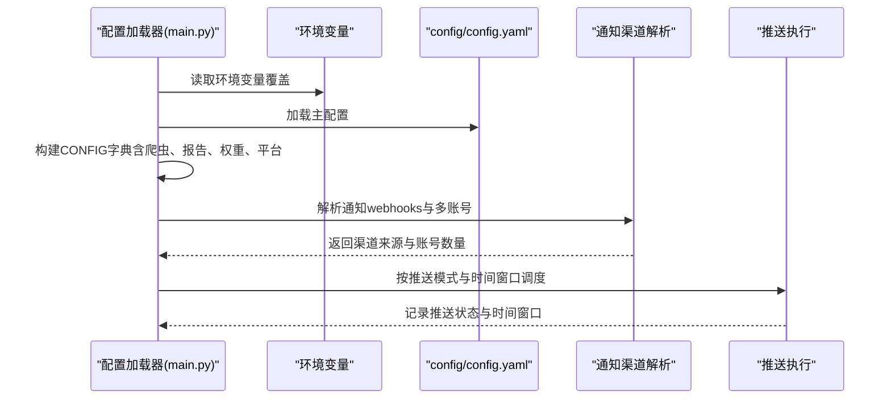
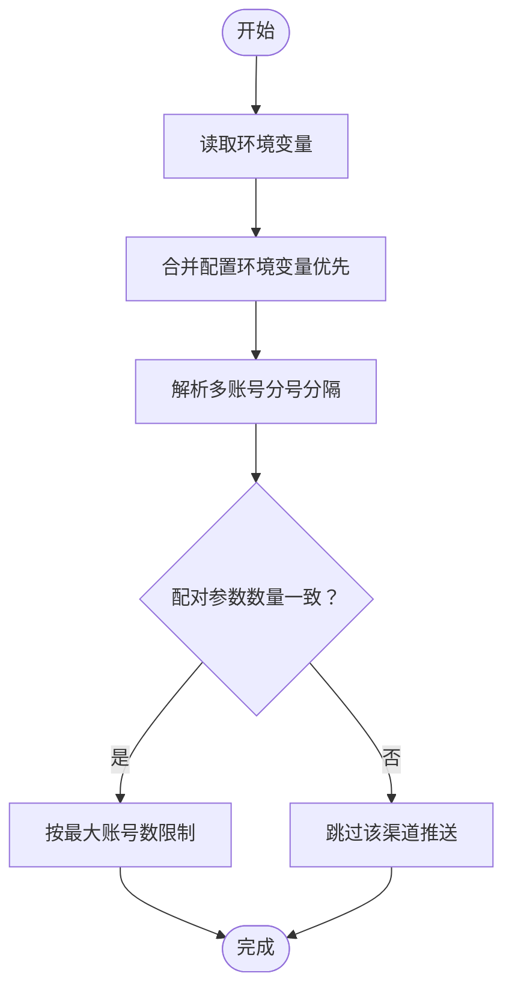
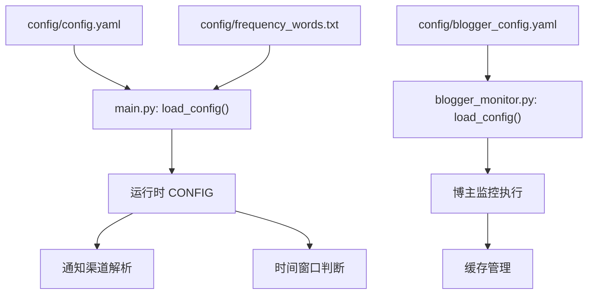

# 配置指南

<cite>
**本文引用的文件**
- [config/config.yaml](file://config/config.yaml)
- [config/frequency_words.txt](file://config/frequency_words.txt)
- [config/blogger_config.yaml](file://config/blogger_config.yaml)
- [main.py](file://main.py)
- [blogger_monitor.py](file://blogger_monitor.py)
- [README.md](file://README.md)
- [README-EN.md](file://README-EN.md)
</cite>

## 目录
1. [简介](#简介)
2. [项目结构](#项目结构)
3. [核心组件](#核心组件)
4. [架构总览](#架构总览)
5. [详细组件分析](#详细组件分析)
6. [依赖关系分析](#依赖关系分析)
7. [性能考量](#性能考量)
8. [故障排查指南](#故障排查指南)
9. [结论](#结论)
10. [附录](#附录)

## 简介
本指南面向首次使用或需要精细化定制 TrendRadar 的用户，围绕两大核心配置文件进行深入讲解：
- config/config.yaml：应用主配置，包括爬虫参数、推送模式、通知渠道、时间窗口、权重分配、平台列表等。
- config/frequency_words.txt：关键词配置，定义监控词组、过滤规则、数量限制以及全局过滤区域。
- config/blogger_config.yaml：博主监控配置，用于定向监控微博、知乎等平台的特定用户，并按关键词过滤推送。

同时，本指南提供安全配置建议（敏感信息加密与环境变量优先）、匹配逻辑说明、完整配置示例与常见错误排查方法，帮助您快速建立稳定可靠的监控体系。

## 项目结构
与配置相关的关键文件位于 config/ 目录，另有运行时加载与解析逻辑集中在 main.py 与 blogger_monitor.py 中；README 文档提供了丰富的配置说明与最佳实践。

```mermaid
graph TB
subgraph "配置文件"
CFG["config/config.yaml"]
KW["config/frequency_words.txt"]
BLOGCFG["config/blogger_config.yaml"]
end
subgraph "运行时加载"
MAIN["main.py<br/>加载配置/通知渠道/时间窗口"]
BLOGMON["blogger_monitor.py<br/>博主监控配置加载与执行"]
end
subgraph "文档参考"
READMEMD["README.md"]
READMEEN["README-EN.md"]
end
CFG --> MAIN
KW --> MAIN
BLOGCFG --> BLOGMON
READMEMD --> CFG
READMEMD --> KW
READMEMD --> BLOGCFG
READMEEN --> CFG
READMEEN --> KW
READMEEN --> BLOGCFG
```

图表来源
- [config/config.yaml](file://config/config.yaml#L1-L140)
- [config/frequency_words.txt](file://config/frequency_words.txt#L1-L114)
- [config/blogger_config.yaml](file://config/blogger_config.yaml#L1-L60)
- [main.py](file://main.py#L161-L395)
- [blogger_monitor.py](file://blogger_monitor.py#L31-L114)
- [README.md](file://README.md#L1530-L1729)
- [README-EN.md](file://README-EN.md#L2045-L2119)

章节来源
- [config/config.yaml](file://config/config.yaml#L1-L140)
- [config/frequency_words.txt](file://config/frequency_words.txt#L1-L114)
- [config/blogger_config.yaml](file://config/blogger_config.yaml#L1-L60)
- [main.py](file://main.py#L161-L395)
- [blogger_monitor.py](file://blogger_monitor.py#L31-L114)
- [README.md](file://README.md#L1530-L1729)
- [README-EN.md](file://README-EN.md#L2045-L2119)

## 核心组件
- 应用主配置（config/config.yaml）
  - 爬虫参数：请求间隔、代理、开关等
  - 推送模式：每日汇总、当前榜单、增量监控
  - 通知渠道：飞书、钉钉、企业微信、Telegram、ntfy、Bark、Slack、邮件等
  - 时间窗口：推送时间段、每日仅推送一次、记录保留天数
  - 权重配置：排名、频次、热度权重
  - 平台列表：监控平台ID与显示名称
- 关键词配置（config/frequency_words.txt）
  - 语法：普通词、必须词（+）、过滤词（!）、数量限制（@）、全局过滤区（[GLOBAL_FILTER]）
  - 区域标记：[GLOBAL_FILTER]、[WORD_GROUPS]，空行分组
  - 匹配优先级：全局过滤 > 词组内过滤 > 词组匹配
- 博主监控配置（config/blogger_config.yaml）
  - 监控目标：平台、用户ID、关键词、备注
  - 通知配置：通道开关（控制台、文件、邮件、微信、Telegram等）
  - 参数：检查间隔、每次检查最大帖子数
  - RSSHub 配置：公共实例或私有实例
  - 缓存配置：过期天数、最大缓存条目数

章节来源
- [config/config.yaml](file://config/config.yaml#L5-L140)
- [config/frequency_words.txt](file://config/frequency_words.txt#L1-L114)
- [config/blogger_config.yaml](file://config/blogger_config.yaml#L1-L60)
- [README.md](file://README.md#L1561-L1729)
- [README-EN.md](file://README-EN.md#L2569-L2787)

## 架构总览
配置加载与通知渠道解析的总体流程如下：

```mermaid
sequenceDiagram
participant Loader as "配置加载器(main.py)"
participant Env as "环境变量"
participant Yaml as "config/config.yaml"
participant Notifier as "通知渠道解析"
participant Push as "推送执行"
Loader->>Env : 读取环境变量覆盖
Loader->>Yaml : 加载主配置
Loader->>Loader : 构建CONFIG字典含爬虫、报告、权重、平台
Loader->>Notifier : 解析通知webhooks与多账号
Notifier-->>Loader : 返回渠道来源与账号数量
Loader->>Push : 按推送模式与时间窗口调度
Push-->>Loader : 记录推送状态与时间窗口
```

图表来源
- [main.py](file://main.py#L161-L395)

章节来源
- [main.py](file://main.py#L161-L395)

## 详细组件分析

### 组件A：config/config.yaml 字段详解
- 应用与版本
  - 版本检查URL、是否显示版本更新提示
- 爬虫配置
  - 请求间隔（毫秒）、是否启用爬取、是否使用代理、默认代理地址
- 报告模式与排序
  - 模式：daily/incremental/current
  - 排名高亮阈值、按位置优先排序、每关键词最大新闻数、内容顺序反转
- 通知渠道
  - 总开关、消息分批大小、批次发送间隔、消息分隔符、每渠道最大账号数
  - 多账号支持：分号分隔；Telegram与ntfy需配对参数数量一致
  - Webhook配置：飞书、钉钉、企业微信（含消息类型）、Telegram、邮件（发件人、授权码、收件人、SMTP服务器与端口）、ntfy（服务器、主题、令牌）、Bark、Slack
- 时间窗口
  - 是否启用、起止时间（24小时制）、每日仅推送一次、推送记录保留天数
- 权重配置
  - 排名权重、频次权重、热度权重
- 平台列表
  - 监控平台ID与显示名称，用于后续数据聚合与展示

安全配置建议
- GitHub Fork 用户请勿在 config.yaml 中直接填写敏感信息（Webhook、Token等），应使用 GitHub Secrets 或环境变量注入
- 多账号数量限制：max_accounts_per_channel 控制每个渠道最多账号数，避免暴露过多凭证
- 邮件推送：使用授权码而非密码；若自动识别失败，可手动配置SMTP服务器与端口

章节来源
- [config/config.yaml](file://config/config.yaml#L1-L140)
- [main.py](file://main.py#L161-L395)
- [README-EN.md](file://README-EN.md#L2569-L2787)
- [README.md](file://README.md#L846-L1185)

### 组件B：config/frequency_words.txt 语法与匹配逻辑
- 语法类型
  - 普通词：包含任意一个即命中
  - 必须词（+）：必须同时包含普通词与“必须词”
  - 过滤词（!）：包含即排除
  - 数量限制（@）：限制该词组最多显示新闻数（优先级高于全局配置）
  - 全局过滤（[GLOBAL_FILTER]）：任何情况下都过滤，优先级最高
- 区域标记
  - [GLOBAL_FILTER]：全局过滤区，包含的词在任何情况下都会被过滤
  - [WORD_GROUPS]：词组区，保持现有语法（!、+、@）
  - 若不使用区域标记，默认全部作为词组处理（向后兼容）
- 分组与空行
  - 用空行分隔不同词组，每个词组独立统计
- 匹配优先级
  - 全局过滤 > 词组内过滤（!）> 词组匹配
- 与运行时的关系
  - main.py 中提供 load_frequency_words 用于加载与解析关键词文件，支持环境变量覆盖路径

章节来源
- [config/frequency_words.txt](file://config/frequency_words.txt#L1-L114)
- [main.py](file://main.py#L793-L860)
- [README.md](file://README.md#L1561-L1729)
- [README-EN.md](file://README-EN.md#L222-L254)

### 组件C：config/blogger_config.yaml 结构与用途
- 监控目标列表 monitors
  - platform：平台（如 weibo、zhihu）
  - user_id：用户标识（数字ID或用户名）
  - keywords：该用户的特定关键词（可选）
  - name：用户备注（可选）
- 全局关键词 keywords
  - 对所有监控目标生效
- 通知配置 notification
  - enable：是否启用通知
  - channels：通知渠道（控制台、文件、邮件、微信、Telegram等）
- 监控参数
  - check_interval：检查间隔（秒）
  - max_posts_per_check：每次检查最多获取的帖子数
- RSSHub 配置 rsshub
  - public_url：公共实例地址
  - private_url：私有实例地址（可选）
- 缓存配置 cache
  - expire_days：缓存过期天数
  - max_cache_size：最大缓存条目数

章节来源
- [config/blogger_config.yaml](file://config/blogger_config.yaml#L1-L60)
- [blogger_monitor.py](file://blogger_monitor.py#L31-L114)
- [blogger_monitor.py](file://blogger_monitor.py#L293-L351)

### 组件D：通知渠道与多账号解析流程
- 多账号解析
  - 分号分隔多个账号；Telegram 与 ntfy 需要配对参数数量一致
  - 每个渠道最多支持 max_accounts_per_channel 个账号
- 环境变量优先
  - FEISHU_WEBHOOK_URL、TELEGRAM_BOT_TOKEN、TELEGRAM_CHAT_ID、EMAIL_*、NTFY_*、BARK_URL、SLACK_WEBHOOK_URL 等均可通过环境变量覆盖
- 验证与限制
  - 配对参数数量不一致将跳过该渠道推送
  - 超过最大账号数将截断至上限

```mermaid
flowchart TD
Start(["开始"]) --> ParseEnv["读取环境变量"]
ParseEnv --> MergeCfg["合并配置环境变量优先"]
MergeCfg --> MultiAcc["解析多账号分号分隔"]
MultiAcc --> ValidatePair{"配对参数数量一致？"}
ValidatePair --> |否| Skip["跳过该渠道推送"]
ValidatePair --> |是| Limit["按最大账号数限制"]
Limit --> Done(["完成"])
Skip --> Done
```

图表来源
- [main.py](file://main.py#L59-L159)
- [main.py](file://main.py#L261-L395)

章节来源
- [main.py](file://main.py#L59-L159)
- [main.py](file://main.py#L261-L395)

## 依赖关系分析
- 配置文件依赖
  - config/config.yaml 被 main.py 加载并构建运行时 CONFIG
  - config/frequency_words.txt 被 main.py 的 load_frequency_words 解析
  - config/blogger_config.yaml 被 blogger_monitor.py 加载并驱动监控流程
- 运行时依赖
  - 通知渠道解析依赖多账号解析与配对校验函数
  - 时间窗口依赖北京时间与时长判断
  - 博主监控依赖 RSSHub 与缓存

```mermaid
graph TB
CFG["config/config.yaml"] --> LOAD["main.py: load_config()"]
KW["config/frequency_words.txt"] --> LOAD
BLOGCFG["config/blogger_config.yaml"] --> BLOGLOAD["blogger_monitor.py: load_config()"]
LOAD --> RUNTIME["运行时 CONFIG"]
BLOGLOAD --> MONITOR["博主监控执行"]
RUNTIME --> NOTIF["通知渠道解析"]
RUNTIME --> TIMEWIN["时间窗口判断"]
MONITOR --> CACHE["缓存管理"]
```

图表来源
- [main.py](file://main.py#L161-L395)
- [blogger_monitor.py](file://blogger_monitor.py#L31-L114)

章节来源
- [main.py](file://main.py#L161-L395)
- [blogger_monitor.py](file://blogger_monitor.py#L31-L114)

## 性能考量
- 爬虫请求间隔
  - request_interval 控制请求间隔（毫秒），合理设置可避免触发反爬策略与资源浪费
- 分批推送
  - 不同渠道的消息分批大小与批次发送间隔可减少推送压力与网络抖动
- 时间窗口
  - 合理设置推送时间窗口，避免非工作时间打扰，同时减少无效推送
- 平台数量
  - 平台列表不宜过多，建议 10-15 个核心平台，避免信息过载
- 缓存与历史数据
  - 博主监控缓存过期天数与最大缓存条目数需结合实际使用量调整

[本节为通用建议，不直接分析具体文件]

## 故障排查指南
- 配置未生效
  - 确认环境变量覆盖优先级高于 config.yaml；在 Docker/NAS 等环境中可通过环境变量直接覆盖
  - 检查 CONFIG_PATH 环境变量是否指向正确的配置文件路径
- 通知渠道不推送
  - 检查多账号数量是否超过 max_accounts_per_channel 限制
  - Telegram 与 ntfy 的配对参数数量必须一致，否则会跳过推送
  - GitHub Fork 用户请勿在 config.yaml 中直接填写敏感信息，应使用 GitHub Secrets 或环境变量
- 关键词过滤异常
  - 全局过滤优先级最高，避免过度过滤导致遗漏有价值内容
  - 数量限制（@）优先级高于全局配置，注意词组边界
  - 词组之间用空行分隔，确保独立统计
- 博主监控无新内容
  - 检查 RSSHub 实例可用性与 user_id 正确性
  - 调整 check_interval 与 max_posts_per_check，避免漏检
  - 查看缓存文件与输出目录，确认缓存是否正常更新

章节来源
- [README-EN.md](file://README-EN.md#L2045-L2119)
- [README.md](file://README.md#L846-L1185)
- [main.py](file://main.py#L261-L395)
- [blogger_monitor.py](file://blogger_monitor.py#L115-L191)

## 结论
通过合理配置 config/config.yaml 与 config/frequency_words.txt，并遵循安全与多账号管理的最佳实践，您可以构建稳定高效的热点监控体系。对于个性化博主监控，config/blogger_config.yaml 提供灵活的平台、用户与关键词配置。建议在生产环境中优先使用环境变量或 GitHub Secrets 注入敏感信息，并结合时间窗口与分批推送策略优化用户体验与资源消耗。

[本节为总结性内容，不直接分析具体文件]

## 附录

### A. 完整配置示例（路径与要点）
- config/config.yaml
  - 爬虫：请求间隔、代理、开关
  - 报告：模式、排序、最大新闻数、内容顺序
  - 通知：各渠道Webhook、分批大小、批次间隔、消息分隔符、每渠道最大账号数
  - 时间窗口：启用、起止时间、每日仅推送一次、记录保留天数
  - 权重：排名、频次、热度
  - 平台：监控平台ID与名称
- config/frequency_words.txt
  - 语法：普通词、必须词（+）、过滤词（!）、数量限制（@）、全局过滤（[GLOBAL_FILTER]）
  - 区域：[GLOBAL_FILTER]、[WORD_GROUPS]，空行分组
- config/blogger_config.yaml
  - monitors：平台、用户ID、关键词、备注
  - keywords：全局关键词
  - notification：通道开关
  - check_interval、max_posts_per_check
  - rsshub：public_url 或 private_url
  - cache：expire_days、max_cache_size

章节来源
- [config/config.yaml](file://config/config.yaml#L1-L140)
- [config/frequency_words.txt](file://config/frequency_words.txt#L1-L114)
- [config/blogger_config.yaml](file://config/blogger_config.yaml#L1-L60)
- [README.md](file://README.md#L1561-L1729)
- [README-EN.md](file://README-EN.md#L2569-L2787)