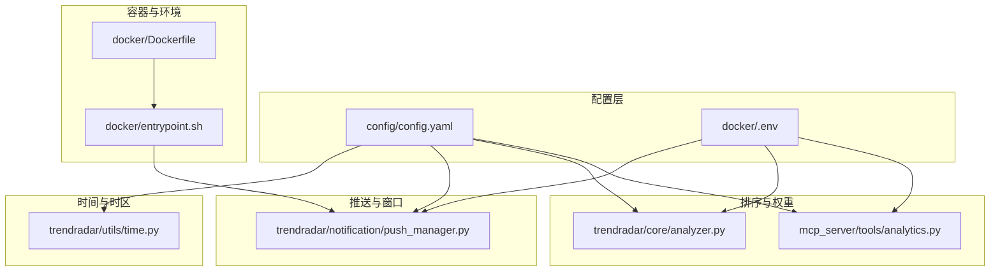
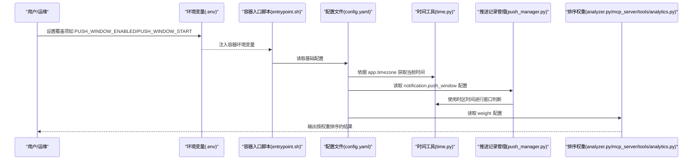
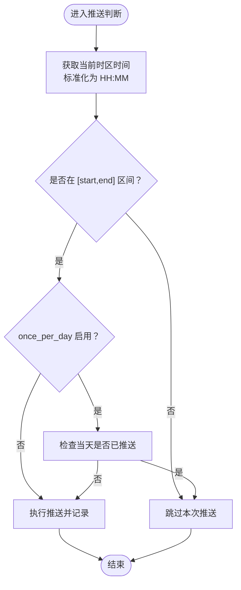
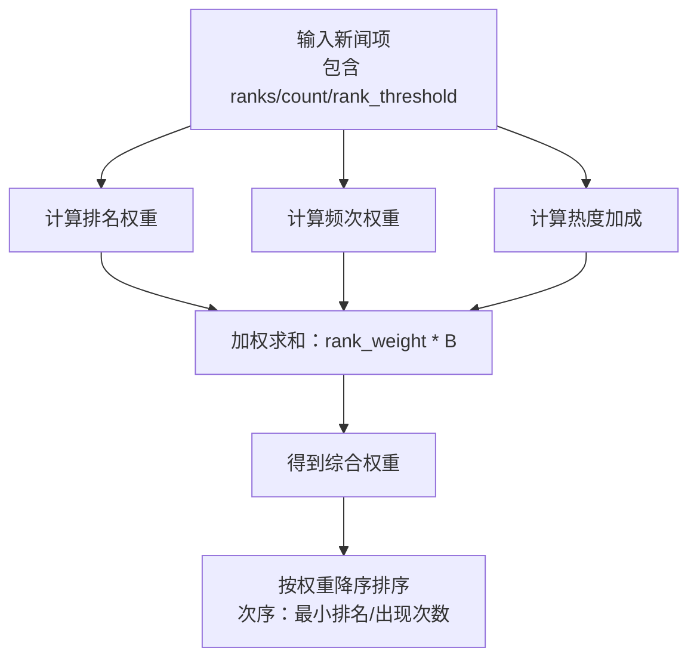
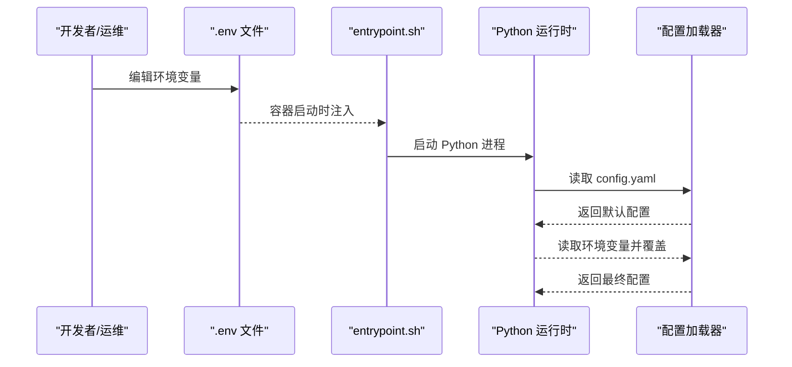
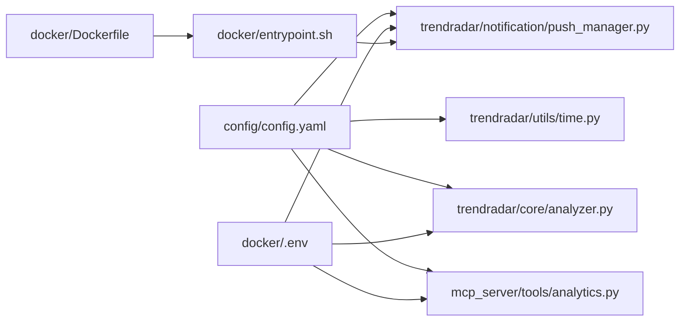

# 高级配置

<cite>
**本文引用的文件**
- [config/config.yaml](file://config/config.yaml)
- [trendradar/utils/time.py](file://trendradar/utils/time.py)
- [trendradar/notification/push_manager.py](file://trendradar/notification/push_manager.py)
- [trendradar/core/analyzer.py](file://trendradar/core/analyzer.py)
- [mcp_server/tools/analytics.py](file://mcp_server/tools/analytics.py)
- [docker/.env](file://docker/.env)
- [docker/entrypoint.sh](file://docker/entrypoint.sh)
- [docker/Dockerfile](file://docker/Dockerfile)
- [README.md](file://README.md)
- [README-EN.md](file://README-EN.md)
</cite>

## 目录
1. [简介](#简介)
2. [项目结构](#项目结构)
3. [核心组件](#核心组件)
4. [架构总览](#架构总览)
5. [详细组件分析](#详细组件分析)
6. [依赖关系分析](#依赖关系分析)
7. [性能考量](#性能考量)
8. [故障排查指南](#故障排查指南)
9. [结论](#结论)
10. [附录](#附录)

## 简介
本章节系统性介绍配置文件中的高级功能，重点围绕以下方面展开：
- app.timezone 对全系统时间显示与推送窗口判断的影响，以及常用时区值
- push_window 的时间窗口控制机制，包括 start/end 时间范围与 once_per_day 的每日仅推送一次功能，并给出针对 GitHub Actions 执行不稳定性的应对建议
- weight 模块中 rank_weight、frequency_weight、hotness_weight 的个性化排序算法原理与调整策略
- 如何通过环境变量覆盖 config.yaml 中的任意配置项，适用于 Docker 部署等场景

## 项目结构
与高级配置密切相关的文件与模块分布如下：
- 配置文件：config/config.yaml
- 时间工具：trendradar/utils/time.py
- 推送记录管理：trendradar/notification/push_manager.py
- 排序与权重计算：trendradar/core/analyzer.py、mcp_server/tools/analytics.py
- 环境变量与覆盖机制：docker/.env、docker/entrypoint.sh、Dockerfile
- 文档说明：README.md、README-EN.md

图表来源
- [config/config.yaml](file://config/config.yaml#L1-L187)
- [trendradar/utils/time.py](file://trendradar/utils/time.py#L1-L92)
- [trendradar/notification/push_manager.py](file://trendradar/notification/push_manager.py#L1-L110)
- [trendradar/core/analyzer.py](file://trendradar/core/analyzer.py#L1-L473)
- [mcp_server/tools/analytics.py](file://mcp_server/tools/analytics.py#L1-L775)
- [docker/.env](file://docker/.env#L1-L130)
- [docker/entrypoint.sh](file://docker/entrypoint.sh#L1-L50)
- [docker/Dockerfile](file://docker/Dockerfile#L1-L71)

章节来源
- [config/config.yaml](file://config/config.yaml#L1-L187)
- [docker/.env](file://docker/.env#L1-L130)
- [docker/entrypoint.sh](file://docker/entrypoint.sh#L1-L50)
- [docker/Dockerfile](file://docker/Dockerfile#L1-L71)

## 核心组件
- app.timezone：统一决定时间显示、推送窗口判断、数据落盘命名等行为的时区基准
- push_window：推送时间窗口控制，含 enabled、time_range.start/end、once_per_day
- weight：个性化排序权重，包含 rank_weight、frequency_weight、hotness_weight
- 环境变量覆盖：通过 docker/.env 与容器入口脚本实现对 config.yaml 的覆盖

章节来源
- [config/config.yaml](file://config/config.yaml#L1-L187)
- [docker/.env](file://docker/.env#L1-L130)
- [docker/entrypoint.sh](file://docker/entrypoint.sh#L1-L50)

## 架构总览
下图展示“配置—时间—推送—排序”链路在系统中的交互关系，以及环境变量覆盖机制如何介入。

图表来源
- [docker/.env](file://docker/.env#L1-L130)
- [docker/entrypoint.sh](file://docker/entrypoint.sh#L1-L50)
- [config/config.yaml](file://config/config.yaml#L1-L187)
- [trendradar/utils/time.py](file://trendradar/utils/time.py#L1-L92)
- [trendradar/notification/push_manager.py](file://trendradar/notification/push_manager.py#L1-L110)
- [trendradar/core/analyzer.py](file://trendradar/core/analyzer.py#L1-L473)
- [mcp_server/tools/analytics.py](file://mcp_server/tools/analytics.py#L1-L775)

## 详细组件分析

### 1) app.timezone 对全系统的影响
- 影响范围
  - 时间显示：日期文件夹、文件名时间、日志显示等均基于该时区
  - 推送窗口判断：窗口边界与 once_per_day 的“今日”判定均依赖该时区
  - 数据落盘：输出目录与文件命名遵循该时区
- 常用时区值
  - 亚洲：Asia/Shanghai（北京时间）、Asia/Tokyo（东京时间）、Asia/Hong_Kong（香港时间）
  - 欧洲：Europe/London（伦敦时间）、Europe/Paris（巴黎时间）、Europe/Moscow（莫斯科时间）
  - 美洲：America/New_York（纽约时间）、America/Los_Angeles（洛杉矶时间）、America/Sao_Paulo（巴西利亚时间）
  - 其他：Australia/Sydney（悉尼时间）、Pacific/Auckland（惠灵顿时间）

章节来源
- [config/config.yaml](file://config/config.yaml#L1-L187)
- [trendradar/utils/time.py](file://trendradar/utils/time.py#L1-L92)
- [trendradar/notification/push_manager.py](file://trendradar/notification/push_manager.py#L1-L110)

### 2) push_window 时间窗口控制机制
- 配置要点
  - enabled：是否启用时间窗口控制
  - time_range.start/end：窗口起止时间（HH:MM，24小时制）
  - once_per_day：每天在窗口内仅推送一次
- 判断流程
  - 使用时区时间获取当前时间，标准化为 HH:MM
  - 判断当前时间是否处于 [start, end] 区间
  - 若开启 once_per_day，还需检查当天是否已推送过
- GitHub Actions 执行不稳定性的应对建议
  - 建议将时间窗口至少预留 2 小时，避免因执行时间漂移导致错过推送
  - 若追求稳定定时，建议使用 Docker 部署在个人服务器上

图表来源
- [config/config.yaml](file://config/config.yaml#L93-L106)
- [trendradar/notification/push_manager.py](file://trendradar/notification/push_manager.py#L68-L110)

章节来源
- [config/config.yaml](file://config/config.yaml#L93-L106)
- [trendradar/notification/push_manager.py](file://trendradar/notification/push_manager.py#L1-L110)
- [README.md](file://README.md#L2216-L2244)
- [README-EN.md](file://README-EN.md#L2167-L2196)

### 3) weight 模块个性化排序算法
- 权重构成
  - rank_weight：排名权重（综合各平台最小排名与出现次数）
  - frequency_weight：频次权重（新闻出现次数）
  - hotness_weight：热度加成（高排名占比）
- 计算流程（核心逻辑）
  - 排名权重：对每个平台的排名计算贡献，取平均
  - 频次权重：取出现次数与阈值比较后的线性加权
  - 热度加成：高排名次数占比乘以系数
  - 综合权重：三者加权求和，权重由配置项控制
- 排序优先级
  - analyzer.py 中对新闻列表按权重降序排序，其次考虑最小排名与出现次数
  - 可通过 report.sort_by_position_first 控制“按配置位置优先”或“按热点条数优先”
- 调整策略
  - 三个权重之和需为 1.0
  - 实时热点：提高 rank_weight，降低 frequency_weight
  - 深度分析：提高 frequency_weight，保持 rank_weight 适中
  - 建议每次调整 0.1~0.2，观察效果后再微调

图表来源
- [trendradar/core/analyzer.py](file://trendradar/core/analyzer.py#L16-L73)
- [trendradar/core/analyzer.py](file://trendradar/core/analyzer.py#L425-L433)
- [mcp_server/tools/analytics.py](file://mcp_server/tools/analytics.py#L24-L74)

章节来源
- [config/config.yaml](file://config/config.yaml#L157-L162)
- [trendradar/core/analyzer.py](file://trendradar/core/analyzer.py#L16-L73)
- [trendradar/core/analyzer.py](file://trendradar/core/analyzer.py#L425-L433)
- [mcp_server/tools/analytics.py](file://mcp_server/tools/analytics.py#L24-L74)
- [README-EN.md](file://README-EN.md#L2003-L2046)

### 4) 环境变量覆盖 config.yaml 的机制
- 覆盖优先级：环境变量 > config.yaml
- 常用覆盖项（节选）
  - ENABLE_CRAWLER、ENABLE_NOTIFICATION、REPORT_MODE、MAX_ACCOUNTS_PER_CHANNEL
  - PUSH_WINDOW_ENABLED、PUSH_WINDOW_START、PUSH_WINDOW_END、PUSH_WINDOW_ONCE_PER_DAY
  - FEISHU_WEBHOOK_URL、TELEGRAM_BOT_TOKEN、TELEGRAM_CHAT_ID、DINGTALK_WEBHOOK_URL、WEWORK_WEBHOOK_URL、EMAIL_*、NTFY_*、BARK_URL、SLACK_WEBHOOK_URL
  - STORAGE_BACKEND、LOCAL_RETENTION_DAYS、REMOTE_RETENTION_DAYS、STORAGE_TXT_ENABLED、STORAGE_HTML_ENABLED、S3_*、PULL_ENABLED、PULL_DAYS
  - RUN_MODE、CRON_SCHEDULE、IMMEDIATE_RUN、ENABLE_WEBSERVER、WEBSERVER_PORT
- Docker 部署要点
  - 在 docker/.env 中设置所需变量
  - 容器入口脚本会将环境变量注入系统环境，并根据 RUN_MODE 启动一次性或定时任务
  - Dockerfile 中设置了默认配置路径与依赖安装

图表来源
- [docker/.env](file://docker/.env#L1-L130)
- [docker/entrypoint.sh](file://docker/entrypoint.sh#L1-L50)
- [docker/Dockerfile](file://docker/Dockerfile#L1-L71)
- [README.md](file://README.md#L2216-L2244)
- [README-EN.md](file://README-EN.md#L2167-L2196)

章节来源
- [docker/.env](file://docker/.env#L1-L130)
- [docker/entrypoint.sh](file://docker/entrypoint.sh#L1-L50)
- [docker/Dockerfile](file://docker/Dockerfile#L1-L71)
- [README.md](file://README.md#L2216-L2244)
- [README-EN.md](file://README-EN.md#L2167-L2196)

## 依赖关系分析
- 时间与时区
  - config.yaml 的 app.timezone 决定时间工具的时区基准
  - 推送记录管理器使用时区时间进行窗口判断与“今日”判定
- 推送与窗口
  - push_window 配置被推送记录管理器读取，结合 once_per_day 与窗口范围共同决定是否推送
- 排序与权重
  - weight 配置被排序模块读取，参与综合权重计算
  - report.sort_by_position_first 控制排序优先级
- 环境变量覆盖
  - docker/.env 与 entrypoint.sh 共同实现对 config.yaml 的覆盖，Dockerfile 提供运行时环境

图表来源
- [config/config.yaml](file://config/config.yaml#L1-L187)
- [trendradar/utils/time.py](file://trendradar/utils/time.py#L1-L92)
- [trendradar/notification/push_manager.py](file://trendradar/notification/push_manager.py#L1-L110)
- [trendradar/core/analyzer.py](file://trendradar/core/analyzer.py#L1-L473)
- [mcp_server/tools/analytics.py](file://mcp_server/tools/analytics.py#L1-L775)
- [docker/.env](file://docker/.env#L1-L130)
- [docker/entrypoint.sh](file://docker/entrypoint.sh#L1-L50)
- [docker/Dockerfile](file://docker/Dockerfile#L1-L71)

章节来源
- [config/config.yaml](file://config/config.yaml#L1-L187)
- [docker/.env](file://docker/.env#L1-L130)
- [docker/entrypoint.sh](file://docker/entrypoint.sh#L1-L50)
- [docker/Dockerfile](file://docker/Dockerfile#L1-L71)

## 性能考量
- 推送窗口与 once_per_day
  - 合理设置窗口范围与 once_per_day 可减少无效执行，降低资源消耗
  - 在 GitHub Actions 环境中建议预留足够窗口宽度，避免执行时间漂移导致漏推
- 排序权重
  - 频繁调整权重会增加排序开销，建议小步调整并观察效果
  - 合理设置 report.max_news_per_keyword 与 group 级别的 max_count，避免输出过大
- 存储与拉取
  - 远程存储与拉取配置会影响启动时长与网络开销，建议在本地开发与 CI 环境中谨慎启用

[本节为通用指导，无需列出具体文件来源]

## 故障排查指南
- 推送未按预期发生
  - 检查 app.timezone 是否正确，确认当前时间与窗口范围
  - 确认 once_per_day 已生效（当天已推送过则不会再次推送）
  - 在 GitHub Actions 环境中适当放宽窗口范围或改用 Docker 部署
- 权重调整后排序变化不明显
  - 确认三个权重之和为 1.0
  - 观察 report.sort_by_position_first 的影响
  - 检查新闻数据中 ranks/count 的分布是否足够多样化
- 环境变量未生效
  - 确认 docker/.env 中变量名与 README 中说明一致
  - 确认容器已重启，使新环境变量生效
  - 检查 RUN_MODE 与 CRON_SCHEDULE 是否符合预期

章节来源
- [config/config.yaml](file://config/config.yaml#L93-L106)
- [trendradar/notification/push_manager.py](file://trendradar/notification/push_manager.py#L68-L110)
- [trendradar/core/analyzer.py](file://trendradar/core/analyzer.py#L425-L433)
- [docker/.env](file://docker/.env#L1-L130)
- [README.md](file://README.md#L2216-L2244)
- [README-EN.md](file://README-EN.md#L2167-L2196)

## 结论
- app.timezone 是系统时间与推送窗口判断的基石，应与部署时区保持一致
- push_window 提供灵活的时间窗口控制，配合 once_per_day 可有效避免重复推送
- weight 模块通过 rank_weight、frequency_weight、hotness_weight 实现个性化排序，建议按业务目标逐步微调
- 环境变量覆盖机制为 Docker 部署提供了便捷的配置管理手段，优先级高于 config.yaml

[本节为总结性内容，无需列出具体文件来源]

## 附录
- 常用时区参考
  - 亚洲：Asia/Shanghai、Asia/Tokyo、Asia/Hong_Kong
  - 欧洲：Europe/London、Europe/Paris、Europe/Moscow
  - 美洲：America/New_York、America/Los_Angeles、America/Sao_Paulo
  - 大洋洲：Australia/Sydney、Pacific/Auckland
- 环境变量覆盖清单（节选）
  - ENABLE_CRAWLER、ENABLE_NOTIFICATION、REPORT_MODE、MAX_ACCOUNTS_PER_CHANNEL
  - PUSH_WINDOW_ENABLED、PUSH_WINDOW_START、PUSH_WINDOW_END、PUSH_WINDOW_ONCE_PER_DAY
  - FEISHU_WEBHOOK_URL、TELEGRAM_BOT_TOKEN、TELEGRAM_CHAT_ID、DINGTALK_WEBHOOK_URL、WEWORK_WEBHOOK_URL、EMAIL_*、NTFY_*、BARK_URL、SLACK_WEBHOOK_URL
  - STORAGE_BACKEND、LOCAL_RETENTION_DAYS、REMOTE_RETENTION_DAYS、STORAGE_TXT_ENABLED、STORAGE_HTML_ENABLED、S3_*、PULL_ENABLED、PULL_DAYS
  - RUN_MODE、CRON_SCHEDULE、IMMEDIATE_RUN、ENABLE_WEBSERVER、WEBSERVER_PORT

章节来源
- [config/config.yaml](file://config/config.yaml#L1-L187)
- [docker/.env](file://docker/.env#L1-L130)
- [README.md](file://README.md#L2216-L2244)
- [README-EN.md](file://README-EN.md#L2167-L2196)