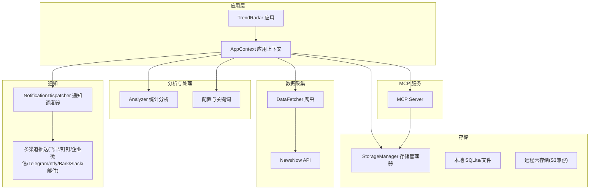
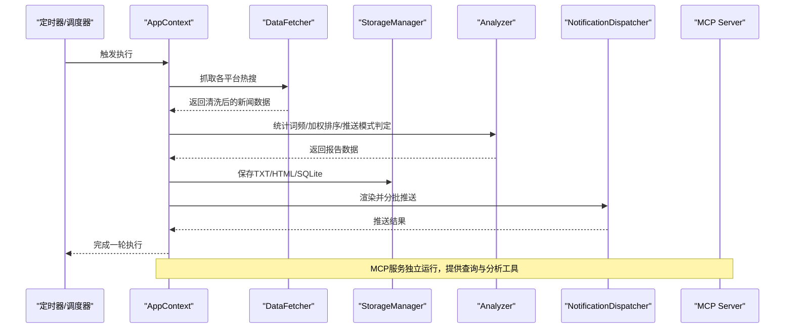
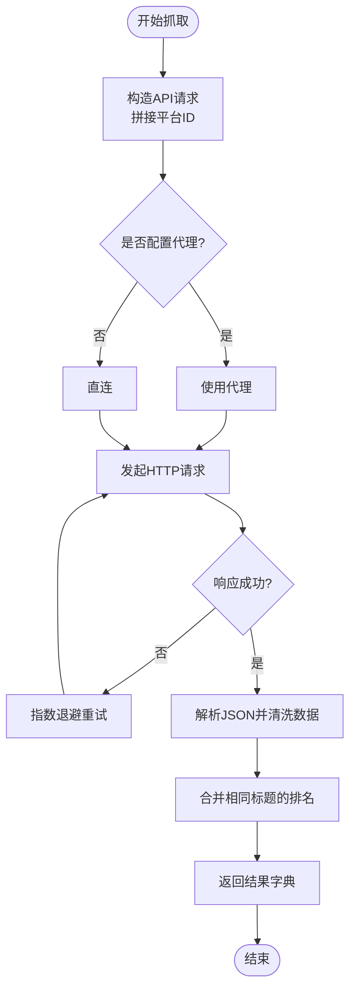
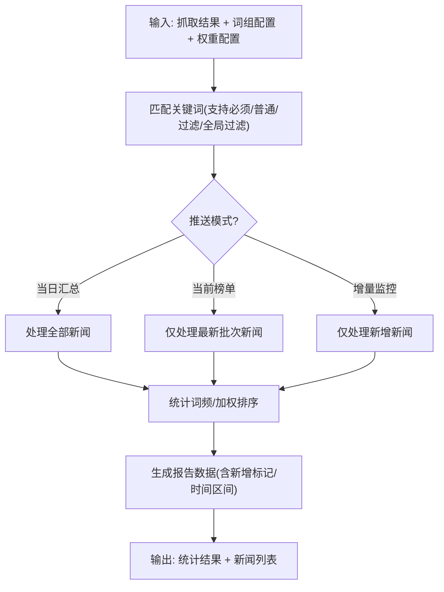
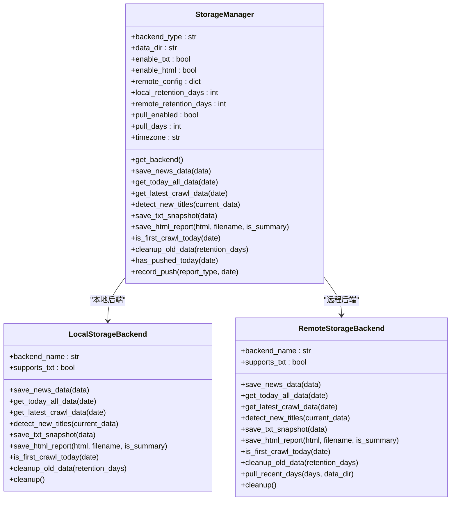
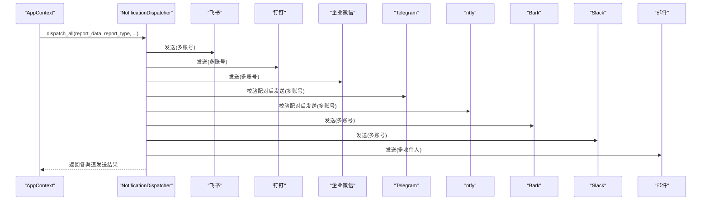
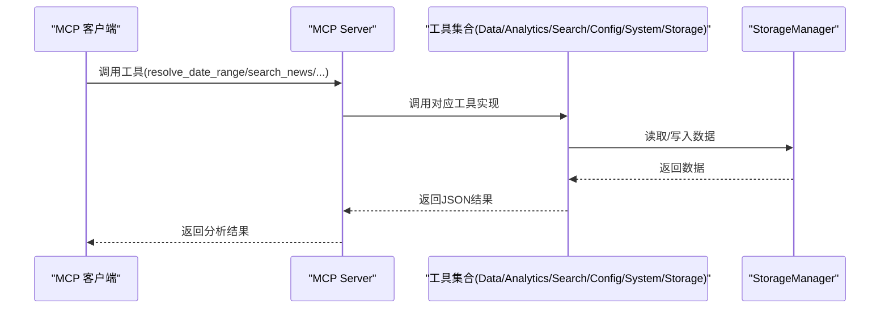
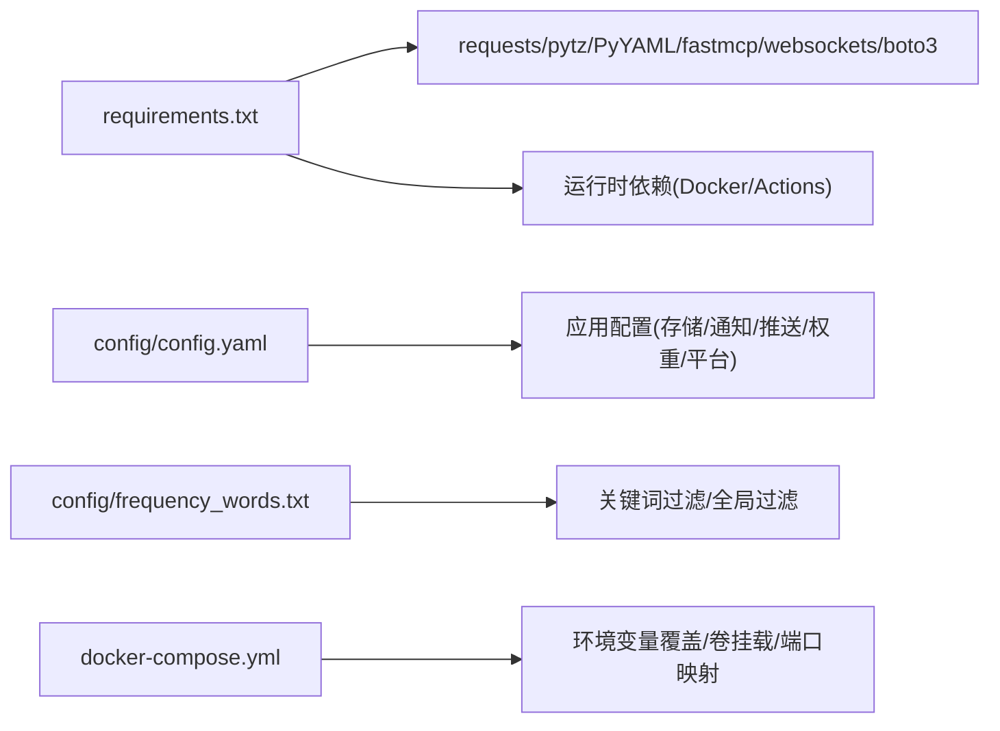

# 项目概述

<cite>
**本文引用的文件**
- [README.md](file://README.md)
- [config/config.yaml](file://config/config.yaml)
- [config/frequency_words.txt](file://config/frequency_words.txt)
- [requirements.txt](file://requirements.txt)
- [docker/Dockerfile](file://docker/Dockerfile)
- [docker/docker-compose.yml](file://docker/docker-compose.yml)
- [docker/docker-compose-build.yml](file://docker/docker-compose-build.yml)
- [docker/manage.py](file://docker/manage.py)
- [trendradar/__init__.py](file://trendradar/__init__.py)
- [trendradar/context.py](file://trendradar/context.py)
- [trendradar/core/analyzer.py](file://trendradar/core/analyzer.py)
- [trendradar/crawler/fetcher.py](file://trendradar/crawler/fetcher.py)
- [trendradar/storage/manager.py](file://trendradar/storage/manager.py)
- [trendradar/notification/dispatcher.py](file://trendradar/notification/dispatcher.py)
- [mcp_server/server.py](file://mcp_server/server.py)
</cite>

## 目录
1. [引言](#引言)
2. [项目结构](#项目结构)
3. [核心组件](#核心组件)
4. [架构总览](#架构总览)
5. [详细组件分析](#详细组件分析)
6. [依赖分析](#依赖分析)
7. [性能考量](#性能考量)
8. [故障排查指南](#故障排查指南)
9. [结论](#结论)
10. [附录](#附录)

## 引言
TrendRadar 是一款轻量级热点新闻聚合与分析工具，旨在帮助用户摆脱算法推荐的束缚，主动获取真正关心的信息。项目以“零技术门槛部署”和“30秒快速上线”为核心优势，支持聚合11个主流平台的热搜内容，并通过个性化关键词筛选与智能推送策略，为不同角色用户提供高效的信息获取体验。目标用户包括投资者、自媒体人、企业公关以及普通资讯关注者；典型使用场景涵盖股市监控、舆情追踪、行业动态分析等。

项目具备灵活的部署能力（Docker、GitHub Actions、本地运行），支持多渠道通知（企业微信、飞书、钉钉、Telegram、邮件、ntfy、Bark、Slack），并提供基于 MCP 协议的 AI 智能分析能力，满足从基础聚合到深度洞察的多层次需求。

## 项目结构
项目采用模块化组织，围绕“爬虫-分析-存储-通知”四大核心模块构建，同时提供 MCP 服务以支撑智能分析。Docker 化部署与配置文件分离，便于在不同环境中快速运行。

图表来源
- [trendradar/context.py](file://trendradar/context.py#L1-L120)
- [trendradar/crawler/fetcher.py](file://trendradar/crawler/fetcher.py#L1-L120)
- [trendradar/core/analyzer.py](file://trendradar/core/analyzer.py#L1-L120)
- [trendradar/storage/manager.py](file://trendradar/storage/manager.py#L1-L120)
- [trendradar/notification/dispatcher.py](file://trendradar/notification/dispatcher.py#L1-L120)
- [mcp_server/server.py](file://mcp_server/server.py#L1-L120)

章节来源
- [README.md](file://README.md#L1-L120)
- [config/config.yaml](file://config/config.yaml#L1-L120)
- [docker/docker-compose.yml](file://docker/docker-compose.yml#L1-L88)

## 核心组件
- 爬虫模块：从 NewsNow API 获取各平台热搜数据，支持重试与代理，统一清洗与去重。
- 分析模块：基于权重算法对新闻进行加权排序，支持三种推送模式（当日汇总、当前榜单、增量监控），并提供关键词过滤与全局过滤。
- 存储模块：自动选择本地或远程存储后端（S3 兼容），支持数据保留策略与过期清理，提供 HTML/文本快照与 SQLite 查询能力。
- 通知模块：统一调度多渠道推送，支持多账号配置与配对校验，自动分批与间隔控制，保障消息体积与发送稳定性。
- MCP 服务：基于 Model Context Protocol 提供对话式查询与分析工具集，支持趋势分析、情感分析、相似新闻查找、摘要生成等。

章节来源
- [trendradar/crawler/fetcher.py](file://trendradar/crawler/fetcher.py#L1-L185)
- [trendradar/core/analyzer.py](file://trendradar/core/analyzer.py#L1-L200)
- [trendradar/storage/manager.py](file://trendradar/storage/manager.py#L1-L120)
- [trendradar/notification/dispatcher.py](file://trendradar/notification/dispatcher.py#L1-L120)
- [mcp_server/server.py](file://mcp_server/server.py#L1-L120)

## 架构总览
TrendRadar 的整体架构遵循“采集-分析-存储-通知”的流水线设计，应用上下文统一协调各模块，MCP 服务独立提供智能分析能力。存储层根据运行环境自动选择本地或远程后端，确保数据可移植与可查询。

图表来源
- [trendradar/context.py](file://trendradar/context.py#L120-L260)
- [trendradar/crawler/fetcher.py](file://trendradar/crawler/fetcher.py#L120-L185)
- [trendradar/core/analyzer.py](file://trendradar/core/analyzer.py#L90-L200)
- [trendradar/storage/manager.py](file://trendradar/storage/manager.py#L120-L220)
- [trendradar/notification/dispatcher.py](file://trendradar/notification/dispatcher.py#L60-L140)
- [mcp_server/server.py](file://mcp_server/server.py#L780-L800)

## 详细组件分析

### 爬虫与数据采集
- 职责：从 NewsNow API 获取各平台热搜，统一清洗标题、URL、移动端链接，合并相同标题的排名，处理无效数据。
- 关键点：支持代理、随机退避重试、请求间隔控制，避免触发风控；对异常响应进行降级处理。
- 输出：按平台聚合的标题-排名-链接结构，供后续分析与存储。

图表来源
- [trendradar/crawler/fetcher.py](file://trendradar/crawler/fetcher.py#L50-L185)

章节来源
- [trendradar/crawler/fetcher.py](file://trendradar/crawler/fetcher.py#L1-L185)

### 分析与推送策略
- 职责：根据权重配置计算新闻权重，支持三种推送模式；提供关键词匹配、全局过滤、新增检测与时间区间统计。
- 关键点：权重由“排名质量”“出现频次”“高排名占比”三部分组成，可调；支持按配置位置优先或按热度优先排序；增量模式避免重复推送。
- 输出：按词组统计的新闻列表，标注新增与时间区间，用于报告与推送。

图表来源
- [trendradar/core/analyzer.py](file://trendradar/core/analyzer.py#L90-L200)
- [trendradar/core/analyzer.py](file://trendradar/core/analyzer.py#L200-L473)

章节来源
- [trendradar/core/analyzer.py](file://trendradar/core/analyzer.py#L1-L200)
- [config/config.yaml](file://config/config.yaml#L157-L162)

### 存储与数据管理
- 职责：根据运行环境自动选择本地或远程存储后端；支持 TXT/HTML 快照与 SQLite；提供数据保留策略与过期清理；支持从远程拉取到本地。
- 关键点：GitHub Actions 环境优先远程存储；Docker/本地默认本地存储；远程后端基于 S3 兼容协议（Cloudflare R2、阿里云 OSS、腾讯云 COS 等）。
- 输出：统一的保存接口，供报告生成与 MCP 查询使用。

图表来源
- [trendradar/storage/manager.py](file://trendradar/storage/manager.py#L1-L120)
- [trendradar/storage/manager.py](file://trendradar/storage/manager.py#L120-L220)
- [trendradar/storage/manager.py](file://trendradar/storage/manager.py#L220-L344)

章节来源
- [trendradar/storage/manager.py](file://trendradar/storage/manager.py#L1-L120)
- [config/config.yaml](file://config/config.yaml#L12-L52)

### 通知与多渠道推送
- 职责：统一调度多渠道推送，支持多账号配置与配对校验；自动分批与间隔控制，保障消息体积与发送稳定性。
- 关键点：飞书/钉钉/企业微信/Telegram/ntfy/Bark/Slack/邮件；多账号用分号分隔；Telegram/ntfy 需要配对参数数量一致；默认每渠道最多3个账号。
- 输出：各渠道发送结果字典，便于记录与审计。

图表来源
- [trendradar/notification/dispatcher.py](file://trendradar/notification/dispatcher.py#L1-L120)
- [trendradar/notification/dispatcher.py](file://trendradar/notification/dispatcher.py#L120-L260)
- [trendradar/notification/dispatcher.py](file://trendradar/notification/dispatcher.py#L260-L421)
- [config/config.yaml](file://config/config.yaml#L123-L156)

章节来源
- [trendradar/notification/dispatcher.py](file://trendradar/notification/dispatcher.py#L1-L120)
- [config/config.yaml](file://config/config.yaml#L82-L122)

### MCP 智能分析服务
- 职责：提供基于 MCP 协议的对话式查询与分析工具集，支持趋势分析、情感分析、相似新闻查找、摘要生成、搜索与检索等。
- 关键点：统一日期解析工具；支持多客户端（Cherry Studio、Claude Desktop、Cursor、Cline 等）；提供存储同步工具，支持从远程拉取到本地。
- 输出：JSON 格式的分析结果与报告内容，便于前端渲染与二次加工。

图表来源
- [mcp_server/server.py](file://mcp_server/server.py#L1-L120)
- [mcp_server/server.py](file://mcp_server/server.py#L120-L260)
- [mcp_server/server.py](file://mcp_server/server.py#L260-L540)
- [mcp_server/server.py](file://mcp_server/server.py#L540-L800)

章节来源
- [mcp_server/server.py](file://mcp_server/server.py#L1-L120)
- [config/config.yaml](file://config/config.yaml#L1-L20)

## 依赖分析
- 外部依赖：requests、pytz、PyYAML、fastmcp、websockets、boto3（S3 兼容存储）。
- 运行时依赖：Docker 环境（supercronic 定时器）、GitHub Actions（远程存储与自动化）。
- 配置依赖：config/config.yaml 与 config/frequency_words.txt；Docker 环境变量覆盖。

图表来源
- [requirements.txt](file://requirements.txt#L1-L7)
- [config/config.yaml](file://config/config.yaml#L1-L120)
- [config/frequency_words.txt](file://config/frequency_words.txt#L1-L114)
- [docker/docker-compose.yml](file://docker/docker-compose.yml#L1-L88)

章节来源
- [requirements.txt](file://requirements.txt#L1-L7)
- [docker/docker-compose.yml](file://docker/docker-compose.yml#L1-L88)

## 性能考量
- 爬取性能：请求间隔与随机抖动降低风控风险；重试机制提升稳定性；代理支持应对网络波动。
- 存储性能：本地 SQLite 查询快速；远程存储基于 S3 兼容协议，适合大规模数据与多节点访问；支持数据保留策略减少空间占用。
- 推送性能：按渠道分批与间隔控制，避免消息超限与风控；多账号轮询提升成功率。
- 分析性能：权重计算与排序逻辑在内存中完成，适合中小规模数据；MCP 服务可独立扩展，满足更高并发需求。

## 故障排查指南
- 爬取失败：检查 API 可用性与代理配置；确认请求间隔与重试策略；查看失败平台列表与日志。
- 存储异常：确认远程存储配置（端点、桶名、密钥、区域）；在 GitHub Actions 环境中优先使用远程存储；必要时回退到本地存储。
- 推送失败：检查各渠道 webhook/Token/ChatID/Topic 配置；确保配对参数数量一致；限制每渠道账号数量不超过3个。
- MCP 服务：确认端口映射与卷挂载；检查存储同步工具与日期解析工具的调用链路；验证远程拉取配置。

章节来源
- [trendradar/crawler/fetcher.py](file://trendradar/crawler/fetcher.py#L120-L185)
- [trendradar/storage/manager.py](file://trendradar/storage/manager.py#L120-L220)
- [trendradar/notification/dispatcher.py](file://trendradar/notification/dispatcher.py#L260-L421)
- [mcp_server/server.py](file://mcp_server/server.py#L660-L800)

## 结论
TrendRadar 以“零技术门槛部署”和“30秒快速上线”为核心价值，通过聚合11个主流平台热搜、个性化关键词筛选与智能推送策略，帮助用户摆脱算法推荐，主动掌握关键信息。其模块化架构与多部署形态（Docker、GitHub Actions、本地运行）满足不同场景需求；MCP 智能分析进一步拓展了数据洞察边界。对于初学者，项目提供了清晰的配置与部署路径；对于高级用户，其可扩展的存储与工具体系提供了深入定制的空间。

## 附录
- 部署方式：Docker 镜像与 Compose 文件、GitHub Actions 工作流、本地运行脚本。
- 关键配置：存储后端选择、远程存储参数、推送模式与时间窗口、多账号配置、关键词过滤与全局过滤。
- MCP 工具清单：数据查询、趋势分析、情感分析、相似新闻查找、搜索与检索、配置与系统管理、存储同步。

章节来源
- [README.md](file://README.md#L43-L120)
- [docker/Dockerfile](file://docker/Dockerfile#L1-L71)
- [docker/docker-compose.yml](file://docker/docker-compose.yml#L1-L88)
- [docker/docker-compose-build.yml](file://docker/docker-compose-build.yml#L1-L92)
- [docker/manage.py](file://docker/manage.py#L1-L200)
- [trendradar/__init__.py](file://trendradar/__init__.py#L1-L14)
- [config/config.yaml](file://config/config.yaml#L1-L187)
- [config/frequency_words.txt](file://config/frequency_words.txt#L1-L114)
- [mcp_server/server.py](file://mcp_server/server.py#L1-L120)