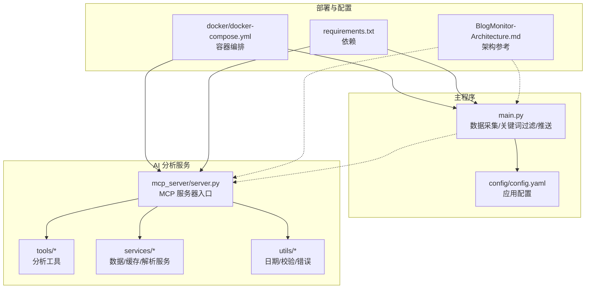
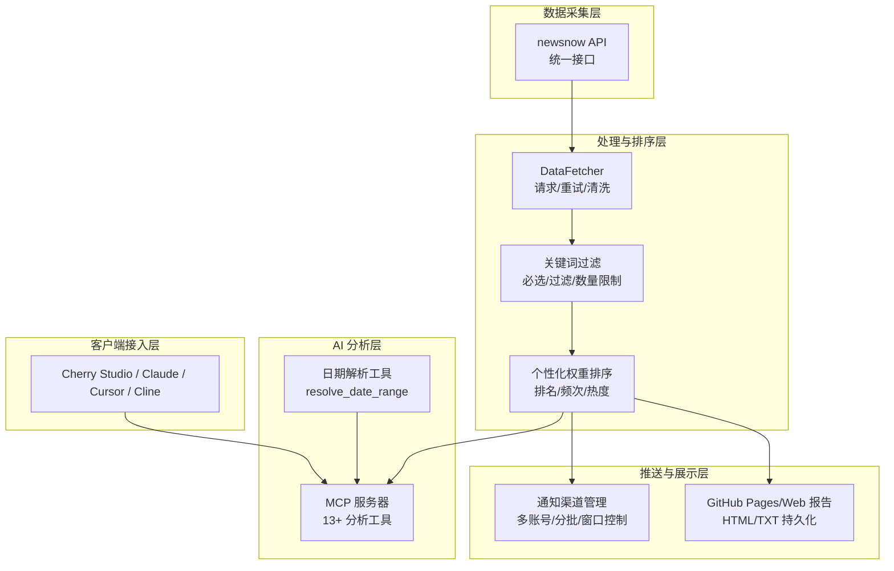
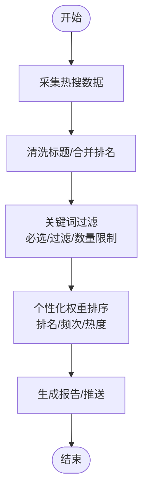
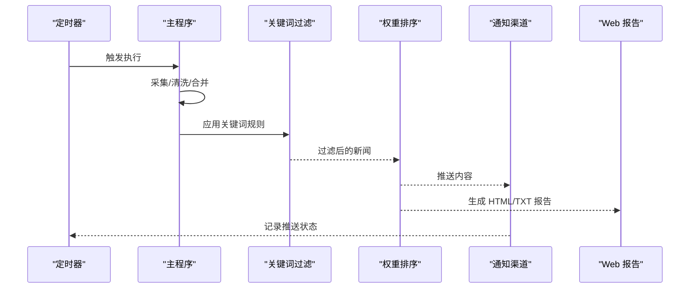
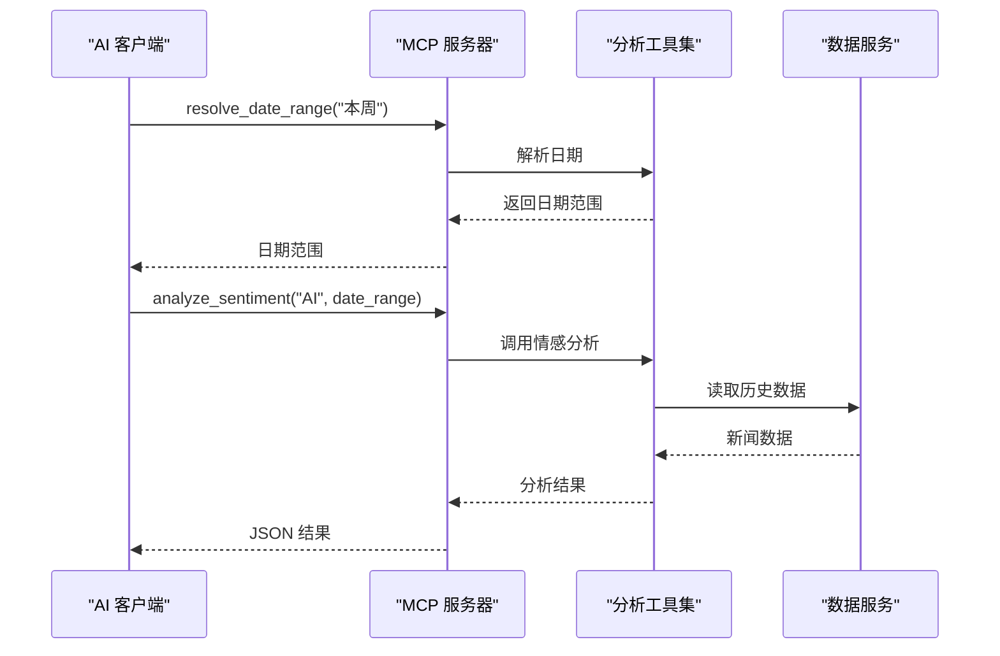
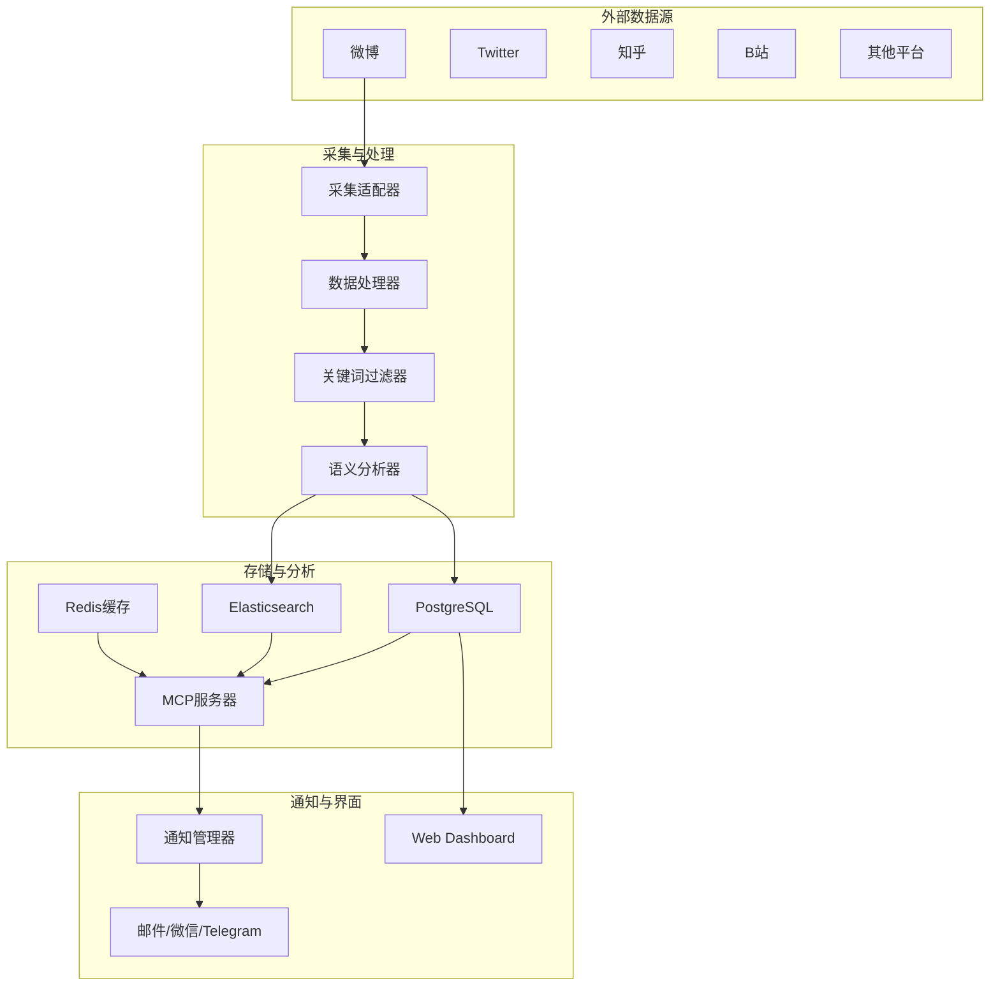
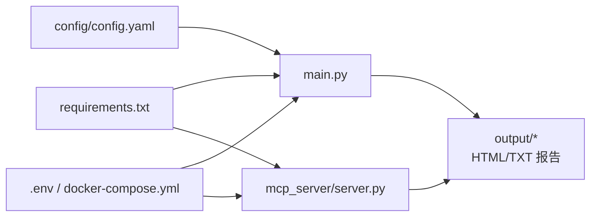

# 项目概述

<cite>
**本文引用的文件**
- [README.md](file://README.md)
- [README-EN.md](file://README-EN.md)
- [BlogMonitor-Architecture.md](file://BlogMonitor-Architecture.md)
- [config/config.yaml](file://config/config.yaml)
- [requirements.txt](file://requirements.txt)
- [main.py](file://main.py)
- [mcp_server/server.py](file://mcp_server/server.py)
- [docker/docker-compose.yml](file://docker/docker-compose.yml)
</cite>

## 目录
1. [简介](#简介)
2. [项目结构](#项目结构)
3. [核心组件](#核心组件)
4. [架构总览](#架构总览)
5. [详细组件分析](#详细组件分析)
6. [依赖关系分析](#依赖关系分析)
7. [性能考量](#性能考量)
8. [故障排查指南](#故障排查指南)
9. [结论](#结论)
10. [附录](#附录)

## 简介
TrendRadar 是一个“全网热点聚合与智能分析”系统，旨在帮助用户从海量信息中主动筛选出真正关心的热点与趋势。项目通过统一的数据采集、个性化排序与权重算法、多渠道实时推送以及基于 MCP 的 AI 对话分析能力，为不同角色用户提供“看得清、管得住、用得好”的信息决策支持。

- 核心目标
  - 聚合主流平台热点，去除平台算法干扰，按用户偏好重新排序
  - 提供三种推送模式（当日汇总、当前榜单、增量监控），满足不同使用场景
  - 支持多渠道通知（企业微信、飞书、钉钉、Telegram、邮件、ntfy、Bark、Slack）
  - 基于 MCP 的 AI 分析服务器，支持自然语言对话式查询与趋势洞察
  - 提供零门槛部署方案（GitHub 一键 Fork）与 Docker 容器化部署

- 目标用户
  - 数据分析师：通过 AI 工具进行跨平台对比、情感分析、相似新闻检索
  - 运营人员：监控竞品动态、品牌舆情、热点事件，辅助内容策略
  - 开发者与技术爱好者：快速搭建本地热点监控与分析流水线
  - 普通用户：减少无效刷屏，专注自身关注的领域

- 价值定位
  - 实时信息监控：统一抓取与清洗，稳定输出
  - AI 驱动分析：自然语言交互，降低分析门槛
  - 多渠道通知：消息直达手机与邮箱，避免错过关键信息
  - 可扩展生态：模块化设计，便于二次开发与集成

**章节来源**
- file://README.md#L220-L371
- file://README-EN.md#L172-L324

## 项目结构
项目采用“主程序 + MCP AI 分析服务 + 配置与部署”的分层组织方式，核心文件与目录如下：
- 根目录
  - README.md / README-EN.md：项目说明与使用指南
  - main.py：主程序，负责数据采集、关键词过滤、报告生成与推送
  - config/config.yaml：应用配置（报告模式、推送设置、平台权重、通知渠道等）
  - requirements.txt：Python 依赖
  - docker/docker-compose.yml：Docker 编排与环境变量
- mcp_server：AI 分析服务
  - server.py：MCP 服务器入口，注册 13+ 分析工具
  - tools/：分析工具集合（数据查询、智能检索、高级分析、系统管理）
  - services/：数据服务、缓存服务、解析服务
  - utils/：日期解析、参数校验、错误定义
- config/：配置文件与词表
- integrations/：第三方集成示例（如 Blogger 集成）
- docs/：部署与 API 参考文档
- 其他脚本：一键部署、启动脚本等

```mermaid
graph TB
subgraph "主程序"
A["main.py<br/>数据采集/关键词过滤/推送"]
B["config/config.yaml<br/>应用配置"]
end
subgraph "AI 分析服务"
C["mcp_server/server.py<br/>MCP 服务器入口"]
D["tools/*<br/>分析工具"]
E["services/*<br/>数据/缓存/解析服务"]
F["utils/*<br/>日期/校验/错误"]
end
subgraph "部署与配置"
G["docker/docker-compose.yml<br/>容器编排"]
H["requirements.txt<br/>依赖"]
I["BlogMonitor-Architecture.md<br/>架构参考"]
end
A --> B
C --> D
C --> E
C --> F
A -.-> C
G --> A
G --> C
H --> A
H --> C
I -.-> A
I -.-> C
```

**图表来源**
- [main.py](file://main.py#L160-L400)
- [config/config.yaml](file://config/config.yaml#L1-L140)
- [mcp_server/server.py](file://mcp_server/server.py#L1-L120)
- [docker/docker-compose.yml](file://docker/docker-compose.yml#L1-L74)
- [BlogMonitor-Architecture.md](file://BlogMonitor-Architecture.md#L1-L112)

**章节来源**
- file://README.md#L2072-L2146
- file://README-EN.md#L1987-L2119

## 核心组件
- 数据采集与处理
  - 通过统一 API 获取多平台热搜，清洗标题、合并排名、统计频次
  - 支持请求重试、随机间隔、异常标题过滤，保障稳定性
- 关键词与筛选
  - 支持普通词、必须词、过滤词、数量限制、全局过滤等语法
  - 支持按热度优先或配置顺序优先排序
- 个性化热点算法
  - 通过“排名权重、出现频次权重、热度权重”三者组合，重新排序热点
  - 权重比例可调，满足不同场景偏好
- 推送策略与多渠道
  - 三种推送模式：当日汇总、当前榜单、增量监控
  - 支持推送时间窗口控制、内容顺序配置、多账号推送
  - 支持飞书、钉钉、企业微信、Telegram、邮件、ntfy、Bark、Slack
- AI 分析服务（MCP）
  - 提供 13+ 分析工具：基础查询、智能检索、趋势分析、情感分析、相似新闻、摘要生成、系统管理等
  - 支持自然语言日期解析，统一日期范围，确保分析一致性
  - 支持 STDIO/HTTP 两种传输模式，便于多种客户端接入

**章节来源**
- file://README.md#L220-L371
- file://README-EN.md#L172-L324
- file://config/config.yaml#L1-L140
- file://mcp_server/server.py#L1-L120

## 架构总览
TrendRadar 的整体架构由“数据采集层、处理与排序层、推送与展示层、AI 分析层、客户端接入层”构成。主程序负责采集与推送，MCP 服务提供 AI 分析能力，二者通过统一的数据文件（output）进行衔接。

```mermaid
graph TB
subgraph "数据采集层"
C1["newsnow API<br/>统一接口"]
end
subgraph "处理与排序层"
P1["DataFetcher<br/>请求/重试/清洗"]
P2["关键词过滤<br/>必选/过滤/数量限制"]
P3["个性化权重排序<br/>排名/频次/热度"]
end
subgraph "推送与展示层"
N1["通知渠道管理<br/>多账号/分批/窗口控制"]
W1["GitHub Pages/Web 报告<br/>HTML/TXT 持久化"]
end
subgraph "AI 分析层"
M1["MCP 服务器<br/>13+ 分析工具"]
U1["日期解析工具<br/>resolve_date_range"]
end
subgraph "客户端接入层"
X1["Cherry Studio / Claude / Cursor / Cline"]
end
C1 --> P1 --> P2 --> P3 --> N1
P3 --> W1
P3 --> M1
U1 --> M1
X1 --> M1
```

**图表来源**
- [main.py](file://main.py#L616-L899)
- [config/config.yaml](file://config/config.yaml#L1-L140)
- [mcp_server/server.py](file://mcp_server/server.py#L1-L120)

## 详细组件分析

### 数据采集与关键词过滤
- 数据采集
  - 通过统一 API 获取各平台热搜，按排名排序，合并相同标题，记录 URL 与移动端链接
  - 支持请求重试与随机间隔，避免平台限流
- 关键词过滤
  - 支持“必须词 +”、“过滤词 !”、“数量限制 @”、“全局过滤 [GLOBAL_FILTER]”
  - 支持按热度优先或配置顺序优先排序，灵活控制推送长度
- 个性化权重排序
  - 通过“排名权重、出现频次权重、热度权重”三者组合，重新排序热点，突出高价值内容

```mermaid
flowchart TD
Start(["开始"]) --> Fetch["采集热搜数据"]
Fetch --> Clean["清洗标题/合并排名"]
Clean --> Filter["关键词过滤<br/>必选/过滤/数量限制"]
Filter --> Weight["个性化权重排序<br/>排名/频次/热度"]
Weight --> Output["生成报告/推送"]
Output --> End(["结束"])
```

**图表来源**
- [main.py](file://main.py#L616-L899)
- [config/config.yaml](file://config/config.yaml#L1-L140)

**章节来源**
- file://main.py#L616-L899
- file://config/config.yaml#L1-L140

### 推送策略与多渠道
- 推送模式
  - 当日汇总：按时推送当日所有匹配新闻
  - 当前榜单：推送当前榜单匹配新闻
  - 增量监控：仅推送新增内容，零重复
- 多账号与分批
  - 所有推送渠道支持多账号配置，使用分号分隔
  - 对 Telegram/ntfy 等需要配对参数的渠道，自动校验数量一致性
  - 按渠道设置分批大小与间隔，避免消息超限
- 推送时间窗口
  - 可设置推送时间范围与“一天一次/窗口内多次”策略
  - 支持推送记录清理与留存天数控制

```mermaid
sequenceDiagram
participant Cron as "定时器"
participant Main as "主程序"
participant Filter as "关键词过滤"
participant Sort as "权重排序"
participant Push as "通知渠道"
participant Web as "Web 报告"
Cron->>Main : 触发执行
Main->>Main : 采集/清洗/合并
Main->>Filter : 应用关键词规则
Filter-->>Sort : 过滤后的新闻
Sort-->>Push : 推送内容
Sort-->>Web : 生成 HTML/TXT 报告
Push-->>Cron : 记录推送状态
```

**图表来源**
- [main.py](file://main.py#L100-L160)
- [main.py](file://main.py#L160-L400)
- [config/config.yaml](file://config/config.yaml#L1-L140)

**章节来源**
- file://config/config.yaml#L1-L140
- file://main.py#L100-L160
- file://main.py#L160-L400

### AI 分析服务（MCP）
- 工具体系
  - 基础查询：获取最新新闻、按日期查询、趋势话题
  - 智能检索：关键词/模糊/实体搜索、历史相关新闻检索
  - 高级分析：话题趋势、数据洞察（平台对比/活跃度/关键词共现）、情感分析、相似新闻、摘要生成
  - 系统管理：获取当前配置、系统状态、手动触发爬取
- 日期解析
  - 统一将自然语言日期解析为标准日期范围，确保 AI 模型与系统日期一致
- 传输模式
  - 支持 STDIO（推荐）与 HTTP（生产）两种模式，便于不同客户端接入

```mermaid
sequenceDiagram
participant Client as "AI 客户端"
participant MCP as "MCP 服务器"
participant Tools as "分析工具集"
participant Data as "数据服务"
Client->>MCP : resolve_date_range("本周")
MCP->>Tools : 解析日期
Tools-->>MCP : 返回日期范围
MCP-->>Client : 日期范围
Client->>MCP : analyze_sentiment("AI", date_range)
MCP->>Tools : 调用情感分析
Tools->>Data : 读取历史数据
Data-->>Tools : 新闻数据
Tools-->>MCP : 分析结果
MCP-->>Client : JSON 结果
```

**图表来源**
- [mcp_server/server.py](file://mcp_server/server.py#L1-L120)
- [mcp_server/server.py](file://mcp_server/server.py#L111-L222)
- [mcp_server/server.py](file://mcp_server/server.py#L225-L460)

**章节来源**
- file://mcp_server/server.py#L1-L120
- file://mcp_server/server.py#L111-L222
- file://mcp_server/server.py#L225-L460

### 概念性架构参考（BlogMonitor）
尽管 TrendRadar 与 BlogMonitor 在功能侧重点不同，但其“数据采集-处理-存储-分析-通知”的通用架构设计可作为理解系统演进的参考。

```mermaid
graph TB
subgraph "外部数据源"
W["微博"]
T["Twitter"]
Z["知乎"]
B["B站"]
O["其他平台"]
end
subgraph "采集与处理"
CA["采集适配器"]
DP["数据处理器"]
KF["关键词过滤器"]
SA["语义分析器"]
end
subgraph "存储与分析"
PQ["PostgreSQL"]
ES["Elasticsearch"]
RD["Redis缓存"]
MCP["MCP服务器"]
end
subgraph "通知与界面"
NM["通知管理器"]
EM["邮件/微信/Telegram"]
WD["Web Dashboard"]
end
W --> CA --> DP --> KF --> SA --> PQ
SA --> ES
PQ --> MCP
ES --> MCP
RD --> MCP
MCP --> NM --> EM
PQ --> WD
```

**图表来源**
- [BlogMonitor-Architecture.md](file://BlogMonitor-Architecture.md#L1-L112)

**章节来源**
- file://BlogMonitor-Architecture.md#L1-L112

## 依赖关系分析
- Python 依赖
  - requests、pytz、PyYAML、fastmcp、websockets 等，支撑网络请求、时区处理、配置解析、MCP 协议与 WebSocket
- 配置与环境变量
  - config/config.yaml：主配置（报告模式、推送设置、平台权重、通知渠道）
  - .env / docker-compose 环境变量：覆盖主配置，支持多账号、推送时间窗口、Web 服务器、定时任务等
- 容器化部署
  - docker-compose.yml：定义两个服务（新闻推送与 MCP 分析），挂载配置与输出目录，暴露端口

```mermaid
graph LR
R["requirements.txt"] --> M["main.py"]
R --> S["mcp_server/server.py"]
C["config/config.yaml"] --> M
E[".env / docker-compose.yml"] --> M
E --> S
M --> O["output/*<br/>HTML/TXT 报告"]
S --> O
```

**图表来源**
- [requirements.txt](file://requirements.txt#L1-L6)
- [config/config.yaml](file://config/config.yaml#L1-L140)
- [docker/docker-compose.yml](file://docker/docker-compose.yml#L1-L74)

**章节来源**
- file://requirements.txt#L1-L6
- file://docker/docker-compose.yml#L1-L74

## 性能考量
- 数据采集
  - 请求重试与随机间隔，避免平台限流；对异常标题进行过滤，提升稳定性
- 推送分批
  - 针对不同渠道设置分批大小与间隔，避免消息超限与失败
- 缓存与索引（MCP 侧）
  - TTL 缓存、智能缓存与分页加载，降低查询延迟与内存占用
- 容器化与资源
  - Docker 多架构镜像，支持独立服务部署与弹性扩展

[本节为通用指导，不涉及具体文件分析]

## 故障排查指南
- GitHub Actions 限制
  - 由于 Fork 数量激增，官方对服务器压力较大，建议使用 Docker 部署
- 多账号配置
  - 多账号使用分号分隔；Telegram/ntfy 需保证配对参数数量一致；超过最大账号数会被截断
- 推送时间窗口
  - 若推送时间窗口设置不合理，可能导致推送记录异常；可通过清理记录或调整窗口范围解决
- MCP 服务连接
  - 确认 STDIO/HTTP 模式配置正确；使用 Inspector 测试连接；检查端口与路径

**章节来源**
- file://README.md#L1-L95
- file://config/config.yaml#L1-L140
- file://README-EN.md#L1-L95

## 结论
TrendRadar 以“全网热点聚合 + AI 智能分析”为核心，围绕“采集-过滤-排序-推送-分析”的闭环，提供多角色、多场景的实用能力。其模块化设计与容器化部署，既降低了使用门槛，也为扩展与二次开发提供了良好基础。对于初学者，可从零门槛部署入手；对于高级用户，可利用 MCP 与 Docker 组合，构建更复杂的监控与分析流水线。

[本节为总结性内容，不涉及具体文件分析]

## 附录
- 实际应用示例
  - 社交媒体趋势捕捉：通过关键词与推送模式，聚焦 AI、新能源等领域的热点变化
  - 竞品动态监控：使用增量监控模式，仅接收新增竞品相关内容，避免重复信息干扰
  - 跨平台对比分析：借助 MCP 的平台对比与情感分析工具，观察同一话题在不同平台的关注度与情绪分布
- 快速开始建议
  - 初学者：使用 GitHub 一键 Fork，按文档配置关键词与推送渠道
  - 运维与开发者：使用 Docker 部署，结合环境变量与多账号配置，实现稳定可靠的生产级运行

[本节为概念性内容，不涉及具体文件分析]