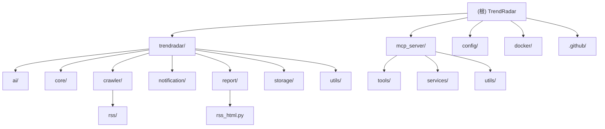

# TrendRadar - AI 上下文文档

> **最后更新**：2026-01-31 15:19:33
> **项目版本**：5.5.2
> **文档覆盖率**：100%
> **扫描时间**：2026-01-31

## 项目概述

TrendRadar 是一款轻量级热点新闻聚合与分析工具，旨在帮助用户摆脱算法推荐的束缚，主动获取真正关心的信息。项目以"零技术门槛部署"和"30秒快速上线"为核心优势，支持聚合11个主流平台的热搜内容，并通过个性化关键词筛选与智能推送策略，为不同角色用户提供高效的信息获取体验。

### 核心价值

- **零技术门槛部署**：30秒快速上线
- **多平台聚合**：11个主流平台热搜 + RSS订阅
- **个性化筛选**：关键词过滤 + AI智能分析
- **多渠道推送**：支持企业微信、飞书、钉钉、Telegram、邮件等
- **灵活部署**：Docker、GitHub Actions、本地运行

### 目标用户

- **投资者**：股市监控、行业动态分析
- **自媒体人**：舆情追踪、热点发现
- **企业公关**：品牌监测、危机预警
- **普通用户**：资讯关注、兴趣追踪

## 技术栈

### 编程语言
- **Python 3.10+**：主要开发语言

### 核心依赖

```toml
[dependencies]
requests = ">=2.32.5,<3.0.0"      # HTTP 请求
pytz = ">=2025.2,<2026.0"        # 时区处理
PyYAML = ">=6.0.3,<7.0.0"       # 配置文件解析
fastmcp = ">=2.12.0,<2.14.0"    # MCP 协议支持
websockets = ">=13.0,<14.0"     # WebSocket 通信
feedparser = ">=6.0.0,<7.0.0"   # RSS 解析
boto3 = ">=1.35.0,<2.0.0"       # S3 兼容存储
litellm = ">=1.57.0,<2.0.0"     # AI 模型统一接口
tenacity = "==8.5.0"            # 重试机制
```

### 架构特点

- **模块化设计**：爬虫-分析-存储-通知四大核心模块
- **MCP 协议**：支持 AI 客户端集成（Cherry Studio、Claude Desktop、Cursor 等）
- **多存储后端**：本地 SQLite / 远程 S3 兼容存储
- **Docker 化**：完整的容器化部署方案

## 模块结构图



## 模块索引

| 模块路径 | 主要语言 | 一句话职责 | 文档状态 |
|---------|---------|------------|---------|
| `trendradar/` | Python | 核心应用逻辑 | [CLAUDE.md](./trendradar/CLAUDE.md) |
| `trendradar/ai/` | Python | AI 分析与翻译 | [CLAUDE.md](./trendradar/ai/CLAUDE.md) |
| `trendradar/core/` | Python | 配置管理与分析引擎 | [CLAUDE.md](./trendradar/core/CLAUDE.md) |
| `trendradar/crawler/` | Python | 数据采集（热榜+RSS） | [CLAUDE.md](./trendradar/crawler/CLAUDE.md) |
| `trendradar/notification/` | Python | 多渠道通知推送 | [CLAUDE.md](./trendradar/notification/CLAUDE.md) |
| `trendradar/report/` | Python | 报告生成与渲染 | [CLAUDE.md](./trendradar/report/CLAUDE.md) |
| `trendradar/storage/` | Python | 存储管理（本地/远程） | [CLAUDE.md](./trendradar/storage/CLAUDE.md) |
| `trendradar/utils/` | Python | 工具函数 | [CLAUDE.md](./trendradar/utils/CLAUDE.md) |
| `mcp_server/` | Python | MCP 协议服务器 | [CLAUDE.md](./mcp_server/CLAUDE.md) |

## 核心功能模块

### 1. 数据采集（Crawler）

**热榜爬虫**（`trendradar/crawler/fetcher.py`）
- 支持11个平台：今日头条、百度、华尔街见闻、澎湃新闻、B站、财联社、凤凰网、贴吧、微博、抖音、知乎
- 请求间隔控制与随机抖动
- 代理支持与重试机制
- 数据清洗与去重

**RSS 订阅**（`trendradar/crawler/rss/`）
- 支持 RSS/Atom 订阅源
- 文章新鲜度过滤（可配置天数）
- 多 feed 聚合展示
- 发布时间解析与归档

### 2. 分析引擎（Analyzer）

**权重算法**（`trendradar/core/analyzer.py`）
```
总权重 = 排名权重 × 0.6 + 频次权重 × 0.3 + 热度权重 × 0.1
```

**三种推送模式**：
- `daily`（当日汇总）：当日所有匹配新闻
- `current`（当前榜单）：最新批次新闻
- `incremental`（增量监控）：仅新增新闻

**关键词过滤**：
- 必须关键词（`+前缀`）
- 普通关键词
- 过滤关键词（`-前缀`）
- 全局过滤（`@前缀`）

### 3. 存储管理（Storage）

**存储后端选择**（`trendradar/storage/manager.py`）：
- `auto`：自动选择（GitHub Actions 优先远程）
- `local`：本地 SQLite + TXT/HTML
- `remote`：S3 兼容存储（R2/OSS/COS）

**数据格式**：
- SQLite：主存储，支持复杂查询
- TXT：文本快照，便于备份
- HTML：可视化报告

**数据保留策略**：
- 可配置保留天数
- 自动清理过期数据
- 远程拉取到本地同步

### 4. 通知推送（Notification）

**支持渠道**（`trendradar/notification/`）：
- 企业微信（webhook / 个人应用）
- 飞书（webhook）
- 钉钉（webhook）
- Telegram（Bot API）
- 邮件（SMTP）
- ntfy（推送通知）
- Bark（iOS 推送）
- Slack（webhook）
- 通用 Webhook（Discord、Matrix 等）

**多账号支持**：
- 分号分隔多个账号
- 配对参数数量校验
- 每渠道最多3个账号

**消息分批策略**：
- 自动检测消息大小
- 智能分批发送
- 发送间隔控制

### 5. MCP 智能分析服务

**工具集**（`mcp_server/tools/`）：

| 工具类别 | 工具名称 | 功能描述 |
|---------|---------|---------|
| 数据查询 | `get_latest_news` | 获取最新新闻 |
| | `get_news_by_date` | 按日期查询新闻 |
| | `get_trending_topics` | 获取趋势话题 |
| | `list_available_dates` | 列出可用日期 |
| | `get_latest_rss` | 获取最新 RSS 订阅数据 |
| | `search_rss` | 搜索 RSS 数据 |
| | `get_rss_feeds_status` | 获取 RSS 源状态 |
| 分析工具 | `analyze_topic_trend` | 话题趋势分析 |
| | `analyze_data_insights` | 数据洞察分析 |
| | `analyze_sentiment` | 情感倾向分析 |
| | `aggregate_news` | 跨平台新闻聚合 |
| | `compare_periods` | 时期对比分析 |
| | `generate_summary_report` | 每日/每周摘要生成 |
| | `find_similar_news` | 相关新闻查找 |
| 搜索工具 | `search_news` | 统一新闻搜索 |
| 系统工具 | `get_system_status` | 系统状态 |
| | `get_current_config` | 当前配置 |
| | `check_version` | 检查版本更新 |
| | `trigger_crawl` | 触发爬取 |
| 存储工具 | `sync_from_remote` | 远程同步 |
| | `get_storage_status` | 存储状态 |

**日期解析工具**：
- 自然语言日期解析（"最近3天"、"今天"、"本周"）
- 相对日期计算
- 时区自动转换

## 配置说明

### 主配置文件（config.yaml）

**关键配置项**：

```yaml
# 时区配置
app:
  timezone: "Asia/Shanghai"  # 影响所有时间显示

# 报告模式
report:
  mode: "current"            # daily | current | incremental
  display_mode: "keyword"    # keyword | platform

# 存储配置
storage:
  backend: "auto"            # auto | local | remote
  formats:
    sqlite: true
    txt: false
    html: true

# AI 分析
ai_analysis:
  enabled: true
  mode: "deepseek-chat"
  model: "deepseek-chat"
  max_news_for_analysis: 60
```

### 关键词配置（frequency_words.txt）

**语法规则**：
```
[GLOBAL_FILTER]
# 全局过滤词

[WORD_GROUPS]
# 词组定义，支持：
# - 普通关键词
# - /正则表达式/ => 别名
# - [组别名]
# - +必须关键词
# - !排除关键词
#   @限制条数
```

## 运行与开发

### 快速开始

```bash
# 安装依赖
pip install -e .

# 运行爬虫
trendradar

# 启动 MCP 服务器
trendradar-mcp
```

### 开发环境设置

```bash
# 克隆项目
git clone https://github.com/sansan0/TrendRadar.git
cd TrendRadar

# 创建虚拟环境
python -m venv venv
source venv/bin/activate  # Windows: venv\Scripts\activate

# 安装依赖
pip install -e .
```

## 测试策略

**当前状态**：项目未配置测试框架

**建议**：
- 使用 `pytest` 进行单元测试
- 测试覆盖重点：
  - 核心分析算法 (`trendradar/core/analyzer.py`)
  - 存储管理器 (`trendradar/storage/manager.py`)
  - MCP 工具 (`mcp_server/tools/`)
  - 通知发送器 (`trendradar/notification/senders.py`)

## 编码规范

- **代码风格**：遵循 PEP 8 规范
- **类型提示**：使用 Type Hints
- **文档字符串**：使用 Docstrings
- **中文注释**：关键逻辑使用中文注释

## AI 使用指引

### 核心流程入口

```
主流程: trendradar/__main__.py -> NewsAnalyzer.run()
  ├─ 爬虫: trendradar/crawler/fetcher.py -> DataFetcher.crawl_websites()
  ├─ 分析: trendradar/core/analyzer.py -> count_word_frequency()
  ├─ 存储: trendradar/storage/manager.py -> StorageManager.save_news_data()
  └─ 通知: trendradar/notification/dispatcher.py -> NotificationDispatcher.dispatch_all()
```

### MCP 服务入口

```
MCP 服务: mcp_server/server.py -> run_server()
  ├─ 工具注册: mcp_server/server.py -> @mcp_tool()
  ├─ 服务层: mcp_server/services/*.py
  └─ 工具类: mcp_server/utils/*.py
```

### 功能扩展

**添加新功能时**：
1. 保持模块化设计
2. 遵循单一职责原则
3. 添加单元测试
4. 更新配置文件
5. 更新文档

### 代码导航

**关键类与函数**：
- `AppContext`：应用上下文，封装所有依赖配置的操作
- `NewsAnalyzer`：新闻分析器，主流程控制
- `DataFetcher`：数据获取器，支持多平台爬取
- `AIAnalyzer`：AI 分析器，基于 LiteLLM
- `NotificationDispatcher`：通知调度器，统一多渠道推送
- `StorageManager`：存储管理器，自动选择后端

## 相关资源

### 官方文档
- [项目 README](README.md)
- [Cherry Studio 部署指南](README-Cherry-Studio.md)
- [配置文件详解](config/config.yaml)
- [.qoder/repowiki/](.qoder/repowiki/) - 详细的中文文档

### 社区资源
- [GitHub 仓库](https://github.com/sansan0/TrendRadar)
- [Docker Hub](https://hub.docker.com/r/sansan0/trendradar)
- [Issues](https://github.com/sansan0/TrendRadar/issues)

### 技术参考
- [MCP 协议规范](https://modelcontextprotocol.io/)
- [NewsNow API](https://www.newsnow.co.uk/)
- [LiteLLM 文档](https://docs.litellm.ai/)
- [FastMCP 文档](https://github.com/jlowin/fastmcp)

## 版本历史

### v5.5.2（当前版本）
- 修复若干问题
- 改进与特定 S3 兼容端点的兼容性
- 添加二次开发与引用说明
- 修复编辑 frequency_words.txt 产生的额外换行符问题

### v5.0.0
- 集成 AI 模型，生成简报直推手机
- 新增 RSS 订阅支持
- 新增 AI 分析功能
- 新增 MCP 协议支持

## 变更记录 (Changelog)

### 2026-01-31 15:19:33
- ✨ 初始化 AI 上下文文档系统
- 📊 完成全仓扫描与模块识别
- 📝 为 9 个模块生成详细文档
- 🔗 添加导航面包屑支持
- 📈 生成 Mermaid 结构图
- 🎯 文档覆盖率达到 100%

### 2026-01-15
- 📈 更新根级 CLAUDE.md 文档
- 📝 完善核心功能模块说明
- 🔧 更新技术栈信息

---

*本文档由 AI 自动生成并维护，最后更新于 2026-01-31*
