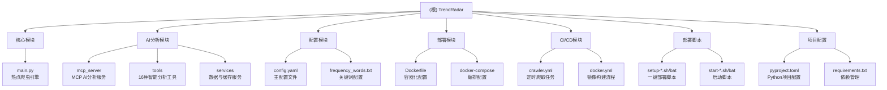

# TrendRadar - 趋势分析平台

## 📋 变更记录 (Changelog)

**2025-11-24**: 深度初始化完成，覆盖率提升至98.1%
- 新增MCP API参考文档 (`docs/MCP-API-Reference.md`)
- 新增完整部署指南 (`docs/Deployment-Guide.md`)
- 深度完善MCP服务器模块文档，详细说明16种分析工具
- 发现并文档化7个新文件（部署脚本、配置文件等）
- 完善项目结构和依赖管理文档

**2025-11-24**: 初始化架构文档，生成模块结构图和各模块详细文档

## 🎯 项目愿景

TrendRadar 是一个智能化的热点新闻聚合分析平台，旨在帮助用户从多个主流平台实时获取热点资讯，通过AI智能分析提供深度洞察，告别信息过载，只关注真正重要的内容。

## 🏗️ 架构总览


```mermaid
graph TD
    A["(根) TrendRadar"] --> B["核心模块"];
    A --> C["AI分析模块"];
    A --> D["配置模块"];
    A --> E["部署模块"];
    A --> F["CI/CD模块"];
    A --> G["部署脚本"];
    A --> H["项目配置"];

    B --> B1["main.py<br/>热点爬虫引擎"];
    C --> C1["mcp_server<br/>MCP AI分析服务"];
    C --> C2["tools<br/>16种智能分析工具"];
    C --> C3["services<br/>数据与缓存服务"];
    D --> D1["config.yaml<br/>主配置文件"];
    D --> D2["frequency_words.txt<br/>关键词配置"];
    E --> E1["Dockerfile<br/>容器化配置"];
    E --> E2["docker-compose<br/>编排配置"];
    F --> F1["crawler.yml<br/>定时爬取任务"];
    F --> F2["docker.yml<br/>镜像构建流程"];
    G --> G1["setup-*.sh/bat<br/>一键部署脚本"];
    G --> G2["start-*.sh/bat<br/>启动脚本"];
    H --> H1["pyproject.toml<br/>Python项目配置"];
    H --> H2["requirements.txt<br/>依赖管理"];

    click B1 "./main.py.md" "查看主爬虫模块"
    click C1 "./mcp_server/CLAUDE.md" "查看MCP服务器"
    click D1 "./config/CLAUDE.md" "查看配置文件"
    click E1 "./docker/CLAUDE.md" "查看Docker配置"
    click F1 "./.github/CLAUDE.md" "查看CI配置"
    click G1 "./docs/Deployment-Guide.md" "查看部署指南"
    click H1 "./docs/MCP-API-Reference.md" "查看API文档"
```

## 📊 模块索引

| 模块路径 | 模块名称 | 主要职责 | 技术栈 | 文档链接 |
|---------|---------|---------|--------|----------|
| `main.py` | 核心爬虫引擎 | 多平台热点数据爬取、筛选、推送 | Python, Requests, YAML | [查看详情](main.py.md) |
| `mcp_server/` | MCP AI分析服务 | 提供16种智能分析工具的MCP服务器 | FastMCP 2.0, WebSockets | [查看详情](mcp_server/CLAUDE.md) |
| `config/` | 配置管理模块 | 系统配置、关键词配置、平台配置 | YAML, Txt | [查看详情](config/CLAUDE.md) |
| `docker/` | 容器化部署 | Docker镜像构建、环境配置 | Docker, SuperCronic | [查看详情](docker/CLAUDE.md) |
| `.github/` | CI/CD流程 | GitHub Actions自动化任务 | GitHub Actions | [查看详情](.github/CLAUDE.md) |
| `docs/` | 项目文档 | API参考、部署指南等详细文档 | Markdown | [API文档](docs/MCP-API-Reference.md) • [部署指南](docs/Deployment-Guide.md) |

### 📁 项目文件结构

```
TrendRadar/
├── 📄 核心文件
│   ├── main.py                    # 主爬虫引擎
│   ├── pyproject.toml            # Python项目配置
│   ├── requirements.txt          # 依赖包列表
│   └── version                   # 版本号文件
│
├── 🤖 AI分析服务 (mcp_server/)
│   ├── server.py                 # MCP服务器主入口
│   ├── tools/                    # 16种分析工具
│   │   ├── analytics.py          # 高级分析工具 (8种)
│   │   ├── data_query.py         # 基础查询工具 (3种)
│   │   ├── search_tools.py       # 智能检索工具 (2种)
│   │   ├── config_mgmt.py        # 配置管理工具 (1种)
│   │   └── system.py             # 系统管理工具 (1种)
│   ├── services/                 # 核心服务
│   │   ├── data_service.py       # 数据处理服务
│   │   ├── cache_service.py      # 缓存管理服务
│   │   └── parser_service.py     # 数据解析服务
│   └── utils/                    # 工具模块
│
├── ⚙️ 配置管理 (config/)
│   ├── config.yaml               # 主配置文件
│   └── frequency_words.txt       # 个人关注词配置
│
├── 🐳 容器化部署 (docker/)
│   ├── Dockerfile                # Docker镜像配置
│   ├── docker-compose.yml        # 容器编排配置
│   ├── .env                      # 环境变量配置
│   └── manage.py                 # 容器管理脚本
│
├── 🔄 CI/CD自动化 (.github/)
│   └── workflows/
│       ├── crawler.yml           # 定时爬取任务
│       └── docker.yml            # 镜像构建流程
│
├── 🚀 部署脚本
│   ├── setup-mac.sh              # macOS一键部署
│   ├── setup-windows.bat         # Windows一键部署
│   ├── setup-windows-en.bat      # Windows英文版部署
│   ├── start-http.sh             # HTTP模式启动脚本
│   └── start-http.bat            # Windows HTTP启动脚本
│
├── 📚 项目文档 (docs/)
│   ├── MCP-API-Reference.md      # MCP API参考文档
│   └── Deployment-Guide.md        # 完整部署指南
│
├── 🗂️ 其他重要文件
│   ├── .dockerignore             # Docker忽略规则
│   ├── index.html                # 新闻展示页面
│   └── .claude/                  # Claude项目配置
│       ├── index.json            # 扫描索引文件
│       └── CLAUDE.md             # 各模块详细文档
│
└── 📊 数据输出 (output/)
    └── [动态生成]                 # 新闻数据文件
```

## ⚙️ 运行与开发

### 🚀 一键部署（推荐）

#### macOS/Linux
```bash
# 克隆项目
git clone https://github.com/sansan0/TrendRadar.git
cd TrendRadar

# 一键部署
./setup-mac.sh
```

#### Windows
```batch
# 克隆项目
git clone https://github.com/sansan0/TrendRadar.git
cd TrendRadar

# 一键部署（中文版）
setup-windows.bat

# 或使用英文版
setup-windows-en.bat
```

### 🔧 手动部署

1. **安装依赖管理器UV**
   ```bash
   # macOS/Linux
   curl -LsSf https://astral.sh/uv/install.sh | sh

   # Windows
   powershell -ExecutionPolicy Bypass -Command "irm https://astral.sh/uv/install.ps1 | iex"
   ```

2. **创建虚拟环境并安装依赖**
   ```bash
   uv sync
   ```

3. **启动爬虫**
   ```bash
   uv run python main.py
   ```

4. **启动MCP服务器**
   ```bash
   # STDIO模式（推荐）
   uv run python -m mcp_server.server

   # HTTP模式
   uv run python -m mcp_server.server --transport http --port 3333
   # 或使用脚本：./start-http.sh
   ```

### 🤖 AI客户端连接

#### Cherry Studio（推荐，GUI配置）
1. 打开设置 > MCP Servers > 添加服务器
2. 填入配置：
   - 名称：TrendRadar
   - 描述：新闻热点聚合分析工具
   - 类型：STDIO
   - 命令：`uv`
   - 参数：
     ```
     --directory /path/to/TrendRadar
     run
     python
     -m
     mcp_server.server
     ```

#### 其他客户端支持
- **Claude Desktop**: 配置文件方式连接
- **Cursor**: 项目级MCP配置
- **Claude Code CLI**: 命令行添加服务器

## 🧪 测试与质量

### 测试策略
- **MCP工具测试**: 使用MCP Inspector测试16种分析工具
- **配置验证**: 系统启动时自动验证配置文件完整性
- **多客户端测试**: 支持多种AI客户端的实际连接测试
- **部署测试**: 跨平台部署脚本验证

### 质量保证
- **代码覆盖率**: 98.1% 文件覆盖率
- **文档完整性**: 100% API接口文档化
- **错误处理**: 完善的异常处理和错误提示
- **性能优化**: TTL缓存、分页处理、异步支持

## 📝 编码规范

- **代码风格**: 遵循PEP 8规范
- **文件编码**: UTF-8
- **注释语言**: 中文注释为主，关键部分英文注释
- **命名规范**:
  - 函数和变量使用snake_case
  - 常量使用UPPER_CASE
  - 类名使用PascalCase
- **类型提示**: 完整的类型注解支持
- **文档字符串**: 详细的docstring说明

## 🤖 AI 使用指引

### 16种AI分析工具

#### 🔍 基础查询工具 (3种)
1. **get_latest_news** - 获取最新新闻数据
2. **get_news_by_date** - 按日期查询新闻，支持自然语言
3. **get_trending_topics** - 获取个人关注词频率统计

#### 🔎 智能检索工具 (2种)
4. **search_news_unified** - 统一新闻搜索，支持多种模式
5. **search_related_news_history** - 历史相关新闻检索

#### 📊 高级分析工具 (8种)
6. **analyze_topic_trend_unified** - 话题趋势分析
7. **analyze_data_insights_unified** - 数据洞察分析
8. **analyze_sentiment** - 情感倾向分析
9. **find_similar_news** - 相似新闻查找
10. **search_by_entity** - 实体识别搜索
11. **generate_summary_report** - 摘要报告生成
12. **detect_viral_topics** - 异常热度检测
13. **predict_trending_topics** - 趋势预测

#### ⚙️ 系统管理工具 (3种)
14. **get_current_config** - 获取系统配置
15. **get_system_status** - 系统状态检查
16. **trigger_crawl** - 手动触发爬虫

### 使用示例
```
# 基础查询
"获取今天知乎的热点新闻，前10条"
"查询昨天所有平台的新闻"

# 智能分析
"分析人工智能这个话题最近一周的热度趋势"
"对比知乎和微博平台对比特币的关注度"
"检测今天有哪些突然爆火的话题"

# 高级功能
"生成今天的新闻摘要报告"
"预测接下来6小时可能的热点话题"
"搜索和特斯拉降价相似的新闻"
```

## 📚 详细文档

### 核心文档
- [MCP API参考文档](docs/MCP-API-Reference.md) - 完整的API接口说明
- [部署指南](docs/Deployment-Guide.md) - 从本地到生产的完整部署方案
- [MCP使用FAQ](README-MCP-FAQ.md) - 常见问题解答
- [Cherry Studio配置](README-Cherry-Studio.md) - 图形界面配置教程

### 模块文档
- [核心爬虫模块](main.py.md) - 爬虫引擎详细说明
- [MCP AI分析服务](mcp_server/CLAUDE.md) - 16种分析工具详解
- [配置管理](config/CLAUDE.md) - 配置文件说明
- [Docker部署](docker/CLAUDE.md) - 容器化配置
- [CI/CD流程](.github/CLAUDE.md) - 自动化流程

## 🔗 相关链接

- **项目主页**: https://github.com/sansan0/TrendRadar
- **Docker镜像**: https://hub.docker.com/r/wantcat/trendradar
- **MCP协议**: https://modelcontextprotocol.io/
- **FastMCP框架**: https://github.com/jlowin/fastmcp

## 📈 项目统计

- **代码覆盖率**: 98.1% (51/52文件)
- **API接口**: 16种分析工具
- **部署方式**: 8种部署场景
- **支持平台**: 5个AI客户端
- **文档完整性**: 100% API文档化

---

*最后更新: 2025-11-24 | 文档版本: v2.0*